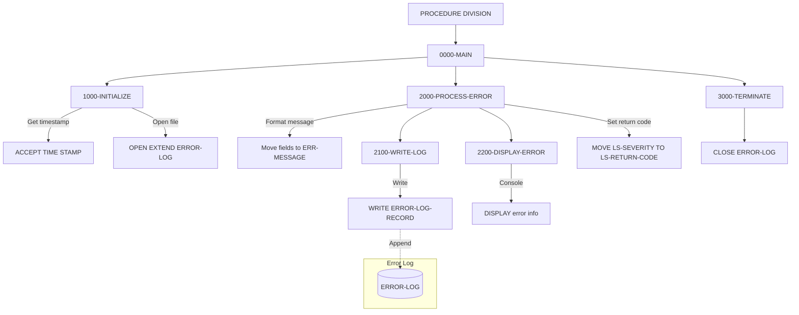

## Overview

ERRPROC is a reusable subroutine that provides centralized error handling for the portfolio management system. The program accepts error information through a linkage section parameter, formats it into a standard error message structure, writes it to a sequential error log file, and displays the error information to the system console.

This program serves as the standard error logging mechanism across the application, ensuring consistent error recording and display formatting. By centralizing error processing in a single subroutine, the system achieves:

- **Consistent Error Formatting**: All errors follow the same structure and display format
- **Centralized Logging**: All errors are written to a single error log file for easy monitoring
- **Severity Tracking**: Error severity levels are captured and returned to calling programs
- **Audit Trail**: Timestamped error records support troubleshooting and compliance requirements

## Program Structure



## Data Structures

### Working Storage

#### WS-WORK-AREAS

| Level | Name | Picture | Description |
|-------|------|---------|-------------|
| 01 | WS-WORK-AREAS | - | Working storage group |
| 05 | WS-LOG-STATUS | X(2) | File status code for ERROR-LOG |
| 05 | WS-FORMATTED-TIME | X(26) | System timestamp in formatted form |

#### ERR-MESSAGE (from ERRHAND copybook)

| Level | Name | Picture | Description |
|-------|------|---------|-------------|
| 01 | ERR-MESSAGE | - | Standard error message structure |
| 05 | ERR-TIMESTAMP | - | Error timestamp group |
| 10 | ERR-DATE | X(10) | Error date |
| 10 | ERR-TIME | X(8) | Error time |
| 05 | ERR-PROGRAM | X(8) | Program name |
| 05 | ERR-CATEGORY | X(2) | Error category code |
| 05 | ERR-CODE | X(4) | Specific error code |
| 05 | ERR-SEVERITY | S9(4) COMP | Severity level |
| 05 | ERR-TEXT | X(80) | Error message text |
| 05 | ERR-DETAILS | X(256) | Extended error details |

### File Section

#### ERROR-LOG-RECORD

| Level | Name | Picture | Description |
|-------|------|---------|-------------|
| 01 | ERROR-LOG-RECORD | - | Error log file record |
| 05 | LOG-DATA | X(400) | Error message data area |

### Linkage Section

The program receives error information through a single parameter structure:

#### LS-ERROR-REQUEST

| Level | Name | Picture | Description |
|-------|------|---------|-------------|
| 01 | LS-ERROR-REQUEST | - | Error request structure |
| 05 | LS-PROGRAM-ID | X(8) | Calling program name |
| 05 | LS-CATEGORY | X(2) | Error category code |
| 05 | LS-ERROR-CODE | X(4) | Specific error code |
| 05 | LS-SEVERITY | S9(4) COMP | Error severity level |
| 05 | LS-ERROR-TEXT | X(80) | Error message text |
| 05 | LS-ERROR-DETAILS | X(256) | Extended error details |
| 05 | LS-RETURN-CODE | S9(4) COMP | Return code (output) |

### Error Categories (from ERRHAND copybook)

| Code | Constant | Description |
|------|----------|-------------|
| VS | ERR-CAT-VSAM | VSAM file error |
| VL | ERR-CAT-VALID | Validation error |
| PR | ERR-CAT-PROC | Processing error |
| SY | ERR-CAT-SYSTEM | System error |

### Standard Severity Levels (from ERRHAND copybook)

| Value | Constant | Description |
|-------|----------|-------------|
| 0 | ERR-SUCCESS | Success (no error) |
| 4 | ERR-WARNING | Warning condition |
| 8 | ERR-ERROR | Error condition |
| 12 | ERR-SEVERE | Severe error |
| 16 | ERR-TERMINAL | Terminal error |

## File I/O

### ERROR-LOG

| Property | Value |
|----------|-------|
| Assign To | ERRLOG |
| Organization | Sequential |
| Recording Mode | Fixed (F) |
| Block Contains | 0 (system-determined) |
| Record Length | 400 characters |
| Access Mode | Sequential |
| Open Mode | EXTEND (append) |
| File Status | WS-LOG-STATUS |

The error log file is opened in EXTEND mode, ensuring that new error records are appended to the existing log without overwriting historical data. This preserves the complete error history for troubleshooting and audit purposes.

### I/O Operations Summary

| Paragraph | Operation | Description |
|-----------|-----------|-------------|
| 1000-INITIALIZE | OPEN EXTEND | Opens file for appending |
| 2100-WRITE-LOG | WRITE ERROR-LOG-RECORD | Writes formatted error record |
| 3000-TERMINATE | CLOSE | Closes the error log file |

## Control Flow

### 0000-MAIN

Entry point that orchestrates the three processing phases in sequence:
1. Initialize (clear work areas, get timestamp, open file)
2. Process error (format message, write log, display)
3. Terminate (close file)

Returns to the calling program via GOBACK after processing completes.

### 1000-INITIALIZE

1. **Initialize Work Areas**: Clears WS-WORK-AREAS using the INITIALIZE statement.

2. **Capture Timestamp**: Uses `ACCEPT WS-FORMATTED-TIME FROM TIME STAMP` to get the current system timestamp for the error record.

3. **Open Error Log**: Opens ERROR-LOG in EXTEND mode. If the open fails, displays an error message but continues processing (the error will still be displayed to the console).

### 2000-PROCESS-ERROR

Formats the error message and coordinates logging and display:

1. **Build Error Message**: Maps linkage section fields to the ERR-MESSAGE structure from the ERRHAND copybook:
   - WS-FORMATTED-TIME → ERR-TIMESTAMP
   - LS-PROGRAM-ID → ERR-PROGRAM
   - LS-CATEGORY → ERR-CATEGORY
   - LS-ERROR-CODE → ERR-CODE
   - LS-SEVERITY → ERR-SEVERITY
   - LS-ERROR-TEXT → ERR-TEXT
   - LS-ERROR-DETAILS → ERR-DETAILS

2. **Write to Log**: Performs 2100-WRITE-LOG to write the error to the log file.

3. **Display Error**: Performs 2200-DISPLAY-ERROR to show the error on the console.

4. **Set Return Code**: Copies LS-SEVERITY to LS-RETURN-CODE to communicate the error severity back to the calling program.

### 2100-WRITE-LOG

1. **Format Record**: Moves ERR-MESSAGE to LOG-DATA in the file record.

2. **Write Record**: Writes ERROR-LOG-RECORD to the file.

3. **Error Handling**: If the write fails, displays an error message with the file status code.

### 2200-DISPLAY-ERROR

Displays a formatted error message to the system console with clear visual separators:

```
====================================================
ERROR DETECTED: [timestamp]
PROGRAM:       [program-id]
CATEGORY:      [category]
CODE:          [error-code]
SEVERITY:      [severity]
MESSAGE:       [error-text]
DETAILS:       [error-details]
====================================================
```

### 3000-TERMINATE

Closes the ERROR-LOG file.

## Dependencies

### Copybooks

- [ERRHAND](/docs/copybooks/ERRHAND) - Standard error handling definitions including ERR-MESSAGE structure, error categories, and severity constants

### Called Programs

This program does not call any external programs.

### Calling Programs

ERRPROC is designed to be called as a subroutine by any program requiring error logging:

```cobol
CALL 'ERRPROC' USING LS-ERROR-REQUEST
```

### Related Programs

Programs that share the ERRHAND copybook and may call ERRPROC:
- [BCHCTL00](/docs/programs/BCHCTL00), [HISTLD00](/docs/programs/HISTLD00), [PRCSEQ00](/docs/programs/PRCSEQ00), [RCVPRC00](/docs/programs/RCVPRC00) - Batch processing programs
- [RPTAUD00](/docs/programs/RPTAUD00), [RPTPOS00](/docs/programs/RPTPOS00), [RPTSTA00](/docs/programs/RPTSTA00) - Report generation programs
- [DB2CMT](/docs/programs/DB2CMT), [DB2CONN](/docs/programs/DB2CONN), [DB2ERR](/docs/programs/DB2ERR), [DB2STAT](/docs/programs/DB2STAT) - Database utility programs
- [PORTTEST](/docs/programs/PORTTEST), [PORTTRAN](/docs/programs/PORTTRAN) - Portfolio processing programs
- [TSTGEN00](/docs/programs/TSTGEN00), [TSTVAL00](/docs/programs/TSTVAL00) - Test programs
- [UTLMNT00](/docs/programs/UTLMNT00), [UTLMON00](/docs/programs/UTLMON00), [UTLVAL00](/docs/programs/UTLVAL00) - Utility programs

## Return Codes

The return code is set to the same value as the input severity level:

| Code | Description |
|------|-------------|
| 0 | Success (informational logging) |
| 4 | Warning condition logged |
| 8 | Error condition logged |
| 12 | Severe error logged |
| 16 | Terminal error logged |

## Usage Example

```cobol
       WORKING-STORAGE SECTION.
       01  WS-ERROR-REQUEST.
           05  WS-PROGRAM-ID      PIC X(8).
           05  WS-CATEGORY        PIC X(2).
           05  WS-ERROR-CODE      PIC X(4).
           05  WS-SEVERITY        PIC S9(4) COMP.
           05  WS-ERROR-TEXT      PIC X(80).
           05  WS-ERROR-DETAILS   PIC X(256).
           05  WS-RETURN-CODE     PIC S9(4) COMP.
       
       PROCEDURE DIVISION.
           * Log a VSAM file error
           MOVE 'MYPROGRAM'      TO WS-PROGRAM-ID
           MOVE 'VS'             TO WS-CATEGORY
           MOVE '0023'           TO WS-ERROR-CODE
           MOVE 8                TO WS-SEVERITY
           MOVE 'Record not found in master file' 
                                 TO WS-ERROR-TEXT
           MOVE 'Key value: ACCT12345, File: CUSTMAST'
                                 TO WS-ERROR-DETAILS
           
           CALL 'ERRPROC' USING WS-ERROR-REQUEST
           
           IF WS-RETURN-CODE >= 8
               PERFORM ERROR-RECOVERY
           END-IF.
```

## Console Output Example

When ERRPROC processes an error, the following output is displayed:

```
====================================================
ERROR DETECTED: 2024-03-20-14.30.45.123456
PROGRAM:       MYPROGRAM
CATEGORY:      VS
CODE:          0023
SEVERITY:      +0008
MESSAGE:       Record not found in master file
DETAILS:       Key value: ACCT12345, File: CUSTMAST
====================================================
```

## Technical Notes

### ACCEPT FROM TIME STAMP

The `ACCEPT FROM TIME STAMP` statement retrieves the current system date and time in a 26-character format (typically `YYYY-MM-DD-HH.MM.SS.NNNNNN`). This provides microsecond precision for error log chronological ordering.

### OPEN EXTEND Mode

Opening a sequential file in EXTEND mode positions the file at the end for writing, preserving all existing records. This is essential for error log integrity, ensuring that:
- New error records are always appended
- Historical error data is never overwritten
- Multiple program invocations can write to the same error log

### Error Recovery Strategy

If the error log file cannot be opened or written to, ERRPROC continues processing and displays the error to the console. This ensures that error information is still visible even if logging fails, following a "fail-safe" approach to error handling.
