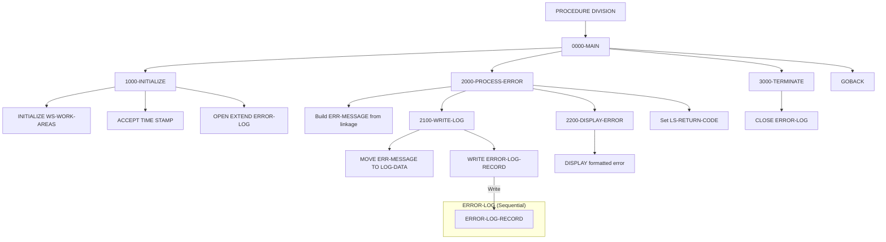

## Overview

ERRPROC is a reusable subroutine that provides centralized error processing services. It accepts error information from calling programs through the linkage section, logs the error to a sequential error log file, and displays formatted error information to the system console.

The program serves as a standardized error handling service that can be called by any application program needing to:
- Log errors to a persistent error log file
- Display formatted error messages to operators
- Maintain consistent error categorization and severity levels

By centralizing error processing in a single subroutine, the system ensures consistent error handling, logging formats, and severity code management across all applications.

## Program Structure



## Data Structures

### Working Storage

#### Work Areas

| Level | Name | Picture | Description |
|-------|------|---------|-------------|
| 01 | WS-WORK-AREAS | - | Working storage group |
| 05 | WS-LOG-STATUS | X(2) | File status code for ERROR-LOG |
| 05 | WS-FORMATTED-TIME | X(26) | Formatted timestamp from system |

#### Error Categories (from ERRHAND copybook)

| Level | Name | Picture | Value | Description |
|-------|------|---------|-------|-------------|
| 01 | ERR-CATEGORIES | - | - | Category code constants |
| 05 | ERR-CAT-VSAM | X(2) | `'VS'` | VSAM file error |
| 05 | ERR-CAT-VALID | X(2) | `'VL'` | Validation error |
| 05 | ERR-CAT-PROC | X(2) | `'PR'` | Processing error |
| 05 | ERR-CAT-SYSTEM | X(2) | `'SY'` | System error |

#### Standard Return Codes (from ERRHAND copybook)

| Level | Name | Picture | Value | Description |
|-------|------|---------|-------|-------------|
| 01 | ERR-RETURN-CODES | - | - | Standard return code constants |
| 05 | ERR-SUCCESS | S9(4) COMP | +0 | Successful completion |
| 05 | ERR-WARNING | S9(4) COMP | +4 | Warning condition |
| 05 | ERR-ERROR | S9(4) COMP | +8 | Error condition |
| 05 | ERR-SEVERE | S9(4) COMP | +12 | Severe error |
| 05 | ERR-TERMINAL | S9(4) COMP | +16 | Terminal/fatal error |

#### Error Message Structure (from ERRHAND copybook)

| Level | Name | Picture | Description |
|-------|------|---------|-------------|
| 01 | ERR-MESSAGE | - | Error message work area |
| 05 | ERR-TIMESTAMP | X(18) | Timestamp group |
| 10 | ERR-DATE | X(10) | Error date |
| 10 | ERR-TIME | X(8) | Error time |
| 05 | ERR-PROGRAM | X(8) | Source program name |
| 05 | ERR-CATEGORY | X(2) | Error category code |
| 05 | ERR-CODE | X(4) | Application error code |
| 05 | ERR-SEVERITY | S9(4) COMP | Severity level |
| 05 | ERR-TEXT | X(80) | Error message text |
| 05 | ERR-DETAILS | X(256) | Extended error details |

#### VSAM Status Handling (from ERRHAND copybook)

| Level | Name | Picture | Value | Description |
|-------|------|---------|-------|-------------|
| 01 | ERR-VSAM-STATUSES | - | - | VSAM status code constants |
| 05 | ERR-VSAM-SUCCESS | X(2) | `'00'` | Successful operation |
| 05 | ERR-VSAM-DUPKEY | X(2) | `'22'` | Duplicate key |
| 05 | ERR-VSAM-NOTFND | X(2) | `'23'` | Record not found |
| 05 | ERR-VSAM-EOF | X(2) | `'10'` | End of file |

| Level | Name | Picture | Value | Description |
|-------|------|---------|-------|-------------|
| 01 | ERR-VSAM-MSGS | - | - | VSAM error message texts |
| 05 | ERR-VSAM-22 | X(80) | `'Duplicate record key'` | Message for status 22 |
| 05 | ERR-VSAM-23 | X(80) | `'Record not found'` | Message for status 23 |
| 05 | ERR-OTHER | X(80) | `'Unexpected VSAM error'` | Generic VSAM error |

### Linkage Section

The `LS-ERROR-REQUEST` structure is passed by calling programs:

| Level | Name | Picture | Description |
|-------|------|---------|-------------|
| 01 | LS-ERROR-REQUEST | - | Error request input/output structure |
| 05 | LS-PROGRAM-ID | X(8) | Calling program name |
| 05 | LS-CATEGORY | X(2) | Error category code |
| 05 | LS-ERROR-CODE | X(4) | Application-specific error code |
| 05 | LS-SEVERITY | S9(4) COMP | Severity level (input) |
| 05 | LS-ERROR-TEXT | X(80) | Error message text |
| 05 | LS-ERROR-DETAILS | X(256) | Extended error details |
| 05 | LS-RETURN-CODE | S9(4) COMP | Return code (output) |

### File Section

| Level | Name | Picture | Description |
|-------|------|---------|-------------|
| 01 | ERROR-LOG-RECORD | - | Error log file record |
| 05 | LOG-DATA | X(400) | Error log data area |

## File I/O

### ERROR-LOG

| Property | Value |
|----------|-------|
| DD Name | ERRLOG |
| Organization | SEQUENTIAL |
| Recording Mode | F (Fixed) |
| Record Length | 400 bytes |
| Access Mode | EXTEND (append) |
| File Status | WS-LOG-STATUS |

The error log file is opened in EXTEND mode, which positions the file pointer at the end so new records are appended rather than overwriting existing records. This preserves the complete error history.

### File Operations

| Paragraph | Operation | Description |
|-----------|-----------|-------------|
| 1000-INITIALIZE | OPEN EXTEND | Opens file for appending |
| 2100-WRITE-LOG | WRITE | Writes the error log record |
| 3000-TERMINATE | CLOSE | Closes the error log file |

## Control Flow

### 0000-MAIN

The main entry point that orchestrates the three processing phases:
1. Initialize - Set up work areas, get timestamp, open file
2. Process - Build error message, write to log, display to console
3. Terminate - Close the file
4. Return to caller via GOBACK

### 1000-INITIALIZE

Performs startup activities:
1. **INITIALIZE WS-WORK-AREAS**: Clears working storage fields
2. **ACCEPT WS-FORMATTED-TIME FROM TIME STAMP**: Retrieves the current system timestamp in ISO format (26 characters)
3. **OPEN EXTEND ERROR-LOG**: Opens the error log file in extend mode for appending
4. **Error Check**: If file open fails, displays error message with status code (but continues processing)

### 2000-PROCESS-ERROR

Builds and processes the error message:
1. **Build ERR-MESSAGE**: Moves data from linkage section to the ERR-MESSAGE structure:
   - Timestamp from working storage
   - Program ID, category, error code, severity from linkage
   - Error text and details from linkage
2. **PERFORM 2100-WRITE-LOG**: Writes the error to the log file
3. **PERFORM 2200-DISPLAY-ERROR**: Displays the error to the console
4. **Set return code**: Copies the severity level to LS-RETURN-CODE

### 2100-WRITE-LOG

Writes the error record to the log file:
1. **MOVE ERR-MESSAGE TO LOG-DATA**: Copies the formatted error message to the file record
2. **WRITE ERROR-LOG-RECORD**: Writes the record to the file
3. **Error Check**: If write fails, displays error message with status code

### 2200-DISPLAY-ERROR

Displays a formatted error message to the system console (SYSOUT):
```
====================================================
ERROR DETECTED: [timestamp]
PROGRAM:       [program-id]
CATEGORY:      [category]
CODE:          [error-code]
SEVERITY:      [severity]
MESSAGE:       [error-text]
DETAILS:       [error-details]
====================================================
```

### 3000-TERMINATE

Closes the error log file.

## Usage Example

Calling programs should use ERRPROC as follows:

```cobol
WORKING-STORAGE SECTION.
    COPY ERRHAND.
    
01  WS-ERROR-REQUEST.
    05  WS-PROGRAM-ID      PIC X(8).
    05  WS-CATEGORY        PIC X(2).
    05  WS-ERROR-CODE      PIC X(4).
    05  WS-SEVERITY        PIC S9(4) COMP.
    05  WS-ERROR-TEXT      PIC X(80).
    05  WS-ERROR-DETAILS   PIC X(256).
    05  WS-RETURN-CODE     PIC S9(4) COMP.

PROCEDURE DIVISION.
    ...
    * Log a VSAM error
    MOVE 'PORTMSTR' TO WS-PROGRAM-ID
    MOVE ERR-CAT-VSAM TO WS-CATEGORY
    MOVE '0023' TO WS-ERROR-CODE
    MOVE ERR-ERROR TO WS-SEVERITY
    MOVE 'Portfolio record not found' TO WS-ERROR-TEXT
    MOVE 'Key: PORT001, File: PORTFILE, Status: 23'
      TO WS-ERROR-DETAILS
    
    CALL 'ERRPROC' USING WS-ERROR-REQUEST
    
    * Check return code (will match severity passed in)
    IF WS-RETURN-CODE >= ERR-SEVERE
        PERFORM ERROR-ABORT-PROCESSING
    END-IF
    ...
```

## Console Output Example

When ERRPROC is called, it displays output like this:

```
====================================================
ERROR DETECTED: 2024-03-20-14.35.22.123456
PROGRAM:       PORTMSTR
CATEGORY:      VS
CODE:          0023
SEVERITY:      +0008
MESSAGE:       Portfolio record not found
DETAILS:       Key: PORT001, File: PORTFILE, Status: 23
====================================================
```

## Dependencies

### Copybooks

- **ERRHAND** - Standard error handling definitions including:
  - Error category codes (VSAM, validation, processing, system)
  - Standard return codes (0, 4, 8, 12, 16)
  - Error message structure
  - VSAM status codes and messages

### Called Programs

None - ERRPROC is a leaf-level service module.

### Related Programs

- **RPTAUD00** - May read error log files for reporting purposes
- **AUDPROC** - Companion audit logging service

Any program that needs to log errors will call ERRPROC. Programs using the ERRHAND copybook are potential callers.

## Return Codes

The return code is set to match the input severity level:

| Input Severity | Return Code | Meaning |
|----------------|-------------|---------|
| 0 | 0 | Information/Success |
| 4 | 4 | Warning |
| 8 | 8 | Error |
| 12 | 12 | Severe error |
| 16 | 16 | Terminal/Fatal error |

## Technical Notes

### COBOL Constructs Used

- **ACCEPT FROM TIME STAMP**: An IBM extension that retrieves the current system timestamp in a 26-character ISO format (`YYYY-MM-DD-HH.MM.SS.FFFFFF`). This provides microsecond precision for error timestamps.

- **OPEN EXTEND**: Opens a sequential file for output, positioning at the end of existing data. New records are appended rather than overwriting. Essential for error logs where historical records must be preserved.

- **INITIALIZE**: Sets all elementary items in a group to their default values (spaces for alphanumeric, zeros for numeric). Used here to clear working storage before use.

- **DISPLAY**: Writes output to SYSOUT (typically the job log or console). Multiple DISPLAY statements create the formatted error output visible to operators.

- **PROCEDURE DIVISION USING**: Defines the linkage section parameter that the program receives when called. The calling program passes LS-ERROR-REQUEST by reference.

- **GOBACK**: Returns control to the calling program while preserving the run unit.

### Configuration Section

The program specifies IBM z/OS as both source and object computer:
```cobol
SOURCE-COMPUTER. IBM-ZOS.
OBJECT-COMPUTER. IBM-ZOS.
```

### Error Category Usage

| Category | Code | Use For |
|----------|------|---------|
| VSAM | `'VS'` | File I/O errors, status codes |
| Validation | `'VL'` | Data validation failures |
| Processing | `'PR'` | Business logic errors |
| System | `'SY'` | System-level errors, resources |

### Severity Level Guidelines

| Severity | When to Use |
|----------|-------------|
| 0 (Success) | Informational logging only |
| 4 (Warning) | Recoverable issues, processing continues |
| 8 (Error) | Significant issue, may affect results |
| 12 (Severe) | Critical issue, recommend stopping |
| 16 (Terminal) | Fatal error, must abort processing |
