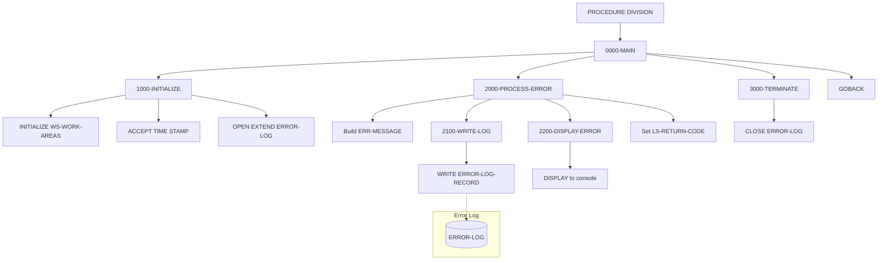

## Overview

ERRPROC is a common subroutine that provides standardized error processing services for the application system. It accepts error information from calling programs via a linkage section interface, logs the error to a sequential error log file, and displays formatted error information to the system console.

The program serves as the central error handling facility, ensuring consistent error logging and reporting across all programs in the system. By centralizing error processing, ERRPROC promotes uniform error message formatting, simplifies error log analysis, and provides a single point of maintenance for error handling logic.

Error records written by ERRPROC can be analyzed by reporting programs like RPTAUD00 to generate error summary reports for operations monitoring and troubleshooting. The console display provides immediate visibility of errors during batch job execution.

## Program Structure



## Data Structures

### Working Storage

#### Work Areas (WS-WORK-AREAS)

| Level | Name | Picture | Description |
|-------|------|---------|-------------|
| 01 | WS-WORK-AREAS | | Group item for working variables |
| 05 | WS-LOG-STATUS | X(2) | File status code for ERROR-LOG operations |
| 05 | WS-FORMATTED-TIME | X(26) | Timestamp from ACCEPT TIME STAMP |

#### Error Categories (from ERRHAND copybook)

| Level | Name | Picture | Value | Description |
|-------|------|---------|-------|-------------|
| 01 | ERR-CATEGORIES | | | Predefined error category codes |
| 05 | ERR-CAT-VSAM | X(2) | 'VS' | VSAM file errors |
| 05 | ERR-CAT-VALID | X(2) | 'VL' | Validation errors |
| 05 | ERR-CAT-PROC | X(2) | 'PR' | Processing errors |
| 05 | ERR-CAT-SYSTEM | X(2) | 'SY' | System errors |

#### Standard Return Codes (from ERRHAND copybook)

| Level | Name | Picture | Value | Description |
|-------|------|---------|-------|-------------|
| 01 | ERR-RETURN-CODES | | | Standard severity/return codes |
| 05 | ERR-SUCCESS | S9(4) COMP | +0 | Successful completion |
| 05 | ERR-WARNING | S9(4) COMP | +4 | Warning condition |
| 05 | ERR-ERROR | S9(4) COMP | +8 | Error condition |
| 05 | ERR-SEVERE | S9(4) COMP | +12 | Severe error |
| 05 | ERR-TERMINAL | S9(4) COMP | +16 | Terminal/fatal error |

#### Error Message Structure (from ERRHAND copybook)

| Level | Name | Picture | Description |
|-------|------|---------|-------------|
| 01 | ERR-MESSAGE | | Complete error message record |
| 05 | ERR-TIMESTAMP | | Timestamp group |
| 10 | ERR-DATE | X(10) | Error date |
| 10 | ERR-TIME | X(8) | Error time |
| 05 | ERR-PROGRAM | X(8) | Program that detected the error |
| 05 | ERR-CATEGORY | X(2) | Error category code |
| 05 | ERR-CODE | X(4) | Specific error code |
| 05 | ERR-SEVERITY | S9(4) COMP | Severity level |
| 05 | ERR-TEXT | X(80) | Error message text |
| 05 | ERR-DETAILS | X(256) | Extended error details |

#### VSAM Status Handling (from ERRHAND copybook)

| Level | Name | Picture | Value | Description |
|-------|------|---------|-------|-------------|
| 01 | ERR-VSAM-STATUSES | | | Common VSAM status codes |
| 05 | ERR-VSAM-SUCCESS | X(2) | '00' | Successful operation |
| 05 | ERR-VSAM-DUPKEY | X(2) | '22' | Duplicate key |
| 05 | ERR-VSAM-NOTFND | X(2) | '23' | Record not found |
| 05 | ERR-VSAM-EOF | X(2) | '10' | End of file |

| Level | Name | Picture | Description |
|-------|------|---------|-------------|
| 01 | ERR-VSAM-MSGS | | Predefined VSAM error messages |
| 05 | ERR-VSAM-22 | X(80) | 'Duplicate record key' |
| 05 | ERR-VSAM-23 | X(80) | 'Record not found' |
| 05 | ERR-OTHER | X(80) | 'Unexpected VSAM error' |

### File Section

| Level | Name | Picture | Description |
|-------|------|---------|-------------|
| 01 | ERROR-LOG-RECORD | | Error log file record |
| 05 | LOG-DATA | X(400) | Error message data |

### Linkage Section - LS-ERROR-REQUEST

The input parameter structure passed by calling programs:

| Level | Name | Picture | Description |
|-------|------|---------|-------------|
| 01 | LS-ERROR-REQUEST | | Error request from calling program |
| 05 | LS-PROGRAM-ID | X(8) | Name of program reporting the error |
| 05 | LS-CATEGORY | X(2) | Error category (VS, VL, PR, SY) |
| 05 | LS-ERROR-CODE | X(4) | Application-specific error code |
| 05 | LS-SEVERITY | S9(4) COMP | Error severity (0, 4, 8, 12, 16) |
| 05 | LS-ERROR-TEXT | X(80) | Brief error message |
| 05 | LS-ERROR-DETAILS | X(256) | Extended error information |
| 05 | LS-RETURN-CODE | S9(4) COMP | Return code (set by ERRPROC) |

## File I/O

### ERROR-LOG

| Property | Value |
|----------|-------|
| Logical Name | ERROR-LOG |
| Physical Assignment | ERRLOG |
| Organization | Sequential |
| Recording Mode | Fixed (F) |
| Record Length | 400 bytes |
| Access Mode | Extend (append) |
| File Status | WS-LOG-STATUS |

The file is opened in EXTEND mode to append new error records to the existing log, preserving the complete error history.

## Control Flow

### Main Processing (0000-MAIN)

The program executes three sequential paragraphs then returns to the caller:

1. **1000-INITIALIZE** - Set up timestamp and open log file
2. **2000-PROCESS-ERROR** - Build, log, and display the error
3. **3000-TERMINATE** - Close the log file
4. **GOBACK** - Return to calling program

### Initialization (1000-INITIALIZE)

1. **Initialize Work Areas**: Clears WS-WORK-AREAS to initial values
2. **Get Timestamp**: Uses `ACCEPT WS-FORMATTED-TIME FROM TIME STAMP` to capture the current system timestamp
3. **Open Log File**: Opens ERROR-LOG in EXTEND mode
4. **Error Check**: If open fails, displays error message (but continues processing)

### Process Error (2000-PROCESS-ERROR)

1. **Build Error Record**: Populates the ERR-MESSAGE structure from the ERRHAND copybook:
   - Copies timestamp from working storage
   - Copies program ID, category, error code, severity, text, and details from linkage section

2. **Write to Log**: Performs 2100-WRITE-LOG to persist the error

3. **Display to Console**: Performs 2200-DISPLAY-ERROR for immediate visibility

4. **Set Return Code**: Copies LS-SEVERITY to LS-RETURN-CODE so the caller knows the error severity

### Write Log (2100-WRITE-LOG)

1. Moves ERR-MESSAGE to LOG-DATA (the file record)
2. Writes ERROR-LOG-RECORD to the file
3. If write fails, displays error message to console

### Display Error (2200-DISPLAY-ERROR)

Outputs a formatted error report to the system console (SYSOUT):

```
====================================================
ERROR DETECTED: <timestamp>
PROGRAM:       <program-id>
CATEGORY:      <category>
CODE:          <error-code>
SEVERITY:      <severity>
MESSAGE:       <error-text>
DETAILS:       <error-details>
====================================================
```

### Terminate (3000-TERMINATE)

Closes the ERROR-LOG file to release system resources.

## Dependencies

### Copybooks
- ERRHAND - Standard error handling definitions including categories, return codes, message structure, and VSAM status handling

### Called Programs
None - ERRPROC is a leaf subroutine that does not call other programs.

### Related Programs

Programs that use the ERRHAND copybook (potential callers of ERRPROC):
- BCHCTL00 - Batch control program
- HISTLD00 - History load program
- PRCSEQ00 - Sequential processing
- RCVPRC00 - Recovery processing
- RPTAUD00 - Audit report generator
- RPTPOS00 - Position report
- RPTSTA00 - Status report
- DB2CMT - DB2 commit utility
- DB2CONN - DB2 connection utility
- DB2ERR - DB2 error handler
- DB2STAT - DB2 status utility
- PORTTEST - Portfolio test program
- PORTTRAN - Portfolio transaction processing
- TSTGEN00 - Test generation
- TSTVAL00 - Test validation
- UTLMNT00 - Maintenance utility
- UTLMON00 - Monitoring utility
- UTLVAL00 - Validation utility

## Usage Example

Calling programs should prepare the LS-ERROR-REQUEST structure and call ERRPROC:

```cobol
WORKING-STORAGE SECTION.
01  WS-ERROR-REQUEST.
    05  WS-PROGRAM-ID      PIC X(8).
    05  WS-CATEGORY        PIC X(2).
    05  WS-ERROR-CODE      PIC X(4).
    05  WS-SEVERITY        PIC S9(4) COMP.
    05  WS-ERROR-TEXT      PIC X(80).
    05  WS-ERROR-DETAILS   PIC X(256).
    05  WS-RETURN-CODE     PIC S9(4) COMP.

PROCEDURE DIVISION.
    ...
    IF SOME-ERROR-CONDITION
        MOVE 'MYPROGRAM' TO WS-PROGRAM-ID
        MOVE 'VL'        TO WS-CATEGORY
        MOVE 'E001'      TO WS-ERROR-CODE
        MOVE +8          TO WS-SEVERITY
        MOVE 'Invalid account number format'
          TO WS-ERROR-TEXT
        MOVE 'Account: ' & WS-ACCOUNT-NO &
             ' contains non-numeric characters'
          TO WS-ERROR-DETAILS
        
        CALL 'ERRPROC' USING WS-ERROR-REQUEST
        
        IF WS-RETURN-CODE >= 8
            PERFORM ERROR-RECOVERY
        END-IF
    END-IF
    ...
```

## JCL Requirements

The calling program's JCL must include the ERRLOG DD statement:

```jcl
//ERRLOG   DD DSN=your.error.log.file,DISP=MOD,
//            DCB=(RECFM=FB,LRECL=400,BLKSIZE=0)
```

Note: Use `DISP=MOD` to allow appending to the existing error log, which matches the program's OPEN EXTEND behavior.

## Return Codes

The LS-RETURN-CODE field is set to the same value as LS-SEVERITY:

| Code | Meaning |
|------|---------|
| 0 | Informational message (success) |
| 4 | Warning condition |
| 8 | Error condition |
| 12 | Severe error |
| 16 | Terminal/fatal error |

## Error Categories Reference

| Category | Code | Typical Use |
|----------|------|-------------|
| VSAM | VS | File I/O errors, record not found, duplicates |
| Validation | VL | Data validation failures, format errors |
| Processing | PR | Business logic errors, calculation errors |
| System | SY | System-level errors, resource issues |

## Technical Notes

### ACCEPT TIME STAMP

The program uses `ACCEPT WS-FORMATTED-TIME FROM TIME STAMP` to obtain a 26-character timestamp. This is an IBM COBOL extension that returns the current date and time in ISO format (YYYY-MM-DD-HH.MM.SS.ffffff).

### OPEN EXTEND

Opening the file in EXTEND mode positions the file pointer at the end, so all WRITE operations append records. This preserves the complete error history for later analysis.

### Dual Output

ERRPROC provides both persistent logging (to ERROR-LOG file) and immediate visibility (DISPLAY to console). This ensures errors are captured for later analysis while also alerting operators during job execution.

### Error During Error Logging

If the error log file cannot be opened or written to, ERRPROC displays a message but continues processing. This prevents cascading failures where an error in error handling causes the entire job to fail.
