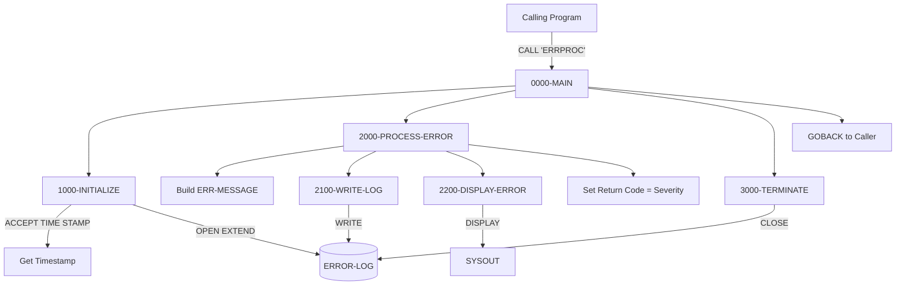

## Overview

ERRPROC is a reusable error processing subroutine that provides centralized error handling services for the application. It accepts error information from calling programs via a linkage section parameter, logs the error to a sequential error log file, and displays formatted error information to the system output.

This program serves as the standard mechanism for error reporting across the application, ensuring consistent error logging, formatting, and severity handling. By centralizing error processing, the application maintains uniform error documentation that supports troubleshooting, monitoring, and compliance requirements.

ERRPROC is designed to be called from both batch and online programs whenever an error condition needs to be recorded and reported. The program returns the severity level as the return code, allowing calling programs to make decisions based on error severity.

## Program Structure



## Data Structures

### Working Storage

#### ERRHAND Copybook Structures

The program uses the ERRHAND copybook which provides standard error handling definitions:

**Error Categories (ERR-CATEGORIES)**

| Name | Value | Description |
|------|-------|-------------|
| ERR-CAT-VSAM | VS | VSAM file error |
| ERR-CAT-VALID | VL | Validation error |
| ERR-CAT-PROC | PR | Processing error |
| ERR-CAT-SYSTEM | SY | System error |

**Standard Return Codes (ERR-RETURN-CODES)**

| Name | Value | Description |
|------|-------|-------------|
| ERR-SUCCESS | 0 | Successful completion |
| ERR-WARNING | 4 | Warning condition |
| ERR-ERROR | 8 | Error condition |
| ERR-SEVERE | 12 | Severe error |
| ERR-TERMINAL | 16 | Terminal/critical error |

**Error Message Structure (ERR-MESSAGE)**

| Level | Name | Picture | Description |
|-------|------|---------|-------------|
| 01 | ERR-MESSAGE | - | Complete error message structure |
| 05 | ERR-TIMESTAMP | - | Timestamp group |
| 10 | ERR-DATE | X(10) | Error date |
| 10 | ERR-TIME | X(8) | Error time |
| 05 | ERR-PROGRAM | X(8) | Program that detected error |
| 05 | ERR-CATEGORY | X(2) | Error category code |
| 05 | ERR-CODE | X(4) | Specific error code |
| 05 | ERR-SEVERITY | S9(4) COMP | Severity level |
| 05 | ERR-TEXT | X(80) | Error message text |
| 05 | ERR-DETAILS | X(256) | Detailed error information |

**VSAM Status Values (ERR-VSAM-STATUSES)**

| Name | Value | Description |
|------|-------|-------------|
| ERR-VSAM-SUCCESS | 00 | Successful operation |
| ERR-VSAM-DUPKEY | 22 | Duplicate key |
| ERR-VSAM-NOTFND | 23 | Record not found |
| ERR-VSAM-EOF | 10 | End of file |

#### Work Areas (WS-WORK-AREAS)

| Level | Name | Picture | Description |
|-------|------|---------|-------------|
| 01 | WS-WORK-AREAS | - | Working storage group |
| 05 | WS-LOG-STATUS | X(2) | File status for error log |
| 05 | WS-FORMATTED-TIME | X(26) | System timestamp |

### File Section

| Level | Name | Picture | Description |
|-------|------|---------|-------------|
| 01 | ERROR-LOG-RECORD | - | Error log file record |
| 05 | LOG-DATA | X(400) | Error data content |

### Linkage Section - Input/Output Parameter

The calling program passes a single structure containing error information:

#### LS-ERROR-REQUEST

| Level | Name | Picture | Description |
|-------|------|---------|-------------|
| 01 | LS-ERROR-REQUEST | - | Complete error request structure |
| 05 | LS-PROGRAM-ID | X(8) | Program reporting the error |
| 05 | LS-CATEGORY | X(2) | Error category (VS/VL/PR/SY) |
| 05 | LS-ERROR-CODE | X(4) | Specific error code |
| 05 | LS-SEVERITY | S9(4) COMP | Severity level (0/4/8/12/16) |
| 05 | LS-ERROR-TEXT | X(80) | Error message text |
| 05 | LS-ERROR-DETAILS | X(256) | Additional error details |
| 05 | LS-RETURN-CODE | S9(4) COMP | Return code (output) |

## File I/O

### ERROR-LOG

| Attribute | Value |
|-----------|-------|
| Logical Name | ERROR-LOG |
| DD Name | ERRLOG |
| Organization | Sequential |
| Access Mode | Sequential |
| Open Mode | Extend |
| Recording Mode | Fixed (F) |
| Record Length | 400 characters |
| File Status | WS-LOG-STATUS |

The file is opened in **EXTEND** mode to append new error records to the existing log file, preserving the historical error trail.

### File Operations

| Operation | Paragraph | Description |
|-----------|-----------|-------------|
| OPEN EXTEND | 1000-INITIALIZE | Opens log file for appending |
| WRITE | 2100-WRITE-LOG | Writes error record to log |
| CLOSE | 3000-TERMINATE | Closes the error log file |

## Control Flow

### Processing Logic

1. **1000-INITIALIZE**
   - Initializes work areas to spaces/zeros
   - Accepts current timestamp using `ACCEPT WS-FORMATTED-TIME FROM TIME STAMP`
   - Opens the error log file in EXTEND mode
   - Displays warning if file open fails (but continues processing)

2. **2000-PROCESS-ERROR**
   - Builds the ERR-MESSAGE structure from linkage section data:
     - Timestamp from working storage
     - Program ID, category, error code from caller
     - Severity level from caller
     - Error text and details from caller
   - Calls 2100-WRITE-LOG to write the error record
   - Calls 2200-DISPLAY-ERROR to display formatted output
   - Sets the return code equal to the severity level

3. **2100-WRITE-LOG**
   - Moves ERR-MESSAGE to LOG-DATA
   - Writes the error log record
   - Displays warning if write fails

4. **2200-DISPLAY-ERROR**
   - Displays a formatted error report to SYSOUT including:
     - Separator lines
     - Timestamp
     - Program name
     - Error category
     - Error code
     - Severity level
     - Error message text
     - Error details

5. **3000-TERMINATE**
   - Closes the error log file
   - Returns control to calling program via GOBACK

### Error Display Format

The program displays errors in a structured format:

```
====================================================
ERROR DETECTED: 2024-03-20-14.30.45.123456
PROGRAM:       MYPROG
CATEGORY:      VS
CODE:          E004
SEVERITY:      +0008
MESSAGE:       File read error occurred
DETAILS:       Record key 12345 not found in CUSTFILE
====================================================
```

## Dependencies

### Copybooks

- **ERRHAND** - Standard error handling definitions including error categories, return codes, message structure, and VSAM status values

### Called Programs

This program does not call any other programs. It is designed to be called by other programs.

### Related Programs

Programs that use the ERRHAND copybook and may call ERRPROC:

- **Batch Programs:** BCHCTL00, HISTLD00, PRCSEQ00, RCVPRC00, RPTAUD00, RPTPOS00, RPTSTA00
- **DB2 Programs:** DB2CMT, DB2CONN, DB2ERR, DB2STAT
- **Online Programs:** PORTTEST, PORTTRAN
- **Test Programs:** TSTGEN00, TSTVAL00
- **Utility Programs:** UTLMNT00, UTLMON00, UTLVAL00

## Technical Notes

### COBOL Concepts Used

- **ACCEPT FROM TIME STAMP**: Retrieves the current system timestamp in a 26-character format including date and time with microseconds precision.

- **OPEN EXTEND**: Opens the file for output, positioning at the end of existing data. New records are appended, preserving the error history.

- **DISPLAY Statement**: Outputs formatted messages to SYSOUT (typically the job log in batch or console in online environments).

- **Linkage Section and USING Clause**: The `PROCEDURE DIVISION USING LS-ERROR-REQUEST` establishes the parameter interface for the subroutine call.

### Calling Convention

To call ERRPROC from another COBOL program:

```cobol
WORKING-STORAGE SECTION.
01  WS-ERROR-REQUEST.
    05  WS-PROGRAM-ID      PIC X(8).
    05  WS-CATEGORY        PIC X(2).
    05  WS-ERROR-CODE      PIC X(4).
    05  WS-SEVERITY        PIC S9(4) COMP.
    05  WS-ERROR-TEXT      PIC X(80).
    05  WS-ERROR-DETAILS   PIC X(256).
    05  WS-RETURN-CODE     PIC S9(4) COMP.

PROCEDURE DIVISION.
    MOVE 'MYPROG'   TO WS-PROGRAM-ID
    MOVE 'VS'       TO WS-CATEGORY
    MOVE 'E004'     TO WS-ERROR-CODE
    MOVE 8          TO WS-SEVERITY
    MOVE 'File read error occurred' TO WS-ERROR-TEXT
    MOVE 'Record key 12345 not found in CUSTFILE'
                    TO WS-ERROR-DETAILS
    
    CALL 'ERRPROC' USING WS-ERROR-REQUEST
    
    IF WS-RETURN-CODE >= 12
        DISPLAY 'Severe error - aborting'
        STOP RUN
    END-IF
```

### Return Code Behavior

The program sets the return code equal to the severity passed by the caller:

| Severity Input | Return Code | Recommended Action |
|----------------|-------------|-------------------|
| 0 | 0 | Continue processing |
| 4 | 4 | Continue with warning |
| 8 | 8 | Handle error, may continue |
| 12 | 12 | Severe error, consider termination |
| 16 | 16 | Critical error, terminate |

### Error Categories Quick Reference

| Code | Category | Typical Use |
|------|----------|-------------|
| VS | VSAM | File operation errors |
| VL | Validation | Data validation failures |
| PR | Processing | Business logic errors |
| SY | System | System-level errors |

### JCL Considerations

The calling job must include a DD statement for the error log:

```jcl
//ERRLOG   DD DSN=your.error.log,DISP=MOD
```

Using `DISP=MOD` complements the OPEN EXTEND, ensuring records are appended to the existing file.
