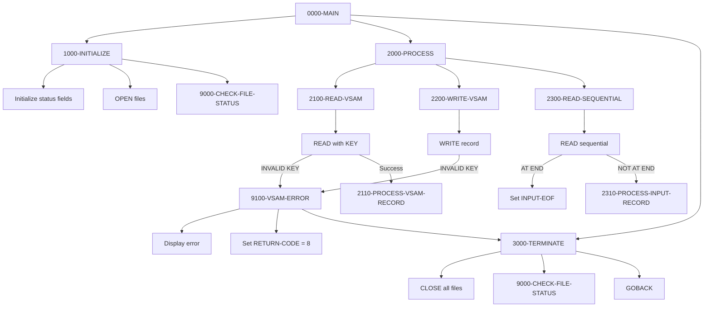

## Overview

FILEHNDL is a template program that demonstrates standard patterns for handling both VSAM KSDS (Key-Sequenced Data Set) files and sequential files in COBOL. It provides reusable code patterns for common file operations including reading, writing, and error handling.

The template includes three file definitions covering the most common file types: a VSAM indexed file with dynamic access, a sequential input file, and a sequential output file. Each file has associated status fields with 88-level conditions for easy status checking.

This template is designed to be copied and customized by developers when creating new programs that require file handling. It establishes consistent patterns for file operations and error handling across the system.

:::note Template Program
This is a **template program** intended to be copied and modified for specific applications. The processing paragraphs (2110-PROCESS-VSAM-RECORD, 2310-PROCESS-INPUT-RECORD) are referenced but not implemented, serving as placeholders for application-specific logic.
:::

## Program Structure



## Data Structures

### VSAM File Record

| Level | Name | Picture | Description |
|-------|------|---------|-------------|
| 01 | VSAM-RECORD | - | VSAM KSDS record (100 bytes) |
| 05 | VSAM-RECORD-KEY | X(10) | Primary record key |
| 05 | VSAM-RECORD-DATA | X(90) | Record data area |

### Sequential File Records

| File | Record Name | Picture | Description |
|------|-------------|---------|-------------|
| INPUT-FILE | INPUT-RECORD | X(80) | 80-byte input record |
| OUTPUT-FILE | OUTPUT-RECORD | X(80) | 80-byte output record |

### File Status Fields

| Level | Name | Picture | Description |
|-------|------|---------|-------------|
| 01 | WS-FILE-STATUS | - | File status group |
| 05 | WS-VSAM-STATUS | X(2) | VSAM file status |
| 05 | WS-INPUT-STATUS | X(2) | Input file status |
| 05 | WS-OUTPUT-STATUS | X(2) | Output file status |

### VSAM Status Conditions

| Value | 88-Level Condition | Description |
|-------|-------------------|-------------|
| `00` | VSAM-SUCCESS | Operation successful |
| `10` | VSAM-EOF | End of file reached |
| `22` | VSAM-DUP-KEY | Duplicate key on write |
| `23` | VSAM-NOT-FOUND | Record not found on read |

### Sequential Status Conditions

| Value | 88-Level Condition | Description |
|-------|-------------------|-------------|
| `00` | INPUT-SUCCESS | Input operation successful |
| `10` | INPUT-EOF | End of input file |
| `00` | OUTPUT-SUCCESS | Output operation successful |

### Working Storage

| Level | Name | Picture | Description |
|-------|------|---------|-------------|
| 05 | WS-VSAM-KEY | X(10) | Work area for VSAM key |

## File I/O

### VSAM-FILE

A VSAM KSDS (Key-Sequenced Data Set) file with dynamic access.

| Property | Value |
|----------|-------|
| Logical Name | VSAM-FILE |
| DD Name | VSAMFILE |
| Organization | INDEXED |
| Access Mode | DYNAMIC |
| Record Key | VSAM-RECORD-KEY |
| Record Length | 100 bytes |
| File Status | WS-VSAM-STATUS |

**Access Mode DYNAMIC** allows both:
- Random access by key (READ with KEY IS)
- Sequential access (READ NEXT)

### INPUT-FILE

A sequential input file for reading data.

| Property | Value |
|----------|-------|
| Logical Name | INPUT-FILE |
| DD Name | INFILE |
| Organization | SEQUENTIAL |
| Access Mode | SEQUENTIAL |
| Open Mode | INPUT |
| Recording Mode | F (Fixed) |
| Record Length | 80 bytes |
| File Status | WS-INPUT-STATUS |

### OUTPUT-FILE

A sequential output file for writing data.

| Property | Value |
|----------|-------|
| Logical Name | OUTPUT-FILE |
| DD Name | OUTFILE |
| Organization | SEQUENTIAL |
| Access Mode | SEQUENTIAL |
| Open Mode | OUTPUT |
| Recording Mode | F (Fixed) |
| Record Length | 80 bytes |
| File Status | WS-OUTPUT-STATUS |

## Control Flow

### Main Processing (0000-MAIN)

Standard three-phase structure:
1. Calls 1000-INITIALIZE for setup
2. Calls 2000-PROCESS for main processing
3. Calls 3000-TERMINATE for cleanup
4. Returns via GOBACK

### Initialize (1000-INITIALIZE)

Prepares the processing environment:
1. Initializes WS-FILE-STATUS to spaces
2. Opens VSAM-FILE for INPUT
3. Opens INPUT-FILE for INPUT
4. Opens OUTPUT-FILE for OUTPUT
5. Calls 9000-CHECK-FILE-STATUS to verify opens

### Process (2000-PROCESS)

Contains example file operation paragraphs:

#### 2100-READ-VSAM - VSAM Random Read
```cobol
MOVE LOW-VALUES TO VSAM-RECORD-KEY
READ VSAM-FILE KEY IS VSAM-RECORD-KEY
    INVALID KEY
        PERFORM 9100-VSAM-ERROR
END-READ
IF VSAM-SUCCESS
    PERFORM 2110-PROCESS-VSAM-RECORD
END-IF
```

**Pattern:** Use `KEY IS` clause for random access by key. The `INVALID KEY` phrase handles not-found and other error conditions.

#### 2200-WRITE-VSAM - VSAM Write
```cobol
WRITE VSAM-RECORD
    INVALID KEY
        PERFORM 9100-VSAM-ERROR
END-WRITE
```

**Pattern:** The `INVALID KEY` phrase catches duplicate key errors (status 22) and other write failures.

#### 2300-READ-SEQUENTIAL - Sequential Read
```cobol
READ INPUT-FILE
    AT END
        SET INPUT-EOF TO TRUE
    NOT AT END
        PERFORM 2310-PROCESS-INPUT-RECORD
END-READ
```

**Pattern:** Use `AT END` / `NOT AT END` phrases for sequential reading with end-of-file detection.

### Terminate (3000-TERMINATE)

Closes all files and verifies close operations:
1. Closes VSAM-FILE, INPUT-FILE, OUTPUT-FILE
2. Calls 9000-CHECK-FILE-STATUS to verify closes

### Error Handling (9000-CHECK-FILE-STATUS)

Validates file status after operations:
1. Checks VSAM status (ignores success and EOF)
2. Checks INPUT status (ignores success and EOF)
3. Checks OUTPUT status (ignores success)

Calls appropriate error handler for any failures.

### VSAM Error Handler (9100-VSAM-ERROR)

Handles VSAM file errors:
1. Displays error message with file status code
2. Sets RETURN-CODE to 8
3. Performs 3000-TERMINATE to close files
4. Exits via GOBACK

### Sequential Error Handler (9200-SEQ-ERROR)

Handles sequential file errors:
1. Displays error message with both status codes
2. Sets RETURN-CODE to 8
3. Performs 3000-TERMINATE to close files
4. Exits via GOBACK

## File Status Codes Reference

### Common VSAM Status Codes

| Status | Category | Description |
|--------|----------|-------------|
| 00 | Success | Operation completed successfully |
| 02 | Success | Duplicate alternate key (non-unique) |
| 10 | End | End of file reached |
| 21 | Error | Sequence error on write |
| 22 | Error | Duplicate primary key |
| 23 | Error | Record not found |
| 24 | Error | Boundary violation |
| 35 | Error | File not found |
| 39 | Error | File attributes conflict |
| 41 | Error | File already open |
| 42 | Error | File not open |
| 46 | Error | No current record (sequential read) |
| 47 | Error | File not open for input |
| 48 | Error | File not open for output |
| 49 | Error | Rewrite/Delete without prior read |

### Common Sequential Status Codes

| Status | Category | Description |
|--------|----------|-------------|
| 00 | Success | Operation completed successfully |
| 10 | End | End of file reached |
| 30 | Error | Permanent I/O error |
| 34 | Error | Boundary violation (disk full) |
| 35 | Error | File not found |
| 37 | Error | Invalid open mode |
| 41 | Error | File already open |
| 42 | Error | File not open |

## Return Codes

| Code | Description |
|------|-------------|
| 0 | Processing completed successfully |
| 8 | File error occurred |

## Template Customization Points

When using this template, customize the following:

### Placeholder Paragraphs

These paragraphs are referenced but not implemented:

| Paragraph | Purpose |
|-----------|---------|
| 2110-PROCESS-VSAM-RECORD | Process successfully read VSAM record |
| 2310-PROCESS-INPUT-RECORD | Process successfully read input record |

### File Definitions

Modify as needed:
- Record layouts (VSAM-RECORD, INPUT-RECORD, OUTPUT-RECORD)
- Record lengths
- Key fields and positions
- Additional files

### Open Modes

Adjust based on requirements:
- VSAM-FILE: INPUT, OUTPUT, I-O, or EXTEND
- Sequential files: INPUT, OUTPUT, I-O, or EXTEND

## JCL Example

```jcl
//FILEHNDL EXEC PGM=FILEHNDL
//STEPLIB  DD  DSN=your.loadlib,DISP=SHR
//VSAMFILE DD  DSN=your.vsam.cluster,DISP=SHR
//INFILE   DD  DSN=your.input.file,DISP=SHR
//OUTFILE  DD  DSN=your.output.file,
//             DISP=(NEW,CATLG,DELETE),
//             SPACE=(TRK,(10,5)),
//             DCB=(RECFM=FB,LRECL=80,BLKSIZE=0)
//SYSOUT   DD  SYSOUT=*
```

## Code Patterns

### Pattern: VSAM Random Read with Status Check

```cobol
MOVE search-key TO VSAM-RECORD-KEY
READ VSAM-FILE KEY IS VSAM-RECORD-KEY
    INVALID KEY
        EVALUATE TRUE
            WHEN VSAM-NOT-FOUND
                PERFORM not-found-processing
            WHEN OTHER
                PERFORM 9100-VSAM-ERROR
        END-EVALUATE
END-READ
IF VSAM-SUCCESS
    PERFORM process-record
END-IF
```

### Pattern: VSAM Sequential Browse

```cobol
MOVE starting-key TO VSAM-RECORD-KEY
START VSAM-FILE KEY >= VSAM-RECORD-KEY
    INVALID KEY
        PERFORM no-records-found
END-START

PERFORM UNTIL VSAM-EOF
    READ VSAM-FILE NEXT RECORD
        AT END
            SET VSAM-EOF TO TRUE
        NOT AT END
            PERFORM process-record
    END-READ
END-PERFORM
```

### Pattern: VSAM Update (Read-Modify-Rewrite)

```cobol
MOVE search-key TO VSAM-RECORD-KEY
READ VSAM-FILE KEY IS VSAM-RECORD-KEY
    INVALID KEY
        PERFORM 9100-VSAM-ERROR
END-READ

IF VSAM-SUCCESS
    MOVE new-data TO VSAM-RECORD-DATA
    REWRITE VSAM-RECORD
        INVALID KEY
            PERFORM 9100-VSAM-ERROR
    END-REWRITE
END-IF
```

### Pattern: Sequential File Copy

```cobol
PERFORM UNTIL INPUT-EOF
    READ INPUT-FILE
        AT END
            SET INPUT-EOF TO TRUE
        NOT AT END
            MOVE INPUT-RECORD TO OUTPUT-RECORD
            WRITE OUTPUT-RECORD
    END-READ
END-PERFORM
```

## Technical Notes

- **ACCESS MODE DYNAMIC** on VSAM files enables both random (KEY IS) and sequential (NEXT RECORD) access in the same program
- **BLOCK CONTAINS 0 RECORDS** allows the system to determine optimal blocking factor
- **RECORDING MODE IS F** specifies fixed-length records for sequential files
- The **INVALID KEY** phrase on VSAM operations catches all error conditions (status 21-49)
- The **AT END** / **NOT AT END** phrases handle end-of-file detection for sequential reads
- **LOW-VALUES** is used to position to the beginning of a VSAM file
- File status is a 2-character field; always check both characters for complete error information
- The template uses 88-level conditions for readable status checking instead of comparing literal values
- Error handlers call 3000-TERMINATE before GOBACK to ensure proper file closure
