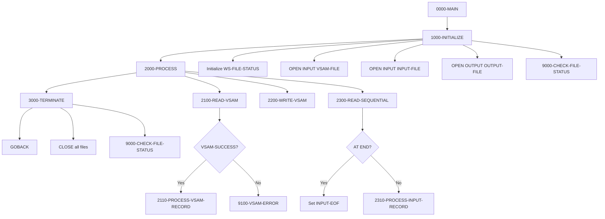

:::info Template Program
This is a **template program** designed to be copied and customized for new development. It demonstrates standard patterns for VSAM and sequential file handling in COBOL.
:::

## Overview

FILE-HANDLING (FILEHNDL) is a template program that provides standardized patterns for working with both VSAM KSDS files and sequential files in COBOL. It demonstrates best practices for file definition, status checking, error handling, and common I/O operations.

The template includes three file types commonly used in batch processing:
- **VSAM KSDS** - For indexed, keyed access to master files
- **Sequential Input** - For reading transaction or parameter files
- **Sequential Output** - For writing reports or extract files

Developers should copy this template and customize the record layouts, processing logic, and error handling for their specific requirements.

## Program Structure



## Data Structures

### VSAM Record (File Section)

| Level | Name | Picture | Description |
|-------|------|---------|-------------|
| 01 | VSAM-RECORD | - | VSAM file record (100 bytes) |
| 05 | VSAM-RECORD-KEY | X(10) | Primary record key |
| 05 | VSAM-RECORD-DATA | X(90) | Record data area |

### Sequential Input Record (File Section)

| Level | Name | Picture | Description |
|-------|------|---------|-------------|
| 01 | INPUT-RECORD | X(80) | Input file record |

### Sequential Output Record (File Section)

| Level | Name | Picture | Description |
|-------|------|---------|-------------|
| 01 | OUTPUT-RECORD | X(80) | Output file record |

### Working Storage - File Status

| Level | Name | Picture | Description |
|-------|------|---------|-------------|
| 05 | WS-VSAM-STATUS | X(2) | VSAM file status |
| 05 | WS-INPUT-STATUS | X(2) | Input file status |
| 05 | WS-OUTPUT-STATUS | X(2) | Output file status |

### File Status Conditions (88-Levels)

| Condition | Value | Meaning |
|-----------|-------|---------|
| VSAM-SUCCESS | '00' | Successful VSAM operation |
| VSAM-EOF | '10' | End of file reached |
| VSAM-DUP-KEY | '22' | Duplicate key on WRITE |
| VSAM-NOT-FOUND | '23' | Record not found on READ |
| INPUT-SUCCESS | '00' | Successful input operation |
| INPUT-EOF | '10' | End of input file |
| OUTPUT-SUCCESS | '00' | Successful output operation |

### VSAM Work Areas

| Level | Name | Picture | Description |
|-------|------|---------|-------------|
| 05 | WS-VSAM-KEY | X(10) | Work area for key manipulation |

## File Definitions

### VSAM-FILE (VSAM KSDS)

| Attribute | Value |
|-----------|-------|
| Logical Name | VSAM-FILE |
| DD Name | VSAMFILE |
| Organization | INDEXED |
| Access Mode | DYNAMIC |
| Record Key | VSAM-RECORD-KEY |
| Record Length | 100 bytes |
| File Status | WS-VSAM-STATUS |

**Dynamic access mode** allows both sequential and random access to the VSAM file using the same SELECT statement.

### INPUT-FILE (Sequential)

| Attribute | Value |
|-----------|-------|
| Logical Name | INPUT-FILE |
| DD Name | INFILE |
| Organization | SEQUENTIAL |
| Access Mode | SEQUENTIAL |
| Recording Mode | F (Fixed) |
| Record Length | 80 bytes |
| File Status | WS-INPUT-STATUS |

### OUTPUT-FILE (Sequential)

| Attribute | Value |
|-----------|-------|
| Logical Name | OUTPUT-FILE |
| DD Name | OUTFILE |
| Organization | SEQUENTIAL |
| Access Mode | SEQUENTIAL |
| Recording Mode | F (Fixed) |
| Record Length | 80 bytes |
| File Status | WS-OUTPUT-STATUS |

## Template Patterns

### Pattern 1: VSAM Keyed READ

```cobol
2100-READ-VSAM.
    MOVE LOW-VALUES TO VSAM-RECORD-KEY
    
    READ VSAM-FILE KEY IS VSAM-RECORD-KEY
        INVALID KEY
            PERFORM 9100-VSAM-ERROR
    END-READ
    
    IF VSAM-SUCCESS
        PERFORM 2110-PROCESS-VSAM-RECORD
    END-IF
    .
```

**Usage Notes:**
- Set VSAM-RECORD-KEY before the READ
- Use `KEY IS` clause for explicit key specification
- Handle INVALID KEY for not-found conditions
- Check VSAM-SUCCESS before processing

### Pattern 2: VSAM WRITE

```cobol
2200-WRITE-VSAM.
    WRITE VSAM-RECORD
        INVALID KEY
            PERFORM 9100-VSAM-ERROR
    END-WRITE
    .
```

**Usage Notes:**
- Populate VSAM-RECORD before WRITE
- INVALID KEY catches duplicate key errors
- Check for VSAM-DUP-KEY ('22') status

### Pattern 3: Sequential READ

```cobol
2300-READ-SEQUENTIAL.
    READ INPUT-FILE
        AT END
            SET INPUT-EOF TO TRUE
        NOT AT END
            PERFORM 2310-PROCESS-INPUT-RECORD
    END-READ
    .
```

**Usage Notes:**
- Use AT END/NOT AT END for end-of-file handling
- Set a flag (INPUT-EOF) for loop control
- Process record only on NOT AT END

### Pattern 4: File Status Checking

```cobol
9000-CHECK-FILE-STATUS.
    IF NOT VSAM-SUCCESS AND NOT VSAM-EOF
        PERFORM 9100-VSAM-ERROR
    END-IF
    
    IF NOT INPUT-SUCCESS AND NOT INPUT-EOF
        PERFORM 9200-SEQ-ERROR
    END-IF
    
    IF NOT OUTPUT-SUCCESS
        PERFORM 9200-SEQ-ERROR
    END-IF
    .
```

**Usage Notes:**
- Always check file status after OPEN and CLOSE
- Allow for expected conditions (EOF)
- Centralize status checking logic

## Error Handling

### 9100-VSAM-ERROR

Handles VSAM file errors:
1. Displays error message with file status
2. Sets RETURN-CODE to 8
3. Performs cleanup (3000-TERMINATE)
4. Exits program via GOBACK

### 9200-SEQ-ERROR

Handles sequential file errors:
1. Displays error message with both input and output status
2. Sets RETURN-CODE to 8
3. Performs cleanup (3000-TERMINATE)
4. Exits program via GOBACK

## Return Codes

| Code | Meaning |
|------|---------|
| 0 | Successful completion |
| 8 | File error occurred |

## Customization Points

When using this template, customize the following:

### 1. Record Layouts

Replace the generic record definitions:

```cobol
* Replace this:
01  VSAM-RECORD.
    05  VSAM-RECORD-KEY          PIC X(10).
    05  VSAM-RECORD-DATA         PIC X(90).

* With your specific layout:
01  CUSTOMER-RECORD.
    05  CUST-KEY.
        10  CUST-ID              PIC X(8).
        10  CUST-TYPE            PIC XX.
    05  CUST-NAME                PIC X(30).
    05  CUST-ADDRESS             PIC X(60).
```

### 2. Processing Logic

Implement the stub paragraphs:

```cobol
2110-PROCESS-VSAM-RECORD.
    * Add your VSAM record processing logic here
    .

2310-PROCESS-INPUT-RECORD.
    * Add your input record processing logic here
    .
```

### 3. Main Processing Loop

Modify 2000-PROCESS for your workflow:

```cobol
2000-PROCESS.
    PERFORM UNTIL INPUT-EOF
        READ INPUT-FILE
            AT END
                SET INPUT-EOF TO TRUE
            NOT AT END
                PERFORM 2100-LOOKUP-VSAM
                PERFORM 2200-UPDATE-RECORD
                PERFORM 2300-WRITE-OUTPUT
        END-READ
    END-PERFORM
    .
```

### 4. File Open Modes

Adjust open modes as needed:

| Operation | Open Mode |
|-----------|-----------|
| Read only | INPUT |
| Write new | OUTPUT |
| Read and update | I-O |
| Append | EXTEND |

## File Status Reference

### Common VSAM Status Codes

| Status | Meaning |
|--------|---------|
| 00 | Successful completion |
| 02 | Duplicate alternate key (non-unique) |
| 10 | End of file |
| 21 | Sequence error |
| 22 | Duplicate primary key |
| 23 | Record not found |
| 24 | Key outside boundary |
| 35 | File not found |
| 39 | File attribute mismatch |
| 41 | File already open |
| 42 | File not open |
| 46 | No current record (sequential read) |
| 47 | Read not allowed (wrong open mode) |
| 48 | Write not allowed (wrong open mode) |
| 49 | Delete/Rewrite not allowed |

### Common Sequential Status Codes

| Status | Meaning |
|--------|---------|
| 00 | Successful completion |
| 04 | Record length mismatch |
| 05 | File not present (optional file) |
| 10 | End of file |
| 30 | Permanent I/O error |
| 34 | Disk full |
| 35 | File not found |
| 37 | Open mode not supported |
| 41 | File already open |
| 42 | File not open |

## Technical Notes

1. **DYNAMIC Access Mode**: Allows mixing random (READ KEY) and sequential (READ NEXT) operations on the same VSAM file without reopening.

2. **BLOCK CONTAINS 0**: Lets the system determine optimal blocking based on device and buffer characteristics.

3. **RECORDING MODE F**: Specifies fixed-length records. Use V for variable-length.

4. **LOW-VALUES for Key**: Moving LOW-VALUES to a key positions to the beginning of the file for sequential browsing.

5. **File Status Best Practice**: Always define and check FILE STATUS for every file. This is essential for proper error handling.

6. **INVALID KEY vs AT END**: Use INVALID KEY for keyed operations (READ KEY, WRITE, REWRITE, DELETE). Use AT END for sequential READ.

7. **Stub Paragraphs**: The template references 2110-PROCESS-VSAM-RECORD and 2310-PROCESS-INPUT-RECORD which must be implemented when customizing.

## JCL Example

```jcl
//FILEHNDL EXEC PGM=FILEHNDL
//STEPLIB  DD DSN=your.loadlib,DISP=SHR
//VSAMFILE DD DSN=your.vsam.cluster,DISP=SHR
//INFILE   DD DSN=your.input.file,DISP=SHR
//OUTFILE  DD DSN=your.output.file,
//            DISP=(NEW,CATLG,DELETE),
//            SPACE=(TRK,(10,5)),
//            DCB=(RECFM=FB,LRECL=80,BLKSIZE=0)
//SYSOUT   DD SYSOUT=*
```

## Related Templates

- **standard-program.cbl** - Basic COBOL program structure template
- **db2-handling.cbl** - DB2 database access template
- **error-handling.cbl** - Error handling patterns template
