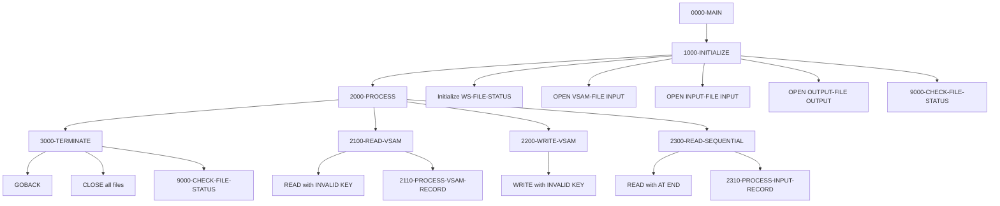
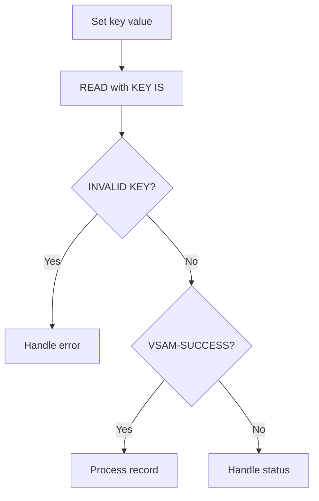
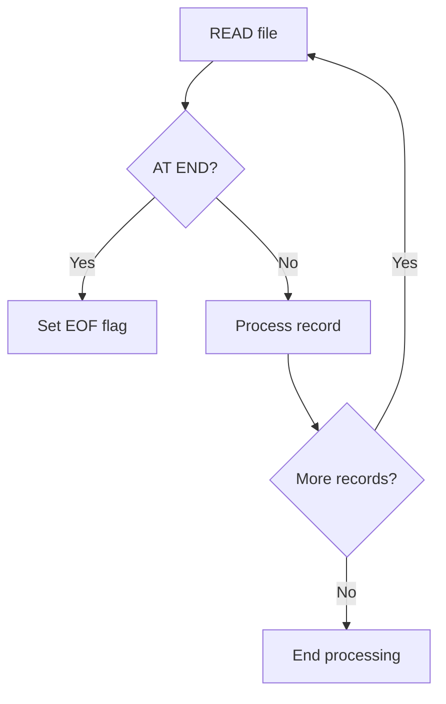
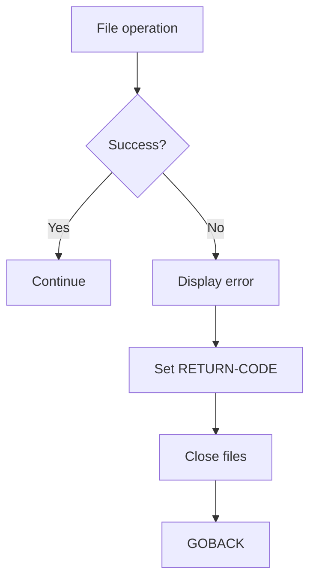

## Overview

FILE-HANDLING (FILEHNDL) is a template program that demonstrates standard patterns for handling VSAM and sequential files in COBOL. It provides reusable code examples for common file operations including opening, reading, writing, and closing files with proper error handling.

The template showcases three file types: a VSAM KSDS (Key-Sequenced Data Set) file with dynamic access mode, a sequential input file, and a sequential output file. Each file includes proper file status checking and condition name definitions for common status codes.

This program serves as a reference implementation for developers creating new batch programs that require file I/O operations. It demonstrates best practices for file status handling, error recovery, and structured program flow.

## Program Structure



## Data Structures

### VSAM Record (File Section)

| Level | Name | Picture | Description |
|-------|------|---------|-------------|
| 01 | VSAM-RECORD | | VSAM KSDS record (100 bytes) |
| 05 | VSAM-RECORD-KEY | X(10) | Primary record key |
| 05 | VSAM-RECORD-DATA | X(90) | Record data area |

### Sequential Input Record (File Section)

| Level | Name | Picture | Description |
|-------|------|---------|-------------|
| 01 | INPUT-RECORD | X(80) | Sequential input record |

### Sequential Output Record (File Section)

| Level | Name | Picture | Description |
|-------|------|---------|-------------|
| 01 | OUTPUT-RECORD | X(80) | Sequential output record |

### Working Storage - File Status

| Level | Name | Picture | Description |
|-------|------|---------|-------------|
| 05 | WS-VSAM-STATUS | X(2) | VSAM file status |
| 05 | WS-INPUT-STATUS | X(2) | Input file status |
| 05 | WS-OUTPUT-STATUS | X(2) | Output file status |

### VSAM Status Condition Names

| Status | Condition Name | Description |
|--------|----------------|-------------|
| `00` | VSAM-SUCCESS | Successful operation |
| `10` | VSAM-EOF | End of file reached |
| `22` | VSAM-DUP-KEY | Duplicate key on write |
| `23` | VSAM-NOT-FOUND | Record not found |

### Sequential Status Condition Names

| Status | Condition Name | Description |
|--------|----------------|-------------|
| `00` | INPUT-SUCCESS | Successful input operation |
| `10` | INPUT-EOF | End of input file |
| `00` | OUTPUT-SUCCESS | Successful output operation |

### Working Storage - VSAM Work Areas

| Level | Name | Picture | Description |
|-------|------|---------|-------------|
| 05 | WS-VSAM-KEY | X(10) | Key work area for VSAM operations |

## File I/O

### VSAM-FILE

| Attribute | Value |
|-----------|-------|
| DD Name | VSAMFILE |
| Organization | Indexed (VSAM KSDS) |
| Access Mode | Dynamic |
| Record Key | VSAM-RECORD-KEY |
| Record Length | 100 bytes |
| Open Mode | INPUT |

**Operations demonstrated:**
- **READ** with KEY IS and INVALID KEY handling
- **WRITE** with INVALID KEY handling

### INPUT-FILE

| Attribute | Value |
|-----------|-------|
| DD Name | INFILE |
| Organization | Sequential |
| Access Mode | Sequential |
| Recording Mode | Fixed (F) |
| Record Length | 80 bytes |
| Open Mode | INPUT |

**Operations demonstrated:**
- **READ** with AT END and NOT AT END handling

### OUTPUT-FILE

| Attribute | Value |
|-----------|-------|
| DD Name | OUTFILE |
| Organization | Sequential |
| Access Mode | Sequential |
| Recording Mode | Fixed (F) |
| Record Length | 80 bytes |
| Open Mode | OUTPUT |

**Operations demonstrated:**
- File opening and closing patterns

## Control Flow

### 0000-MAIN

Main driver paragraph that orchestrates the three processing phases:
1. 1000-INITIALIZE - Opens files and initializes work areas
2. 2000-PROCESS - Contains example file operations
3. 3000-TERMINATE - Closes files and performs cleanup

### 1000-INITIALIZE

1. Initializes WS-FILE-STATUS to spaces
2. Opens VSAM-FILE for INPUT
3. Opens INPUT-FILE for INPUT
4. Opens OUTPUT-FILE for OUTPUT
5. Calls 9000-CHECK-FILE-STATUS to verify all opens succeeded

### 2000-PROCESS

Contains example operations organized as sub-paragraphs:

#### 2100-READ-VSAM
Demonstrates VSAM random read by key:
```cobol
MOVE LOW-VALUES TO VSAM-RECORD-KEY

READ VSAM-FILE KEY IS VSAM-RECORD-KEY
    INVALID KEY
        PERFORM 9100-VSAM-ERROR
END-READ

IF VSAM-SUCCESS
    PERFORM 2110-PROCESS-VSAM-RECORD
END-IF
```

#### 2200-WRITE-VSAM
Demonstrates VSAM write with duplicate key handling:
```cobol
WRITE VSAM-RECORD
    INVALID KEY
        PERFORM 9100-VSAM-ERROR
END-WRITE
```

#### 2300-READ-SEQUENTIAL
Demonstrates sequential read with end-of-file handling:
```cobol
READ INPUT-FILE
    AT END
        SET INPUT-EOF TO TRUE
    NOT AT END
        PERFORM 2310-PROCESS-INPUT-RECORD
END-READ
```

### 3000-TERMINATE

1. Closes all three files in a single CLOSE statement
2. Calls 9000-CHECK-FILE-STATUS to verify closes succeeded

### 9000-CHECK-FILE-STATUS

Comprehensive file status checking:
1. If VSAM status is not success or EOF, calls 9100-VSAM-ERROR
2. If input status is not success or EOF, calls 9200-SEQ-ERROR
3. If output status is not success, calls 9200-SEQ-ERROR

### 9100-VSAM-ERROR

VSAM-specific error handler:
1. Displays "VSAM ERROR - FILE STATUS:" with status code
2. Sets RETURN-CODE to 8
3. Performs 3000-TERMINATE to close files
4. GOBACKs to terminate program

### 9200-SEQ-ERROR

Sequential file error handler:
1. Displays "SEQUENTIAL FILE ERROR - STATUS:" with both input and output status
2. Sets RETURN-CODE to 8
3. Performs 3000-TERMINATE to close files
4. GOBACKs to terminate program

## File Operation Patterns

### VSAM Random Read Pattern



### Sequential Read Loop Pattern



### Error Recovery Pattern



## JCL Example

```jcl
//FILEHNDL EXEC PGM=FILEHNDL
//STEPLIB  DD   DSN=your.loadlib,DISP=SHR
//VSAMFILE DD   DSN=your.vsam.cluster,DISP=SHR
//INFILE   DD   DSN=your.input.file,DISP=SHR
//OUTFILE  DD   DSN=your.output.file,
//             DISP=(NEW,CATLG,DELETE),
//             SPACE=(TRK,(10,5),RLSE),
//             DCB=(RECFM=FB,LRECL=80,BLKSIZE=0)
//SYSOUT   DD   SYSOUT=*
```

## Return Codes

| Code | Description |
|------|-------------|
| 0 | Successful completion |
| 8 | File error (VSAM or sequential) |

## Stub Paragraphs

The following paragraphs are referenced but not fully implemented in the template. They serve as placeholders for application-specific logic:

| Paragraph | Purpose |
|-----------|---------|
| 2110-PROCESS-VSAM-RECORD | Process a successfully read VSAM record |
| 2310-PROCESS-INPUT-RECORD | Process a successfully read sequential record |

## Dependencies

### Copybooks

None - this is a standalone template program.

### Related Programs

This template can be used as a starting point for programs that require similar file handling patterns.

## Technical Notes

1. **Dynamic Access Mode**: The VSAM file uses `ACCESS MODE IS DYNAMIC`, allowing both random (by key) and sequential access in the same program. This is useful for programs that need to read specific records and also browse sequentially.

2. **BLOCK CONTAINS 0**: Sequential files use `BLOCK CONTAINS 0 RECORDS`, allowing the system to determine optimal blocking based on device characteristics.

3. **LOW-VALUES for Positioning**: The template demonstrates using `LOW-VALUES` to position at the beginning of the VSAM file, which is useful for sequential browsing from the start.

4. **Condition Names**: File status codes are defined with 88-level condition names (e.g., `VSAM-SUCCESS`, `INPUT-EOF`), making the code more readable than numeric comparisons.

5. **Centralized Error Handling**: The 9000-CHECK-FILE-STATUS paragraph provides a single point for validating file operations, reducing code duplication.

6. **Graceful Termination**: Error handlers always close files via 3000-TERMINATE before GOBACK, ensuring proper resource cleanup.

7. **INVALID KEY vs AT END**: 
   - VSAM operations use `INVALID KEY` for error handling (key not found, duplicate key)
   - Sequential reads use `AT END` for end-of-file detection

8. **File Status Checking**: The template demonstrates checking file status after operations using condition names rather than literal values, improving maintainability.

## Usage as Template

To use this template for a new program:

1. Copy the file and rename PROGRAM-ID
2. Modify record layouts in FILE SECTION for your data
3. Update file assignments (DD names) as needed
4. Implement the stub paragraphs (2110, 2310) with your processing logic
5. Add additional file operations as required
6. Modify error messages for your application context
