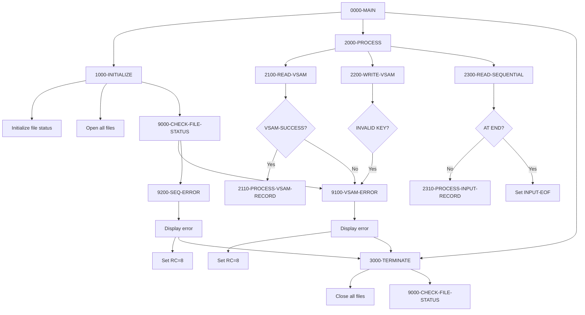
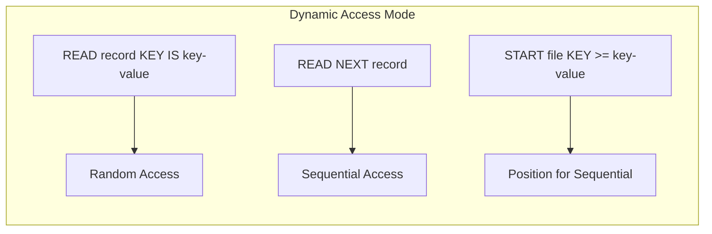

## Overview

FILE-HANDLING (Program ID: FILEHNDL) is a template program that demonstrates standard patterns for handling both VSAM indexed files and sequential files in COBOL. It serves as a reference implementation and starting point for developers building file-processing programs.

The template showcases three common file types:
- **VSAM KSDS** (Key-Sequenced Data Set) with dynamic access mode
- **Sequential Input** file for reading records
- **Sequential Output** file for writing records

This program provides skeleton code for file operations including OPEN, READ (keyed and sequential), WRITE, and CLOSE, along with comprehensive file status checking and error handling patterns.

:::info Template Program
This is a template/reference program intended to be copied and customized for specific application needs. The processing paragraphs (2110-PROCESS-VSAM-RECORD, 2310-PROCESS-INPUT-RECORD) are designed to be implemented based on specific business requirements.
:::

## Program Structure



## Data Structures

### File Section

#### VSAM-RECORD

| Level | Name | Picture | Description |
|-------|------|---------|-------------|
| 01 | VSAM-RECORD | - | VSAM file record (100 bytes) |
| 05 | VSAM-RECORD-KEY | X(10) | Primary key field |
| 05 | VSAM-RECORD-DATA | X(90) | Data portion |

#### INPUT-RECORD

| Level | Name | Picture | Description |
|-------|------|---------|-------------|
| 01 | INPUT-RECORD | X(80) | Sequential input record |

#### OUTPUT-RECORD

| Level | Name | Picture | Description |
|-------|------|---------|-------------|
| 01 | OUTPUT-RECORD | X(80) | Sequential output record |

### Working Storage

#### WS-FILE-STATUS

| Level | Name | Picture | Description |
|-------|------|---------|-------------|
| 01 | WS-FILE-STATUS | - | File status group |
| 05 | WS-VSAM-STATUS | X(2) | VSAM file status code |
| 05 | WS-INPUT-STATUS | X(2) | Input file status code |
| 05 | WS-OUTPUT-STATUS | X(2) | Output file status code |

##### WS-VSAM-STATUS Condition Names

| Condition | Value | Description |
|-----------|-------|-------------|
| VSAM-SUCCESS | '00' | Successful operation |
| VSAM-EOF | '10' | End of file reached |
| VSAM-DUP-KEY | '22' | Duplicate key on WRITE |
| VSAM-NOT-FOUND | '23' | Record not found on READ |

##### WS-INPUT-STATUS Condition Names

| Condition | Value | Description |
|-----------|-------|-------------|
| INPUT-SUCCESS | '00' | Successful operation |
| INPUT-EOF | '10' | End of file reached |

##### WS-OUTPUT-STATUS Condition Names

| Condition | Value | Description |
|-----------|-------|-------------|
| OUTPUT-SUCCESS | '00' | Successful operation |

#### WS-VSAM-WORK-AREAS

| Level | Name | Picture | Description |
|-------|------|---------|-------------|
| 01 | WS-VSAM-WORK-AREAS | - | VSAM work fields |
| 05 | WS-VSAM-KEY | X(10) | Key search field |

## File I/O

### VSAM-FILE

| Attribute | Value |
|-----------|-------|
| DD Name | VSAMFILE |
| Organization | INDEXED (VSAM KSDS) |
| Access Mode | DYNAMIC |
| Record Key | VSAM-RECORD-KEY |
| Record Length | 100 bytes |
| File Status | WS-VSAM-STATUS |
| Open Mode | INPUT |

**Operations Demonstrated:**
- **READ** - Keyed read with INVALID KEY handling
- **WRITE** - Insert with duplicate key detection

### INPUT-FILE

| Attribute | Value |
|-----------|-------|
| DD Name | INFILE |
| Organization | SEQUENTIAL |
| Access Mode | SEQUENTIAL |
| Recording Mode | F (Fixed) |
| Block Contains | 0 (System determined) |
| Record Length | 80 bytes |
| File Status | WS-INPUT-STATUS |
| Open Mode | INPUT |

**Operations Demonstrated:**
- **READ** - Sequential read with AT END handling

### OUTPUT-FILE

| Attribute | Value |
|-----------|-------|
| DD Name | OUTFILE |
| Organization | SEQUENTIAL |
| Access Mode | SEQUENTIAL |
| Recording Mode | F (Fixed) |
| Block Contains | 0 (System determined) |
| Record Length | 80 bytes |
| File Status | WS-OUTPUT-STATUS |
| Open Mode | OUTPUT |

**Operations Demonstrated:**
- **WRITE** - Sequential write (implementation needed)

## Control Flow

### 0000-MAIN

Standard batch program driver:
1. Initialize (open files, set up work areas)
2. Process (perform file operations)
3. Terminate (close files, cleanup)
4. Return via GOBACK

### 1000-INITIALIZE

Sets up the processing environment:
1. Initializes WS-FILE-STATUS to spaces
2. Opens VSAM-FILE for INPUT
3. Opens INPUT-FILE for INPUT
4. Opens OUTPUT-FILE for OUTPUT
5. Validates all files opened successfully via 9000-CHECK-FILE-STATUS

### 2000-PROCESS

Contains example file operation paragraphs (to be customized):
- 2100-READ-VSAM
- 2200-WRITE-VSAM
- 2300-READ-SEQUENTIAL

### 3000-TERMINATE

Closes all files and validates clean closure:
1. Closes VSAM-FILE, INPUT-FILE, OUTPUT-FILE
2. Checks file status via 9000-CHECK-FILE-STATUS

## File Operation Patterns

### VSAM Keyed Read (2100-READ-VSAM)

```cobol
MOVE LOW-VALUES TO VSAM-RECORD-KEY

READ VSAM-FILE KEY IS VSAM-RECORD-KEY
    INVALID KEY
        PERFORM 9100-VSAM-ERROR
END-READ

IF VSAM-SUCCESS
    PERFORM 2110-PROCESS-VSAM-RECORD
END-IF
```

**Pattern Notes:**
- Uses `KEY IS` clause for explicit key specification
- `INVALID KEY` handles not-found and other key errors
- Checks VSAM-SUCCESS before processing

### VSAM Write (2200-WRITE-VSAM)

```cobol
WRITE VSAM-RECORD
    INVALID KEY
        PERFORM 9100-VSAM-ERROR
END-WRITE
```

**Pattern Notes:**
- `INVALID KEY` catches duplicate key errors
- Record must be populated before WRITE
- Key field must be set in VSAM-RECORD-KEY

### Sequential Read (2300-READ-SEQUENTIAL)

```cobol
READ INPUT-FILE
    AT END
        SET INPUT-EOF TO TRUE
    NOT AT END
        PERFORM 2310-PROCESS-INPUT-RECORD
END-READ
```

**Pattern Notes:**
- Uses `AT END` / `NOT AT END` for end-of-file handling
- Sets condition name for loop control
- Process record only when successfully read

## VSAM Access Modes

The template uses **DYNAMIC** access mode for the VSAM file, which supports both:

| Access Type | Use Case |
|-------------|----------|
| Sequential | Reading all records in key order |
| Random | Reading/writing specific records by key |



## File Status Codes

### Common VSAM Status Codes

| Code | Meaning | Typical Cause |
|------|---------|---------------|
| 00 | Success | Operation completed normally |
| 10 | End of file | No more records (sequential read) |
| 22 | Duplicate key | WRITE with existing key |
| 23 | Record not found | READ with non-existent key |
| 24 | Key boundary | Key outside defined range |
| 35 | File not found | Dataset doesn't exist |
| 39 | Attribute conflict | File attributes don't match |

### Common Sequential Status Codes

| Code | Meaning | Typical Cause |
|------|---------|---------------|
| 00 | Success | Operation completed normally |
| 10 | End of file | No more records to read |
| 34 | Record too large | Record exceeds maximum |
| 35 | File not found | Dataset doesn't exist |
| 37 | Open mode error | Wrong open mode for operation |

## Error Handling

### 9000-CHECK-FILE-STATUS

Centralized file status validation:
```cobol
IF NOT VSAM-SUCCESS AND NOT VSAM-EOF
    PERFORM 9100-VSAM-ERROR
END-IF

IF NOT INPUT-SUCCESS AND NOT INPUT-EOF
    PERFORM 9200-SEQ-ERROR
END-IF

IF NOT OUTPUT-SUCCESS
    PERFORM 9200-SEQ-ERROR
END-IF
```

**Note:** EOF (status '10') is not treated as an error since it's a normal condition during sequential processing.

### 9100-VSAM-ERROR

VSAM-specific error handling:
1. Displays error message with file status
2. Sets RETURN-CODE to 8
3. Performs cleanup (3000-TERMINATE)
4. Exits program via GOBACK

### 9200-SEQ-ERROR

Sequential file error handling:
1. Displays both input and output file status
2. Sets RETURN-CODE to 8
3. Performs cleanup (3000-TERMINATE)
4. Exits program via GOBACK

## Dependencies

### Copybooks

None - this is a self-contained template.

### Called Programs

None - this is a standalone batch program.

## JCL Example

```jcl
//FILEHNDL EXEC PGM=FILEHNDL
//STEPLIB  DD DSN=your.loadlib,DISP=SHR
//*
//* VSAM KSDS File
//VSAMFILE DD DSN=your.vsam.cluster,DISP=SHR
//*
//* Sequential Input File
//INFILE   DD DSN=your.input.file,DISP=SHR
//*
//* Sequential Output File
//OUTFILE  DD DSN=your.output.file,
//            DISP=(NEW,CATLG,DELETE),
//            SPACE=(TRK,(10,5),RLSE),
//            DCB=(RECFM=FB,LRECL=80,BLKSIZE=0)
//*
//SYSOUT   DD SYSOUT=*
```

## Customization Guide

### Adding a New VSAM Operation

To add VSAM UPDATE capability:

```cobol
2400-UPDATE-VSAM.
    READ VSAM-FILE KEY IS VSAM-RECORD-KEY
        INVALID KEY
            PERFORM 9100-VSAM-ERROR
    END-READ
    
    IF VSAM-SUCCESS
*       Modify record fields here
        MOVE new-value TO VSAM-RECORD-DATA
        
        REWRITE VSAM-RECORD
            INVALID KEY
                PERFORM 9100-VSAM-ERROR
        END-REWRITE
    END-IF
    .
```

### Adding Sequential Browse

To browse VSAM file sequentially:

```cobol
2500-BROWSE-VSAM.
    MOVE LOW-VALUES TO VSAM-RECORD-KEY
    
    START VSAM-FILE KEY >= VSAM-RECORD-KEY
        INVALID KEY
            PERFORM 9100-VSAM-ERROR
    END-START
    
    PERFORM UNTIL VSAM-EOF
        READ VSAM-FILE NEXT
            AT END
                SET VSAM-EOF TO TRUE
            NOT AT END
                PERFORM 2510-PROCESS-BROWSE-RECORD
        END-READ
    END-PERFORM
    .
```

### Adding Alternate Key Support

Modify FILE-CONTROL for alternate key:

```cobol
SELECT VSAM-FILE
    ASSIGN TO VSAMFILE
    ORGANIZATION IS INDEXED
    ACCESS MODE IS DYNAMIC
    RECORD KEY IS VSAM-RECORD-KEY
    ALTERNATE RECORD KEY IS VSAM-ALT-KEY WITH DUPLICATES
    FILE STATUS IS WS-VSAM-STATUS.
```

## Technical Notes

### Dynamic Access Mode

The VSAM file uses `ACCESS MODE IS DYNAMIC`, which allows:
- `READ ... KEY IS` for random access
- `READ NEXT` for sequential access
- `START` to position for sequential reading
- Both modes in the same program run

### LOW-VALUES for Key Positioning

The template uses `MOVE LOW-VALUES TO VSAM-RECORD-KEY` before reading. This technique:
- Positions to the beginning of the file
- Useful for "find first" operations
- Can be replaced with specific key values for targeted reads

### Block Contains 0

The `BLOCK CONTAINS 0 RECORDS` clause lets the system determine optimal blocking:
- JCL BLKSIZE=0 enables system-determined block size
- Improves I/O performance
- Recommended for most sequential files

### Recording Mode F

Fixed-length records (`RECORDING MODE IS F`) are used for:
- Predictable record layouts
- Simplified processing
- Standard 80-byte input/output records

## Return Codes

| Code | Meaning |
|------|---------|
| 0 | Successful completion |
| 8 | File error occurred |

## Best Practices Demonstrated

1. **Centralized Status Checking**: All file status checks go through 9000-CHECK-FILE-STATUS
2. **Condition Names**: Use 88-levels for readable status checking
3. **Proper Cleanup**: Always close files, even on error paths
4. **Descriptive Error Messages**: Display file status codes for debugging
5. **Consistent Structure**: Standard initialize/process/terminate pattern
