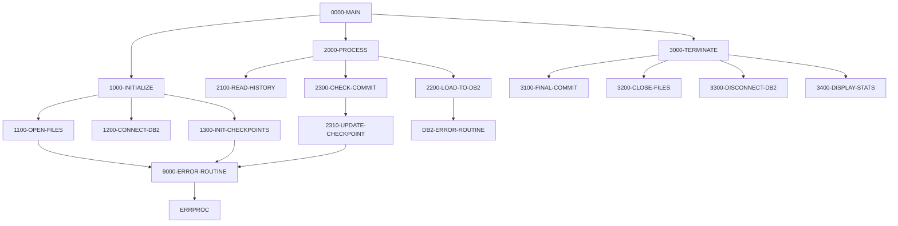

## Overview

HISTLD00 is a batch COBOL program designed to load position history transaction data from an indexed VSAM file into the DB2 POSHIST (Position History) table. This program is a key component of the data migration and synchronization process, enabling historical transaction records to be persisted in the relational database for reporting and analysis purposes.

The program implements checkpoint/restart capabilities through a batch control file, allowing for recovery in case of failures. It processes records in batches, committing to the database every 1000 records to balance performance with recoverability. The program gracefully handles duplicate key errors (SQLCODE -803), allowing re-runs without failing on already-loaded records.

Processing statistics are displayed upon completion, showing records read, records written, and any errors encountered. The error count is returned as the program's return code, enabling job schedulers to detect and react to processing issues.

## Program Structure

## Data Structures

### Working Storage

| Level | Name | Picture | Description |
|-------|------|---------|-------------|
| 01 | WS-FILE-STATUS | - | File status group |
| 05 | WS-TH-STATUS | X(2) | Transaction history file status |
| 05 | WS-BCT-STATUS | X(2) | Batch control file status |
| 01 | WS-COUNTERS | - | Processing counters group |
| 05 | WS-RECORDS-READ | S9(9) COMP | Count of records read from input |
| 05 | WS-RECORDS-WRITTEN | S9(9) COMP | Count of records successfully inserted |
| 05 | WS-ERROR-COUNT | S9(9) COMP | Count of errors encountered |
| 05 | WS-COMMIT-COUNT | S9(4) COMP | Records since last commit |
| 01 | WS-COMMIT-THRESHOLD | S9(4) COMP | Commit frequency (default: 1000) |
| 01 | WS-SWITCHES | - | Control switches group |
| 05 | WS-END-OF-FILE-SW | X(1) | End of file indicator (`Y`/`N`) |

### DB2 Host Variables (from DBTBLS)

The POSHIST-RECORD structure is used for inserting into the DB2 POSHIST table:

| Field | Picture | Description |
|-------|---------|-------------|
| PH-ACCOUNT-NO | X(8) | Account number |
| PH-PORTFOLIO-ID | X(10) | Portfolio identifier |
| PH-TRANS-DATE | X(10) | Transaction date |
| PH-TRANS-TIME | X(8) | Transaction time |
| PH-TRANS-TYPE | X(2) | Transaction type code |
| PH-SECURITY-ID | X(12) | Security identifier |
| PH-QUANTITY | S9(12)V9(3) COMP-3 | Transaction quantity |
| PH-PRICE | S9(12)V9(3) COMP-3 | Transaction price |
| PH-AMOUNT | S9(13)V9(2) COMP-3 | Transaction amount |
| PH-FEES | S9(13)V9(2) COMP-3 | Transaction fees |
| PH-TOTAL-AMOUNT | S9(13)V9(2) COMP-3 | Total transaction amount |
| PH-COST-BASIS | S9(13)V9(2) COMP-3 | Cost basis |
| PH-GAIN-LOSS | S9(13)V9(2) COMP-3 | Gain or loss amount |

The COMP-3 picture clause indicates packed decimal format, which is efficient for storing numeric data in mainframe environments.

## File I/O

### Input Files

| Logical Name | DD Name | Organization | Access Mode | Description |
|--------------|---------|--------------|-------------|-------------|
| TRANSACTION-HISTORY | TRANHIST | Indexed (VSAM KSDS) | Sequential | Source file containing position history records |
| BATCH-CONTROL-FILE | BCHCTL | Indexed (VSAM KSDS) | Dynamic | Control file for checkpoint/restart |

### File Operations

| File | Operations | Purpose |
|------|------------|---------|
| TRANSACTION-HISTORY | OPEN INPUT, READ, CLOSE | Read history records for loading |
| BATCH-CONTROL-FILE | OPEN I-O, READ, REWRITE, CLOSE | Manage checkpoint data |

### Database Operations

| Table | Operation | Purpose |
|-------|-----------|---------|
| POSHIST | INSERT | Load position history records |
| - | COMMIT WORK | Commit batches of records |
| - | ROLLBACK WORK | Rollback on error |

## Control Flow

### Initialization (1000-INITIALIZE)

1. **Open Files (1100-OPEN-FILES)**: Opens the transaction history file for input and the batch control file for I/O. Any file open errors trigger the error routine.

2. **Connect to DB2 (1200-CONNECT-DB2)**: Establishes a connection to the POSMVP DB2 database using the standard connection procedure from DBPROC.

3. **Initialize Checkpoints (1300-INIT-CHECKPOINTS)**: Reads the batch control record for this job and updates its status to "Active" to indicate processing has begun.

### Main Processing Loop (2000-PROCESS)

The main loop continues until end-of-file is reached or the error count exceeds 100:

1. **Read History (2100-READ-HISTORY)**: Reads the next record from the transaction history file. Sets the end-of-file flag when the file is exhausted.

2. **Load to DB2 (2200-LOAD-TO-DB2)**: 
   - Initializes the POSHIST-RECORD structure
   - Maps fields from the input record (TH-*) to the DB2 record (PH-*)
   - Executes an INSERT statement
   - On success (SQLCODE = 0), increments the write counter
   - On duplicate key (SQLCODE = -803), continues silently (idempotent behavior)
   - On other errors, increments error count and invokes DB2 error handling

3. **Check Commit (2300-CHECK-COMMIT)**: When the commit counter reaches the threshold (1000), issues a COMMIT WORK and updates the checkpoint record with current progress.

### Termination (3000-TERMINATE)

1. **Final Commit (3100-FINAL-COMMIT)**: Commits any remaining uncommitted work and updates the checkpoint record one final time.

2. **Close Files (3200-CLOSE-FILES)**: Closes both input files.

3. **Disconnect DB2 (3300-DISCONNECT-DB2)**: Commits and disconnects from the DB2 database.

4. **Display Stats (3400-DISPLAY-STATS)**: Outputs processing statistics including records read, records written, and error count.

### Error Handling (9000-ERROR-ROUTINE)

When an error occurs:
1. Sets the program name in the error message structure
2. Calls the ERRPROC external program for error logging
3. Issues a ROLLBACK WORK to undo any uncommitted changes

## Dependencies

### Copybooks

- **HISTREC** - History record structure for the input file
- **BCHCTL** - Batch control file record definition
- **DBTBLS** - DB2 table definitions including POSHIST-RECORD
- **SQLCA** - SQL Communication Area for DB2 status
- **DBPROC** - Standard DB2 procedures (connect, disconnect, error handling)
- **ERRHAND** - Standard error handling definitions
- **BCHCON** - Batch control constants (status values, return codes)

### Called Programs

- **ERRPROC** - External error processing routine

### Related Programs

Programs that share copybooks with HISTLD00:

| Program | Shared Copybooks | Relationship |
|---------|------------------|--------------|
| BCHCTL00 | BCHCTL, ERRHAND, BCHCON | Batch control processing |
| PRCSEQ00 | BCHCTL, ERRHAND, BCHCON | Process sequencing |
| RCVPRC00 | BCHCTL, ERRHAND, BCHCON | Recovery processing |
| RPTSTA00 | BCHCTL, ERRHAND | Status reporting |
| DB2CMT | SQLCA, DBPROC, ERRHAND | DB2 commit processing |
| DB2CONN | SQLCA, DBPROC, ERRHAND | DB2 connection handling |
| DB2ERR | SQLCA, DBPROC, ERRHAND | DB2 error handling |
| DB2STAT | SQLCA, DBPROC, ERRHAND | DB2 status checking |

## Technical Notes

### Checkpoint/Restart

The program supports checkpoint/restart through the BATCH-CONTROL-FILE:
- Checkpoint records are updated every 1000 records (configurable via WS-COMMIT-THRESHOLD)
- The checkpoint stores the number of records read and written
- Recovery restarts from the last committed checkpoint

### Idempotent Processing

The program handles duplicate key errors (SQLCODE -803) by continuing without incrementing the error count. This allows the job to be re-run after a failure without causing errors for records that were already successfully loaded before the checkpoint.

### Return Code

The program returns the error count as its return code:
- Return code 0: All records processed successfully
- Return code > 0: Number of errors encountered (max 100 before abort)
