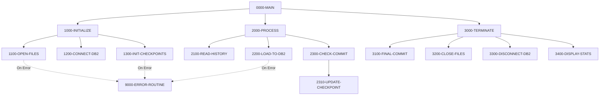

## Overview

HISTLD00 is a batch program that loads position history records from a VSAM indexed file into a DB2 database table. This program is a key component in the portfolio management system's data pipeline, migrating transaction history data to the POSHIST DB2 table for enhanced query capabilities and reporting.

The program implements robust batch processing patterns including checkpoint/restart capability, commit interval management, and comprehensive error handling. It processes records sequentially from the input VSAM file, maps the transaction fields to the DB2 table structure, and commits in configurable batches to optimize performance and recovery.

Key features include:
- Sequential processing of indexed VSAM transaction history file
- Automatic handling of duplicate records (SQLCODE -803)
- Periodic commits at configurable intervals (default 1000 records)
- Checkpoint tracking via batch control file for restart capability
- Error threshold monitoring (maximum 100 errors before abort)

## Program Structure

## Data Structures

### Working Storage

| Level | Name | Picture | Description |
|-------|------|---------|-------------|
| 01 | WS-FILE-STATUS | | File status codes group |
| 05 | WS-TH-STATUS | X(2) | Transaction History file status |
| 05 | WS-BCT-STATUS | X(2) | Batch Control file status |
| 01 | WS-COUNTERS | | Processing counters group |
| 05 | WS-RECORDS-READ | S9(9) COMP | Total records read from input |
| 05 | WS-RECORDS-WRITTEN | S9(9) COMP | Total records inserted to DB2 |
| 05 | WS-ERROR-COUNT | S9(9) COMP | Error counter (max 100) |
| 05 | WS-COMMIT-COUNT | S9(4) COMP | Records since last commit |
| 01 | WS-COMMIT-THRESHOLD | S9(4) COMP | Commit frequency (default 1000) |
| 01 | WS-SWITCHES | | Processing control flags |
| 05 | WS-END-OF-FILE-SW | X(1) | EOF indicator ('Y'/'N') |

### Input File Record (HISTREC Copybook)

The transaction history record structure for VSAM input:

| Level | Name | Picture | Description |
|-------|------|---------|-------------|
| 01 | HISTORY-RECORD | | Main history record |
| 05 | HIST-KEY | | Composite key |
| 10 | HIST-PORTFOLIO-ID | X(8) | Portfolio identifier |
| 10 | HIST-DATE | X(8) | History date (YYYYMMDD) |
| 10 | HIST-TIME | X(6) | History time (HHMMSS) |
| 10 | HIST-SEQ-NO | X(4) | Sequence number |
| 05 | HIST-DATA | | Record data |
| 10 | HIST-RECORD-TYPE | X(2) | PT=Portfolio, PS=Position, TR=Transaction |
| 10 | HIST-ACTION-CODE | X(1) | A=Add, C=Change, D=Delete |
| 10 | HIST-BEFORE-IMAGE | X(400) | Record before change |
| 10 | HIST-AFTER-IMAGE | X(400) | Record after change |
| 10 | HIST-REASON-CODE | X(4) | Reason for change |

### DB2 Output Record (DBTBLS Copybook)

The POSHIST-RECORD structure for DB2 insertion:

| Level | Name | Picture | Description |
|-------|------|---------|-------------|
| 01 | POSHIST-RECORD | | Position history DB2 record |
| 05 | PH-ACCOUNT-NO | X(8) | Account number |
| 05 | PH-PORTFOLIO-ID | X(10) | Portfolio identifier |
| 05 | PH-TRANS-DATE | X(10) | Transaction date |
| 05 | PH-TRANS-TIME | X(8) | Transaction time |
| 05 | PH-TRANS-TYPE | X(2) | Transaction type code |
| 05 | PH-SECURITY-ID | X(12) | Security identifier |
| 05 | PH-QUANTITY | S9(12)V9(3) COMP-3 | Transaction quantity |
| 05 | PH-PRICE | S9(12)V9(3) COMP-3 | Unit price |
| 05 | PH-AMOUNT | S9(13)V9(2) COMP-3 | Transaction amount |
| 05 | PH-FEES | S9(13)V9(2) COMP-3 | Transaction fees |
| 05 | PH-TOTAL-AMOUNT | S9(13)V9(2) COMP-3 | Total amount with fees |
| 05 | PH-COST-BASIS | S9(13)V9(2) COMP-3 | Cost basis |
| 05 | PH-GAIN-LOSS | S9(13)V9(2) COMP-3 | Realized gain/loss |

### Batch Control Record (BCHCTL Copybook)

| Level | Name | Picture | Description |
|-------|------|---------|-------------|
| 01 | BATCH-CONTROL-RECORD | | Job control record |
| 05 | BCT-KEY | | Composite key |
| 10 | BCT-JOB-NAME | X(8) | Job name (HISTLD00) |
| 10 | BCT-PROCESS-DATE | X(8) | Processing date |
| 10 | BCT-SEQUENCE-NO | 9(4) | Sequence number |
| 05 | BCT-STATUS | X(1) | R=Ready, A=Active, D=Done, E=Error |

## File I/O

### File Definitions

| File Name | Type | Organization | Access Mode | Record Key |
|-----------|------|--------------|-------------|------------|
| TRANSACTION-HISTORY | Input | Indexed (VSAM) | Sequential | TH-KEY |
| BATCH-CONTROL-FILE | I/O | Indexed (VSAM) | Dynamic | BCT-KEY |

### DD Name Assignments

| Logical Name | DD Name | Purpose |
|--------------|---------|---------|
| TRANSACTION-HISTORY | TRANHIST | Input transaction history records |
| BATCH-CONTROL-FILE | BCHCTL | Checkpoint and control tracking |

### Database Operations

| Operation | Table | Description |
|-----------|-------|-------------|
| INSERT | POSHIST | Insert position history records |
| COMMIT | - | Commit work at intervals |
| ROLLBACK | - | Rollback on error |
| CONNECT | POSMVP | Connect to DB2 subsystem |

## Control Flow

### Initialization Phase (1000-INITIALIZE)

1. **Open Files (1100-OPEN-FILES)**: Opens the TRANSACTION-HISTORY file for input and the BATCH-CONTROL-FILE for I/O. Any file open errors trigger the error routine.

2. **Connect to DB2 (1200-CONNECT-DB2)**: Establishes connection to the POSMVP DB2 subsystem using the standard CONNECT-TO-DB2 procedure from the DBPROC copybook.

3. **Initialize Checkpoints (1300-INIT-CHECKPOINTS)**: Reads the batch control record for job 'HISTLD00', updates the status to 'A' (Active), and rewrites the control record.

### Processing Phase (2000-PROCESS)

The main processing loop continues until end-of-file or when the error count exceeds 100:

1. **Read History (2100-READ-HISTORY)**: Sequentially reads the next record from TRANSACTION-HISTORY. On EOF, sets the end-of-file switch.

2. **Load to DB2 (2200-LOAD-TO-DB2)**: 
   - Initializes the POSHIST-RECORD
   - Maps fields from input (TH-*) to DB2 record (PH-*)
   - Executes INSERT INTO POSHIST
   - Handles SQLCODE responses:
     - `0`: Success - increment write counter
     - `-803`: Duplicate key - continue (skip duplicates)
     - Other: Error - increment error counter, call DB2-ERROR-ROUTINE

3. **Check Commit (2300-CHECK-COMMIT)**: Increments commit counter. When reaching the threshold (1000 records), commits work and updates the checkpoint record.

### Termination Phase (3000-TERMINATE)

1. **Final Commit (3100-FINAL-COMMIT)**: Issues final COMMIT WORK and updates checkpoint.

2. **Close Files (3200-CLOSE-FILES)**: Closes both VSAM files.

3. **Disconnect DB2 (3300-DISCONNECT-DB2)**: Disconnects from the DB2 subsystem.

4. **Display Statistics (3400-DISPLAY-STATS)**: Outputs processing summary to SYSOUT:
   - Records Read
   - Records Written  
   - Errors

### Error Handling (9000-ERROR-ROUTINE)

The error routine:
1. Sets the program name in the error message structure
2. Calls the ERRPROC error processor
3. Issues ROLLBACK WORK to undo uncommitted changes

## Dependencies

### Copybooks

- **HISTREC** - History record structure for VSAM input file
- **BCHCTL** - Batch control file record definition
- **DBTBLS** - DB2 table definitions including POSHIST-RECORD
- **SQLCA** - SQL Communication Area for DB2 status
- **DBPROC** - DB2 standard procedures (CONNECT, DISCONNECT, error handling)
- **ERRHAND** - Standard error handling definitions
- **BCHCON** - Batch control constants (status values, return codes)

### Called Programs

- **ERRPROC** - Error processing and logging program

### Related Programs

Programs that share copybooks or have similar functionality:
- **BCHCTL00** - Batch control management (uses BCHCTL, BCHCON)
- **PRCSEQ00** - Process sequencing (uses BCHCTL, BCHCON)
- **DB2CMT**, **DB2CONN**, **DB2ERR**, **DB2STAT** - DB2 utility programs (use SQLCA, DBPROC)

## Technical Notes

### COMP-3 (Packed Decimal) Fields

The DB2 table uses COMP-3 (packed decimal) for numeric fields like PH-QUANTITY, PH-PRICE, and PH-AMOUNT. COMP-3 stores two decimal digits per byte plus a sign nibble, making it efficient for financial calculations while maintaining decimal precision.

### Commit Strategy

The program uses interval-based commits (every 1000 records by default) to balance between:
- **Performance**: Fewer commits reduce DB2 logging overhead
- **Recovery**: More frequent commits minimize re-processing on restart

### Duplicate Handling

SQLCODE -803 indicates a duplicate key violation. The program silently continues, allowing the load to be re-run without failing on already-loaded records. This supports restart capability after failures.

### Return Code

The program sets RETURN-CODE to the error count before terminating. A return code of 0 indicates successful completion with no errors.
