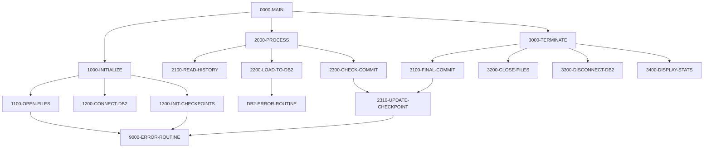

## Overview

HISTLD00 is a batch COBOL program that serves as a data loader for the Position History DB2 table. Its primary purpose is to migrate transaction history records from an indexed VSAM file (TRANSACTION-HISTORY) into the DB2 database table POSHIST. This type of program is essential in portfolio management systems where historical transaction data needs to be consolidated into a relational database for reporting and analysis.

The program implements several enterprise-grade batch processing features including checkpoint/restart capability through a batch control file, periodic commit operations to manage DB2 transaction sizes, and comprehensive error handling with rollback support. It is designed to handle large volumes of data efficiently while maintaining data integrity through transaction management.

The loader uses a commit threshold of 1,000 records (configurable via `WS-COMMIT-THRESHOLD`) to balance performance with recovery granularity. If the program fails, it can be restarted and will resume processing based on checkpoint information stored in the batch control file.

## Program Structure

## Data Structures

### Working Storage

| Level | Name | Picture | Description |
|-------|------|---------|-------------|
| 01 | WS-FILE-STATUS | - | File status group |
| 05 | WS-TH-STATUS | PIC X(2) | Transaction history file status |
| 05 | WS-BCT-STATUS | PIC X(2) | Batch control file status |
| 01 | WS-COUNTERS | - | Processing counters group |
| 05 | WS-RECORDS-READ | PIC S9(9) COMP | Count of records read from input |
| 05 | WS-RECORDS-WRITTEN | PIC S9(9) COMP | Count of records inserted to DB2 |
| 05 | WS-ERROR-COUNT | PIC S9(9) COMP | Count of processing errors |
| 05 | WS-COMMIT-COUNT | PIC S9(4) COMP | Records since last commit |
| 01 | WS-COMMIT-THRESHOLD | PIC S9(4) COMP | Commit every N records (default: 1000) |
| 01 | WS-SWITCHES | - | Control switches group |
| 05 | WS-END-OF-FILE-SW | PIC X(1) | End-of-file indicator (`Y`/`N`) |

### DB2 Host Variables (from DBTBLS copybook)

| Level | Name | Picture | Description |
|-------|------|---------|-------------|
| 01 | POSHIST-RECORD | - | Position history DB2 table record |
| 05 | PH-ACCOUNT-NO | PIC X(8) | Account number |
| 05 | PH-PORTFOLIO-ID | PIC X(10) | Portfolio identifier |
| 05 | PH-TRANS-DATE | PIC X(10) | Transaction date |
| 05 | PH-TRANS-TIME | PIC X(8) | Transaction time |
| 05 | PH-TRANS-TYPE | PIC X(2) | Transaction type code |
| 05 | PH-SECURITY-ID | PIC X(12) | Security identifier |
| 05 | PH-QUANTITY | PIC S9(12)V9(3) COMP-3 | Quantity traded |
| 05 | PH-PRICE | PIC S9(12)V9(3) COMP-3 | Trade price |
| 05 | PH-AMOUNT | PIC S9(13)V9(2) COMP-3 | Transaction amount |
| 05 | PH-FEES | PIC S9(13)V9(2) COMP-3 | Transaction fees |
| 05 | PH-TOTAL-AMOUNT | PIC S9(13)V9(2) COMP-3 | Total amount including fees |
| 05 | PH-COST-BASIS | PIC S9(13)V9(2) COMP-3 | Cost basis for tax purposes |
| 05 | PH-GAIN-LOSS | PIC S9(13)V9(2) COMP-3 | Realized gain/loss |

### Input File Record (from HISTREC copybook)

The input file uses the HISTORY-RECORD structure with fields prefixed `TH-` (Transaction History). Key fields include:
- `TH-KEY`: Composite key with portfolio ID, date, time, and sequence number
- `TH-ACCOUNT-NO`, `TH-PORTFOLIO-ID`, `TH-TRANS-DATE`, etc.: Transaction details
- `TH-QUANTITY`, `TH-PRICE`, `TH-AMOUNT`, `TH-FEES`: Financial values
- `TH-COST-BASIS`, `TH-GAIN-LOSS`: Tax-related calculations

## File I/O

### File Definitions

| Logical Name | DD Name | Organization | Access Mode | Description |
|--------------|---------|--------------|-------------|-------------|
| TRANSACTION-HISTORY | TRANHIST | Indexed (VSAM KSDS) | Sequential | Input file containing transaction history records |
| BATCH-CONTROL-FILE | BCHCTL | Indexed (VSAM KSDS) | Dynamic | Checkpoint/restart control file |

### File Operations

| File | Operation | Paragraph | Purpose |
|------|-----------|-----------|---------|
| TRANSACTION-HISTORY | OPEN INPUT | 1100-OPEN-FILES | Open for sequential read |
| TRANSACTION-HISTORY | READ | 2100-READ-HISTORY | Read next history record |
| TRANSACTION-HISTORY | CLOSE | 3200-CLOSE-FILES | Close input file |
| BATCH-CONTROL-FILE | OPEN I-O | 1100-OPEN-FILES | Open for read/update |
| BATCH-CONTROL-FILE | READ | 1300-INIT-CHECKPOINTS | Read control record for job |
| BATCH-CONTROL-FILE | REWRITE | 1300-INIT-CHECKPOINTS, 2310-UPDATE-CHECKPOINT | Update checkpoint/status |
| BATCH-CONTROL-FILE | CLOSE | 3200-CLOSE-FILES | Close control file |

### DB2 Operations

| Operation | Table | Paragraph | Purpose |
|-----------|-------|-----------|---------|
| CONNECT | POSMVP | 1200-CONNECT-DB2 | Establish database connection |
| INSERT | POSHIST | 2200-LOAD-TO-DB2 | Insert position history record |
| COMMIT | - | 2300-CHECK-COMMIT, 3100-FINAL-COMMIT | Commit transaction |
| ROLLBACK | - | 9000-ERROR-ROUTINE | Rollback on error |
| CONNECT RESET | - | 3300-DISCONNECT-DB2 | Close database connection |

## Control Flow

### Main Processing Logic

1. **Initialization (1000-INITIALIZE)**
   - Opens both input files (TRANSACTION-HISTORY and BATCH-CONTROL-FILE)
   - Establishes DB2 connection to the POSMVP database
   - Reads the batch control record for this job (HISTLD00)
   - Sets the batch status to Active (`A`)

2. **Main Processing Loop (2000-PROCESS)**
   - Reads records sequentially from the TRANSACTION-HISTORY file
   - For each record:
     - Maps input fields to DB2 host variable structure (POSHIST-RECORD)
     - Executes INSERT statement to load data into POSHIST table
     - Handles duplicate key errors (SQLCODE -803) by continuing without error
     - Increments error count for other SQL errors
   - Checks commit threshold after each successful insert
   - When threshold reached (1,000 records), commits and updates checkpoint
   - Loop continues until end-of-file or error count exceeds 100

3. **Termination (3000-TERMINATE)**
   - Performs final COMMIT to save remaining uncommitted records
   - Updates final checkpoint information
   - Closes all files
   - Disconnects from DB2
   - Displays processing statistics

### Error Handling

The program implements a multi-level error handling strategy:

- **File Errors**: Detected via file status codes (`WS-TH-STATUS`, `WS-BCT-STATUS`). Non-zero status triggers `9000-ERROR-ROUTINE`.
- **DB2 Errors**: Checked after each SQL statement via SQLCODE. Duplicate keys (SQLCODE -803) are tolerated; other errors increment error count and invoke `DB2-ERROR-ROUTINE`.
- **Error Threshold**: Processing stops if `WS-ERROR-COUNT` exceeds 100, preventing runaway error conditions.
- **Rollback**: On critical errors, the program executes ROLLBACK WORK before terminating.
- **Return Code**: The program sets RETURN-CODE to the error count, allowing JCL to detect processing issues.

### COMP-3 (Packed Decimal) Fields

The program uses `COMP-3` (packed decimal) format for financial fields like `PH-QUANTITY`, `PH-PRICE`, `PH-AMOUNT`, etc. Packed decimal stores two digits per byte plus a sign nibble, making it efficient for decimal arithmetic while maintaining precision. This is standard practice in financial COBOL applications where exact decimal representation is critical.

## Dependencies

### Copybooks

- **HISTREC** - History record structure defining the input file layout
- **BCHCTL** - Batch control file record definition for checkpoint/restart
- **DBTBLS** - DB2 table definitions including POSHIST-RECORD host variables
- **SQLCA** - SQL Communication Area for DB2 status information
- **DBPROC** - Standard DB2 procedures (CONNECT-TO-DB2, DISCONNECT-FROM-DB2, DB2-ERROR-ROUTINE)
- **ERRHAND** - Standard error handling definitions (ERR-MESSAGE, ERR-TEXT, ERR-PROGRAM)
- **BCHCON** - Batch control constants (status values like BCT-STAT-ACTIVE)

### Called Programs

- **ERRPROC** - Error processing routine called for error logging

### Related Programs

Programs that share the BCHCTL copybook for batch control:
- BCHCTL00 - Batch control management
- PRCSEQ00 - Process sequencing
- RCVPRC00 - Recovery processing
- RPTSTA00 - Status reporting

Programs that use the same DB2 infrastructure (SQLCA, DBPROC):
- DB2CMT - DB2 commit routines
- DB2CONN - DB2 connection management
- DB2ERR - DB2 error handling
- DB2STAT - DB2 status utilities
