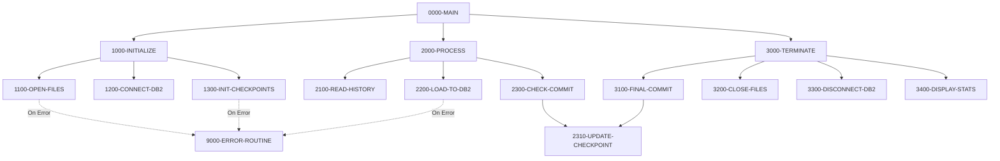

## Overview

HISTLD00 is a batch COBOL program that loads position transaction history data from an indexed file (TRANSACTION-HISTORY) into a DB2 database table (POSHIST). This program is part of the portfolio management system and enables historical transaction data to be migrated or synchronized with the DB2 database for reporting and analysis purposes.

The program implements checkpoint/restart capabilities through a batch control file, allowing it to resume processing after a failure. It uses commit intervals to balance performance with recoverability, committing work every 1000 records by default. Duplicate records (SQLCODE -803) are silently skipped, while other database errors are logged and counted.

The program maintains processing statistics and will terminate if the error count exceeds 100, returning the error count as the program's return code for job control purposes.

## Program Structure

## Data Structures

### Working Storage

| Level | Name | Picture | Description |
|-------|------|---------|-------------|
| 01 | WS-FILE-STATUS | - | File status group |
| 05 | WS-TH-STATUS | PIC X(2) | Transaction history file status |
| 05 | WS-BCT-STATUS | PIC X(2) | Batch control file status |
| 01 | WS-COUNTERS | - | Processing counters group |
| 05 | WS-RECORDS-READ | PIC S9(9) COMP | Count of records read from input |
| 05 | WS-RECORDS-WRITTEN | PIC S9(9) COMP | Count of records inserted to DB2 |
| 05 | WS-ERROR-COUNT | PIC S9(9) COMP | Count of errors encountered |
| 05 | WS-COMMIT-COUNT | PIC S9(4) COMP | Records since last commit |
| 01 | WS-COMMIT-THRESHOLD | PIC S9(4) COMP | Commit interval (default 1000) |
| 01 | WS-SWITCHES | - | Control switches group |
| 05 | WS-END-OF-FILE-SW | PIC X(1) | End of file indicator (`Y`/`N`) |

### Condition Names (88-levels)

| Condition | Variable | Value | Description |
|-----------|----------|-------|-------------|
| END-OF-FILE | WS-END-OF-FILE-SW | 'Y' | Input file exhausted |
| MORE-RECORDS | WS-END-OF-FILE-SW | 'N' | More records to process |

## File I/O

### File Definitions

| Logical Name | Physical Name | Organization | Access Mode | Record Key | Description |
|--------------|---------------|--------------|-------------|------------|-------------|
| TRANSACTION-HISTORY | TRANHIST | Indexed | Sequential | TH-KEY | Input file containing transaction history records |
| BATCH-CONTROL-FILE | BCHCTL | Indexed | Dynamic | BCT-KEY | Checkpoint/restart control file |

### File Operations

| File | Operations | Purpose |
|------|------------|---------|
| TRANSACTION-HISTORY | OPEN INPUT, READ, CLOSE | Sequential read of all history records |
| BATCH-CONTROL-FILE | OPEN I-O, READ, REWRITE, CLOSE | Maintain checkpoint data for restart capability |

## DB2 Operations

### Target Table

The program inserts records into the **POSHIST** (Position History) table with the following field mappings:

| Source Field (File) | Target Field (DB2) | Description |
|---------------------|-------------------|-------------|
| TH-ACCOUNT-NO | PH-ACCOUNT-NO | Account number |
| TH-PORTFOLIO-ID | PH-PORTFOLIO-ID | Portfolio identifier |
| TH-TRANS-DATE | PH-TRANS-DATE | Transaction date |
| TH-TRANS-TIME | PH-TRANS-TIME | Transaction time |
| TH-TRANS-TYPE | PH-TRANS-TYPE | Transaction type code |
| TH-SECURITY-ID | PH-SECURITY-ID | Security identifier |
| TH-QUANTITY | PH-QUANTITY | Number of shares/units |
| TH-PRICE | PH-PRICE | Price per share/unit |
| TH-AMOUNT | PH-AMOUNT | Transaction amount |
| TH-FEES | PH-FEES | Transaction fees |
| TH-TOTAL-AMOUNT | PH-TOTAL-AMOUNT | Total transaction value |
| TH-COST-BASIS | PH-COST-BASIS | Cost basis for tax purposes |
| TH-GAIN-LOSS | PH-GAIN-LOSS | Realized gain or loss |

### SQL Statements

- **INSERT**: Inserts each transaction record into POSHIST table
- **COMMIT WORK**: Commits transactions at threshold intervals and at end of processing
- **ROLLBACK WORK**: Rolls back uncommitted work on error

### SQLCODE Handling

| SQLCODE | Action |
|---------|--------|
| 0 | Success - increment records written counter |
| -803 | Duplicate key - skip record silently (already loaded) |
| Other | Error - increment error counter, call DB2-ERROR-ROUTINE |

## Control Flow

### Initialization Phase (1000-INITIALIZE)

1. **Open Files** (1100-OPEN-FILES): Opens the transaction history file for input and the batch control file for I-O. Errors trigger the error routine.

2. **Connect to DB2** (1200-CONNECT-DB2): Establishes database connection using the CONNECT-TO-DB2 procedure from the DBPROC copybook.

3. **Initialize Checkpoints** (1300-INIT-CHECKPOINTS): Reads the batch control record for job 'HISTLD00' and sets the status to active.

### Processing Phase (2000-PROCESS)

The main processing loop continues until end-of-file is reached or the error count exceeds 100:

1. **Read History** (2100-READ-HISTORY): Reads the next record from the transaction history file. Sets END-OF-FILE flag at end of input.

2. **Load to DB2** (2200-LOAD-TO-DB2): Maps fields from the file record to the DB2 host variable structure and executes an INSERT statement. Handles duplicate keys silently and counts other errors.

3. **Check Commit** (2300-CHECK-COMMIT): After each record, increments the commit counter. When the threshold (1000) is reached:
   - Issues a COMMIT WORK
   - Resets the commit counter
   - Updates the checkpoint record

### Termination Phase (3000-TERMINATE)

1. **Final Commit** (3100-FINAL-COMMIT): Issues a final COMMIT WORK and updates the checkpoint with final statistics.

2. **Close Files** (3200-CLOSE-FILES): Closes both the transaction history and batch control files.

3. **Disconnect DB2** (3300-DISCONNECT-DB2): Disconnects from the database using the DISCONNECT-FROM-DB2 procedure.

4. **Display Statistics** (3400-DISPLAY-STATS): Writes processing statistics to the job log including records read, records written, and error count.

### Error Handling (9000-ERROR-ROUTINE)

When an error occurs:
1. Sets the program name in the error message structure
2. Calls the ERRPROC program with the error details
3. Issues a ROLLBACK WORK to undo uncommitted changes

## Dependencies

### Copybooks

- **HISTREC** - Transaction history record layout (file section)
- **BCHCTL** - Batch control file record layout
- **DBTBLS** - DB2 table host variable definitions (includes POSHIST-RECORD)
- **SQLCA** - SQL Communication Area for DB2 return codes
- **DBPROC** - Database procedures (CONNECT-TO-DB2, DISCONNECT-FROM-DB2, DB2-ERROR-ROUTINE)
- **ERRHAND** - Error handling data structures (ERR-TEXT, ERR-PROGRAM, ERR-MESSAGE)
- **BCHCON** - Batch control constants (BCT-STAT-ACTIVE)

### Called Programs

- **ERRPROC** - Error processing routine called when errors occur

### Related Programs

Programs that share copybooks with HISTLD00:

| Program | Shared Copybooks | Relationship |
|---------|------------------|--------------|
| BCHCTL00 | BCHCTL, ERRHAND, BCHCON | Batch control management |
| PRCSEQ00 | BCHCTL, ERRHAND, BCHCON | Sequential processing |
| RCVPRC00 | BCHCTL, ERRHAND, BCHCON | Recovery processing |
| RPTSTA00 | BCHCTL, ERRHAND | Status reporting |
| DB2CMT | SQLCA, DBPROC, ERRHAND | DB2 commit utility |
| DB2CONN | SQLCA, DBPROC, ERRHAND | DB2 connection utility |
| DB2ERR | SQLCA, DBPROC, ERRHAND | DB2 error handling |
| DB2STAT | SQLCA, DBPROC, ERRHAND | DB2 statistics |

## Technical Notes

### Checkpoint/Restart

The program maintains checkpoint information in the batch control file, recording:
- Job name (HISTLD00)
- Records read count
- Records written count
- Processing status

This enables restart after a failure without reprocessing already-committed records.

### Commit Strategy

Using a commit threshold of 1000 records balances:
- **Performance**: Fewer commits reduce overhead
- **Recoverability**: Limited re-work if restart is needed
- **Lock contention**: Regular commits release database locks

### Return Code

The program sets RETURN-CODE to the error count, allowing JCL to take conditional actions:
- `0` - Successful completion with no errors
- `1-100` - Completed with errors (count indicates severity)
- `>100` - Terminated due to excessive errors
