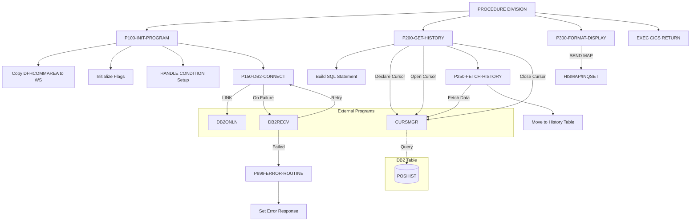
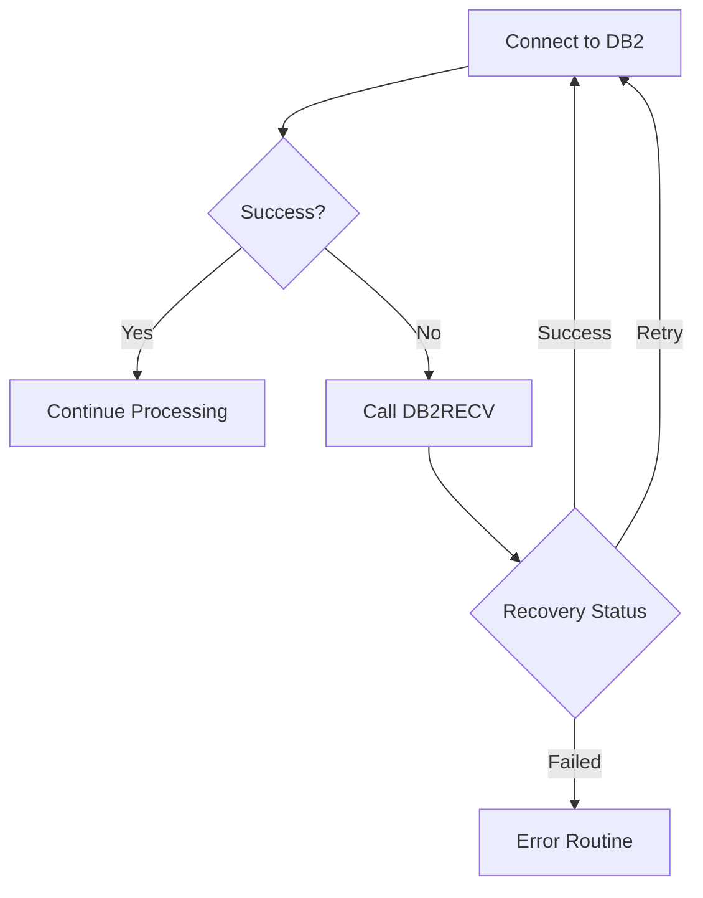

## Overview

INQHIST is a CICS online transaction program that provides transaction history inquiry functionality. It retrieves transaction history records from a DB2 database table (POSHIST), formats the data for display, and presents it to the user through a BMS map screen.

The program is designed as part of an online inquiry system and supports:
- Retrieving transaction history for a specific account
- Displaying transactions in reverse chronological order (most recent first)
- Array fetching for efficient data retrieval
- DB2 connection management with automatic recovery
- Integration with cursor management services

This program is typically invoked from a menu system or other inquiry programs within the CICS region, receiving the account number via the communication area (COMMAREA).

## Program Structure



## Data Structures

### Working Storage

#### WS-COMMAREA

Contains the inquiry communication area copied from INQCOM copybook:

| Level | Name | Picture | Description |
|-------|------|---------|-------------|
| 01 | INQCOM-AREA | - | Communication area structure |
| 05 | INQCOM-FUNCTION | X(4) | Function code |
| 05 | INQCOM-ACCOUNT-NO | X(10) | Account number for inquiry |
| 05 | INQCOM-RESPONSE-CODE | S9(8) COMP | Response code |
| 05 | INQCOM-ERROR-MSG | X(80) | Error message text |

**Function Code Values (88-levels):**
- `MENU` - Return to menu
- `INQP` - Portfolio inquiry
- `INQH` - History inquiry
- `EXIT` - Exit application

#### WS-DB2-AREA

Contains the SQL Communication Area (SQLCA) included via `EXEC SQL INCLUDE SQLCA`.

#### WS-HISTORY-TABLE

| Level | Name | Picture | Description |
|-------|------|---------|-------------|
| 01 | WS-HISTORY-TABLE | - | History display table |
| 05 | WS-HISTORY-ENTRY | OCCURS 10 | Array of history entries |
| 10 | WS-TRANS-DATE | X(10) | Transaction date |
| 10 | WS-TRANS-TYPE | X(4) | Transaction type code |
| 10 | WS-TRANS-UNITS | S9(9)V99 COMP-3 | Number of units |
| 10 | WS-TRANS-PRICE | S9(9)V99 COMP-3 | Price per unit |
| 10 | WS-TRANS-AMOUNT | S9(9)V99 COMP-3 | Total amount |

#### WS-FLAGS

| Level | Name | Picture | Description |
|-------|------|---------|-------------|
| 01 | WS-FLAGS | - | Processing flags |
| 05 | WS-RESPONSE-CODE | S9(8) COMP | CICS response code |
| 05 | WS-MORE-HISTORY | X | More rows indicator |
| 05 | WS-ROW-COUNT | S9(4) COMP | Row counter |

**88-Level Conditions:**
- `MORE-ROWS` (Y) - Additional history rows exist
- `NO-MORE-ROWS` (N) - No more rows to fetch

#### WS-DB2-REQUEST

| Level | Name | Picture | Description |
|-------|------|---------|-------------|
| 01 | WS-DB2-REQUEST | - | DB2 connection request |
| 05 | DB2-REQUEST-TYPE | X | Request type (`C` = Connect) |
| 05 | DB2-RESPONSE-CODE | S9(8) COMP | Response from DB2ONLN |
| 05 | DB2-CONNECTION-TOKEN | X(16) | Connection token |
| 05 | DB2-ERROR-INFO | - | Error information group |
| 10 | DB2-SQLCODE | S9(9) COMP | SQL return code |
| 10 | DB2-ERROR-MSG | X(80) | Error message |

#### WS-CURSOR-REQUEST

| Level | Name | Picture | Description |
|-------|------|---------|-------------|
| 01 | WS-CURSOR-REQUEST | - | Cursor management request |
| 05 | CURS-REQUEST-TYPE | X | Request type |
| 05 | CURS-NAME | X(18) | Cursor name |
| 05 | CURS-STMT | X(240) | SQL statement |
| 05 | CURS-ARRAY-FETCH | X | Array fetch flag |
| 05 | CURS-RESPONSE-CODE | S9(8) COMP | Response code |
| 05 | CURS-DATA-AREA | X(3000) | Data buffer |
| 05 | CURS-DATA-LENGTH | S9(4) COMP | Data length |

**Request Type Values:**
- `D` - Declare cursor
- `O` - Open cursor
- `F` - Fetch data
- `C` - Close cursor

#### WS-RECOVERY-REQUEST

| Level | Name | Picture | Description |
|-------|------|---------|-------------|
| 01 | WS-RECOVERY-REQUEST | - | DB2 recovery request |
| 05 | RECV-REQUEST-TYPE | X | Request type (`C` = Connect recovery) |
| 05 | RECV-RESPONSE-CODE | S9(8) COMP | Response code |
| 05 | RECV-SQLCODE | S9(9) COMP | SQL code from failed operation |
| 05 | RECV-ERROR-INFO | - | Error information |
| 10 | RECV-PROGRAM | X(8) | Program name |
| 10 | RECV-CURSOR | X(18) | Cursor name |
| 10 | RECV-MESSAGE | X(80) | Error message |
| 05 | RECV-STATUS | X | Recovery status |

**Recovery Status Values (88-levels):**
- `RECV-SUCCESS` (S) - Recovery successful
- `RECV-FAILED` (F) - Recovery failed
- `RECV-RETRY` (R) - Retry recommended

### Linkage Section

#### DFHCOMMAREA

The CICS communication area, defined using the INQCOM copybook structure. Contains the account number passed from the calling program.

## Control Flow

### Main Processing Flow

1. **P100-INIT-PROGRAM** - Initialization
   - Copies DFHCOMMAREA to working storage
   - Initializes row count and more-rows flag
   - Sets up CICS error handling via `HANDLE CONDITION`
   - Calls P150-DB2-CONNECT to establish database connection

2. **P150-DB2-CONNECT** - Database Connection
   - Sets request type to 'C' (Connect)
   - Links to DB2ONLN program for connection
   - If connection fails:
     - Calls DB2RECV for recovery
     - On successful recovery, retries connection
     - On failed recovery, routes to error handler

3. **P200-GET-HISTORY** - Data Retrieval
   - Builds SELECT statement for POSHIST table
   - Declares cursor via CURSMGR (type 'D')
   - Opens cursor via CURSMGR (type 'O')
   - Calls P250-FETCH-HISTORY to retrieve data
   - Closes cursor via CURSMGR (type 'C')

4. **P250-FETCH-HISTORY** - Fetch Operation
   - Fetches data via CURSMGR (type 'F')
   - Moves fetched data to WS-HISTORY-TABLE

5. **P300-FORMAT-DISPLAY** - Screen Display
   - Sends HISMAP from INQSET mapset to terminal
   - Uses ERASE option to clear screen first
   - Captures response code

6. **P999-ERROR-ROUTINE** - Error Handling
   - Moves SQLCODE to response code
   - Updates DFHCOMMAREA with error information

### SQL Query

The program executes the following query against the POSHIST table:

```sql
SELECT TRANS_DATE, TRANS_TYPE, TRANS_UNITS, 
       TRANS_PRICE, TRANS_AMOUNT 
FROM POSHIST 
WHERE ACCOUNT_NO = ? 
ORDER BY TRANS_DATE DESC
```

This retrieves transaction history for the specified account, ordered by date descending (most recent first).

## Dependencies

### Copybooks

- **INQCOM** - Online inquiry communication area defining the interface for inquiry programs
- **SQLCA** - SQL Communication Area (included via EXEC SQL INCLUDE)

### Called Programs

| Program | Purpose | Call Method |
|---------|---------|-------------|
| DB2ONLN | DB2 connection management | EXEC CICS LINK |
| DB2RECV | DB2 error recovery | EXEC CICS LINK |
| CURSMGR | Cursor management (declare, open, fetch, close) | EXEC CICS LINK |

### Related Programs

**Programs using INQCOM copybook:**
- INQONLN - Main online inquiry controller
- INQPORT - Portfolio inquiry handler

### BMS Maps

| Map | Mapset | Description |
|-----|--------|-------------|
| HISMAP | INQSET | Transaction history display map |

### Database Tables

| Table | Description |
|-------|-------------|
| POSHIST | Position history table containing transaction records |

**POSHIST Columns Used:**
- ACCOUNT_NO - Account identifier (query parameter)
- TRANS_DATE - Transaction date
- TRANS_TYPE - Transaction type code
- TRANS_UNITS - Number of units in transaction
- TRANS_PRICE - Price per unit
- TRANS_AMOUNT - Total transaction amount

## Technical Notes

### CICS Concepts Used

- **EXEC CICS LINK**: Transfers control to another program, expecting return. Used to call DB2ONLN, DB2RECV, and CURSMGR service programs.

- **EXEC CICS HANDLE CONDITION**: Establishes error handling for CICS exceptional conditions. Routes errors to P999-ERROR-ROUTINE.

- **EXEC CICS SEND MAP**: Sends a BMS map to the terminal for display. The ERASE option clears the screen before displaying.

- **EXEC CICS RETURN**: Returns control to CICS, ending the program's execution.

- **DFHCOMMAREA**: The CICS communication area for passing data between programs. Limited to 32KB in traditional CICS.

### DB2 Concepts Used

- **EXEC SQL INCLUDE SQLCA**: Includes the SQL Communication Area for capturing DB2 return codes and diagnostics.

- **Cursor Processing**: The program uses a cursor-based approach via CURSMGR for fetching multiple rows. The cursor workflow is: Declare → Open → Fetch → Close.

- **Array Fetch**: The CURS-ARRAY-FETCH flag is set to 'Y', enabling retrieval of multiple rows in a single fetch operation for better performance.

### COMP-3 (Packed Decimal)

The monetary and quantity fields (WS-TRANS-UNITS, WS-TRANS-PRICE, WS-TRANS-AMOUNT) use COMP-3 format:
- Packed decimal storage (two digits per byte plus sign)
- Efficient for decimal arithmetic
- Format: `S9(9)V99 COMP-3` stores up to 9 digits with 2 decimal places

### Error Recovery Pattern

The program implements a robust error recovery pattern for DB2 connections:



### Transaction Flow

This program is typically part of a larger inquiry flow:

1. User selects "History Inquiry" from menu (INQONLN)
2. INQONLN sets INQCOM-FUNCTION to 'INQH' and links to INQHIST
3. INQHIST retrieves and displays transaction history
4. User can return to menu or exit

### Performance Considerations

- **Array Fetch**: Fetches up to 10 rows in a single operation, reducing DB2 calls
- **Cursor Close**: Always closes cursor to release DB2 resources
- **Connection Reuse**: Uses DB2ONLN for connection pooling/management
