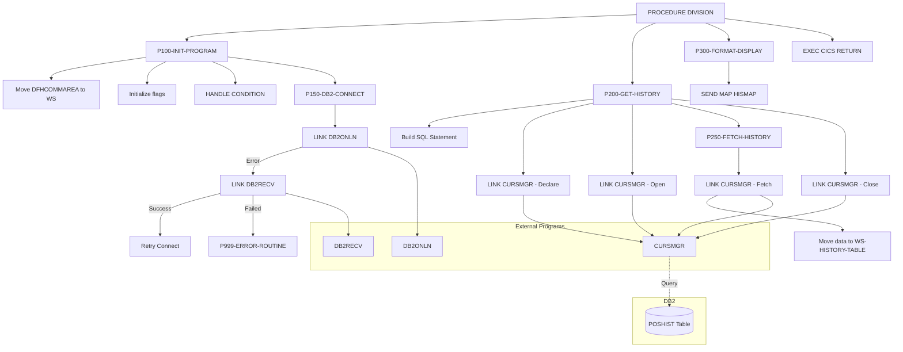

## Overview

INQHIST is a CICS online program that provides transaction history inquiry capabilities. It retrieves transaction history data from a DB2 database table and displays it to users through a BMS map. The program supports scrolling through historical transaction records for a given account.

Key features:
- **DB2 Integration**: Connects to DB2 and executes cursor-based queries
- **Transaction History**: Retrieves history from the POSHIST table ordered by date descending
- **Error Recovery**: Implements DB2 connection recovery through the DB2RECV program
- **BMS Display**: Formats and displays history data using CICS maps

This program is typically invoked as part of an online inquiry transaction when users need to view the transaction history for a portfolio account.

## Program Structure



## Data Structures

### Working Storage

#### Communication Area (WS-COMMAREA)

Uses the INQCOM copybook:

| Level | Name | Picture | Description |
|-------|------|---------|-------------|
| 01 | INQCOM-AREA | - | Inquiry communication area |
| 05 | INQCOM-FUNCTION | X(4) | Function code |
| 05 | INQCOM-ACCOUNT-NO | X(10) | Account number for inquiry |
| 05 | INQCOM-RESPONSE-CODE | S9(8) COMP | Response/error code |
| 05 | INQCOM-ERROR-MSG | X(80) | Error message text |

##### Function Codes (INQCOM-FUNCTION)

| Value | 88-Level Name | Meaning |
|-------|---------------|---------|
| `'MENU'` | INQCOM-MENU | Return to menu |
| `'INQP'` | INQCOM-PORTFOLIO | Portfolio inquiry |
| `'INQH'` | INQCOM-HISTORY | History inquiry |
| `'EXIT'` | INQCOM-EXIT | Exit application |

#### DB2 Area (WS-DB2-AREA)

Contains the SQL Communication Area (SQLCA) included via EXEC SQL INCLUDE.

#### History Table

| Level | Name | Picture | Description |
|-------|------|---------|-------------|
| 01 | WS-HISTORY-TABLE | - | History display table |
| 05 | WS-HISTORY-ENTRY | OCCURS 10 | Array of history entries |
| 10 | WS-TRANS-DATE | X(10) | Transaction date |
| 10 | WS-TRANS-TYPE | X(4) | Transaction type code |
| 10 | WS-TRANS-UNITS | S9(9)V99 COMP-3 | Number of units |
| 10 | WS-TRANS-PRICE | S9(9)V99 COMP-3 | Price per unit |
| 10 | WS-TRANS-AMOUNT | S9(9)V99 COMP-3 | Total amount |

#### Processing Flags

| Level | Name | Picture | Description |
|-------|------|---------|-------------|
| 01 | WS-FLAGS | - | Processing flags |
| 05 | WS-RESPONSE-CODE | S9(8) COMP | CICS response code |
| 05 | WS-MORE-HISTORY | X | More rows indicator |
| 05 | WS-ROW-COUNT | S9(4) COMP | Row counter |

##### More History Indicator (WS-MORE-HISTORY)

| Value | 88-Level Name | Meaning |
|-------|---------------|---------|
| `'Y'` | MORE-ROWS | Additional rows available |
| `'N'` | NO-MORE-ROWS | No more rows to fetch |

#### DB2 Request Structure

| Level | Name | Picture | Description |
|-------|------|---------|-------------|
| 01 | WS-DB2-REQUEST | - | DB2 connection request |
| 05 | DB2-REQUEST-TYPE | X | Request type code |
| 05 | DB2-RESPONSE-CODE | S9(8) COMP | Response code |
| 05 | DB2-CONNECTION-TOKEN | X(16) | Connection token |
| 05 | DB2-ERROR-INFO | - | Error information |
| 10 | DB2-SQLCODE | S9(9) COMP | SQL return code |
| 10 | DB2-ERROR-MSG | X(80) | Error message |

#### Cursor Request Structure

| Level | Name | Picture | Description |
|-------|------|---------|-------------|
| 01 | WS-CURSOR-REQUEST | - | Cursor management request |
| 05 | CURS-REQUEST-TYPE | X | Request type (D/O/F/C) |
| 05 | CURS-NAME | X(18) | Cursor name (`'HISTORY_CURSOR'`) |
| 05 | CURS-STMT | X(240) | SQL statement |
| 05 | CURS-ARRAY-FETCH | X | Array fetch flag (`'Y'`) |
| 05 | CURS-RESPONSE-CODE | S9(8) COMP | Response code |
| 05 | CURS-DATA-AREA | X(3000) | Data buffer |
| 05 | CURS-DATA-LENGTH | S9(4) COMP | Data length |

##### Cursor Request Types (CURS-REQUEST-TYPE)

| Value | Meaning |
|-------|---------|
| `'D'` | Declare cursor |
| `'O'` | Open cursor |
| `'F'` | Fetch rows |
| `'C'` | Close cursor |

#### Recovery Request Structure

| Level | Name | Picture | Description |
|-------|------|---------|-------------|
| 01 | WS-RECOVERY-REQUEST | - | DB2 recovery request |
| 05 | RECV-REQUEST-TYPE | X | Request type |
| 05 | RECV-RESPONSE-CODE | S9(8) COMP | Response code |
| 05 | RECV-SQLCODE | S9(9) COMP | SQL code that caused error |
| 05 | RECV-ERROR-INFO | - | Error context |
| 10 | RECV-PROGRAM | X(8) | Program name |
| 10 | RECV-CURSOR | X(18) | Cursor name |
| 10 | RECV-MESSAGE | X(80) | Error message |
| 05 | RECV-STATUS | X | Recovery status |

##### Recovery Status (RECV-STATUS)

| Value | 88-Level Name | Meaning |
|-------|---------------|---------|
| `'S'` | RECV-SUCCESS | Recovery successful |
| `'F'` | RECV-FAILED | Recovery failed |
| `'R'` | RECV-RETRY | Retry recommended |

### Linkage Section

#### DFHCOMMAREA

Uses the INQCOM copybook (same structure as WS-COMMAREA). This is the CICS communication area passed between programs.

## Control Flow

### Main Processing Flow

The PROCEDURE DIVISION executes three main paragraphs in sequence:

1. **P100-INIT-PROGRAM THRU P100-EXIT**: Initialize program and establish DB2 connection
2. **P200-GET-HISTORY THRU P200-EXIT**: Execute query and fetch history data
3. **P300-FORMAT-DISPLAY THRU P300-EXIT**: Format and send display to terminal
4. **EXEC CICS RETURN**: Return control to CICS

### P100-INIT-PROGRAM

Performs program initialization:

1. **Copy DFHCOMMAREA**: Moves the linkage communication area to working storage
2. **Initialize counters**: Sets WS-ROW-COUNT to zeros, NO-MORE-ROWS to true
3. **Set up error handling**: Uses EXEC CICS HANDLE CONDITION to route errors to P999-ERROR-ROUTINE
4. **Establish DB2 connection**: Performs P150-DB2-CONNECT

### P150-DB2-CONNECT

Establishes the DB2 database connection:

1. **Request connection**: Sets request type to `'C'` (Connect) and LINKs to DB2ONLN program
2. **Check response**: If connection fails:
   - Sets up recovery request with program name and SQLCODE
   - LINKs to DB2RECV for recovery attempt
   - If recovery succeeds, recursively retries connection
   - If recovery fails, moves error message and performs error routine
3. **Save token**: On success, stores DB2-CONNECTION-TOKEN for subsequent operations

### P200-GET-HISTORY

Retrieves transaction history using cursor operations:

1. **Build SQL statement**: Constructs SELECT query for POSHIST table:
   ```sql
   SELECT TRANS_DATE, TRANS_TYPE, TRANS_UNITS, 
          TRANS_PRICE, TRANS_AMOUNT 
   FROM POSHIST 
   WHERE ACCOUNT_NO = ? 
   ORDER BY TRANS_DATE DESC
   ```
2. **Declare cursor**: Sets request type to `'D'` and LINKs to CURSMGR
3. **Open cursor**: Sets request type to `'O'` and LINKs to CURSMGR
4. **Fetch data**: If open successful, performs P250-FETCH-HISTORY
5. **Close cursor**: Sets request type to `'C'` and LINKs to CURSMGR

### P250-FETCH-HISTORY

Fetches history rows from the cursor:

1. **Request fetch**: Sets request type to `'F'` and LINKs to CURSMGR
2. **Move data**: If successful (response >= 0), moves CURS-DATA-AREA to WS-HISTORY-TABLE

### P300-FORMAT-DISPLAY

Displays the history data to the terminal:

1. **Send map**: Uses EXEC CICS SEND MAP to display HISMAP from mapset INQSET
2. **ERASE option**: Clears the screen before displaying
3. **Capture response**: Stores CICS response code in WS-RESPONSE-CODE

### P999-ERROR-ROUTINE

Handles errors during processing:

1. **Set response code**: Moves SQLCODE to INQCOM-RESPONSE-CODE in working storage
2. **Update DFHCOMMAREA**: Copies WS-COMMAREA back to linkage section for return to caller

## DB2 Integration

### POSHIST Table Query

The program queries the POSHIST (Position History) table to retrieve transaction records:

| Column | Maps To | Description |
|--------|---------|-------------|
| TRANS_DATE | WS-TRANS-DATE | Transaction date |
| TRANS_TYPE | WS-TRANS-TYPE | Transaction type code |
| TRANS_UNITS | WS-TRANS-UNITS | Number of units traded |
| TRANS_PRICE | WS-TRANS-PRICE | Price per unit |
| TRANS_AMOUNT | WS-TRANS-AMOUNT | Total transaction amount |

Results are ordered by TRANS_DATE descending (most recent first).

### Cursor Management

The program uses a modular cursor management approach via the CURSMGR program:

| Operation | Request Type | Description |
|-----------|--------------|-------------|
| Declare | `'D'` | Prepares the cursor with the SQL statement |
| Open | `'O'` | Opens the cursor for fetching |
| Fetch | `'F'` | Retrieves rows into the data area |
| Close | `'C'` | Closes the cursor and releases resources |

## CICS Commands Used

| Command | Purpose |
|---------|---------|
| `EXEC CICS HANDLE CONDITION` | Sets up error handling to route to P999-ERROR-ROUTINE |
| `EXEC CICS LINK PROGRAM` | Calls external programs (DB2ONLN, DB2RECV, CURSMGR) |
| `EXEC CICS SEND MAP` | Displays the history map to the terminal |
| `EXEC CICS RETURN` | Returns control to CICS |

## BMS Map

| Map Name | Mapset | Purpose |
|----------|--------|---------|
| HISMAP | INQSET | Transaction history display screen |

The map displays the WS-HISTORY-TABLE data, showing up to 10 transaction history entries per screen.

## Dependencies

### Copybooks

- **INQCOM** - Online inquiry communication area structure
- **SQLCA** - SQL Communication Area (included via EXEC SQL INCLUDE)

### Called Programs

| Program | Purpose |
|---------|---------|
| **DB2ONLN** | DB2 online connection manager |
| **DB2RECV** | DB2 error recovery handler |
| **CURSMGR** | Cursor management service |

### Related Programs

Programs that share the INQCOM communication area or participate in the online inquiry flow may include portfolio inquiry and menu programs.

## Error Handling

### DB2 Connection Errors

When DB2 connection fails:
1. Program attempts recovery via DB2RECV
2. If recovery succeeds, connection is retried
3. If recovery fails, error message is set and P999-ERROR-ROUTINE is invoked

### CICS Error Handling

The `HANDLE CONDITION ERROR` directive routes all CICS errors to P999-ERROR-ROUTINE.

### Error Response

On error, the program:
1. Sets INQCOM-RESPONSE-CODE to the SQLCODE
2. Updates DFHCOMMAREA with error information
3. Allows normal return to CICS (no ABEND)

## Technical Notes

### COBOL Constructs Used

- **EXEC SQL INCLUDE SQLCA**: Embeds the SQL Communication Area for DB2 interaction. SQLCA contains SQLCODE and diagnostic information after each SQL operation.

- **COMP-3 (Packed Decimal)**: The WS-TRANS-UNITS, WS-TRANS-PRICE, and WS-TRANS-AMOUNT fields use COMP-3 format, which stores two digits per byte plus a sign nibble. This is efficient for decimal arithmetic on mainframes.

- **OCCURS Clause**: WS-HISTORY-ENTRY OCCURS 10 TIMES creates an array of 10 history entries for display.

- **PERFORM THRU**: The program uses PERFORM...THRU...EXIT pattern for structured flow control. Each paragraph has a corresponding EXIT paragraph.

- **String Concatenation**: The SQL statement is built using the `&` continuation character to span multiple lines.

- **88-Level Conditions**: Used throughout for readable condition testing (MORE-ROWS, NO-MORE-ROWS, RECV-SUCCESS, etc.).

### CICS Considerations

- **COMMAREA Pattern**: Uses DFHCOMMAREA for inter-program communication, copying to working storage for manipulation
- **LINK vs XCTL**: Uses LINK to call service programs (expecting return) rather than XCTL (transfer control)
- **RESP Option**: Captures response codes to avoid abends on SEND MAP errors

### Recursive Recovery

The P150-DB2-CONNECT paragraph can recursively call itself after successful recovery. This provides automatic retry capability but should be monitored to prevent infinite loops in case of persistent failures.
