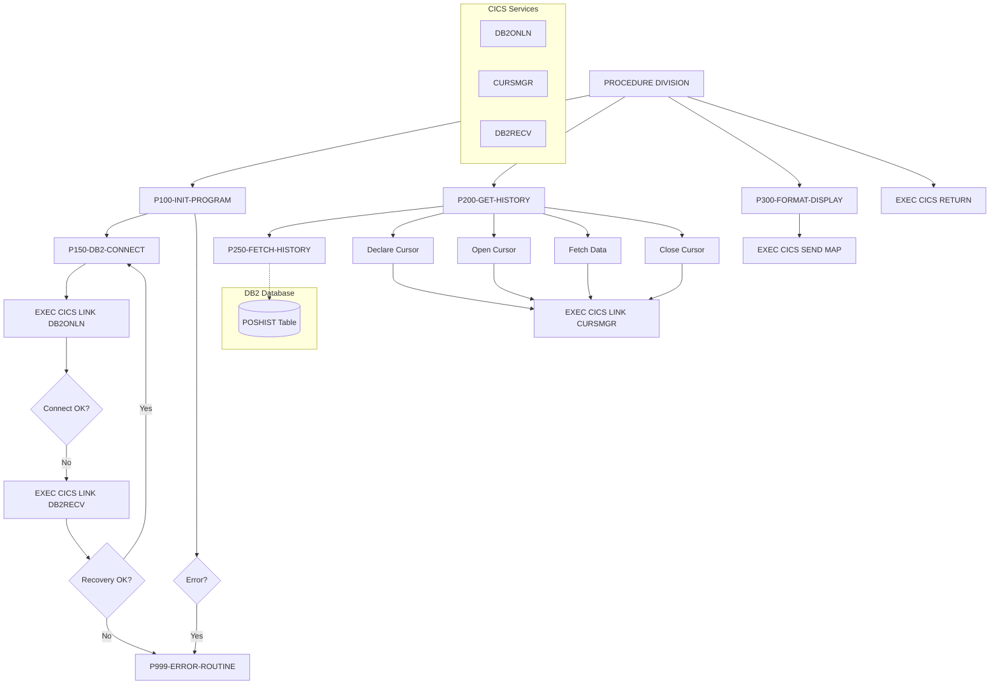

## Overview

INQHIST is a CICS online program that provides transaction history inquiry functionality for the portfolio management system. It retrieves historical transaction data from a DB2 database table and displays it on a CICS terminal screen, allowing users to review past portfolio transactions.

The program is part of the online inquiry subsystem and works in conjunction with other inquiry programs (INQONLN, INQPORT) that share a common communication area structure. It demonstrates typical CICS-DB2 integration patterns including connection management, cursor-based data retrieval, error handling, and BMS map display.

INQHIST supports viewing transaction history ordered by date (most recent first) and integrates with centralized utility programs for DB2 connection management (DB2ONLN), cursor management (CURSMGR), and error recovery (DB2RECV).

## Program Structure



## Data Structures

### Working Storage

#### Communication Area (WS-COMMAREA)

Contains the INQCOM copybook structure for inter-program communication:

| Level | Name | Picture | Description |
|-------|------|---------|-------------|
| 01 | INQCOM-AREA | | Inquiry communication area |
| 05 | INQCOM-FUNCTION | X(4) | Function code |
| 05 | INQCOM-ACCOUNT-NO | X(10) | Account number for inquiry |
| 05 | INQCOM-RESPONSE-CODE | S9(8) COMP | Response/return code |
| 05 | INQCOM-ERROR-MSG | X(80) | Error message text |

**INQCOM-FUNCTION Values (88-level conditions):**
- `MENU` - Return to menu (INQCOM-MENU)
- `INQP` - Portfolio inquiry (INQCOM-PORTFOLIO)
- `INQH` - History inquiry (INQCOM-HISTORY)
- `EXIT` - Exit application (INQCOM-EXIT)

#### DB2 Area (WS-DB2-AREA)

| Level | Name | Description |
|-------|------|-------------|
| 01 | WS-DB2-AREA | Contains SQLCA (SQL Communication Area) |

The SQLCA is included via `EXEC SQL INCLUDE SQLCA END-EXEC` and provides DB2 status information including SQLCODE.

#### History Table (WS-HISTORY-TABLE)

Array structure to hold fetched transaction history records:

| Level | Name | Picture | Occurs | Description |
|-------|------|---------|--------|-------------|
| 01 | WS-HISTORY-TABLE | | | History data container |
| 05 | WS-HISTORY-ENTRY | | 10 | Individual history record |
| 10 | WS-TRANS-DATE | X(10) | | Transaction date |
| 10 | WS-TRANS-TYPE | X(4) | | Transaction type code |
| 10 | WS-TRANS-UNITS | S9(9)V99 COMP-3 | | Number of units traded |
| 10 | WS-TRANS-PRICE | S9(9)V99 COMP-3 | | Price per unit |
| 10 | WS-TRANS-AMOUNT | S9(9)V99 COMP-3 | | Total transaction amount |

#### Flags (WS-FLAGS)

| Level | Name | Picture | Description |
|-------|------|---------|-------------|
| 01 | WS-FLAGS | | Processing flags |
| 05 | WS-RESPONSE-CODE | S9(8) COMP | CICS response code |
| 05 | WS-MORE-HISTORY | X | More rows indicator |
| 05 | WS-ROW-COUNT | S9(4) COMP | Count of rows fetched |

**WS-MORE-HISTORY Values:**
- `Y` - More rows available (MORE-ROWS)
- `N` - No more rows (NO-MORE-ROWS)

#### DB2 Request Structure (WS-DB2-REQUEST)

Communication area for DB2ONLN connection manager:

| Level | Name | Picture | Description |
|-------|------|---------|-------------|
| 01 | WS-DB2-REQUEST | | DB2 connection request |
| 05 | DB2-REQUEST-TYPE | X | Request type (C=Connect, D=Disconnect, S=Status) |
| 05 | DB2-RESPONSE-CODE | S9(8) COMP | Response from DB2ONLN |
| 05 | DB2-CONNECTION-TOKEN | X(16) | Connection identifier |
| 05 | DB2-ERROR-INFO | | Error information group |
| 10 | DB2-SQLCODE | S9(9) COMP | SQL return code |
| 10 | DB2-ERROR-MSG | X(80) | Error message |

#### Cursor Request Structure (WS-CURSOR-REQUEST)

Communication area for CURSMGR cursor manager:

| Level | Name | Picture | Description |
|-------|------|---------|-------------|
| 01 | WS-CURSOR-REQUEST | | Cursor management request |
| 05 | CURS-REQUEST-TYPE | X | Request type |
| 05 | CURS-NAME | X(18) | Cursor name ('HISTORY_CURSOR') |
| 05 | CURS-STMT | X(240) | SQL SELECT statement |
| 05 | CURS-ARRAY-FETCH | X | Array fetch flag ('Y'/'N') |
| 05 | CURS-RESPONSE-CODE | S9(8) COMP | Response code |
| 05 | CURS-DATA-AREA | X(3000) | Fetched data buffer |
| 05 | CURS-DATA-LENGTH | S9(4) COMP | Length of data |

**CURS-REQUEST-TYPE Values:**
- `D` - Declare cursor
- `O` - Open cursor
- `F` - Fetch data
- `C` - Close cursor

#### Recovery Request Structure (WS-RECOVERY-REQUEST)

Communication area for DB2RECV recovery handler:

| Level | Name | Picture | Description |
|-------|------|---------|-------------|
| 01 | WS-RECOVERY-REQUEST | | Recovery request |
| 05 | RECV-REQUEST-TYPE | X | Request type |
| 05 | RECV-RESPONSE-CODE | S9(8) COMP | Response code |
| 05 | RECV-SQLCODE | S9(9) COMP | SQL code that caused error |
| 05 | RECV-ERROR-INFO | | Error context |
| 10 | RECV-PROGRAM | X(8) | Program name |
| 10 | RECV-CURSOR | X(18) | Cursor name |
| 10 | RECV-MESSAGE | X(80) | Error message |
| 05 | RECV-STATUS | X | Recovery status |

**RECV-STATUS Values:**
- `S` - Success (RECV-SUCCESS)
- `F` - Failed (RECV-FAILED)
- `R` - Retry (RECV-RETRY)

### Linkage Section

#### DFHCOMMAREA

The CICS communication area, containing the same INQCOM structure as WS-COMMAREA. This is passed between CICS programs and transactions.

## Control Flow

### Main Processing

The program executes four main phases:

1. **P100-INIT-PROGRAM** - Initialize and establish DB2 connection
2. **P200-GET-HISTORY** - Retrieve transaction history via cursor
3. **P300-FORMAT-DISPLAY** - Send data to terminal screen
4. **EXEC CICS RETURN** - Return control to CICS

### Initialization (P100-INIT-PROGRAM THRU P100-EXIT)

1. **Copy COMMAREA**: Moves DFHCOMMAREA to WS-COMMAREA for local processing
2. **Initialize Flags**: Sets WS-ROW-COUNT to zeros and NO-MORE-ROWS to true
3. **Set Error Handler**: Uses `EXEC CICS HANDLE CONDITION ERROR(P999-ERROR-ROUTINE)` to establish error handling
4. **Connect to DB2**: Performs P150-DB2-CONNECT to establish database connection

### DB2 Connection (P150-DB2-CONNECT THRU P150-EXIT)

1. **Request Connection**: Sets DB2-REQUEST-TYPE to 'C' (Connect)
2. **Link to DB2ONLN**: Calls the DB2 connection manager via `EXEC CICS LINK`
3. **Check Response**: If connection fails:
   - Sets up recovery request with program name and SQLCODE
   - Links to DB2RECV for error recovery
   - If recovery succeeds, retries connection (recursive call)
   - If recovery fails, moves error message and performs error routine
4. **Save Token**: Stores DB2-CONNECTION-TOKEN for subsequent operations

### History Retrieval (P200-GET-HISTORY THRU P200-EXIT)

1. **Build SQL Statement**: Constructs SELECT statement for POSHIST table:
   ```sql
   SELECT TRANS_DATE, TRANS_TYPE, TRANS_UNITS, 
          TRANS_PRICE, TRANS_AMOUNT 
   FROM POSHIST 
   WHERE ACCOUNT_NO = ? 
   ORDER BY TRANS_DATE DESC
   ```

2. **Declare Cursor**: Sets CURS-REQUEST-TYPE to 'D' and links to CURSMGR

3. **Open Cursor**: Sets CURS-REQUEST-TYPE to 'O' and links to CURSMGR

4. **Fetch Data**: If cursor opened successfully, performs P250-FETCH-HISTORY

5. **Close Cursor**: Sets CURS-REQUEST-TYPE to 'C' and links to CURSMGR

### Data Fetch (P250-FETCH-HISTORY THRU P250-EXIT)

1. **Request Fetch**: Sets CURS-REQUEST-TYPE to 'F'
2. **Link to CURSMGR**: Retrieves data into CURS-DATA-AREA
3. **Move Data**: If successful, moves CURS-DATA-AREA to WS-HISTORY-TABLE

### Display (P300-FORMAT-DISPLAY THRU P300-EXIT)

Sends the history data to the terminal using BMS (Basic Mapping Support):

```cobol
EXEC CICS SEND MAP('HISMAP')
          MAPSET('INQSET')
          FROM(WS-HISTORY-TABLE)
          LENGTH(LENGTH OF WS-HISTORY-TABLE)
          ERASE
          RESP(WS-RESPONSE-CODE)
END-EXEC
```

### Error Handling (P999-ERROR-ROUTINE THRU P999-EXIT)

1. Moves SQLCODE to INQCOM-RESPONSE-CODE in WS-COMMAREA
2. Copies WS-COMMAREA back to DFHCOMMAREA for return to caller

## Dependencies

### Copybooks
- INQCOM - Online inquiry communication area structure

### Called Programs

| Program | Purpose | Call Method |
|---------|---------|-------------|
| DB2ONLN | DB2 connection management | EXEC CICS LINK |
| CURSMGR | Cursor lifecycle management | EXEC CICS LINK |
| DB2RECV | DB2 error recovery | EXEC CICS LINK |

### Related Programs

Programs that share the INQCOM copybook:
- INQONLN - Main online inquiry handler
- INQPORT - Portfolio inquiry handler

### Database Objects

| Object | Type | Description |
|--------|------|-------------|
| POSHIST | Table | Position history containing transaction records |

**POSHIST Columns Used:**
- ACCOUNT_NO - Account identifier (WHERE clause)
- TRANS_DATE - Transaction date
- TRANS_TYPE - Transaction type code
- TRANS_UNITS - Units traded
- TRANS_PRICE - Price per unit
- TRANS_AMOUNT - Total amount

### BMS Maps

| Map | Mapset | Description |
|-----|--------|-------------|
| HISMAP | INQSET | History display map |

## CICS Resources

### Commands Used

| Command | Purpose |
|---------|---------|
| HANDLE CONDITION | Establish error handler |
| LINK | Call subprograms |
| SEND MAP | Display BMS screen |
| RETURN | Return to CICS |

### Transaction Flow

```
User Request → INQHIST → DB2ONLN (Connect)
                      → CURSMGR (Declare/Open/Fetch/Close)
                      → SEND MAP (Display)
                      → RETURN
```

## Error Handling

### Connection Errors

When DB2ONLN returns a non-zero response code:
1. Program attempts recovery via DB2RECV
2. If DB2RECV indicates success (RECV-SUCCESS), retries connection
3. If recovery fails, error message is set and P999-ERROR-ROUTINE is performed

### Cursor Errors

Cursor operations check CURS-RESPONSE-CODE after each CURSMGR call. The cursor is always closed in P200-GET-HISTORY regardless of fetch success/failure.

### General CICS Errors

The `EXEC CICS HANDLE CONDITION ERROR(P999-ERROR-ROUTINE)` directive routes unexpected errors to the error routine, which captures the SQLCODE and returns it to the caller.

## Technical Notes

### COMP-3 (Packed Decimal)

The transaction amounts (WS-TRANS-UNITS, WS-TRANS-PRICE, WS-TRANS-AMOUNT) use `COMP-3` (packed decimal) format. This is efficient for decimal arithmetic and is the standard format for DB2 DECIMAL columns.

### Array Fetch

The program sets `CURS-ARRAY-FETCH` to 'Y', enabling the cursor manager to fetch multiple rows in a single operation. This improves performance by reducing the number of DB2 fetch operations.

### PERFORM THRU

The program uses `PERFORM paragraph-name THRU paragraph-name-EXIT` pattern. This ensures proper paragraph boundary handling and allows for consistent exit points.

### Recursive Recovery

The DB2 connection logic includes recursive retry capability—if DB2RECV indicates recovery was successful, P150-DB2-CONNECT calls itself to retry the connection. This handles transient connection failures automatically.

### Communication Area Flow

```
DFHCOMMAREA (input) → WS-COMMAREA (working) → DFHCOMMAREA (output)
```

The COMMAREA is copied to working storage for manipulation, then copied back before returning to preserve any error information.
