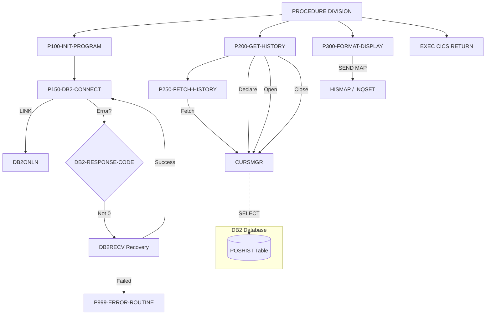

## Overview

INQHIST is a CICS online program that handles transaction history inquiries for the portfolio management system. The program retrieves transaction history data from a DB2 database table and formats it for display on a BMS map screen, providing users with a chronological view of account transactions.

This program is part of the online inquiry subsystem and works in conjunction with other inquiry programs (INQONLN, INQPORT) to provide comprehensive account information. Key features include:

- **DB2 Database Access**: Retrieves transaction history from the POSHIST table using SQL cursor-based processing
- **Scrollable Display**: Supports array fetching for efficient retrieval of multiple history records
- **Error Recovery**: Implements connection recovery through the DB2RECV program when database errors occur
- **BMS Map Integration**: Formats and displays history data using CICS BMS maps

## Program Structure



## Data Structures

### Working Storage

#### WS-COMMAREA

Contains a copy of the INQCOM communication area for local processing.

| Level | Name | Picture | Description |
|-------|------|---------|-------------|
| 01 | WS-COMMAREA | - | Local copy of DFHCOMMAREA |

#### WS-DB2-AREA

| Level | Name | Picture | Description |
|-------|------|---------|-------------|
| 01 | WS-DB2-AREA | - | DB2 SQL Communication Area |
| - | SQLCA | - | Included via EXEC SQL INCLUDE |

#### WS-HISTORY-TABLE

| Level | Name | Picture | Description |
|-------|------|---------|-------------|
| 01 | WS-HISTORY-TABLE | - | Array of history entries |
| 05 | WS-HISTORY-ENTRY | (occurs 10) | Single history entry |
| 10 | WS-TRANS-DATE | X(10) | Transaction date |
| 10 | WS-TRANS-TYPE | X(4) | Transaction type code |
| 10 | WS-TRANS-UNITS | S9(9)V99 COMP-3 | Number of units |
| 10 | WS-TRANS-PRICE | S9(9)V99 COMP-3 | Price per unit |
| 10 | WS-TRANS-AMOUNT | S9(9)V99 COMP-3 | Total transaction amount |

#### WS-FLAGS

| Level | Name | Picture | Description |
|-------|------|---------|-------------|
| 01 | WS-FLAGS | - | Processing flags |
| 05 | WS-RESPONSE-CODE | S9(8) COMP | CICS response code |
| 05 | WS-MORE-HISTORY | X | More rows indicator |
| 05 | WS-ROW-COUNT | S9(4) COMP | Count of rows retrieved |

**WS-MORE-HISTORY Condition Names (88-levels):**

| Condition | Value | Description |
|-----------|-------|-------------|
| MORE-ROWS | 'Y' | Additional history rows exist |
| NO-MORE-ROWS | 'N' | No more rows to retrieve |

#### WS-DB2-REQUEST

| Level | Name | Picture | Description |
|-------|------|---------|-------------|
| 01 | WS-DB2-REQUEST | - | DB2 connection request structure |
| 05 | DB2-REQUEST-TYPE | X | Request type code |
| 05 | DB2-RESPONSE-CODE | S9(8) COMP | Response from DB2ONLN |
| 05 | DB2-CONNECTION-TOKEN | X(16) | Connection token |
| 05 | DB2-ERROR-INFO | - | Error information group |
| 10 | DB2-SQLCODE | S9(9) COMP | SQL return code |
| 10 | DB2-ERROR-MSG | X(80) | Error message text |

#### WS-CURSOR-REQUEST

| Level | Name | Picture | Description |
|-------|------|---------|-------------|
| 01 | WS-CURSOR-REQUEST | - | Cursor manager request structure |
| 05 | CURS-REQUEST-TYPE | X | Request type (D/O/F/C) |
| 05 | CURS-NAME | X(18) | Cursor name ('HISTORY_CURSOR') |
| 05 | CURS-STMT | X(240) | SQL SELECT statement |
| 05 | CURS-ARRAY-FETCH | X | Array fetch flag ('Y') |
| 05 | CURS-RESPONSE-CODE | S9(8) COMP | Response code |
| 05 | CURS-DATA-AREA | X(3000) | Data return area |
| 05 | CURS-DATA-LENGTH | S9(4) COMP | Data length |

**Cursor Request Types:**

| Code | Description |
|------|-------------|
| D | Declare cursor |
| O | Open cursor |
| F | Fetch rows |
| C | Close cursor |

#### WS-RECOVERY-REQUEST

| Level | Name | Picture | Description |
|-------|------|---------|-------------|
| 01 | WS-RECOVERY-REQUEST | - | DB2 recovery request structure |
| 05 | RECV-REQUEST-TYPE | X | Recovery request type |
| 05 | RECV-RESPONSE-CODE | S9(8) COMP | Recovery response code |
| 05 | RECV-SQLCODE | S9(9) COMP | Original SQL code |
| 05 | RECV-ERROR-INFO | - | Error information group |
| 10 | RECV-PROGRAM | X(8) | Program name |
| 10 | RECV-CURSOR | X(18) | Cursor name |
| 10 | RECV-MESSAGE | X(80) | Error message |
| 05 | RECV-STATUS | X | Recovery status |

**Recovery Status Condition Names (88-levels):**

| Condition | Value | Description |
|-----------|-------|-------------|
| RECV-SUCCESS | 'S' | Recovery successful |
| RECV-FAILED | 'F' | Recovery failed |
| RECV-RETRY | 'R' | Retry operation |

### Linkage Section

#### DFHCOMMAREA (from INQCOM copybook)

| Level | Name | Picture | Description |
|-------|------|---------|-------------|
| 01 | INQCOM-AREA | - | Communication area |
| 05 | INQCOM-FUNCTION | X(4) | Function code |
| 05 | INQCOM-ACCOUNT-NO | X(10) | Account number for inquiry |
| 05 | INQCOM-RESPONSE-CODE | S9(8) COMP | Response code (output) |
| 05 | INQCOM-ERROR-MSG | X(80) | Error message (output) |

**Function Code Condition Names (88-levels):**

| Condition | Value | Description |
|-----------|-------|-------------|
| INQCOM-MENU | 'MENU' | Return to menu |
| INQCOM-PORTFOLIO | 'INQP' | Portfolio inquiry |
| INQCOM-HISTORY | 'INQH' | History inquiry |
| INQCOM-EXIT | 'EXIT' | Exit application |

## Database Access

### POSHIST Table

The program retrieves transaction history from the POSHIST (Position History) table:

```sql
SELECT TRANS_DATE, TRANS_TYPE, TRANS_UNITS, 
       TRANS_PRICE, TRANS_AMOUNT 
FROM POSHIST 
WHERE ACCOUNT_NO = ? 
ORDER BY TRANS_DATE DESC
```

| Column | Description |
|--------|-------------|
| TRANS_DATE | Date of transaction |
| TRANS_TYPE | Type code (buy, sell, etc.) |
| TRANS_UNITS | Number of units traded |
| TRANS_PRICE | Price per unit |
| TRANS_AMOUNT | Total transaction amount |
| ACCOUNT_NO | Account number (search key) |

Results are ordered by transaction date in descending order (most recent first).

## Control Flow

### Main Processing Flow

1. **P100-INIT-PROGRAM**: Initialize program, establish DB2 connection
2. **P200-GET-HISTORY**: Retrieve transaction history from DB2
3. **P300-FORMAT-DISPLAY**: Format and send data to BMS map
4. **EXEC CICS RETURN**: Return control to CICS

### P100-INIT-PROGRAM

1. **Copy COMMAREA**: Moves DFHCOMMAREA to WS-COMMAREA for local processing
2. **Initialize Counters**: Sets WS-ROW-COUNT to zeros and NO-MORE-ROWS to true
3. **Set Error Handler**: Uses `EXEC CICS HANDLE CONDITION ERROR` to route errors to P999-ERROR-ROUTINE
4. **Connect to DB2**: Performs P150-DB2-CONNECT to establish database connection

### P150-DB2-CONNECT

1. **Request Connection**: Sets DB2-REQUEST-TYPE to 'C' (Connect) and links to DB2ONLN program
2. **Check Response**: If DB2-RESPONSE-CODE is not 0:
   - Sets up recovery request with program name and SQL code
   - Links to DB2RECV for connection recovery
   - If recovery succeeds (RECV-SUCCESS), recursively retries connection
   - If recovery fails, moves error message to COMMAREA and performs error routine
3. **Save Token**: On successful connection, saves DB2-CONNECTION-TOKEN for subsequent operations

### P200-GET-HISTORY

Manages the cursor lifecycle for retrieving history:

1. **Declare Cursor**: Sets CURS-REQUEST-TYPE to 'D', populates SQL statement, links to CURSMGR
2. **Open Cursor**: If declare successful, sets type to 'O' and links to CURSMGR
3. **Fetch Data**: If open successful, performs P250-FETCH-HISTORY
4. **Close Cursor**: Always closes cursor by setting type to 'C' and linking to CURSMGR

### P250-FETCH-HISTORY

1. **Fetch Request**: Sets CURS-REQUEST-TYPE to 'F' and links to CURSMGR
2. **Process Results**: If response code >= 0, moves CURS-DATA-AREA to WS-HISTORY-TABLE

### P300-FORMAT-DISPLAY

Sends the formatted history data to the terminal:

```cobol
EXEC CICS SEND MAP('HISMAP')
          MAPSET('INQSET')
          FROM(WS-HISTORY-TABLE)
          LENGTH(LENGTH OF WS-HISTORY-TABLE)
          ERASE
          RESP(WS-RESPONSE-CODE)
END-EXEC
```

### P999-ERROR-ROUTINE

Handles errors by:
1. Moving SQLCODE to INQCOM-RESPONSE-CODE
2. Copying WS-COMMAREA back to DFHCOMMAREA for return to caller

## Dependencies

### Copybooks

- [INQCOM](/docs/copybooks/INQCOM) - Online inquiry communication area structure
- [SQLCA](/docs/copybooks/SQLCA) - DB2 SQL Communication Area (included via EXEC SQL)

### Called Programs

| Program | Purpose | Communication |
|---------|---------|---------------|
| [DB2ONLN](/docs/programs/DB2ONLN) | DB2 connection management | WS-DB2-REQUEST |
| [DB2RECV](/docs/programs/DB2RECV) | DB2 error recovery | WS-RECOVERY-REQUEST |
| [CURSMGR](/docs/programs/CURSMGR) | Cursor management | WS-CURSOR-REQUEST |

### BMS Maps

| Map | Mapset | Description |
|-----|--------|-------------|
| HISMAP | INQSET | Transaction history display map |

### Related Programs

Programs that share the INQCOM copybook:
- [INQONLN](/docs/programs/INQONLN) - Main online inquiry controller
- [INQPORT](/docs/programs/INQPORT) - Portfolio inquiry handler

## CICS Commands Used

| Command | Purpose |
|---------|---------|
| `EXEC CICS HANDLE CONDITION ERROR` | Set error handling routine |
| `EXEC CICS LINK PROGRAM` | Call subprograms (DB2ONLN, DB2RECV, CURSMGR) |
| `EXEC CICS SEND MAP` | Display BMS map with history data |
| `EXEC CICS RETURN` | Return control to CICS |

## Error Handling

### DB2 Connection Errors

When DB2ONLN returns a non-zero response code:
1. The program attempts recovery by calling DB2RECV
2. If recovery succeeds (RECV-SUCCESS), the connection is retried
3. If recovery fails, the error message is passed to the user via COMMAREA

### SQL Errors

SQL errors are captured in SQLCODE and moved to INQCOM-RESPONSE-CODE for return to the calling program.

### CICS Errors

The `HANDLE CONDITION ERROR` directive routes any CICS errors to P999-ERROR-ROUTINE.

## Technical Notes

### COMP-3 (Packed Decimal)

The transaction amount fields use `COMP-3` (packed decimal) format, which stores two digits per byte plus a sign nibble. This is efficient for financial calculations and is the standard format for DB2 DECIMAL columns.

### PERFORM THRU

The program uses `PERFORM paragraph-name THRU paragraph-EXIT` pattern, which is a common CICS programming convention that ensures proper paragraph scoping and facilitates debugging.

### Array Fetching

The cursor request specifies `CURS-ARRAY-FETCH = 'Y'`, indicating that CURSMGR should fetch multiple rows in a single operation for efficiency. The WS-HISTORY-TABLE is sized for 10 entries to match this array fetch capability.

### Recursive Recovery

The P150-DB2-CONNECT paragraph can recursively call itself after successful recovery. This should be used cautiously to avoid infinite loops; the DB2RECV program is expected to limit retry attempts.
