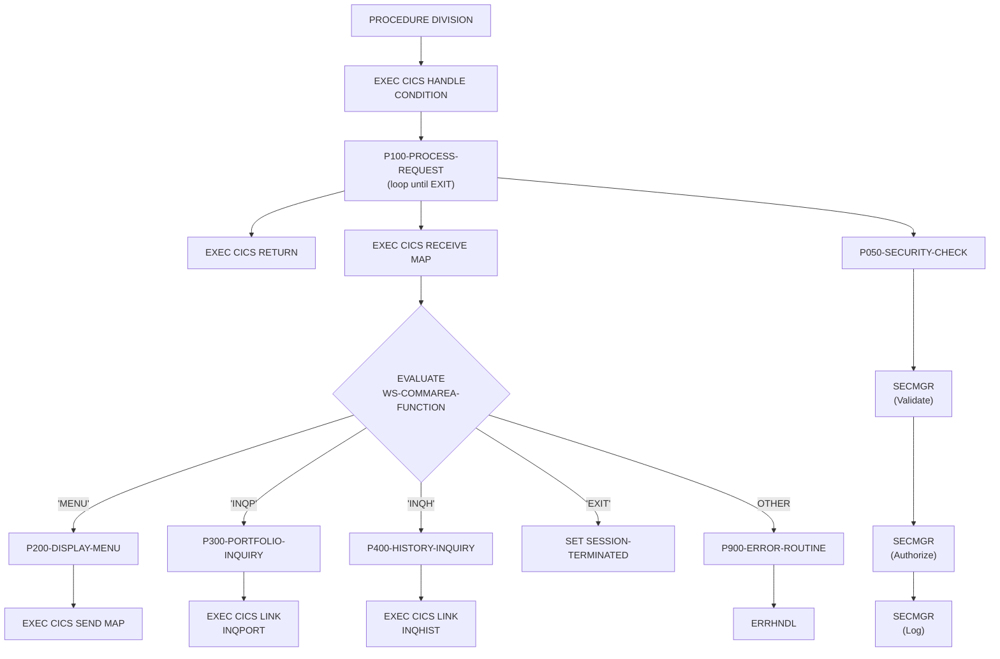

## Overview

INQONLN is the main CICS transaction handler for the portfolio inquiry system. It serves as the central controller that manages user interactions, validates security access, and routes requests to the appropriate inquiry sub-programs.

The program implements a menu-driven architecture supporting four main functions:
- **MENU** - Display the main inquiry menu
- **INQP** - Portfolio inquiry (delegates to INQPORT)
- **INQH** - History inquiry (delegates to INQHIST)
- **EXIT** - Terminate the session

Key features include:
- **Pseudo-conversational design** - Uses CICS RECEIVE MAP to get user input and SEND MAP to display responses
- **Security integration** - Validates user identity and authorization through SECMGR before processing requests
- **Centralized error handling** - Routes all errors through ERRHNDL with support for warnings and abends
- **BMS map support** - Uses INQMAP/INQMNU maps from the INQSET mapset

## Program Structure



## Data Structures

### Working Storage

| Level | Name | Picture | Description |
|-------|------|---------|-------------|
| 01 | WS-COMMAREA | - | Communication area (COPY INQCOM) |
| 01 | WS-FLAGS | - | Session control flags |
| 05 | WS-END-OF-SESSION | PIC X | Session termination flag (default `N`) |
| 05 | WS-RESPONSE-CODE | PIC S9(8) COMP | CICS response code from commands |
| 01 | WS-ERROR-AREA | - | Error handling area (COPY ERRHND) |
| 01 | WS-SECURITY-REQUEST | - | Security manager request structure |
| 05 | SEC-REQUEST-TYPE | PIC X | Security request type (`V`/`A`/`L`) |
| 05 | SEC-USER-ID | PIC X(8) | User ID from CICS |
| 05 | SEC-RESOURCE-NAME | PIC X(8) | Resource being accessed |
| 05 | SEC-ACCESS-TYPE | PIC X(8) | Type of access requested |
| 05 | SEC-RESPONSE-CODE | PIC S9(8) COMP | Security check result |
| 05 | SEC-ERROR-INFO | PIC X(80) | Security error message |

### Session Control Flags (88-Level Conditions)

| Condition Name | Value | Description |
|----------------|-------|-------------|
| SESSION-ACTIVE | `N` | Session is active (continue processing) |
| SESSION-TERMINATED | `Y` | Session ended (exit main loop) |

### Linkage Section

| Level | Name | Description |
|-------|------|-------------|
| 01 | DFHCOMMAREA | CICS communication area (COPY INQCOM) |

### Inquiry Communication Area (from INQCOM copybook)

| Level | Name | Picture | Description |
|-------|------|---------|-------------|
| 01 | INQCOM-AREA | - | Main communication structure |
| 05 | INQCOM-FUNCTION | PIC X(4) | Function code |
| 05 | INQCOM-ACCOUNT-NO | PIC X(10) | Account number for inquiry |
| 05 | INQCOM-RESPONSE-CODE | PIC S9(8) COMP | Response from sub-programs |
| 05 | INQCOM-ERROR-MSG | PIC X(80) | Error message text |

### Function Codes (88-Level Conditions on INQCOM-FUNCTION)

| Condition Name | Value | Description |
|----------------|-------|-------------|
| INQCOM-MENU | `MENU` | Display main menu |
| INQCOM-PORTFOLIO | `INQP` | Portfolio inquiry |
| INQCOM-HISTORY | `INQH` | History inquiry |
| INQCOM-EXIT | `EXIT` | Exit transaction |

### Error Handling Area (from ERRHND copybook)

| Level | Name | Picture | Description |
|-------|------|---------|-------------|
| 01 | ERROR-HANDLING | - | Error information structure |
| 05 | ERR-PROGRAM | PIC X(8) | Program where error occurred |
| 05 | ERR-PARAGRAPH | PIC X(30) | Paragraph where error occurred |
| 05 | ERR-SQLCODE | PIC S9(9) COMP | DB2 SQLCODE (if applicable) |
| 05 | ERR-CICS-RESP | PIC S9(8) COMP | CICS EIBRESP value |
| 05 | ERR-CICS-RESP2 | PIC S9(8) COMP | CICS EIBRESP2 value |
| 05 | ERR-SEVERITY | PIC X | Severity: `F`=Fatal, `W`=Warning, `I`=Info |
| 05 | ERR-MESSAGE | PIC X(80) | Error message text |
| 05 | ERR-ACTION | PIC X | Action: `R`=Return, `C`=Continue, `A`=Abend |
| 05 | ERR-TRACE | - | Trace information |
| 10 | ERR-TRACE-ID | PIC X(16) | Trace identifier |
| 10 | ERR-TIMESTAMP | PIC X(26) | Error timestamp |

## File I/O

This program does not perform any file I/O operations. All data access is performed through linked sub-programs (INQPORT, INQHIST) and BMS maps for screen I/O.

### BMS Maps

| Map Name | Mapset | Usage |
|----------|--------|-------|
| INQMAP | INQSET | Receive user input |
| INQMNU | INQSET | Display menu screen |

## Control Flow

### Initialization

The program begins with `EXEC CICS HANDLE CONDITION` to establish error handlers:
- **ERROR** → P900-ERROR-ROUTINE
- **PGMIDERR** → P900-ERROR-ROUTINE (program not found)
- **NOTFND** → P900-ERROR-ROUTINE (record not found)

This ensures that any CICS exception condition routes to the centralized error handler.

### Main Processing Loop (P100-PROCESS-REQUEST)

The main loop executes until `SESSION-TERMINATED` becomes true:

1. **Initialize**: Clear the working storage COMMAREA
2. **Receive Input**: Execute `EXEC CICS RECEIVE MAP` to get user input from INQMAP
3. **Route Request**: EVALUATE the function code to dispatch to appropriate handler:
   - `MENU` → P200-DISPLAY-MENU
   - `INQP` → P300-PORTFOLIO-INQUIRY
   - `INQH` → P400-HISTORY-INQUIRY
   - `EXIT` → Set SESSION-TERMINATED to TRUE
   - Other → P900-ERROR-ROUTINE
4. **Security Check**: Call P050-SECURITY-CHECK after processing
5. **Validate Security**: If security check fails, display error and return to CICS

### P200-DISPLAY-MENU

Sends the main menu screen to the terminal:
```cobol
EXEC CICS SEND MAP('INQMNU')
          MAPSET('INQSET')
          ERASE
END-EXEC
```

The `ERASE` option clears the screen before displaying the menu.

### P300-PORTFOLIO-INQUIRY

Links to the INQPORT program for portfolio lookup:
```cobol
EXEC CICS LINK PROGRAM('INQPORT')
          COMMAREA(WS-COMMAREA)
          LENGTH(LENGTH OF WS-COMMAREA)
END-EXEC
```

The COMMAREA contains the account number and receives the response.

### P400-HISTORY-INQUIRY

Links to the INQHIST program for transaction history:
```cobol
EXEC CICS LINK PROGRAM('INQHIST')
          COMMAREA(WS-COMMAREA)
          LENGTH(LENGTH OF WS-COMMAREA)
END-EXEC
```

### P050-SECURITY-CHECK

Implements a three-step security validation process by calling SECMGR:

1. **Validate User (V)**: Verifies the user ID is valid
   - Gets current user ID via `EXEC CICS ASSIGN USERID`
   - Calls SECMGR with request type `'V'`

2. **Authorize Access (A)**: Checks user has READ access to INQONLN
   - Sets resource name to `'INQONLN'`
   - Sets access type to `'READ'`
   - Calls SECMGR with request type `'A'`

3. **Log Access (L)**: Records the access attempt
   - Calls SECMGR with request type `'L'`

If any security check fails (`SEC-RESPONSE-CODE NOT = 0`), the error message is displayed and the transaction returns to CICS.

### P900-ERROR-ROUTINE

Centralized error handling that:
1. Populates error context information:
   - `ERR-PROGRAM` = `'INQONLN'`
   - `ERR-PARAGRAPH` = `'P900-ERROR-ROUTINE'`
   - `ERR-CICS-RESP` = EIBRESP (CICS response code)
   - `ERR-CICS-RESP2` = EIBRESP2 (secondary response)
   - Sets severity to WARNING
2. Links to ERRHNDL for error processing
3. If ERRHNDL sets `ERR-ABEND`, issues `EXEC CICS ABEND ABCODE('IERR')`
4. Otherwise, copies error message for display

## Dependencies

### Copybooks

- **INQCOM** - Online inquiry communication area defining the COMMAREA structure shared between INQONLN and sub-programs
- **ERRHND** - Online error handling structure for passing error information to ERRHNDL

### Called Programs

| Program | Purpose | Communication |
|---------|---------|---------------|
| INQPORT | Portfolio inquiry processing | WS-COMMAREA (INQCOM) |
| INQHIST | History inquiry processing | WS-COMMAREA (INQCOM) |
| SECMGR | Security validation and authorization | WS-SECURITY-REQUEST |
| ERRHNDL | Centralized error handling | WS-ERROR-AREA (ERRHND) |

### Related Programs

Programs that share the INQCOM copybook:
- INQHIST - History inquiry handler
- INQPORT - Portfolio inquiry handler

Programs that share the ERRHND copybook:
- DB2ONLN - DB2 online operations
- DB2RECV - DB2 recovery handler
- ERRHNDL - Error handler
- SECMGR - Security manager

## CICS Commands Reference

| Command | Purpose |
|---------|---------|
| `HANDLE CONDITION` | Establish error condition handlers |
| `RECEIVE MAP` | Get input from BMS map |
| `SEND MAP` | Display BMS map to terminal |
| `LINK PROGRAM` | Call another CICS program |
| `ASSIGN USERID` | Get current user ID |
| `RETURN` | Return control to CICS |
| `ABEND ABCODE` | Abnormally terminate with code |

## Security Model

The program implements defense-in-depth security:

1. **User Validation**: Confirms the user ID is recognized by the security system
2. **Resource Authorization**: Verifies the user has explicit READ permission to the INQONLN resource
3. **Audit Logging**: Records all access attempts for compliance and troubleshooting

This three-step approach ensures that:
- Only authenticated users can access the inquiry functions
- Authorization is checked against specific resources
- All access is logged for audit trails

## Error Handling Strategy

The program uses a tiered error handling approach:

| Severity | Condition | Action |
|----------|-----------|--------|
| `I` (Info) | Informational message | Continue processing |
| `W` (Warning) | Non-fatal error | Display message, continue |
| `F` (Fatal) | Unrecoverable error | Abend with code `'IERR'` |

The `EXEC CICS HANDLE CONDITION` ensures that unexpected CICS errors (ERROR, PGMIDERR, NOTFND) are captured and routed to the error routine rather than causing an uncontrolled abend.
