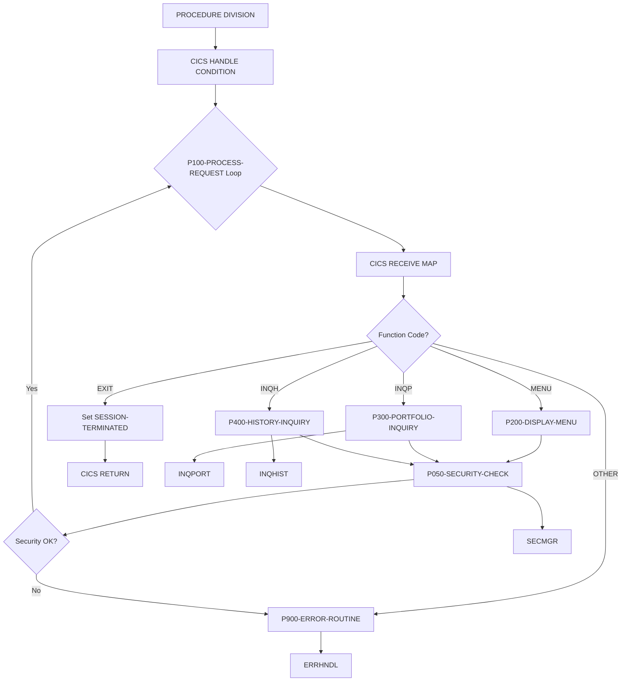

## Overview

INQONLN is the main CICS transaction handler for the portfolio inquiry subsystem. It serves as the central controller for online inquiry operations, managing user interactions through BMS maps and routing requests to specialized inquiry programs.

The program provides the following capabilities:

- **Menu Display**: Presents the main inquiry menu to users
- **Portfolio Inquiry**: Routes portfolio lookup requests to INQPORT
- **History Inquiry**: Routes transaction history requests to INQHIST
- **Security Validation**: Performs multi-level security checks via SECMGR
- **Error Handling**: Centralized error handling through ERRHNDL

INQONLN implements a pseudo-conversational design pattern, processing user requests in a loop until the session is terminated. Each iteration receives map input, validates security, dispatches to the appropriate handler, and returns control to CICS.

## Program Structure



## Data Structures

### Working Storage

| Level | Name | Picture | Description |
|-------|------|---------|-------------|
| 01 | WS-COMMAREA | - | Communication area (contains INQCOM) |
| 01 | WS-FLAGS | - | Session control flags |
| 05 | WS-END-OF-SESSION | X | Session status (`N`=active, `Y`=terminated) |
| 05 | WS-RESPONSE-CODE | S9(8) COMP | CICS response code |
| 01 | WS-ERROR-AREA | - | Error handling area (contains ERRHND) |
| 01 | WS-SECURITY-REQUEST | - | Security manager request area |
| 05 | SEC-REQUEST-TYPE | X | Security request type |
| 05 | SEC-USER-ID | X(8) | User ID for security check |
| 05 | SEC-RESOURCE-NAME | X(8) | Resource being accessed |
| 05 | SEC-ACCESS-TYPE | X(8) | Type of access requested |
| 05 | SEC-RESPONSE-CODE | S9(8) COMP | Security check result |
| 05 | SEC-ERROR-INFO | X(80) | Security error details |

### Inquiry Communication Area (from INQCOM copybook)

| Level | Name | Picture | Description |
|-------|------|---------|-------------|
| 01 | INQCOM-AREA | - | Inquiry communication structure |
| 05 | INQCOM-FUNCTION | X(4) | Function code (see table below) |
| 05 | INQCOM-ACCOUNT-NO | X(10) | Account number for inquiry |
| 05 | INQCOM-RESPONSE-CODE | S9(8) COMP | Response code |
| 05 | INQCOM-ERROR-MSG | X(80) | Error message text |

### Function Codes

| Code | 88-Level Name | Description |
|------|---------------|-------------|
| `MENU` | INQCOM-MENU | Display main inquiry menu |
| `INQP` | INQCOM-PORTFOLIO | Portfolio inquiry |
| `INQH` | INQCOM-HISTORY | History inquiry |
| `EXIT` | INQCOM-EXIT | Terminate session |

### Error Handling Structure (from ERRHND copybook)

| Level | Name | Picture | Description |
|-------|------|---------|-------------|
| 01 | ERROR-HANDLING | - | Error information structure |
| 05 | ERR-PROGRAM | X(8) | Program where error occurred |
| 05 | ERR-PARAGRAPH | X(30) | Paragraph where error occurred |
| 05 | ERR-SQLCODE | S9(9) COMP | DB2 SQLCODE if applicable |
| 05 | ERR-CICS-RESP | S9(8) COMP | CICS EIBRESP value |
| 05 | ERR-CICS-RESP2 | S9(8) COMP | CICS EIBRESP2 value |
| 05 | ERR-SEVERITY | X | Severity: `F`=Fatal, `W`=Warning, `I`=Info |
| 05 | ERR-MESSAGE | X(80) | Error message text |
| 05 | ERR-ACTION | X | Action: `R`=Return, `C`=Continue, `A`=Abend |
| 05 | ERR-TRACE | - | Trace information |
| 10 | ERR-TRACE-ID | X(16) | Trace identifier |
| 10 | ERR-TIMESTAMP | X(26) | Error timestamp |

### Linkage Section

| Level | Name | Description |
|-------|------|-------------|
| 01 | DFHCOMMAREA | CICS communication area (contains INQCOM structure) |

## File I/O

This program does not use traditional file I/O. All data interaction is through:
- CICS BMS maps for screen I/O
- CICS LINK for program-to-program communication
- CICS COMMAREA for data passing

### BMS Maps

| Map Name | Mapset | Purpose |
|----------|--------|---------|
| INQMAP | INQSET | Main inquiry input map |
| INQMNU | INQSET | Inquiry menu display map |

## Control Flow

### Main Entry Point

1. Sets up CICS condition handling for ERROR, PGMIDERR, and NOTFND conditions
2. Enters the main processing loop (P100-PROCESS-REQUEST)
3. Continues until SESSION-TERMINATED flag is set
4. Returns control to CICS via `EXEC CICS RETURN`

### Process Request (P100-PROCESS-REQUEST)

The main processing loop for each user interaction:

1. **Initialize**: Clears WS-COMMAREA to LOW-VALUES
2. **Receive Input**: Executes `EXEC CICS RECEIVE MAP` to get user input from INQMAP
3. **Dispatch**: Uses EVALUATE to route based on function code:
   - `MENU` → P200-DISPLAY-MENU
   - `INQP` → P300-PORTFOLIO-INQUIRY
   - `INQH` → P400-HISTORY-INQUIRY
   - `EXIT` → Sets SESSION-TERMINATED
   - Other → P900-ERROR-ROUTINE
4. **Security Check**: Calls P050-SECURITY-CHECK
5. **Security Validation**: If security fails, displays error and returns

### Display Menu (P200-DISPLAY-MENU)

Sends the inquiry menu screen to the terminal:

```
EXEC CICS SEND MAP('INQMNU')
          MAPSET('INQSET')
          ERASE
END-EXEC
```

The ERASE option clears the screen before displaying the menu.

### Portfolio Inquiry (P300-PORTFOLIO-INQUIRY)

Links to the INQPORT program for portfolio lookup:

```
EXEC CICS LINK PROGRAM('INQPORT')
          COMMAREA(WS-COMMAREA)
          LENGTH(LENGTH OF WS-COMMAREA)
END-EXEC
```

The account number and other parameters are passed via WS-COMMAREA.

### History Inquiry (P400-HISTORY-INQUIRY)

Links to the INQHIST program for transaction history lookup:

```
EXEC CICS LINK PROGRAM('INQHIST')
          COMMAREA(WS-COMMAREA)
          LENGTH(LENGTH OF WS-COMMAREA)
END-EXEC
```

### Security Check (P050-SECURITY-CHECK)

Performs a three-phase security validation via SECMGR:

1. **User Validation** (Request Type `V`):
   - Gets current user ID via `EXEC CICS ASSIGN USERID`
   - Validates the user is authenticated

2. **Resource Authorization** (Request Type `A`):
   - Checks if user has READ access to INQONLN resource
   - Only performed if user validation succeeds

3. **Access Logging** (Request Type `L`):
   - Logs the access attempt for audit purposes
   - Only performed if authorization succeeds

If any security check fails, SEC-RESPONSE-CODE will be non-zero and the error information will be in SEC-ERROR-INFO.

### Error Routine (P900-ERROR-ROUTINE)

Centralized error handling:

1. Populates error structure with:
   - Program name ('INQONLN')
   - Paragraph name ('P900-ERROR-ROUTINE')
   - CICS response codes (EIBRESP, EIBRESP2)
   - Severity level (Warning)

2. Links to ERRHNDL for error processing:
   ```
   EXEC CICS LINK PROGRAM('ERRHNDL')
             COMMAREA(WS-ERROR-AREA)
   END-EXEC
   ```

3. If ERRHNDL returns ERR-ABEND action, issues:
   ```
   EXEC CICS ABEND ABCODE('IERR') END-EXEC
   ```

4. Otherwise, moves error message to display area

## Dependencies

### Copybooks

- **INQCOM** - Online inquiry communication area structure
- **ERRHND** - Online error handling structure and severity codes

### Called Programs

| Program | Purpose | Invocation |
|---------|---------|------------|
| INQPORT | Portfolio inquiry processing | EXEC CICS LINK |
| INQHIST | History inquiry processing | EXEC CICS LINK |
| SECMGR | Security management and validation | EXEC CICS LINK |
| ERRHNDL | Error handling and logging | EXEC CICS LINK |

### Related Programs

Programs that share copybooks with INQONLN:

| Program | Shared Copybooks | Relationship |
|---------|------------------|--------------|
| INQHIST | INQCOM | History inquiry (called by INQONLN) |
| INQPORT | INQCOM | Portfolio inquiry (called by INQONLN) |
| DB2ONLN | ERRHND | Online DB2 processing |
| DB2RECV | ERRHND | DB2 recovery |
| ERRHNDL | ERRHND | Error handler (called by INQONLN) |
| SECMGR | ERRHND | Security manager (called by INQONLN) |

## Technical Notes

### Pseudo-Conversational Design

INQONLN implements the CICS pseudo-conversational pattern:
- The program processes one user interaction per invocation
- State is maintained in DFHCOMMAREA between invocations
- The processing loop handles multiple functions but returns to CICS after each

However, note that this implementation uses a PERFORM UNTIL loop rather than the more typical single-pass approach. This means:
- Multiple map interactions may occur within a single task
- The session continues until the user selects EXIT
- This is a conversational pattern within a pseudo-conversational shell

### CICS Condition Handling

The program uses `EXEC CICS HANDLE CONDITION` to establish error handlers:

| Condition | Handler | Description |
|-----------|---------|-------------|
| ERROR | P900-ERROR-ROUTINE | General CICS errors |
| PGMIDERR | P900-ERROR-ROUTINE | Program not found |
| NOTFND | P900-ERROR-ROUTINE | Record not found |

### Security Model

The three-phase security check provides defense in depth:

1. **Authentication** (`V`): Verifies user identity
2. **Authorization** (`A`): Verifies access rights to the resource
3. **Audit Logging** (`L`): Creates audit trail

This ensures that:
- Only authenticated users can access the system
- Users can only perform authorized operations
- All access attempts are logged for compliance

### Abend Codes

| Code | Meaning |
|------|---------|
| IERR | Inquiry error - fatal error during processing |

### BMS Mapset Structure

The INQSET mapset contains:
- **INQMAP**: Input map for receiving user selections and data
- **INQMNU**: Output map for displaying the main menu

These maps are defined separately in the BMS source and compiled into the CICS load library.
