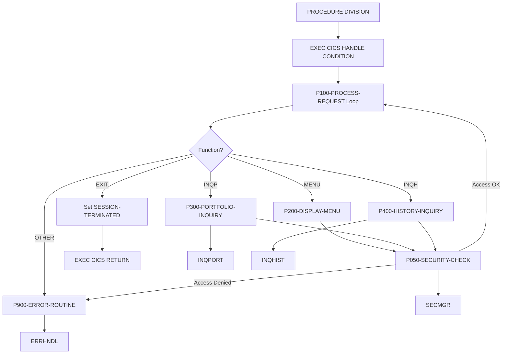
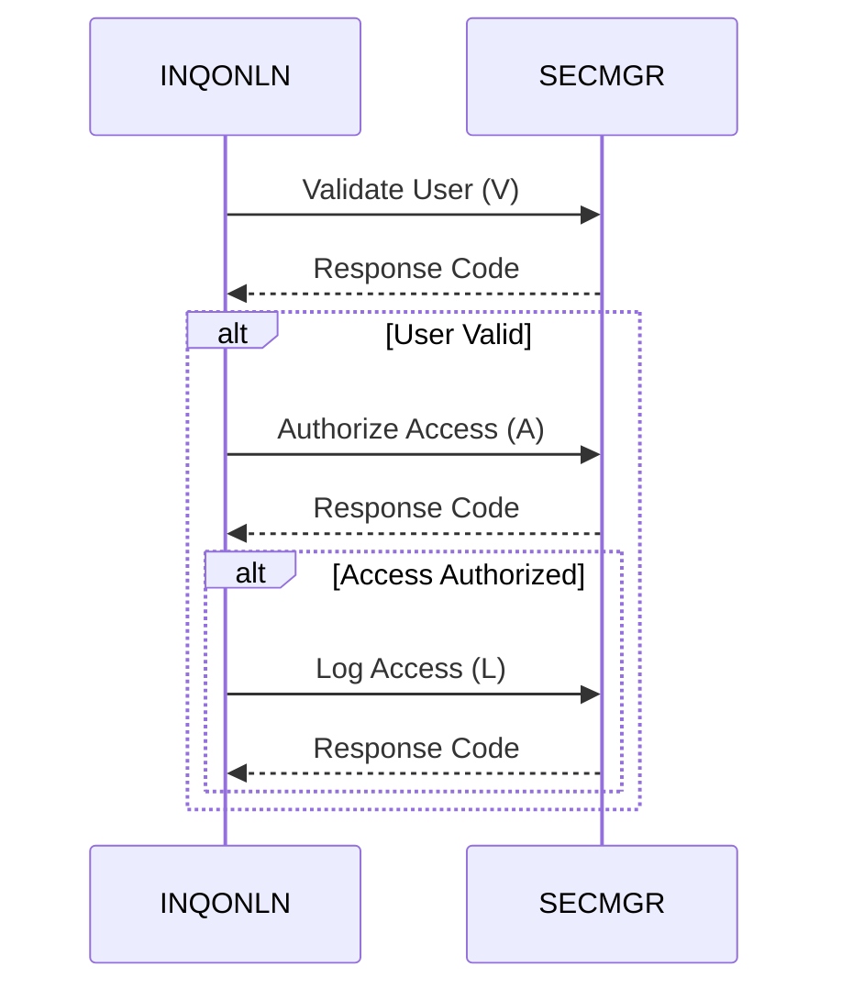

## Overview

INQONLN is a CICS COBOL program that serves as the main handler for portfolio online inquiry transactions. It provides a menu-driven interface for users to perform portfolio lookups and view transaction history through BMS (Basic Mapping Support) screens.

The program implements a conversational transaction model, maintaining session state through a communication area (COMMAREA) and processing user requests in a loop until the user exits. Key features include:

- **Menu-driven navigation** - Displays main menu and routes to appropriate functions
- **Portfolio inquiry** - Delegates to INQPORT for portfolio details
- **History inquiry** - Delegates to INQHIST for transaction history
- **Security integration** - Validates user access through SECMGR before processing
- **Error handling** - Centralized error processing with CICS condition handling

## Program Structure

## Data Structures

### Working Storage

| Level | Name | Picture | Description |
|-------|------|---------|-------------|
| 01 | WS-COMMAREA | - | Communication area (uses INQCOM copybook) |
| 01 | WS-FLAGS | - | Session control flags |
| 05 | WS-END-OF-SESSION | PIC X | Session status flag (default 'N') |
| 05 | WS-RESPONSE-CODE | PIC S9(8) COMP | CICS response code |
| 01 | WS-ERROR-AREA | - | Error handling area (uses ERRHND copybook) |
| 01 | WS-SECURITY-REQUEST | - | Security manager request block |
| 05 | SEC-REQUEST-TYPE | PIC X | Security operation type |
| 05 | SEC-USER-ID | PIC X(8) | User ID for security check |
| 05 | SEC-RESOURCE-NAME | PIC X(8) | Resource being accessed |
| 05 | SEC-ACCESS-TYPE | PIC X(8) | Type of access requested |
| 05 | SEC-RESPONSE-CODE | PIC S9(8) COMP | Security check result |
| 05 | SEC-ERROR-INFO | PIC X(80) | Security error message |

### Session Control Flags (88-levels)

| Condition Name | Value | Description |
|----------------|-------|-------------|
| SESSION-ACTIVE | 'N' | Session is active, continue processing |
| SESSION-TERMINATED | 'Y' | User requested exit |

### Linkage Section

| Level | Name | Description |
|-------|------|-------------|
| 01 | DFHCOMMAREA | CICS communication area (uses INQCOM copybook) |

## CICS Operations

### BMS Map Operations

| Map | Mapset | Operation | Paragraph | Description |
|-----|--------|-----------|-----------|-------------|
| INQMAP | INQSET | RECEIVE | P100 | Receives user input from inquiry screen |
| INQMNU | INQSET | SEND | P200 | Displays the main menu screen |

### Program Links

| Program | Paragraph | Purpose |
|---------|-----------|---------|
| INQPORT | P300 | Portfolio inquiry processing |
| INQHIST | P400 | Transaction history inquiry |
| ERRHNDL | P900 | Error handling and logging |
| SECMGR | P050 | Security validation (called 3 times) |

### CICS Commands Summary

| Command | Purpose |
|---------|---------|
| `HANDLE CONDITION` | Sets up error handling for ERROR, PGMIDERR, NOTFND |
| `RECEIVE MAP` | Receives input from BMS map |
| `SEND MAP` | Sends BMS map to terminal |
| `LINK PROGRAM` | Calls subprograms with COMMAREA |
| `ASSIGN USERID` | Retrieves current user ID |
| `RETURN` | Returns control to CICS |
| `ABEND` | Terminates transaction abnormally |

## Control Flow

### Main Processing Loop

The program operates in a conversational loop:

1. **Condition Handling Setup**: Establishes handlers for ERROR, PGMIDERR, and NOTFND conditions
2. **Request Processing Loop**: Executes P100-PROCESS-REQUEST until SESSION-TERMINATED
3. **Return**: When user exits, returns control to CICS

### P100-PROCESS-REQUEST

Main request dispatcher:

1. Initializes WS-COMMAREA to LOW-VALUES
2. Receives input from INQMAP screen
3. Evaluates WS-COMMAREA-FUNCTION to route request:
   - `'MENU'` → P200-DISPLAY-MENU
   - `'INQP'` → P300-PORTFOLIO-INQUIRY
   - `'INQH'` → P400-HISTORY-INQUIRY
   - `'EXIT'` → Set SESSION-TERMINATED
   - Other → P900-ERROR-ROUTINE
4. Performs security check (P050-SECURITY-CHECK)
5. If security check fails, displays error and returns

### P200-DISPLAY-MENU

Displays the main inquiry menu:
- Sends INQMNU map with ERASE option (clears screen)
- Captures response code for error handling

### P300-PORTFOLIO-INQUIRY

Delegates to portfolio inquiry program:
- Links to INQPORT program
- Passes WS-COMMAREA for data exchange
- Captures response code

### P400-HISTORY-INQUIRY

Delegates to history inquiry program:
- Links to INQHIST program
- Passes WS-COMMAREA for data exchange
- Captures response code

### P050-SECURITY-CHECK

Performs three-phase security validation:

**Phase 1 - User Validation ('V')**
1. Sets request type to 'V' (Validate)
2. Retrieves user ID via CICS ASSIGN
3. Calls SECMGR to validate user

**Phase 2 - Authorization ('A')**
1. If user valid, sets request type to 'A' (Authorize)
2. Sets resource name to 'INQONLN'
3. Sets access type to 'READ'
4. Calls SECMGR to check authorization

**Phase 3 - Logging ('L')**
1. If authorized, sets request type to 'L' (Log)
2. Calls SECMGR to log the access

### P900-ERROR-ROUTINE

Centralized error handling:

1. Populates error area:
   - ERR-PROGRAM = 'INQONLN'
   - ERR-PARAGRAPH = 'P900-ERROR-ROUTINE'
   - ERR-CICS-RESP = EIBRESP (CICS response)
   - ERR-CICS-RESP2 = EIBRESP2 (extended response)
   - Sets ERR-WARNING flag
2. Links to ERRHNDL for processing
3. If ERR-ABEND is set, issues CICS ABEND with code 'IERR'
4. Copies error message for display

## Menu Functions

| Function Code | Description | Target Program |
|---------------|-------------|----------------|
| MENU | Display main menu | (internal) |
| INQP | Portfolio inquiry | INQPORT |
| INQH | History inquiry | INQHIST |
| EXIT | End session | (terminates) |

## Dependencies

### Copybooks

- **INQCOM** - Inquiry communication area layout (defines WS-COMMAREA-FUNCTION and related fields)
- **ERRHND** - Error handling structures (defines ERR-PROGRAM, ERR-PARAGRAPH, ERR-CICS-RESP, ERR-CICS-RESP2, ERR-WARNING, ERR-ABEND, ERR-MESSAGE, WS-ERROR-MESSAGE)

### Called Programs

| Program | Purpose | Called From |
|---------|---------|-------------|
| INQPORT | Portfolio inquiry processing | P300-PORTFOLIO-INQUIRY |
| INQHIST | Transaction history inquiry | P400-HISTORY-INQUIRY |
| ERRHNDL | Error handling and logging | P900-ERROR-ROUTINE |
| SECMGR | Security validation and logging | P050-SECURITY-CHECK |

### BMS Maps

| Mapset | Maps | Description |
|--------|------|-------------|
| INQSET | INQMAP | Main inquiry input screen |
| INQSET | INQMNU | Main menu display screen |

### Related Programs

Programs that share copybooks with INQONLN:

| Program | Shared Copybooks | Relationship |
|---------|------------------|--------------|
| INQHIST | INQCOM | History inquiry - called by this program |
| INQPORT | INQCOM | Portfolio inquiry - called by this program |
| DB2ONLN | ERRHND | DB2 online services |
| DB2RECV | ERRHND | DB2 recovery |
| ERRHNDL | ERRHND | Error handler - called by this program |
| SECMGR | ERRHND | Security manager - called by this program |

## Technical Notes

### Conversational Transaction Model

This program uses a pseudo-conversational pattern within a single transaction:
- Session state maintained in WS-COMMAREA
- Loop continues until user selects EXIT
- COMMAREA passed to subprograms preserves context

For true pseudo-conversational design (releasing CICS resources between interactions), the program would need to use `EXEC CICS RETURN TRANSID(...) COMMAREA(...)`.

### Security Model

The three-phase security check ensures:
1. **Authentication**: User ID is valid in the system
2. **Authorization**: User has READ access to INQONLN resource
3. **Audit**: Access attempt is logged for compliance

### Error Handling Strategy

The program uses CICS HANDLE CONDITION for exception-based error handling:
- ERROR, PGMIDERR, NOTFND conditions routed to P900-ERROR-ROUTINE
- Error details captured from EIB (Exec Interface Block)
- Severity-based response (warning vs. abend)

### Abend Code

| Code | Meaning |
|------|---------|
| IERR | Inquiry error - unrecoverable error in INQONLN |

### CICS Resources Required

- **Transaction**: Transaction ID to invoke this program
- **Program**: INQONLN, INQPORT, INQHIST, ERRHNDL, SECMGR
- **Mapset**: INQSET (contains INQMAP, INQMNU)
- **DB2 Connection**: Required for INQPORT and INQHIST operations
