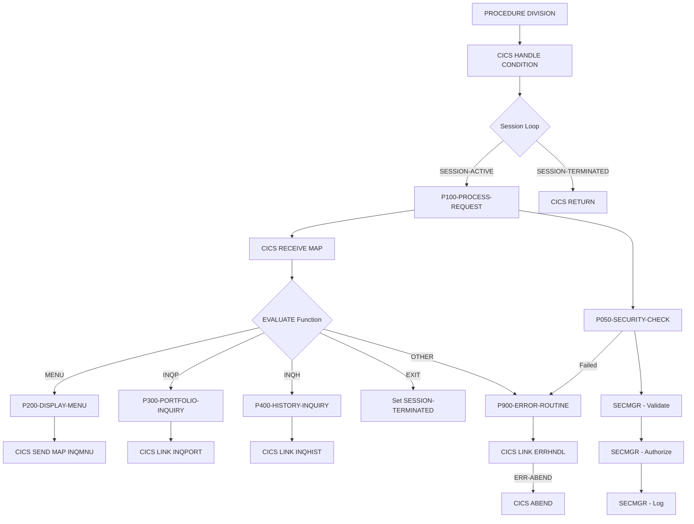

## Overview

INQONLN is a CICS online program that serves as the main handler for portfolio inquiry transactions. It provides a menu-driven interface for users to perform portfolio lookups and view transaction history, while implementing security validation and centralized error handling.

The program acts as a controller that:
- **Manages screen interactions** - Receives and processes BMS map input
- **Routes requests** - Dispatches to appropriate sub-programs based on user selection
- **Enforces security** - Validates user authentication and authorization via SECMGR
- **Handles errors** - Provides consistent error handling through ERRHNDL

Key features include:
- Menu-based navigation (MENU, INQP, INQH, EXIT)
- Portfolio inquiry via INQPORT program
- Transaction history inquiry via INQHIST program
- Three-level security check (Validate, Authorize, Log)
- Pseudo-conversational design with session management

## Program Structure

## Data Structures

### Working Storage

| Level | Name | Picture | Description |
|-------|------|---------|-------------|
| 01 | WS-COMMAREA | | Communication area (INQCOM copybook) |
| 01 | WS-FLAGS | | Session control flags |
| 05 | WS-END-OF-SESSION | X | Session termination flag ('N'/'Y') |
| 05 | WS-RESPONSE-CODE | S9(8) COMP | CICS response code |
| 01 | WS-ERROR-AREA | | Error handling area (ERRHND copybook) |
| 01 | WS-SECURITY-REQUEST | | Security manager request |
| 05 | SEC-REQUEST-TYPE | X | V=Validate, A=Authorize, L=Log |
| 05 | SEC-USER-ID | X(8) | User ID from CICS |
| 05 | SEC-RESOURCE-NAME | X(8) | Resource to check (INQONLN) |
| 05 | SEC-ACCESS-TYPE | X(8) | Access type (READ) |
| 05 | SEC-RESPONSE-CODE | S9(8) COMP | Security check result |
| 05 | SEC-ERROR-INFO | X(80) | Security error message |

### Linkage Section

| Level | Name | Description |
|-------|------|-------------|
| 01 | DFHCOMMAREA | CICS communication area (INQCOM copybook) |

### Inquiry Communication Area (INQCOM Copybook)

| Level | Name | Picture | Description |
|-------|------|---------|-------------|
| 01 | INQCOM-AREA | | Main communication structure |
| 05 | INQCOM-FUNCTION | X(4) | Function code |
| 05 | INQCOM-ACCOUNT-NO | X(10) | Account number for inquiry |
| 05 | INQCOM-RESPONSE-CODE | S9(8) COMP | Response code |
| 05 | INQCOM-ERROR-MSG | X(80) | Error message |

### Function Codes

| Code | 88-Level Name | Description |
|------|---------------|-------------|
| MENU | INQCOM-MENU | Display main menu |
| INQP | INQCOM-PORTFOLIO | Portfolio inquiry |
| INQH | INQCOM-HISTORY | History inquiry |
| EXIT | INQCOM-EXIT | End session |

### Error Handling Area (ERRHND Copybook)

| Level | Name | Picture | Description |
|-------|------|---------|-------------|
| 01 | ERROR-HANDLING | | Error information structure |
| 05 | ERR-PROGRAM | X(8) | Program name |
| 05 | ERR-PARAGRAPH | X(30) | Paragraph where error occurred |
| 05 | ERR-SQLCODE | S9(9) COMP | DB2 SQLCODE (if applicable) |
| 05 | ERR-CICS-RESP | S9(8) COMP | CICS EIBRESP value |
| 05 | ERR-CICS-RESP2 | S9(8) COMP | CICS EIBRESP2 value |
| 05 | ERR-SEVERITY | X | F=Fatal, W=Warning, I=Info |
| 05 | ERR-MESSAGE | X(80) | Error message text |
| 05 | ERR-ACTION | X | R=Return, C=Continue, A=Abend |
| 05 | ERR-TRACE | | Trace information |
| 10 | ERR-TRACE-ID | X(16) | Trace identifier |
| 10 | ERR-TIMESTAMP | X(26) | Error timestamp |

## Control Flow

### Main Processing Loop

The program operates in a pseudo-conversational loop:

1. **HANDLE CONDITION Setup**: Establishes error handling for ERROR, PGMIDERR, and NOTFND conditions, routing all to P900-ERROR-ROUTINE

2. **Session Loop**: Continues processing until `SESSION-TERMINATED` is set to TRUE

3. **CICS RETURN**: Returns control to CICS when session ends

### P100-PROCESS-REQUEST

Main request processing paragraph:

1. Initializes WS-COMMAREA to LOW-VALUES
2. Receives input from BMS map (INQMAP in INQSET mapset)
3. Evaluates function code and dispatches to appropriate handler:
   - `MENU` → P200-DISPLAY-MENU
   - `INQP` → P300-PORTFOLIO-INQUIRY
   - `INQH` → P400-HISTORY-INQUIRY
   - `EXIT` → Sets SESSION-TERMINATED
   - Other → P900-ERROR-ROUTINE
4. Performs security check via P050-SECURITY-CHECK
5. If security fails, displays error and returns to CICS

### P200-DISPLAY-MENU

Displays the main inquiry menu:
- Sends INQMNU map from INQSET mapset
- Uses ERASE option to clear screen
- Captures response code

### P300-PORTFOLIO-INQUIRY

Links to the portfolio inquiry subprogram:
- Calls INQPORT program via EXEC CICS LINK
- Passes WS-COMMAREA as communication area
- Captures response code

### P400-HISTORY-INQUIRY

Links to the history inquiry subprogram:
- Calls INQHIST program via EXEC CICS LINK
- Passes WS-COMMAREA as communication area
- Captures response code

### P050-SECURITY-CHECK

Performs three-level security validation:

1. **Validate (V)**: Verifies user identity
   - Gets user ID via EXEC CICS ASSIGN USERID
   - Calls SECMGR with request type 'V'

2. **Authorize (A)**: Checks resource access permission
   - Sets resource name to 'INQONLN'
   - Sets access type to 'READ'
   - Calls SECMGR with request type 'A'

3. **Log (L)**: Records access for audit trail
   - Calls SECMGR with request type 'L'

If any step fails (SEC-RESPONSE-CODE ≠ 0), subsequent steps are skipped.

### P900-ERROR-ROUTINE

Centralized error handling:

1. Populates error area:
   - Sets ERR-PROGRAM to 'INQONLN'
   - Sets ERR-PARAGRAPH to 'P900-ERROR-ROUTINE'
   - Captures EIBRESP and EIBRESP2 from CICS
   - Sets severity to WARNING

2. Links to ERRHNDL for error processing

3. If ERR-ABEND flag is set, issues CICS ABEND with abcode 'IERR'

4. Copies ERR-MESSAGE to WS-ERROR-MESSAGE for display

## BMS Maps

| Map Name | Mapset | Purpose |
|----------|--------|---------|
| INQMAP | INQSET | Input map for receiving user requests |
| INQMNU | INQSET | Menu display map |

## Dependencies

### Copybooks

- **INQCOM** - Online inquiry communication area structure
- **ERRHND** - Online error handling structure with severity and action codes

### Called Programs

| Program | Purpose | Parameters |
|---------|---------|------------|
| INQPORT | Portfolio inquiry processing | WS-COMMAREA (INQCOM) |
| INQHIST | Transaction history inquiry | WS-COMMAREA (INQCOM) |
| SECMGR | Security manager for validation/authorization | WS-SECURITY-REQUEST |
| ERRHNDL | Error handling and logging | WS-ERROR-AREA (ERRHND) |

### Related Programs

Programs that share copybooks with INQONLN:
- **INQHIST** - History inquiry (uses INQCOM)
- **INQPORT** - Portfolio inquiry (uses INQCOM)
- **DB2ONLN** - DB2 online handler (uses ERRHND)
- **DB2RECV** - DB2 recovery (uses ERRHND)
- **SECMGR** - Security manager (uses ERRHND)

## Technical Notes

### Pseudo-Conversational Design

The program uses a session-based loop with `WS-END-OF-SESSION` controlling continuation. While structured as a loop, in a true CICS pseudo-conversational implementation, the program would typically:
1. Receive input
2. Process request
3. Send response
4. Issue EXEC CICS RETURN TRANSID(...) COMMAREA(...)

The current implementation processes multiple requests within a single task invocation.

### Security Model

The three-phase security check implements defense in depth:

| Phase | Type | Purpose |
|-------|------|---------|
| 1 | Validate (V) | Confirm user identity is valid |
| 2 | Authorize (A) | Verify READ access to INQONLN resource |
| 3 | Log (L) | Record access attempt for audit |

If validation fails, authorization is skipped. If authorization fails, logging may still occur depending on SECMGR implementation.

### Error Handling Strategy

The program uses EXEC CICS HANDLE CONDITION to trap errors at the CICS level, routing all exceptional conditions to P900-ERROR-ROUTINE. The error routine:

- Captures CICS diagnostic information (EIBRESP, EIBRESP2)
- Delegates to ERRHNDL for centralized processing
- Supports three actions: Return, Continue, or Abend
- Uses abend code 'IERR' for fatal errors

### CICS Commands Used

| Command | Purpose |
|---------|---------|
| HANDLE CONDITION | Set up exception handling |
| RECEIVE MAP | Get input from terminal |
| SEND MAP | Display output to terminal |
| LINK | Call subprogram |
| ASSIGN USERID | Get current user ID |
| RETURN | Return to CICS |
| ABEND | Abnormal termination |

### Response Code Handling

The program captures CICS response codes in WS-RESPONSE-CODE using the RESP option on CICS commands. This allows programmatic checking of command success without relying solely on HANDLE CONDITION.
