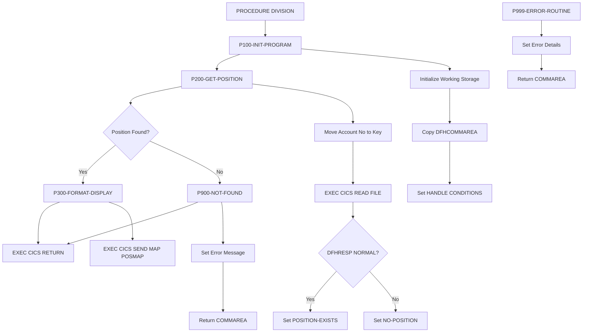
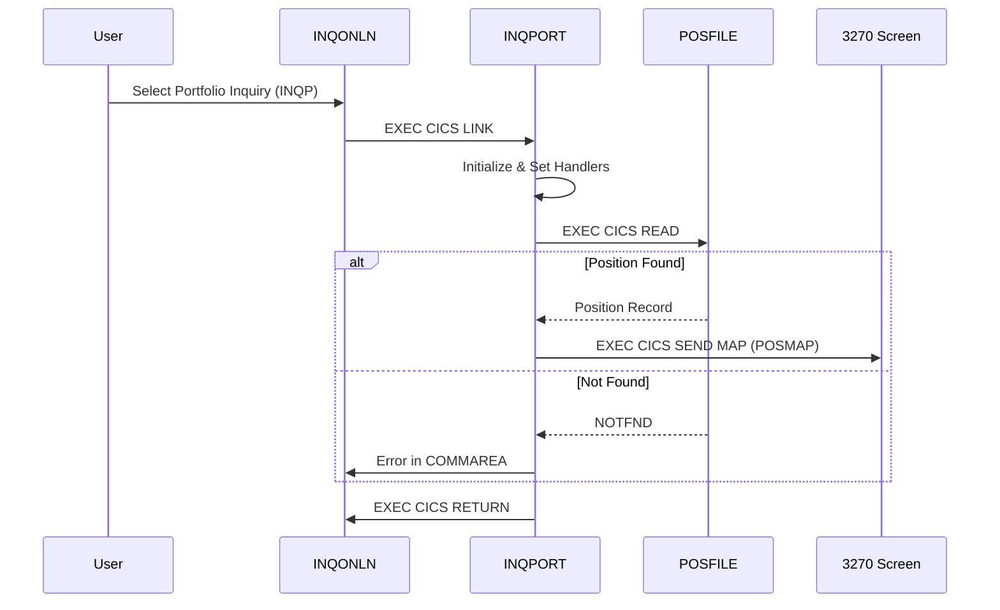

## Overview

INQPORT is a CICS-based COBOL program that handles portfolio position inquiries in the Investment Portfolio Management System. It retrieves current portfolio position data from VSAM files and formats the information for display on 3270 terminals.

Key capabilities include:

- **Position Retrieval**: Reads portfolio position records from VSAM POSFILE
- **Screen Formatting**: Formats position data for display via BMS maps
- **Error Handling**: Provides user-friendly messages for not-found and error conditions
- **CICS Integration**: Uses CICS file control and BMS services

This program is called by INQONLN (the main online inquiry handler) when users select the portfolio position inquiry option from the main menu.

## Program Structure



## Calling Interface

INQPORT is invoked via CICS LINK from INQONLN with a COMMAREA:

```cobol
EXEC CICS LINK PROGRAM('INQPORT')
          COMMAREA(WS-COMMAREA)
          LENGTH(LENGTH OF WS-COMMAREA)
          RESP(WS-RESPONSE-CODE)
END-EXEC
```

### Communication Area (INQCOM)

| Level | Name | Picture | Description |
|-------|------|---------|-------------|
| 01 | INQCOM-AREA | - | Communication area structure |
| 05 | INQCOM-FUNCTION | X(4) | Function code (MENU/INQP/INQH/EXIT) |
| 05 | INQCOM-ACCOUNT-NO | X(10) | Account number for inquiry |
| 05 | INQCOM-RESPONSE-CODE | S9(8) COMP | Response code (output) |
| 05 | INQCOM-ERROR-MSG | X(80) | Error message text (output) |

### Function Codes

| Code | 88-Level Name | Description |
|------|---------------|-------------|
| `MENU` | INQCOM-MENU | Display main menu |
| `INQP` | INQCOM-PORTFOLIO | Portfolio position inquiry |
| `INQH` | INQCOM-HISTORY | Transaction history inquiry |
| `EXIT` | INQCOM-EXIT | Exit the application |

## Data Structures

### Working Storage

#### Communication Area

```cobol
01  WS-COMMAREA.
    COPY INQCOM.
```

Local copy of the communication area for processing.

#### Position Record

```cobol
01  WS-POSITION-RECORD.
    COPY POSREC.
```

Contains the position record structure from POSREC copybook.

#### DB2 Position (Reserved)

```cobol
01  WS-DB2-POSITION.
    EXEC SQL INCLUDE SQLPOS END-EXEC.
```

Reserved for future DB2 integration for position data.

#### Processing Flags

| Level | Name | Picture | Description |
|-------|------|---------|-------------|
| 01 | WS-FLAGS | - | Processing flags |
| 05 | WS-RESPONSE-CODE | S9(8) COMP | CICS response code |
| 05 | WS-POSITION-FOUND | X | Position found flag |
| 88 | POSITION-EXISTS | VALUE 'Y' | Position was found |
| 88 | NO-POSITION | VALUE 'N' | Position not found |

#### Map Field Labels

| Level | Name | Picture | Value | Description |
|-------|------|---------|-------|-------------|
| 05 | WS-ACCOUNT-LABEL | X(10) | 'Account:' | Account field label |
| 05 | WS-FUND-LABEL | X(10) | 'Fund ID:' | Fund ID label |
| 05 | WS-UNITS-LABEL | X(10) | 'Units:' | Units field label |
| 05 | WS-COST-LABEL | X(15) | 'Cost Basis:' | Cost basis label |
| 05 | WS-VALUE-LABEL | X(15) | 'Market Value:' | Market value label |

### Position Record Structure (POSREC)

| Level | Name | Picture | Description |
|-------|------|---------|-------------|
| 01 | POSITION-RECORD | - | Position record structure |
| 05 | POS-KEY | - | Composite record key |
| 10 | POS-PORTFOLIO-ID | X(08) | Portfolio identifier |
| 10 | POS-DATE | X(08) | Position date (YYYYMMDD) |
| 10 | POS-INVESTMENT-ID | X(10) | Investment/fund identifier |
| 05 | POS-DATA | - | Position data fields |
| 10 | POS-QUANTITY | S9(11)V9(4) COMP-3 | Holding quantity (units) |
| 10 | POS-COST-BASIS | S9(13)V9(2) COMP-3 | Total cost basis |
| 10 | POS-MARKET-VALUE | S9(13)V9(2) COMP-3 | Current market value |
| 10 | POS-CURRENCY | X(03) | Currency code |
| 10 | POS-STATUS | X(01) | Status (A/C/P) |
| 05 | POS-AUDIT | - | Audit information |
| 10 | POS-LAST-MAINT-DATE | X(26) | Last maintenance timestamp |
| 10 | POS-LAST-MAINT-USER | X(08) | Last maintenance user ID |

### Position Status Values

| Code | 88-Level | Description |
|------|----------|-------------|
| `A` | POS-STATUS-ACTIVE | Active position |
| `C` | POS-STATUS-CLOSED | Closed position |
| `P` | POS-STATUS-PEND | Pending position |

## Control Flow

### Initialization (P100-INIT-PROGRAM)

1. **Clear Working Storage**: Initializes `WS-POSITION-RECORD` with LOW-VALUES
2. **Copy COMMAREA**: Moves `DFHCOMMAREA` to local `WS-COMMAREA`
3. **Set Error Handlers**: Establishes CICS HANDLE CONDITIONS:
   - `ERROR` → P999-ERROR-ROUTINE
   - `NOTFND` → P900-NOT-FOUND

### Position Retrieval (P200-GET-POSITION)

1. **Set Key**: Moves `WS-COMMAREA-ACCOUNT-NO` to position record key field
2. **Read VSAM**: Issues `EXEC CICS READ FILE('POSFILE')`
3. **Check Response**:
   - `DFHRESP(NORMAL)` → Set `POSITION-EXISTS`
   - Other → Set `NO-POSITION`

### Display Formatting (P300-FORMAT-DISPLAY)

Sends the position map to the terminal:

```cobol
EXEC CICS SEND MAP('POSMAP')
          MAPSET('INQSET')
          FROM(WS-POSITION-RECORD)
          ERASE
          RESP(WS-RESPONSE-CODE)
END-EXEC
```

### Not Found Handler (P900-NOT-FOUND)

1. Sets error message: "Position not found for account"
2. Copies updated COMMAREA back to DFHCOMMAREA

### Error Handler (P999-ERROR-ROUTINE)

1. Sets error message: "Error accessing position data"
2. Captures response code in COMMAREA
3. Returns error information to calling program

## CICS Integration

### CICS Commands Used

| Command | Purpose | Paragraph |
|---------|---------|-----------|
| `HANDLE CONDITION` | Set error handlers | P100-INIT-PROGRAM |
| `READ FILE` | Read VSAM position file | P200-GET-POSITION |
| `SEND MAP` | Display position screen | P300-FORMAT-DISPLAY |
| `RETURN` | Return to CICS | End of program |

### File Resources

| File Name | Type | Access | Description |
|-----------|------|--------|-------------|
| POSFILE | VSAM KSDS | READ | Portfolio position master file |

### BMS Map Resources

| Map | Mapset | Description |
|-----|--------|-------------|
| POSMAP | INQSET | Portfolio position inquiry screen |

### POSMAP Screen Layout

```
Row 1:  Portfolio Position Inquiry
Row 3:  Account: [__________]
Row 5:  Fund ID: [______]  Fund Name: [______________________________]
Row 7:  Units: [_______________]
Row 9:  Cost Basis: [_______________]
Row 11: Market Value: [_______________]
Row 22: PF3=Exit  PF7=Previous  PF8=Next
Row 23: [Error Message Area]
```

### Screen Fields

| Field | Position | Length | Attributes | Description |
|-------|----------|--------|------------|-------------|
| ACCTIN | (3,12) | 10 | Input | Account number input |
| FUNDOUT | (5,12) | 6 | Protected | Fund ID display |
| NAMEOUT | (5,31) | 30 | Protected | Fund name display |
| UNITOUT | (7,12) | 15 | Protected | Units held |
| COSTOUT | (9,17) | 15 | Protected | Cost basis |
| VALOUT | (11,17) | 15 | Protected | Market value |
| POSMSG | (23,1) | 78 | Protected | Error/info message |

## Dependencies

### Copybooks

| Copybook | Location | Purpose |
|----------|----------|---------|
| INQCOM | online | Communication area structure |
| POSREC | common | Position record structure |
| SQLPOS | (SQL include) | DB2 position structure (future) |

### Related Programs

| Program | Relationship | Description |
|---------|--------------|-------------|
| INQONLN | Caller | Main online inquiry handler |
| INQHIST | Sibling | Transaction history inquiry |
| CURSMGR | Support | Cursor manager for DB2 access |

### Programs Sharing Copybooks

**INQCOM copybook:**
- INQHIST - Transaction history inquiry
- INQONLN - Main online inquiry handler

**POSREC copybook:**
- RPTPOS00 - Position report generator
- UTLVAL00 - Data validation utility

## Error Handling

### CICS Condition Handling

The program uses `EXEC CICS HANDLE CONDITION` to route errors:

| Condition | Handler | Description |
|-----------|---------|-------------|
| ERROR | P999-ERROR-ROUTINE | General CICS errors |
| NOTFND | P900-NOT-FOUND | Record not found in POSFILE |

### Error Messages

| Condition | Message |
|-----------|---------|
| Not Found | "Position not found for account" |
| Error | "Error accessing position data" |

### Response Code Handling

The program checks `DFHRESP(NORMAL)` after the READ operation:
- Normal response indicates successful read
- Any other response triggers the not-found logic

## Usage Flow



## Technical Notes

### PERFORM THRU Pattern

This program uses the `PERFORM ... THRU` pattern with explicit EXIT paragraphs:

```cobol
PERFORM P100-INIT-PROGRAM
   THRU P100-EXIT.
```

This mainframe COBOL pattern ensures clean paragraph boundaries.

### COMP-3 Packed Decimal Fields

The position record uses COMP-3 (packed decimal) for numeric fields:
- `POS-QUANTITY`: S9(11)V9(4) - Up to 99,999,999,999.9999 units
- `POS-COST-BASIS`: S9(13)V9(2) - Up to $9,999,999,999,999.99
- `POS-MARKET-VALUE`: S9(13)V9(2) - Up to $9,999,999,999,999.99

Packed decimal is efficient for financial calculations and storage on mainframes.

### VSAM File Access

The program accesses POSFILE using keyed read:
- The account number from COMMAREA is used as the RIDFLD (Record ID Field)
- CICS File Control handles the VSAM I/O

### Future DB2 Integration

The `WS-DB2-POSITION` area with `EXEC SQL INCLUDE SQLPOS` suggests planned DB2 integration for position data, potentially for:
- Historical position queries
- Cross-account aggregation
- Complex reporting queries

### Screen Color Attributes

The BMS map uses color attributes for visual clarity:
- **TURQUOISE**: Data display fields
- **RED**: Error message area
- **BRT (Bright)**: Headers and labels
