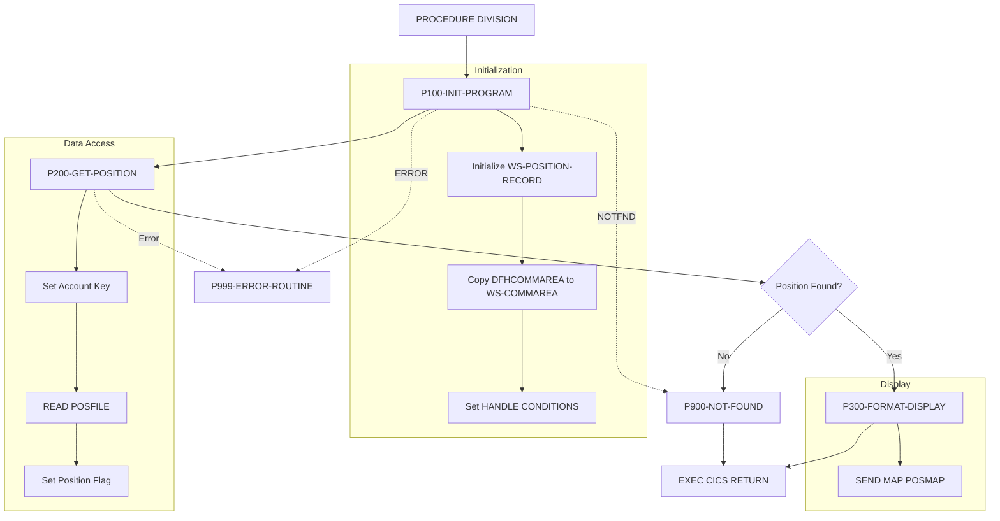
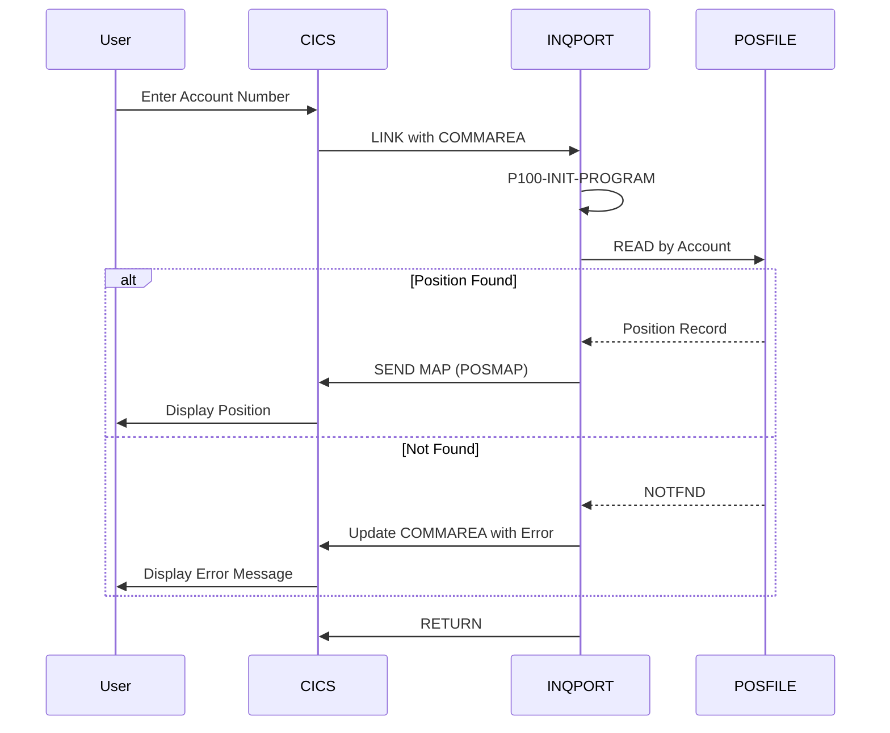

## Overview

INQPORT is a CICS online program that handles portfolio position inquiries. It retrieves position data from a VSAM file and displays it to users via a BMS map. The program is part of the Portfolio Management System's online inquiry subsystem.

**Key Functions:**
- **Position Retrieval**: Reads position records from VSAM file POSFILE using account number as the key
- **Screen Display**: Formats and sends position data to the POSMAP screen
- **Error Handling**: Provides user-friendly messages for not-found and error conditions
- **CICS Integration**: Uses standard CICS commands for file access, screen I/O, and condition handling

The program follows a typical CICS pseudo-conversational pattern, receiving input via COMMAREA and returning control to CICS after processing.

## Program Structure



## Data Structures

### Working Storage

#### Communication Area (WS-COMMAREA)

From INQCOM copybook - used to receive request parameters:

| Level | Name | Picture | Description |
|-------|------|---------|-------------|
| 01 | INQCOM-AREA | Group | Inquiry communication area |
| 05 | INQCOM-FUNCTION | X(4) | Function code |
| 88 | INQCOM-MENU | 'MENU' | Return to menu |
| 88 | INQCOM-PORTFOLIO | 'INQP' | Portfolio inquiry |
| 88 | INQCOM-HISTORY | 'INQH' | History inquiry |
| 88 | INQCOM-EXIT | 'EXIT' | Exit system |
| 05 | INQCOM-ACCOUNT-NO | X(10) | Account number for inquiry |
| 05 | INQCOM-RESPONSE-CODE | S9(8) COMP | Response code returned to caller |
| 05 | INQCOM-ERROR-MSG | X(80) | Error message text |

#### Position Record (WS-POSITION-RECORD)

From POSREC copybook - VSAM record structure:

| Level | Name | Picture | Description |
|-------|------|---------|-------------|
| 01 | POSITION-RECORD | Group | Position record layout |
| 05 | POS-KEY | Group | Composite key |
| 10 | POS-PORTFOLIO-ID | X(8) | Portfolio identifier |
| 10 | POS-DATE | X(8) | Position date (YYYYMMDD) |
| 10 | POS-INVESTMENT-ID | X(10) | Investment/fund identifier |
| 05 | POS-DATA | Group | Position values |
| 10 | POS-QUANTITY | S9(11)V9(4) COMP-3 | Holding quantity (packed decimal) |
| 10 | POS-COST-BASIS | S9(13)V9(2) COMP-3 | Total cost basis |
| 10 | POS-MARKET-VALUE | S9(13)V9(2) COMP-3 | Current market value |
| 10 | POS-CURRENCY | X(3) | Currency code (e.g., USD) |
| 10 | POS-STATUS | X(1) | Position status |
| 88 | POS-STATUS-ACTIVE | 'A' | Active position |
| 88 | POS-STATUS-CLOSED | 'C' | Closed position |
| 88 | POS-STATUS-PEND | 'P' | Pending position |
| 05 | POS-AUDIT | Group | Audit trail |
| 10 | POS-LAST-MAINT-DATE | X(26) | Last maintenance timestamp |
| 10 | POS-LAST-MAINT-USER | X(8) | Last maintenance user ID |
| 05 | POS-FILLER | X(50) | Reserved for future use |

#### DB2 Position Area (WS-DB2-POSITION)

Included via `EXEC SQL INCLUDE SQLPOS` - provides DB2 host variables for position data. This structure supports hybrid VSAM/DB2 access patterns.

#### Processing Flags

| Level | Name | Picture | Value | Description |
|-------|------|---------|-------|-------------|
| 01 | WS-FLAGS | Group | | Processing flags |
| 05 | WS-RESPONSE-CODE | S9(8) COMP | | CICS response code |
| 05 | WS-POSITION-FOUND | X | 'N' | Position found indicator |
| 88 | POSITION-EXISTS | | 'Y' | Position was found |
| 88 | NO-POSITION | | 'N' | Position not found |

#### Map Field Labels

| Level | Name | Picture | Value | Description |
|-------|------|---------|-------|-------------|
| 01 | WS-MAP-FIELDS | Group | | Screen label constants |
| 05 | WS-ACCOUNT-LABEL | X(10) | 'Account:' | Account field label |
| 05 | WS-FUND-LABEL | X(10) | 'Fund ID:' | Fund ID field label |
| 05 | WS-UNITS-LABEL | X(10) | 'Units:' | Units field label |
| 05 | WS-COST-LABEL | X(15) | 'Cost Basis:' | Cost basis field label |
| 05 | WS-VALUE-LABEL | X(15) | 'Market Value:' | Market value field label |

### Linkage Section

#### DFHCOMMAREA

The CICS communication area mirrors the INQCOM structure and is used to pass data between pseudo-conversational transactions.

## File I/O

### VSAM File Access

| File | DD/FCT Name | Operation | Key Field | Description |
|------|-------------|-----------|-----------|-------------|
| Position File | POSFILE | READ | POSITION-ACCOUNT | Retrieves position by account |

The program uses keyed VSAM access:

```cobol
EXEC CICS READ FILE('POSFILE')
          INTO(WS-POSITION-RECORD)
          RIDFLD(POSITION-ACCOUNT OF WS-POSITION-RECORD)
          RESP(WS-RESPONSE-CODE)
END-EXEC
```

## Control Flow

### Initialization (P100-INIT-PROGRAM)

1. Initialize `WS-POSITION-RECORD` with LOW-VALUES to clear any residual data
2. Copy `DFHCOMMAREA` to `WS-COMMAREA` for local processing
3. Set up CICS condition handlers:
   - `ERROR` → routes to P999-ERROR-ROUTINE
   - `NOTFND` → routes to P900-NOT-FOUND

### Position Retrieval (P200-GET-POSITION)

1. Move account number from COMMAREA to position record key field
2. Execute CICS READ against POSFILE
3. Check response code:
   - `DFHRESP(NORMAL)` → Set `POSITION-EXISTS` flag
   - Other → Set `NO-POSITION` flag

### Display Formatting (P300-FORMAT-DISPLAY)

Sends the position data to the screen using BMS:

```cobol
EXEC CICS SEND MAP('POSMAP')
          MAPSET('INQSET')
          FROM(WS-POSITION-RECORD)
          ERASE
          RESP(WS-RESPONSE-CODE)
END-EXEC
```

The POSMAP displays:
- Account number (input field)
- Fund ID and Fund Name
- Units held
- Cost basis
- Current market value
- Navigation instructions (PF3=Exit, PF7/PF8 for paging)

### Not Found Handling (P900-NOT-FOUND)

1. Set error message: "Position not found for account"
2. Copy updated COMMAREA back to DFHCOMMAREA for return to caller

### Error Handling (P999-ERROR-ROUTINE)

1. Set error message: "Error accessing position data"
2. Copy CICS response code to COMMAREA
3. Return updated COMMAREA to caller

## CICS Commands

| Paragraph | Command | Purpose |
|-----------|---------|---------|
| P100-INIT-PROGRAM | `HANDLE CONDITION` | Set up error and not-found handlers |
| P200-GET-POSITION | `READ FILE` | Read position record from VSAM |
| P300-FORMAT-DISPLAY | `SEND MAP` | Display position data on screen |
| Main | `RETURN` | Return control to CICS |

## BMS Maps

The program uses the INQSET mapset containing:

| Map | Purpose | Key Fields |
|-----|---------|------------|
| POSMAP | Portfolio Position Display | ACCTIN (input), FUNDOUT, NAMEOUT, UNITOUT, COSTOUT, VALOUT, POSMSG |

### POSMAP Screen Layout

```
Row 1:  Portfolio Position Inquiry
Row 3:  Account: [__________]
Row 5:  Fund ID: [______]    Fund Name: [______________________________]
Row 7:  Units:   [_______________]
Row 9:  Cost Basis:    [_______________]
Row 11: Market Value:  [_______________]
Row 22: PF3=Exit  PF7=Previous  PF8=Next
Row 23: [Error Message Area - 78 chars, RED]
```

## Dependencies

### Copybooks

| Copybook | Location | Description |
|----------|----------|-------------|
| INQCOM | online/ | Inquiry communication area with function codes and account number |
| POSREC | common/ | Position record layout with key, values, and audit fields |
| SQLPOS | (DB2) | DB2 host variable structure for position data (via EXEC SQL INCLUDE) |

### BMS Mapsets

| Mapset | Maps | Description |
|--------|------|-------------|
| INQSET | POSMAP, MENMAP, HISMAP, ERRMAP | Inquiry system screen definitions |

### Called Programs

*None* - This program handles the inquiry directly and returns to CICS.

### Related Programs

Programs sharing the same copybooks or mapsets:

| Program | Relationship |
|---------|--------------|
| INQHIST | Uses INQCOM copybook - transaction history inquiry |
| INQONLN | Uses INQCOM copybook - main online inquiry controller |
| RPTPOS00 | Uses POSREC copybook - position reporting batch program |
| UTLVAL00 | Uses POSREC copybook - validation utility |

## Return Behavior

The program uses pseudo-conversational design:
- Receives input via DFHCOMMAREA
- Processes the inquiry
- Either displays results via SEND MAP or updates COMMAREA with error info
- Returns to CICS via `EXEC CICS RETURN`

### Response Codes

| Code | Meaning |
|------|---------|
| DFHRESP(NORMAL) | Position successfully retrieved |
| DFHRESP(NOTFND) | No position found for account |
| Other | Error accessing position data |

## Transaction Flow



## Usage Notes

### Packed Decimal Fields

The position record uses COMP-3 (packed decimal) format for numeric fields:
- `POS-QUANTITY`: S9(11)V9(4) - supports up to 11 digits with 4 decimal places
- `POS-COST-BASIS`: S9(13)V9(2) - supports large monetary values
- `POS-MARKET-VALUE`: S9(13)V9(2) - supports large monetary values

When displaying these values, they should be moved to edited PIC fields for proper formatting with commas and decimal points.

### Currency Handling

The `POS-CURRENCY` field (3 characters) stores ISO currency codes (e.g., 'USD', 'EUR'). The display formatting should consider the currency when showing monetary values.
