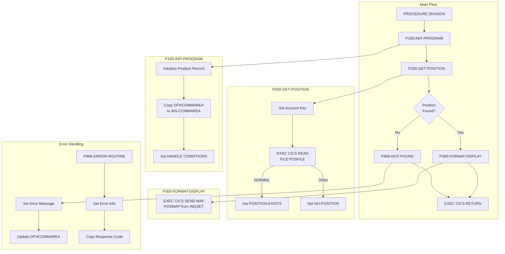

## Overview

INQPORT is a CICS online program that handles portfolio position inquiries for the Investment Portfolio Management System. It retrieves position data from a VSAM file and formats it for display on a 3270 terminal screen using BMS (Basic Mapping Support) maps.

The program is invoked as a sub-program by the main online inquiry handler (INQONLN) when users select the portfolio inquiry option. It provides:
- Account-based position lookup from VSAM POSFILE
- Formatted screen display of position details
- Support for DB2 position data (structure defined but VSAM used for primary access)
- Error handling for not-found and access error conditions

INQPORT is designed for read-only inquiry operations, allowing users to view their current portfolio holdings including units, cost basis, and market value.

## Program Structure



## Data Structures

### Working Storage

#### Communication Area (WS-COMMAREA)

The program uses the INQCOM copybook for inter-program communication:

| Level | Name | Picture | Description |
|-------|------|---------|-------------|
| 01 | INQCOM-AREA | - | Communication area group |
| 05 | INQCOM-FUNCTION | X(4) | Function code from caller |
| 88 | INQCOM-MENU | VALUE 'MENU' | Display main menu |
| 88 | INQCOM-PORTFOLIO | VALUE 'INQP' | Portfolio inquiry |
| 88 | INQCOM-HISTORY | VALUE 'INQH' | History inquiry |
| 88 | INQCOM-EXIT | VALUE 'EXIT' | Exit application |
| 05 | INQCOM-ACCOUNT-NO | X(10) | Account number for inquiry |
| 05 | INQCOM-RESPONSE-CODE | S9(8) COMP | Response code to caller |
| 05 | INQCOM-ERROR-MSG | X(80) | Error message text |

#### Position Record (WS-POSITION-RECORD)

Uses the POSREC copybook for the VSAM file record:

| Level | Name | Picture | Description |
|-------|------|---------|-------------|
| 01 | POSITION-RECORD | - | Position record group |
| 05 | POS-KEY | - | Composite key |
| 10 | POS-PORTFOLIO-ID | X(08) | Portfolio identifier |
| 10 | POS-DATE | X(08) | Position date (YYYYMMDD) |
| 10 | POS-INVESTMENT-ID | X(10) | Investment/security identifier |
| 05 | POS-DATA | - | Position data |
| 10 | POS-QUANTITY | S9(11)V9(4) COMP-3 | Holding quantity |
| 10 | POS-COST-BASIS | S9(13)V9(2) COMP-3 | Total cost basis |
| 10 | POS-MARKET-VALUE | S9(13)V9(2) COMP-3 | Current market value |
| 10 | POS-CURRENCY | X(03) | Currency code |
| 10 | POS-STATUS | X(01) | Status: A=Active, C=Closed, P=Pending |
| 05 | POS-AUDIT | - | Audit information |
| 10 | POS-LAST-MAINT-DATE | X(26) | Last maintenance timestamp |
| 10 | POS-LAST-MAINT-USER | X(08) | Last maintenance user ID |

#### Processing Flags

| Level | Name | Picture | Description |
|-------|------|---------|-------------|
| 01 | WS-FLAGS | - | Program flags group |
| 05 | WS-RESPONSE-CODE | S9(8) COMP | CICS response code |
| 05 | WS-POSITION-FOUND | X | Position found indicator |
| 88 | POSITION-EXISTS | VALUE 'Y' | Position was found |
| 88 | NO-POSITION | VALUE 'N' | Position not found |

#### Map Field Labels

| Level | Name | Picture | Value | Description |
|-------|------|---------|-------|-------------|
| 05 | WS-ACCOUNT-LABEL | X(10) | 'Account:' | Account field label |
| 05 | WS-FUND-LABEL | X(10) | 'Fund ID:' | Fund ID field label |
| 05 | WS-UNITS-LABEL | X(10) | 'Units:' | Units field label |
| 05 | WS-COST-LABEL | X(15) | 'Cost Basis:' | Cost basis field label |
| 05 | WS-VALUE-LABEL | X(15) | 'Market Value:' | Market value field label |

### Linkage Section

| Level | Name | Description |
|-------|------|-------------|
| 01 | DFHCOMMAREA | CICS communication area (uses INQCOM copybook) |

## File I/O

### VSAM File Access

| File | DD Name | Type | Access | Description |
|------|---------|------|--------|-------------|
| POSFILE | POSFILE | VSAM KSDS | READ | Portfolio position master file |

### File Operations

| Paragraph | Operation | Description |
|-----------|-----------|-------------|
| P200-GET-POSITION | READ | Read position by account key |

```cobol
EXEC CICS READ FILE('POSFILE')
          INTO(WS-POSITION-RECORD)
          RIDFLD(POSITION-ACCOUNT OF WS-POSITION-RECORD)
          RESP(WS-RESPONSE-CODE)
END-EXEC
```

## Control Flow

### Initialization (P100-INIT-PROGRAM)

1. Initialize position record to LOW-VALUES
2. Copy DFHCOMMAREA to working storage
3. Set up CICS condition handlers:
   - ERROR → P999-ERROR-ROUTINE
   - NOTFND → P900-NOT-FOUND

```cobol
MOVE LOW-VALUES TO WS-POSITION-RECORD
MOVE DFHCOMMAREA TO WS-COMMAREA

EXEC CICS HANDLE CONDITION
          ERROR(P999-ERROR-ROUTINE)
          NOTFND(P900-NOT-FOUND)
END-EXEC
```

### Position Retrieval (P200-GET-POSITION)

1. Move account number from COMMAREA to position record key
2. Execute CICS READ against POSFILE
3. Set position-found flag based on response:
   - DFHRESP(NORMAL) → POSITION-EXISTS
   - Other → NO-POSITION

### Display Formatting (P300-FORMAT-DISPLAY)

Sends the position data to the terminal using the POSMAP map:

```cobol
EXEC CICS SEND MAP('POSMAP')
          MAPSET('INQSET')
          FROM(WS-POSITION-RECORD)
          ERASE
          RESP(WS-RESPONSE-CODE)
END-EXEC
```

### Error Handling (P900-NOT-FOUND, P999-ERROR-ROUTINE)

**Not Found (P900):**
- Sets error message: "Position not found for account"
- Updates DFHCOMMAREA with error information

**General Error (P999):**
- Sets error message: "Error accessing position data"
- Copies CICS response code to COMMAREA

## Screen Layout

### POSMAP - Portfolio Position Display

The position inquiry uses the POSMAP map from the INQSET mapset:

```
+------------------------------------------------------------------------------+
| Portfolio Position Inquiry                                                    |
|                                                                              |
| Account:   [__________]                                                      |
|                                                                              |
| Fund ID:   XXXXXX     Fund Name: XXXXXXXXXXXXXXXXXXXXXXXXXXXXXX              |
|                                                                              |
| Units:     999,999,999.9999                                                  |
|                                                                              |
| Cost Basis:    $999,999,999.99                                               |
|                                                                              |
| Market Value:  $999,999,999.99                                               |
|                                                                              |
|                                                                              |
|                                                                              |
|                                                                              |
|                                                                              |
|                                                                              |
|                                                                              |
|                                                                              |
|                                                                              |
|                                                                              |
| PF3=Exit  PF7=Previous  PF8=Next                                             |
| [Error message area - 78 characters]                                         |
+------------------------------------------------------------------------------+
```

### Map Fields

| Field | Position | Length | Attributes | Description |
|-------|----------|--------|------------|-------------|
| ACCTIN | (3,12) | 10 | UNPROT,IC | Account number input |
| FUNDOUT | (5,12) | 6 | PROT,TURQUOISE | Fund ID display |
| NAMEOUT | (5,31) | 30 | PROT,TURQUOISE | Fund name display |
| UNITOUT | (7,12) | 15 | PROT,TURQUOISE | Units display |
| COSTOUT | (9,17) | 15 | PROT,TURQUOISE | Cost basis display |
| VALOUT | (11,17) | 15 | PROT,TURQUOISE | Market value display |
| POSMSG | (23,1) | 78 | PROT,BRT,RED | Error message area |

## Dependencies

### Copybooks

| Copybook | Location | Description |
|----------|----------|-------------|
| INQCOM | online/ | Online inquiry communication area |
| POSREC | common/ | Position record structure |

### CICS Resources

| Resource | Type | Description |
|----------|------|-------------|
| POSFILE | FILE | VSAM position master file |
| POSMAP | MAP | Position display map |
| INQSET | MAPSET | Inquiry screen mapset |

### CICS Commands Used

| Command | Purpose |
|---------|---------|
| HANDLE CONDITION | Set up error handlers |
| READ FILE | Read VSAM record by key |
| SEND MAP | Display formatted screen |
| RETURN | Return to calling program |

### Related Programs

| Program | Relationship | Description |
|---------|--------------|-------------|
| INQONLN | Caller | Main online inquiry handler - invokes INQPORT |
| INQHIST | Sibling | Transaction history inquiry - shares INQCOM |
| RPTPOS00 | Related | Position report generator - shares POSREC copybook |
| UTLVAL00 | Related | Validation utility - shares POSREC copybook |
| DB2ONLN | Support | DB2 connection manager (for DB2 position access) |
| CURSMGR | Support | Cursor manager (for DB2 queries) |

## COBOL/CICS Concepts

### EXEC CICS HANDLE CONDITION

Sets up automatic paragraph transfers when specific conditions occur:

```cobol
EXEC CICS HANDLE CONDITION
          ERROR(P999-ERROR-ROUTINE)
          NOTFND(P900-NOT-FOUND)
END-EXEC
```

When an ERROR or NOTFND condition occurs, control transfers directly to the named paragraph.

### DFHRESP Function

The `DFHRESP` function converts response names to numeric values for comparison:

```cobol
IF WS-RESPONSE-CODE = DFHRESP(NORMAL)
```

Common DFHRESP values:
- `DFHRESP(NORMAL)` = 0 - Successful completion
- `DFHRESP(NOTFND)` = 13 - Record not found
- `DFHRESP(ERROR)` = Various - General error

### COMP-3 (Packed Decimal)

The position record uses COMP-3 fields for numeric data:
- `POS-QUANTITY`: S9(11)V9(4) COMP-3 - 8 bytes, 4 decimal places
- `POS-COST-BASIS`: S9(13)V9(2) COMP-3 - 8 bytes, 2 decimal places
- `POS-MARKET-VALUE`: S9(13)V9(2) COMP-3 - 8 bytes, 2 decimal places

COMP-3 stores two digits per byte plus a sign nibble, efficient for financial calculations.

### BMS Map Communication

The `SEND MAP` command uses the FROM option to populate map fields from a data area:

```cobol
EXEC CICS SEND MAP('POSMAP')
          MAPSET('INQSET')
          FROM(WS-POSITION-RECORD)
          ERASE
END-EXEC
```

The ERASE option clears the screen before displaying the new map.

## Return Codes

The program communicates status via `INQCOM-RESPONSE-CODE`:

| Code | Meaning | Condition |
|------|---------|-----------|
| 0 | Success | Position retrieved and displayed |
| DFHRESP value | CICS Error | Error accessing position data |

## Error Messages

| Message | Condition |
|---------|-----------|
| "Position not found for account" | Account not found in POSFILE |
| "Error accessing position data" | General CICS/file error |

## Issues

:::note Implementation Notes
- The program defines `WS-DB2-POSITION` with `EXEC SQL INCLUDE SQLPOS` but does not currently use DB2 access. The DB2 structure is available for future enhancement to support position queries from the POSHIST DB2 table.
- The `WS-MAP-FIELDS` labels are defined but not explicitly used in the SEND MAP operation, as BMS map definitions include field labels.
- The program uses `POSITION-ACCOUNT` as the RIDFLD, but the POSREC copybook shows `POS-KEY` as a composite key. Ensure the file definition uses the correct key structure.
:::
