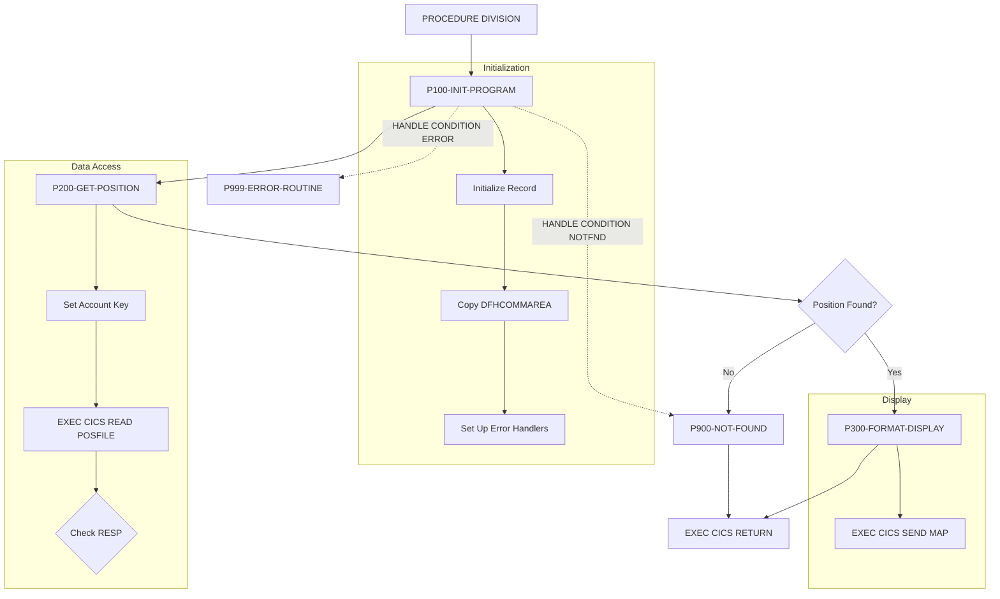

## Overview

INQPORT is a CICS COBOL program that provides online portfolio position inquiry functionality. It serves as part of the Portfolio Management System's online inquiry subsystem, allowing users to retrieve and view current position data for a specified account.

The program performs the following functions:
- **Position Retrieval** - Reads position data from VSAM file (POSFILE) using account number as the key
- **Data Formatting** - Formats position data for screen display using BMS maps
- **Error Handling** - Manages not-found conditions and data access errors with user-friendly messages

INQPORT is designed to be invoked from other CICS programs (typically the main menu handler) via CICS LINK or XCTL, receiving the account number through the COMMAREA.

## Program Structure



## Data Structures

### Working-Storage Section

#### Communication Area (WS-COMMAREA)

Copied from INQCOM copybook:

| Level | Name | Picture | Description |
|-------|------|---------|-------------|
| 01 | INQCOM-AREA | - | Communication area structure |
| 05 | INQCOM-FUNCTION | X(4) | Function code |
| 88 | INQCOM-MENU | VALUE 'MENU' | Return to menu |
| 88 | INQCOM-PORTFOLIO | VALUE 'INQP' | Portfolio inquiry |
| 88 | INQCOM-HISTORY | VALUE 'INQH' | History inquiry |
| 88 | INQCOM-EXIT | VALUE 'EXIT' | Exit application |
| 05 | INQCOM-ACCOUNT-NO | X(10) | Account number for inquiry |
| 05 | INQCOM-RESPONSE-CODE | S9(8) COMP | Response code from operation |
| 05 | INQCOM-ERROR-MSG | X(80) | Error message text |

#### Position Record (WS-POSITION-RECORD)

Copied from POSREC copybook:

| Level | Name | Picture | Description |
|-------|------|---------|-------------|
| 01 | POSITION-RECORD | - | Position record structure |
| 05 | POS-KEY | - | Composite key group |
| 10 | POS-PORTFOLIO-ID | X(8) | Portfolio identifier |
| 10 | POS-DATE | X(8) | Position date (YYYYMMDD) |
| 10 | POS-INVESTMENT-ID | X(10) | Investment identifier |
| 05 | POS-DATA | - | Position data group |
| 10 | POS-QUANTITY | S9(11)V9(4) COMP-3 | Holding quantity (packed decimal) |
| 10 | POS-COST-BASIS | S9(13)V9(2) COMP-3 | Total cost basis |
| 10 | POS-MARKET-VALUE | S9(13)V9(2) COMP-3 | Current market value |
| 10 | POS-CURRENCY | X(3) | Currency code (e.g., USD) |
| 10 | POS-STATUS | X(1) | Position status |
| 88 | POS-STATUS-ACTIVE | VALUE 'A' | Active position |
| 88 | POS-STATUS-CLOSED | VALUE 'C' | Closed position |
| 88 | POS-STATUS-PEND | VALUE 'P' | Pending position |
| 05 | POS-AUDIT | - | Audit information |
| 10 | POS-LAST-MAINT-DATE | X(26) | Last maintenance timestamp |
| 10 | POS-LAST-MAINT-USER | X(8) | Last maintenance user ID |

#### DB2 Position Area (WS-DB2-POSITION)

Included via `EXEC SQL INCLUDE SQLPOS`. This provides an alternate DB2-based position structure (though current implementation uses VSAM).

#### Processing Flags (WS-FLAGS)

| Level | Name | Picture | Description |
|-------|------|---------|-------------|
| 01 | WS-FLAGS | - | Processing flags |
| 05 | WS-RESPONSE-CODE | S9(8) COMP | CICS response code |
| 05 | WS-POSITION-FOUND | X | Position found indicator |
| 88 | POSITION-EXISTS | VALUE 'Y' | Position was found |
| 88 | NO-POSITION | VALUE 'N' | Position not found |

#### Map Field Labels (WS-MAP-FIELDS)

| Level | Name | Picture | Value | Description |
|-------|------|---------|-------|-------------|
| 01 | WS-MAP-FIELDS | - | - | Screen labels |
| 05 | WS-ACCOUNT-LABEL | X(10) | 'Account:' | Account field label |
| 05 | WS-FUND-LABEL | X(10) | 'Fund ID:' | Fund ID field label |
| 05 | WS-UNITS-LABEL | X(10) | 'Units:' | Units field label |
| 05 | WS-COST-LABEL | X(15) | 'Cost Basis:' | Cost basis label |
| 05 | WS-VALUE-LABEL | X(15) | 'Market Value:' | Market value label |

### Linkage Section

#### DFHCOMMAREA

Contains the same INQCOM structure used to receive input parameters and return results to the calling program.

## File I/O

### VSAM File Access

| File | DD Name | Operation | Description |
|------|---------|-----------|-------------|
| POSFILE | POSFILE | READ | Read position record by account key |

The program performs a keyed read on POSFILE using the account number from the COMMAREA as the record identifier (RIDFLD).

## Control Flow

### Initialization (P100-INIT-PROGRAM)

1. **Clear Working Storage**
   - Initialize WS-POSITION-RECORD to LOW-VALUES

2. **Copy Input Parameters**
   - Move DFHCOMMAREA to WS-COMMAREA to access input account number

3. **Set Up Condition Handlers**
   ```cobol
   EXEC CICS HANDLE CONDITION
             ERROR(P999-ERROR-ROUTINE)
             NOTFND(P900-NOT-FOUND)
   END-EXEC
   ```
   This establishes automatic routing for error conditions.

### Position Retrieval (P200-GET-POSITION)

1. **Set Key Value**
   - Copy account number from COMMAREA to position record key field

2. **Read VSAM File**
   ```cobol
   EXEC CICS READ FILE('POSFILE')
             INTO(WS-POSITION-RECORD)
             RIDFLD(POSITION-ACCOUNT OF WS-POSITION-RECORD)
             RESP(WS-RESPONSE-CODE)
   END-EXEC
   ```

3. **Evaluate Response**
   - If DFHRESP(NORMAL): Set POSITION-EXISTS flag
   - Otherwise: Set NO-POSITION flag

### Display Formatting (P300-FORMAT-DISPLAY)

Sends the position data to the terminal using BMS:

```cobol
EXEC CICS SEND MAP('POSMAP')
          MAPSET('INQSET')
          FROM(WS-POSITION-RECORD)
          ERASE
          RESP(WS-RESPONSE-CODE)
END-EXEC
```

The POSMAP map displays:
- Account identifier
- Fund ID and name
- Unit quantity
- Cost basis
- Current market value
- Navigation keys (PF3=Exit, PF7=Previous, PF8=Next)

### Not Found Handler (P900-NOT-FOUND)

1. Sets error message: "Position not found for account"
2. Copies updated COMMAREA back to DFHCOMMAREA for return to caller

### Error Handler (P999-ERROR-ROUTINE)

1. Sets error message: "Error accessing position data"
2. Copies CICS response code to COMMAREA
3. Returns updated COMMAREA to caller

## Dependencies

### Copybooks

| Copybook | Location | Description |
|----------|----------|-------------|
| INQCOM | WS-COMMAREA, DFHCOMMAREA | Online inquiry communication area with function codes and account number |
| POSREC | WS-POSITION-RECORD | Position record structure with key, data, and audit fields |
| SQLPOS | WS-DB2-POSITION (SQL INCLUDE) | DB2 position table DCLGEN |

### Called Programs

This program does not call any external programs. It uses CICS commands for all operations.

### Related Programs

Programs sharing the INQCOM copybook:
- **INQHIST** - Transaction History Inquiry
- **INQONLN** - Online Inquiry Main Menu

Programs sharing the POSREC copybook:
- **RPTPOS00** - Position Report Generator (batch)
- **UTLVAL00** - Validation Utility

## CICS Commands

| Command | Paragraph | Purpose |
|---------|-----------|---------|
| `HANDLE CONDITION` | P100-INIT-PROGRAM | Set up error and not-found handlers |
| `READ FILE` | P200-GET-POSITION | Read position from VSAM POSFILE |
| `SEND MAP` | P300-FORMAT-DISPLAY | Display position data on terminal |
| `RETURN` | Main procedure | Return control to CICS |

## BMS Map Details

The program uses the POSMAP map from the INQSET mapset:

### Screen Layout (POSMAP)

```
Row 1:  Portfolio Position Inquiry (Title)
Row 3:  Account: [__________]
Row 5:  Fund ID: [______]    Fund Name: [______________________________]
Row 7:  Units: [_______________]
Row 9:  Cost Basis: [_______________]
Row 11: Market Value: [_______________]
Row 22: PF3=Exit  PF7=Previous  PF8=Next
Row 23: [Error Message Area - Red]
```

### Map Fields

| Field | Position | Length | Attributes | Description |
|-------|----------|--------|------------|-------------|
| ACCTIN | (3,12) | 10 | UNPROT, IC | Account input field |
| FUNDOUT | (5,12) | 6 | PROT, TURQUOISE | Fund ID display |
| NAMEOUT | (5,31) | 30 | PROT, TURQUOISE | Fund name display |
| UNITOUT | (7,12) | 15 | PROT, TURQUOISE | Units display |
| COSTOUT | (9,17) | 15 | PROT, TURQUOISE | Cost basis display |
| VALOUT | (11,17) | 15 | PROT, TURQUOISE | Market value display |
| POSMSG | (23,1) | 78 | PROT, BRT, RED | Error/status message |

## Response Codes

| Code | Constant | Meaning |
|------|----------|---------|
| 0 | DFHRESP(NORMAL) | Successful operation |
| 13 | DFHRESP(NOTFND) | Record not found in POSFILE |
| Other | Various | CICS error conditions |

## Usage Example

Calling programs invoke INQPORT via CICS LINK:

```cobol
WORKING-STORAGE SECTION.
01  WS-COMMAREA.
    COPY INQCOM.

PROCEDURE DIVISION.
    * Set up inquiry request
    MOVE 'INQP' TO INQCOM-FUNCTION
    MOVE '1234567890' TO INQCOM-ACCOUNT-NO
    
    * Call position inquiry
    EXEC CICS LINK
         PROGRAM('INQPORT')
         COMMAREA(WS-COMMAREA)
         LENGTH(LENGTH OF WS-COMMAREA)
    END-EXEC
    
    * Check result
    IF INQCOM-RESPONSE-CODE NOT = 0
        DISPLAY 'Error: ' INQCOM-ERROR-MSG
    END-IF
```

## Technical Notes

### HANDLE CONDITION vs RESP
The program uses both `HANDLE CONDITION` (for global error routing) and `RESP` option (for explicit response checking). The RESP option takes precedence when specified, allowing paragraph-level control of response handling while maintaining global handlers for unexpected conditions.

### COMP-3 (Packed Decimal) Fields
The position record uses COMP-3 (packed decimal) for numeric fields like POS-QUANTITY, POS-COST-BASIS, and POS-MARKET-VALUE. This is efficient for storage and arithmetic operations on IBM mainframes:
- `S9(11)V9(4) COMP-3` stores up to 11 integer digits and 4 decimal places in 8 bytes
- `S9(13)V9(2) COMP-3` stores up to 13 integer digits and 2 decimal places in 8 bytes

### LOW-VALUES Initialization
The program initializes WS-POSITION-RECORD to LOW-VALUES (binary zeros) before reading. This ensures any unfilled portions of the record are cleared, preventing display of garbage data if the read fails.

### ERASE Option
The `SEND MAP` command uses the ERASE option, which clears the screen before displaying the map. This provides a clean display and prevents residual data from previous screens.

## CICS Resource Definitions

```
DEFINE PROGRAM(INQPORT)
       GROUP(INQGRP)
       LANGUAGE(COBOL)

DEFINE FILE(POSFILE)
       GROUP(INQGRP)
       DSNAME(your.position.vsam.file)
       RECORDFORMAT(F)
       ADD(NO) BROWSE(YES) DELETE(NO) READ(YES) UPDATE(NO)

DEFINE MAPSET(INQSET)
       GROUP(INQGRP)
```

## Error Messages

| Message | Condition | Action |
|---------|-----------|--------|
| "Position not found for account" | NOTFND condition or RESP ≠ NORMAL | Returned in INQCOM-ERROR-MSG |
| "Error accessing position data" | ERROR condition | Returned with response code |
