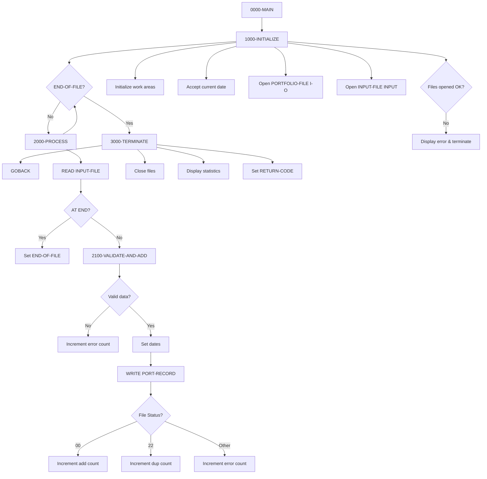
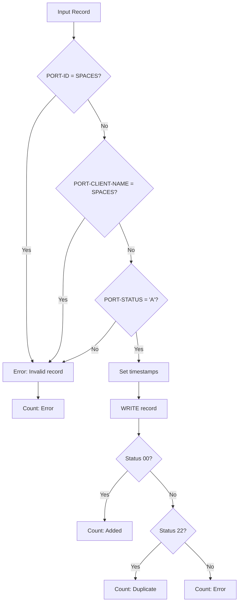

## Overview

PORTADD is a batch Portfolio Addition Program that creates new portfolio records from a sequential input file and writes them to the portfolio master file. It is part of the portfolio management system that handles client investment portfolios.

The program reads portfolio records from a sequential input file, validates required fields, sets creation and maintenance timestamps, and writes the records to a VSAM indexed file. It tracks statistics for successful additions, duplicate records, and validation errors, providing a summary report at the end of processing.

PORTADD implements a typical batch load pattern with initialization, main processing loop, and termination phases. The program handles duplicate key errors gracefully by counting them separately rather than treating them as fatal errors, which is useful for re-runnable batch processes.

## Program Structure



## Data Structures

### Portfolio Record (from PORTFLIO copybook)

| Level | Name | Picture | Description |
|-------|------|---------|-------------|
| 01 | PORT-RECORD | | Portfolio master record |
| 05 | PORT-KEY | | Composite record key |
| 10 | PORT-ID | X(8) | Portfolio identifier |
| 10 | PORT-ACCOUNT-NO | X(10) | Account number |
| 05 | PORT-CLIENT-INFO | | Client information group |
| 10 | PORT-CLIENT-NAME | X(30) | Client name |
| 10 | PORT-CLIENT-TYPE | X(1) | Client type: `I`=Individual, `C`=Corporate, `T`=Trust |
| 05 | PORT-PORTFOLIO-INFO | | Portfolio status information |
| 10 | PORT-CREATE-DATE | 9(8) | Creation date (YYYYMMDD) |
| 10 | PORT-LAST-MAINT | 9(8) | Last maintenance date (YYYYMMDD) |
| 10 | PORT-STATUS | X(1) | Status: `A`=Active, `C`=Closed, `S`=Suspended |
| 05 | PORT-FINANCIAL-INFO | | Financial data group |
| 10 | PORT-TOTAL-VALUE | S9(13)V99 COMP-3 | Total portfolio value |
| 10 | PORT-CASH-BALANCE | S9(13)V99 COMP-3 | Cash balance |
| 05 | PORT-AUDIT-INFO | | Audit trail information |
| 10 | PORT-LAST-USER | X(8) | Last user who modified |
| 10 | PORT-LAST-TRANS | 9(8) | Last transaction date |
| 05 | PORT-FILLER | X(50) | Reserved for future use |

### Working Storage - Constants

| Level | Name | Picture | Value | Description |
|-------|------|---------|-------|-------------|
| 05 | WS-PROGRAM-NAME | X(8) | 'PORTADD' | Program identifier |
| 05 | WS-SUCCESS | S9(4) | +0 | Success return code |
| 05 | WS-ERROR | S9(4) | +8 | Error return code |

### Working Storage - File Status

| Level | Name | Picture | Description |
|-------|------|---------|-------------|
| 05 | WS-FILE-STATUS | X(2) | Portfolio file status |
| 05 | WS-INPUT-STATUS | X(2) | Input file status |
| 05 | WS-END-OF-FILE-SW | X | EOF switch (`Y`/`N`) |

### File Status Values

| Status | Condition Name | Description |
|--------|----------------|-------------|
| `00` | WS-SUCCESS-STATUS | Successful operation |
| `22` | WS-DUP-STATUS | Duplicate key on write |
| `10` | WS-EOF-STATUS / WS-INPUT-EOF | End of file |

### Working Storage - Counters

| Level | Name | Picture | Description |
|-------|------|---------|-------------|
| 05 | WS-ADD-COUNT | 9(7) | Records successfully added |
| 05 | WS-ERROR-COUNT | 9(7) | Records with validation errors |
| 05 | WS-DUP-COUNT | 9(7) | Duplicate records skipped |
| 05 | WS-RETURN-CODE | S9(4) | Program return code |
| 05 | WS-CURRENT-DATE | 9(8) | Current date (YYYYMMDD) |

## File I/O

### PORTFOLIO-FILE

| Attribute | Value |
|-----------|-------|
| DD Name | PORTFILE |
| Organization | Indexed (VSAM KSDS) |
| Access Mode | Random |
| Record Key | PORT-KEY (PORT-ID + PORT-ACCOUNT-NO) |
| Open Mode | I-O |
| Record Layout | PORTFLIO copybook |

Operations:
- **WRITE** - Insert new portfolio records

### INPUT-FILE

| Attribute | Value |
|-----------|-------|
| DD Name | INPTFILE |
| Organization | Sequential |
| Open Mode | INPUT |
| Record Layout | PORTFLIO copybook |

Operations:
- **READ** - Read portfolio records to be added

## Control Flow

### 1000-INITIALIZE

1. Initializes WS-WORK-AREAS (counters to zero)
2. Accepts current date in YYYYMMDD format using `ACCEPT FROM DATE YYYYMMDD`
3. Opens PORTFOLIO-FILE for I-O (read/write)
4. Opens INPUT-FILE for INPUT (read-only)
5. If either file fails to open:
   - Displays error message with both file statuses
   - Sets return code to 8 (error)
   - Performs 3000-TERMINATE to exit

### 2000-PROCESS

Main processing loop executed until END-OF-FILE:

1. Reads next record from INPUT-FILE into PORT-RECORD
2. On AT END condition: Sets END-OF-FILE switch to 'Y'
3. On NOT AT END: Performs 2100-VALIDATE-AND-ADD

### 2100-VALIDATE-AND-ADD

Validates and writes each input record:

**Validation Rules:**
1. PORT-ID must not be spaces
2. PORT-CLIENT-NAME must not be spaces
3. PORT-STATUS must equal 'A' (Active)

If validation fails:
- Increments WS-ERROR-COUNT
- Displays error message with PORT-ID
- Exits paragraph (skips write)

If validation passes:
1. Sets PORT-CREATE-DATE to current date
2. Sets PORT-LAST-MAINT to current date
3. Writes PORT-RECORD to PORTFOLIO-FILE
4. Evaluates file status:

| Status | Action |
|--------|--------|
| `00` (Success) | Increments WS-ADD-COUNT |
| `22` (Duplicate) | Increments WS-DUP-COUNT, displays message |
| Other | Increments WS-ERROR-COUNT, displays message |

### 3000-TERMINATE

1. Closes both files
2. Displays processing statistics:
   ```
   Records added:    nnnnnnn
   Duplicate records:nnnnnnn
   Errors occurred:  nnnnnnn
   ```
3. Sets RETURN-CODE from WS-RETURN-CODE

## Validation Flow



## Dependencies

### Copybooks

- **PORTFLIO** - Portfolio master record layout defining the complete record structure including key, client info, financial data, and audit fields

### Related Programs

Programs that share the PORTFLIO copybook:

| Program | Description |
|---------|-------------|
| PORTDEL | Portfolio deletion |
| PORTREAD | Portfolio inquiry/read |
| PORTUPDT | Portfolio update |
| PORTTEST | Portfolio testing utility |
| TSTGEN00 | Test data generation |

## JCL Example

```jcl
//PORTADD  EXEC PGM=PORTADD
//STEPLIB  DD   DSN=your.loadlib,DISP=SHR
//PORTFILE DD   DSN=your.portfolio.master,DISP=SHR
//INPTFILE DD   DSN=your.portfolio.input,DISP=SHR
//SYSOUT   DD   SYSOUT=*
```

## Input File Requirements

The input file must contain records in PORTFLIO copybook format with the following minimum requirements:

| Field | Requirement |
|-------|-------------|
| PORT-ID | Must not be spaces |
| PORT-ACCOUNT-NO | Part of key - should be unique with PORT-ID |
| PORT-CLIENT-NAME | Must not be spaces |
| PORT-STATUS | Must be 'A' (Active) |

**Note:** PORT-CREATE-DATE and PORT-LAST-MAINT are overwritten by the program with the current date, so input values in these fields are ignored.

## Return Codes

| Code | Description |
|------|-------------|
| 0 | Successful completion (may include duplicates) |
| 8 | Error during processing (file open failure) |

## Processing Statistics

The program produces a summary report at termination:

```
Records added:    0000100
Duplicate records:0000005
Errors occurred:  0000002
```

- **Records added**: Successfully written to PORTFOLIO-FILE
- **Duplicate records**: Skipped due to existing key (status 22)
- **Errors occurred**: Failed validation or write errors

## Technical Notes

1. **COMP-3 Fields**: Financial fields (PORT-TOTAL-VALUE, PORT-CASH-BALANCE) use packed decimal format `S9(13)V99 COMP-3`, supporting values up to ±9,999,999,999,999.99.

2. **Composite Key**: The record key consists of PORT-ID (8 bytes) + PORT-ACCOUNT-NO (10 bytes) = 18 bytes total. Both must be unique together.

3. **Re-runnable Design**: The program handles duplicate keys gracefully by counting them separately, making it suitable for re-running after partial failures.

4. **Date Handling**: Uses `ACCEPT FROM DATE YYYYMMDD` for Y2K-compliant date handling. Both create and maintenance dates are set to the current run date.

5. **EXIT PARAGRAPH**: The validation logic uses `EXIT PARAGRAPH` to skip the write operation when validation fails, a clean way to handle conditional processing within a paragraph.

6. **Status 'A' Requirement**: Only records with PORT-STATUS = 'A' (Active) are accepted. This prevents loading of closed or suspended portfolios.
