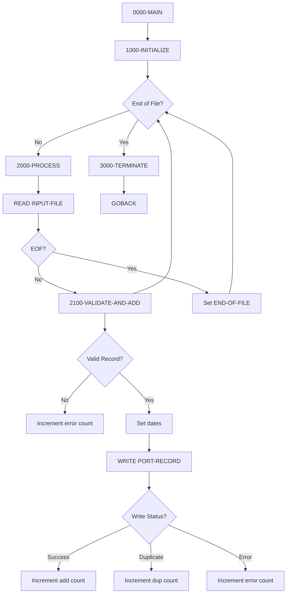

## Overview

PORTADD is a batch program that creates new portfolio records by reading from a sequential input file and writing to an indexed VSAM portfolio master file. It performs basic validation on incoming records before adding them to the portfolio database.

The program processes records in a read-validate-write loop, checking for required fields and valid status codes before attempting to insert. It handles duplicate key conditions gracefully and maintains counts of successful additions, duplicates, and errors for reporting at job completion.

This utility is part of the portfolio management suite and is typically used for initial data loading, batch portfolio creation, or migrating portfolio data from external sources.

## Program Structure



## Data Structures

### Portfolio Record (PORTFLIO Copybook)

The program uses the PORTFLIO copybook for both input and output file definitions:

| Level | Name | Picture | Description |
|-------|------|---------|-------------|
| 01 | PORT-RECORD | - | Portfolio master record |
| 05 | PORT-KEY | - | Composite record key |
| 10 | PORT-ID | X(8) | Portfolio identifier |
| 10 | PORT-ACCOUNT-NO | X(10) | Account number |
| 05 | PORT-CLIENT-INFO | - | Client information |
| 10 | PORT-CLIENT-NAME | X(30) | Client name |
| 10 | PORT-CLIENT-TYPE | X(1) | Client type (I/C/T) |
| 05 | PORT-PORTFOLIO-INFO | - | Portfolio details |
| 10 | PORT-CREATE-DATE | 9(8) | Creation date (YYYYMMDD) |
| 10 | PORT-LAST-MAINT | 9(8) | Last maintenance date |
| 10 | PORT-STATUS | X(1) | Portfolio status |
| 05 | PORT-FINANCIAL-INFO | - | Financial data |
| 10 | PORT-TOTAL-VALUE | S9(13)V99 COMP-3 | Total portfolio value |
| 10 | PORT-CASH-BALANCE | S9(13)V99 COMP-3 | Cash balance |
| 05 | PORT-AUDIT-INFO | - | Audit trail |
| 10 | PORT-LAST-USER | X(8) | Last update user |
| 10 | PORT-LAST-TRANS | 9(8) | Last transaction date |
| 05 | PORT-FILLER | X(50) | Reserved space |

### Client Type Values

| Value | 88-Level Condition | Description |
|-------|-------------------|-------------|
| `I` | PORT-INDIVIDUAL | Individual investor |
| `C` | PORT-CORPORATE | Corporate account |
| `T` | PORT-TRUST | Trust account |

### Portfolio Status Values

| Value | 88-Level Condition | Description |
|-------|-------------------|-------------|
| `A` | PORT-ACTIVE | Active portfolio |
| `C` | PORT-CLOSED | Closed portfolio |
| `S` | PORT-SUSPENDED | Suspended portfolio |

### Working Storage

#### Constants

| Level | Name | Picture | Value | Description |
|-------|------|---------|-------|-------------|
| 05 | WS-PROGRAM-NAME | X(8) | 'PORTADD' | Program identifier |
| 05 | WS-SUCCESS | S9(4) | +0 | Success return code |
| 05 | WS-ERROR | S9(4) | +8 | Error return code |

#### File Status Switches

| Level | Name | Picture | Description |
|-------|------|---------|-------------|
| 05 | WS-FILE-STATUS | X(2) | Portfolio file status |
| 05 | WS-INPUT-STATUS | X(2) | Input file status |
| 05 | WS-END-OF-FILE-SW | X | EOF indicator |

#### File Status Values

| Value | 88-Level Condition | Description |
|-------|-------------------|-------------|
| `00` | WS-SUCCESS-STATUS | Operation successful |
| `22` | WS-DUP-STATUS | Duplicate key |
| `10` | WS-EOF-STATUS | End of file |

#### Counters and Work Areas

| Level | Name | Picture | Description |
|-------|------|---------|-------------|
| 05 | WS-ADD-COUNT | 9(7) | Records successfully added |
| 05 | WS-ERROR-COUNT | 9(7) | Records with errors |
| 05 | WS-DUP-COUNT | 9(7) | Duplicate records |
| 05 | WS-RETURN-CODE | S9(4) | Program return code |
| 05 | WS-CURRENT-DATE | 9(8) | Current date (YYYYMMDD) |

## File I/O

### PORTFOLIO-FILE

The indexed VSAM master file for portfolio records.

| Property | Value |
|----------|-------|
| Logical Name | PORTFOLIO-FILE |
| DD Name | PORTFILE |
| Organization | INDEXED |
| Access Mode | RANDOM |
| Open Mode | I-O |
| Record Key | PORT-KEY |
| File Status | WS-FILE-STATUS |

**Operations:**
- WRITE (add new records)

### INPUT-FILE

The sequential input file containing portfolio records to add.

| Property | Value |
|----------|-------|
| Logical Name | INPUT-FILE |
| DD Name | INPTFILE |
| Organization | SEQUENTIAL |
| Open Mode | INPUT |
| File Status | WS-INPUT-STATUS |

**Operations:**
- READ (sequential read with INTO)

## Control Flow

### Main Processing (0000-MAIN)

Controls the overall program flow:
1. Calls 1000-INITIALIZE for setup
2. Calls 2000-PROCESS in a loop until END-OF-FILE
3. Calls 3000-TERMINATE for cleanup
4. Returns via GOBACK

### Initialize (1000-INITIALIZE)

Prepares the processing environment:
1. Initializes WS-WORK-AREAS to zeros
2. Accepts current date using `ACCEPT ... FROM DATE YYYYMMDD`
3. Opens PORTFOLIO-FILE for I-O
4. Opens INPUT-FILE for INPUT
5. Checks file status and terminates with error if open fails

### Process (2000-PROCESS)

Reads and processes input records:
1. Reads next record from INPUT-FILE into PORT-RECORD
2. On AT END, sets END-OF-FILE flag
3. On NOT AT END, calls 2100-VALIDATE-AND-ADD

### Validate and Add (2100-VALIDATE-AND-ADD)

Validates and writes each record:

**Validation Rules:**
1. PORT-ID must not be spaces
2. PORT-CLIENT-NAME must not be spaces
3. PORT-STATUS must equal 'A' (Active)

If validation fails, increments error count and exits paragraph using `EXIT PARAGRAPH`.

**Processing:**
1. Sets PORT-CREATE-DATE to current date
2. Sets PORT-LAST-MAINT to current date
3. Writes PORT-RECORD to portfolio file
4. Evaluates write status:
   - Success (00): Increments add count
   - Duplicate (22): Increments duplicate count, displays message
   - Other: Increments error count, displays message

### Terminate (3000-TERMINATE)

Finalizes processing:
1. Closes both files
2. Displays processing statistics:
   - Records added
   - Duplicate records
   - Errors occurred
3. Sets RETURN-CODE from WS-RETURN-CODE

## Validation Rules

| Field | Rule | Action on Failure |
|-------|------|-------------------|
| PORT-ID | Not spaces | Reject record |
| PORT-CLIENT-NAME | Not spaces | Reject record |
| PORT-STATUS | Must equal 'A' | Reject record |

**Note:** Only active portfolios (status 'A') can be added through this program.

## Processing Statistics

The program tracks and displays the following counts at termination:

| Counter | Description |
|---------|-------------|
| WS-ADD-COUNT | Records successfully written to portfolio file |
| WS-DUP-COUNT | Records rejected due to duplicate key |
| WS-ERROR-COUNT | Records rejected due to validation or write errors |

## Return Codes

| Code | Description |
|------|-------------|
| 0 | Processing completed successfully |
| 8 | Error occurred (file open failure) |

## Dependencies

### Copybooks

- **PORTFLIO** - Portfolio master record layout (used for both FD definitions)

### Related Programs

Programs that share the PORTFLIO copybook (portfolio management suite):
- PORTDEL - Portfolio deletion
- PORTREAD - Portfolio read/inquiry
- PORTTEST - Portfolio testing utility
- PORTUPDT - Portfolio update
- TSTGEN00 - Test data generation

## JCL Example

```jcl
//PORTADD  EXEC PGM=PORTADD
//STEPLIB  DD  DSN=your.loadlib,DISP=SHR
//PORTFILE DD  DSN=your.portfolio.master,DISP=SHR
//INPTFILE DD  DSN=your.input.file,DISP=SHR
//SYSOUT   DD  SYSOUT=*
```

## Input File Requirements

The input file must:
- Be sequential organization
- Contain records matching the PORTFLIO copybook layout
- Have PORT-STATUS set to 'A' for records to be processed
- Have PORT-ID and PORT-CLIENT-NAME populated

## Sample Output

```
Records added:    0001250
Duplicate records:0000015
Errors occurred:  0000003
```

## Technical Notes

- The program uses **ACCEPT ... FROM DATE YYYYMMDD** to get the current date in 8-digit format
- **READ ... INTO** reads directly into the PORT-RECORD area used for writing
- **EXIT PARAGRAPH** provides early exit from validation when errors are detected
- File status `'22'` indicates a duplicate key condition on WRITE, which is handled gracefully
- The portfolio file is opened I-O (not OUTPUT) to allow random WRITE operations to an existing indexed file
- **COMP-3** (packed decimal) is used for financial fields to maintain precision and efficiency
- Both files share the same record layout (PORTFLIO), simplifying the read-write process
