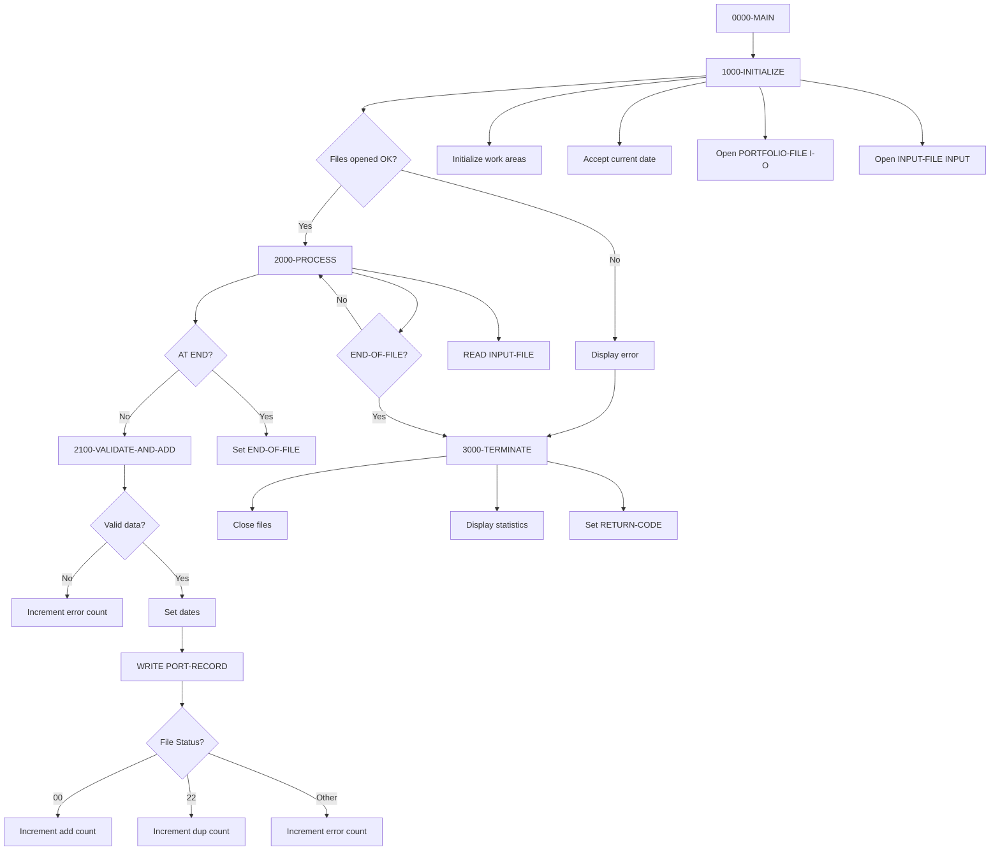
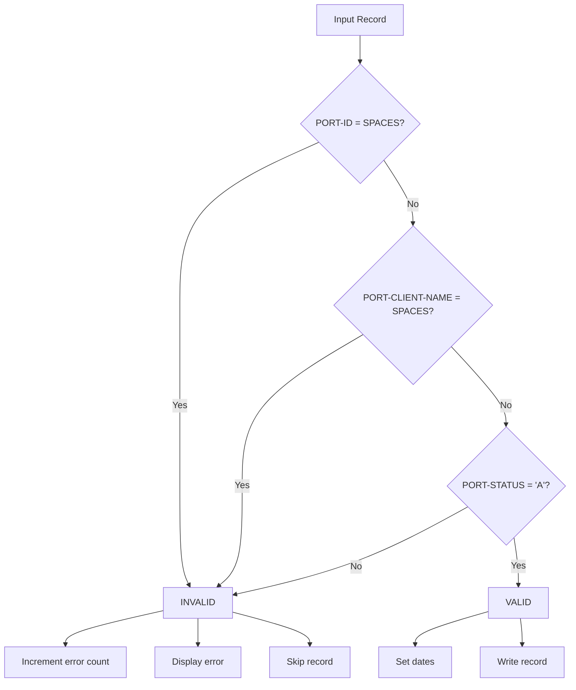

## Overview

PORTADD is a batch program that creates new portfolio records by reading from a sequential input file and writing to an indexed VSAM master file. The program validates each input record before insertion and handles duplicate key conditions gracefully.

The program is part of the portfolio management system and works alongside PORTREAD, PORTUPDT, PORTDEL, and PORTTEST programs that share the same PORTFLIO record structure. It provides comprehensive statistics on records processed, including counts of successful additions, duplicates detected, and errors encountered.

Input records must have an active status ('A') and contain valid portfolio ID and client name values. The program automatically stamps each new record with the current date for both creation date and last maintenance date fields.

## Program Structure



## Data Structures

### Portfolio Record (PORTFLIO Copybook)

The portfolio master record layout used for both input and output:

| Level | Name | Picture | Description |
|-------|------|---------|-------------|
| 01 | PORT-RECORD | - | Portfolio master record |
| 05 | PORT-KEY | - | Composite record key |
| 10 | PORT-ID | X(8) | Portfolio identifier |
| 10 | PORT-ACCOUNT-NO | X(10) | Account number |
| 05 | PORT-CLIENT-INFO | - | Client information group |
| 10 | PORT-CLIENT-NAME | X(30) | Client name |
| 10 | PORT-CLIENT-TYPE | X(1) | Client type: I=Individual, C=Corporate, T=Trust |
| 05 | PORT-PORTFOLIO-INFO | - | Portfolio status group |
| 10 | PORT-CREATE-DATE | 9(8) | Creation date (YYYYMMDD) |
| 10 | PORT-LAST-MAINT | 9(8) | Last maintenance date (YYYYMMDD) |
| 10 | PORT-STATUS | X(1) | Status: A=Active, C=Closed, S=Suspended |
| 05 | PORT-FINANCIAL-INFO | - | Financial data group |
| 10 | PORT-TOTAL-VALUE | S9(13)V99 COMP-3 | Total portfolio value |
| 10 | PORT-CASH-BALANCE | S9(13)V99 COMP-3 | Cash balance |
| 05 | PORT-AUDIT-INFO | - | Audit information group |
| 10 | PORT-LAST-USER | X(8) | Last user to modify |
| 10 | PORT-LAST-TRANS | 9(8) | Last transaction date |
| 05 | PORT-FILLER | X(50) | Reserved space |

### Working Storage

#### Constants

| Level | Name | Picture | Value | Description |
|-------|------|---------|-------|-------------|
| 05 | WS-PROGRAM-NAME | X(8) | 'PORTADD' | Program identifier |
| 05 | WS-SUCCESS | S9(4) | +0 | Success return code |
| 05 | WS-ERROR | S9(4) | +8 | Error return code |

#### Switches and Status Fields

| Level | Name | Picture | Description |
|-------|------|---------|-------------|
| 05 | WS-FILE-STATUS | X(2) | Portfolio file status |
| 05 | WS-INPUT-STATUS | X(2) | Input file status |
| 05 | WS-END-OF-FILE-SW | X | EOF switch (Y/N) |

#### Counters and Work Areas

| Level | Name | Picture | Description |
|-------|------|---------|-------------|
| 05 | WS-ADD-COUNT | 9(7) | Records successfully added |
| 05 | WS-ERROR-COUNT | 9(7) | Records with errors |
| 05 | WS-DUP-COUNT | 9(7) | Duplicate records skipped |
| 05 | WS-RETURN-CODE | S9(4) | Program return code |
| 05 | WS-CURRENT-DATE | 9(8) | Current date (YYYYMMDD) |

## File I/O

### PORTFOLIO-FILE

| Attribute | Value |
|-----------|-------|
| Logical Name | PORTFOLIO-FILE |
| DD Name | PORTFILE |
| Organization | INDEXED (VSAM KSDS) |
| Access Mode | RANDOM |
| Record Key | PORT-KEY (PORT-ID + PORT-ACCOUNT-NO) |
| Open Mode | I-O |
| File Status | WS-FILE-STATUS |

### INPUT-FILE

| Attribute | Value |
|-----------|-------|
| Logical Name | INPUT-FILE |
| DD Name | INPTFILE |
| Organization | SEQUENTIAL |
| Open Mode | INPUT |
| File Status | WS-INPUT-STATUS |

### File Status Codes

| Status | Condition Name | Description |
|--------|----------------|-------------|
| '00' | WS-SUCCESS-STATUS | Operation successful |
| '10' | WS-EOF-STATUS | End of file reached |
| '22' | WS-DUP-STATUS | Duplicate key on WRITE |

## Control Flow

### 1000-INITIALIZE

Prepares the program for processing:
1. Initializes WS-WORK-AREAS (counters set to zero)
2. Accepts current date in YYYYMMDD format
3. Opens PORTFOLIO-FILE for I-O (read and write)
4. Opens INPUT-FILE for INPUT
5. If either file fails to open:
   - Displays error message with both file statuses
   - Sets return code to 8 (error)
   - Calls 3000-TERMINATE to end processing

### 2000-PROCESS

Main processing loop executed until end of file:
1. Reads a record from INPUT-FILE into PORT-RECORD
2. On AT END: Sets END-OF-FILE switch to 'Y'
3. On NOT AT END: Calls 2100-VALIDATE-AND-ADD

### 2100-VALIDATE-AND-ADD

Validates and writes each input record:

**Validation Rules:**
- PORT-ID must not be spaces
- PORT-CLIENT-NAME must not be spaces
- PORT-STATUS must be 'A' (Active)

If validation fails:
- Increments WS-ERROR-COUNT
- Displays error message with PORT-ID
- Exits paragraph (skips write)

If validation passes:
1. Sets PORT-CREATE-DATE to current date
2. Sets PORT-LAST-MAINT to current date
3. Writes PORT-RECORD to PORTFOLIO-FILE
4. Evaluates file status:
   - '00' (Success): Increments WS-ADD-COUNT
   - '22' (Duplicate): Increments WS-DUP-COUNT, displays message
   - Other: Increments WS-ERROR-COUNT, displays message

### 3000-TERMINATE

Closes files and reports results:
1. Closes PORTFOLIO-FILE and INPUT-FILE
2. Displays processing statistics:
   - Records added
   - Duplicate records
   - Errors occurred
3. Moves WS-RETURN-CODE to RETURN-CODE

## Validation Logic



## Return Codes

| Code | Meaning |
|------|---------|
| 0 | Successful completion (may include duplicates) |
| 8 | Error occurred (file open failure) |

## Sample Output

```
Error opening files: PORT=35INPT=00
```
or on successful processing:
```
Records added:    0001234
Duplicate records:0000015
Errors occurred:  0000003
```

## Dependencies

### Copybooks

- **PORTFLIO** - Portfolio master record layout

### Related Programs

Programs that share the PORTFLIO copybook:

- **PORTREAD** - Portfolio inquiry/read program
- **PORTUPDT** - Portfolio update program
- **PORTDEL** - Portfolio deletion program
- **PORTTEST** - Portfolio testing utility
- **TSTGEN00** - Test data generation

## Technical Notes

1. **ACCEPT FROM DATE YYYYMMDD**: This IBM extension retrieves the current system date in YYYYMMDD format (8 digits). Used to timestamp new portfolio records.

2. **EXIT PARAGRAPH**: Transfers control to the end of the current paragraph without executing remaining statements. Used here to skip the WRITE when validation fails.

3. **Random Access Mode**: The portfolio file uses RANDOM access because records are written by key without sequential browsing. This is efficient for batch insert operations.

4. **File Status '22'**: Indicates a duplicate key condition on WRITE. The program treats this as a warning rather than an error, allowing processing to continue.

5. **I-O Open Mode**: The portfolio file is opened for I-O (input-output) even though the program only writes. This is because VSAM KSDS files require I-O mode for WRITE operations in some environments.

6. **COMP-3 (Packed Decimal)**: Financial fields use packed decimal format (`S9(13)V99 COMP-3`) for efficient storage and accurate decimal arithmetic. Each field stores up to 13 integer digits and 2 decimal places.

7. **Composite Key**: The record key consists of PORT-ID (8 bytes) + PORT-ACCOUNT-NO (10 bytes) = 18 bytes total. Both fields together uniquely identify a portfolio.

8. **READ INTO**: The `READ INPUT-FILE INTO PORT-RECORD` statement reads directly into the portfolio file's record area, avoiding the need for a separate input buffer.

## JCL Example

```jcl
//PORTADD  EXEC PGM=PORTADD
//STEPLIB  DD DSN=your.loadlib,DISP=SHR
//PORTFILE DD DSN=your.portfolio.master,DISP=SHR
//INPTFILE DD DSN=your.portfolio.input,DISP=SHR
//SYSOUT   DD SYSOUT=*
```
