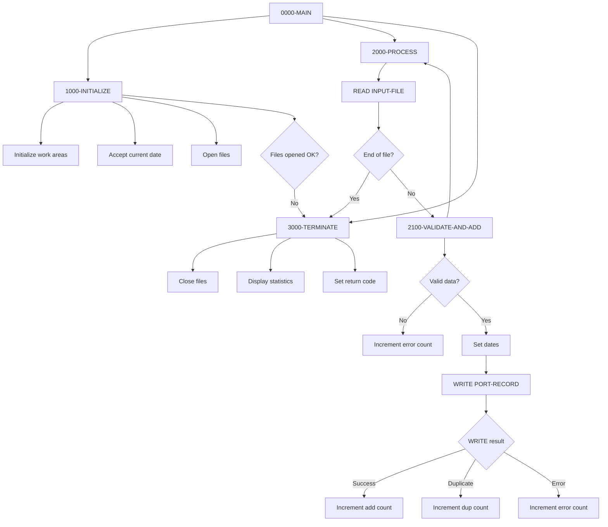
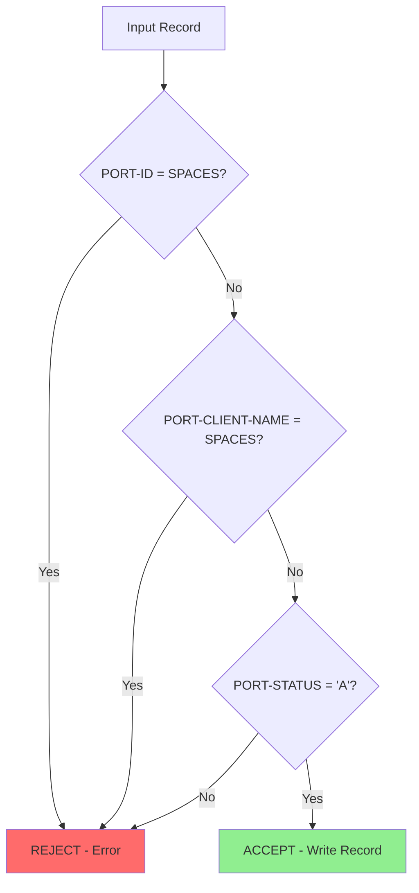

## Overview

PORTADD is a batch program that creates new portfolio records by reading from a sequential input file and writing to an indexed portfolio master file. It performs validation on incoming records, handles duplicate key conditions, and provides comprehensive statistics on processing results.

The program follows a standard batch processing pattern: initialize (open files), process (read input, validate, write output), and terminate (close files, display statistics). Input records are validated for required fields and correct status before being written to the portfolio file.

PORTADD is designed for bulk loading of new portfolio accounts, typically used during system initialization, data migration, or batch account creation processes.

## Program Structure



## Data Structures

### Working Storage - Constants

| Level | Name | Picture | Value | Description |
|-------|------|---------|-------|-------------|
| 01 | WS-CONSTANTS | - | - | Constants group |
| 05 | WS-PROGRAM-NAME | X(8) | 'PORTADD' | Program identifier |
| 05 | WS-SUCCESS | S9(4) | +0 | Success return code |
| 05 | WS-ERROR | S9(4) | +8 | Error return code |

### Working Storage - Switches

| Level | Name | Picture | Description |
|-------|------|---------|-------------|
| 01 | WS-SWITCHES | - | Switch/flag group |
| 05 | WS-FILE-STATUS | X(2) | Portfolio file status |
| 05 | WS-INPUT-STATUS | X(2) | Input file status |
| 05 | WS-END-OF-FILE-SW | X | End of file switch |

#### WS-FILE-STATUS Condition Names

| Condition | Value | Description |
|-----------|-------|-------------|
| WS-SUCCESS-STATUS | '00' | Successful operation |
| WS-DUP-STATUS | '22' | Duplicate key on WRITE |
| WS-EOF-STATUS | '10' | End of file reached |

#### WS-INPUT-STATUS Condition Names

| Condition | Value | Description |
|-----------|-------|-------------|
| WS-INPUT-SUCCESS | '00' | Successful operation |
| WS-INPUT-EOF | '10' | End of file reached |

#### WS-END-OF-FILE-SW Condition Names

| Condition | Value | Description |
|-----------|-------|-------------|
| END-OF-FILE | 'Y' | End of file reached |
| NOT-END-OF-FILE | 'N' | More records to process |

### Working Storage - Work Areas

| Level | Name | Picture | Initial | Description |
|-------|------|---------|---------|-------------|
| 05 | WS-ADD-COUNT | 9(7) | ZERO | Records successfully added |
| 05 | WS-ERROR-COUNT | 9(7) | ZERO | Records with errors |
| 05 | WS-DUP-COUNT | 9(7) | ZERO | Duplicate records skipped |
| 05 | WS-RETURN-CODE | S9(4) | +0 | Program return code |
| 05 | WS-CURRENT-DATE | 9(8) | - | Current date YYYYMMDD |

### Portfolio Record (from PORTFLIO copybook)

| Level | Name | Picture | Description |
|-------|------|---------|-------------|
| 01 | PORT-RECORD | - | Portfolio master record |
| 05 | PORT-KEY | - | Composite primary key |
| 10 | PORT-ID | X(8) | Portfolio identifier |
| 10 | PORT-ACCOUNT-NO | X(10) | Account number |
| 05 | PORT-CLIENT-INFO | - | Client information group |
| 10 | PORT-CLIENT-NAME | X(30) | Client name |
| 10 | PORT-CLIENT-TYPE | X(1) | Client type code |
| 05 | PORT-PORTFOLIO-INFO | - | Portfolio information group |
| 10 | PORT-CREATE-DATE | 9(8) | Creation date YYYYMMDD |
| 10 | PORT-LAST-MAINT | 9(8) | Last maintenance date |
| 10 | PORT-STATUS | X(1) | Portfolio status |
| 05 | PORT-FINANCIAL-INFO | - | Financial data group |
| 10 | PORT-TOTAL-VALUE | S9(13)V99 COMP-3 | Total portfolio value |
| 10 | PORT-CASH-BALANCE | S9(13)V99 COMP-3 | Cash balance |
| 05 | PORT-AUDIT-INFO | - | Audit information group |
| 10 | PORT-LAST-USER | X(8) | Last user to modify |
| 10 | PORT-LAST-TRANS | 9(8) | Last transaction date |
| 05 | PORT-FILLER | X(50) | Reserved space |

#### PORT-CLIENT-TYPE Condition Names

| Condition | Value | Description |
|-----------|-------|-------------|
| PORT-INDIVIDUAL | 'I' | Individual client |
| PORT-CORPORATE | 'C' | Corporate client |
| PORT-TRUST | 'T' | Trust account |

#### PORT-STATUS Condition Names

| Condition | Value | Description |
|-----------|-------|-------------|
| PORT-ACTIVE | 'A' | Active portfolio |
| PORT-CLOSED | 'C' | Closed portfolio |
| PORT-SUSPENDED | 'S' | Suspended portfolio |

## File I/O

### PORTFOLIO-FILE

| Attribute | Value |
|-----------|-------|
| DD Name | PORTFILE |
| Organization | INDEXED (VSAM KSDS) |
| Access Mode | RANDOM |
| Record Key | PORT-KEY (PORT-ID + PORT-ACCOUNT-NO) |
| File Status | WS-FILE-STATUS |
| Open Mode | I-O |

**Operations:**
- **WRITE** - Adds new portfolio records

### INPUT-FILE

| Attribute | Value |
|-----------|-------|
| DD Name | INPTFILE |
| Organization | SEQUENTIAL |
| File Status | WS-INPUT-STATUS |
| Open Mode | INPUT |

**Operations:**
- **READ** - Reads input records for processing

## Control Flow

### 0000-MAIN

Main driver paragraph that orchestrates processing:
1. Performs initialization
2. Loops through 2000-PROCESS until END-OF-FILE
3. Performs termination
4. Returns to caller via GOBACK

### 1000-INITIALIZE

Prepares the program for processing:
1. Initializes all work area counters to zero
2. Accepts current date in YYYYMMDD format
3. Opens PORTFOLIO-FILE for I-O (read/write access)
4. Opens INPUT-FILE for INPUT
5. Checks file status; if either file fails to open:
   - Displays error message with both file statuses
   - Sets return code to error (8)
   - Jumps to 3000-TERMINATE

### 2000-PROCESS

Main processing loop - reads and processes one input record:
1. Reads next record from INPUT-FILE into PORT-RECORD
2. On end of file: Sets END-OF-FILE switch to 'Y'
3. On successful read: Calls 2100-VALIDATE-AND-ADD

### 2100-VALIDATE-AND-ADD

Validates input data and writes to portfolio file:

**Validation Rules:**
1. PORT-ID must not be spaces
2. PORT-CLIENT-NAME must not be spaces
3. PORT-STATUS must be 'A' (Active)

If validation fails:
- Increments WS-ERROR-COUNT
- Displays error message with PORT-ID
- Exits paragraph (skips to next record)

If validation passes:
1. Sets PORT-CREATE-DATE to current date
2. Sets PORT-LAST-MAINT to current date
3. Writes PORT-RECORD to PORTFOLIO-FILE
4. Evaluates write result:
   - **Success ('00')**: Increments WS-ADD-COUNT
   - **Duplicate ('22')**: Increments WS-DUP-COUNT, displays message
   - **Other error**: Increments WS-ERROR-COUNT, displays message

### 3000-TERMINATE

Finalizes processing:
1. Closes both files
2. Displays processing statistics:
   - Records added
   - Duplicate records
   - Errors occurred
3. Moves WS-RETURN-CODE to RETURN-CODE special register

## Validation Rules



| Field | Rule | Failure Action |
|-------|------|----------------|
| PORT-ID | Must not be spaces | Reject record, increment error count |
| PORT-CLIENT-NAME | Must not be spaces | Reject record, increment error count |
| PORT-STATUS | Must equal 'A' (Active) | Reject record, increment error count |

## Dependencies

### Copybooks

- **PORTFLIO** - Portfolio master record layout (used for both input and output files)

### Called Programs

None - this is a standalone batch program.

### Related Programs

- **PORTUPDT** - Portfolio Update Program (updates existing records)
- **PORTDEL** - Portfolio Delete Program (removes records)
- **PORTREAD** - Portfolio Read Program (retrieves records)
- **PORTMSTR** - Portfolio Master Program (main driver)

## JCL Example

```jcl
//PORTADD  EXEC PGM=PORTADD
//STEPLIB  DD DSN=your.loadlib,DISP=SHR
//PORTFILE DD DSN=your.portfolio.master,DISP=SHR
//INPTFILE DD DSN=your.input.file,DISP=SHR
//SYSOUT   DD SYSOUT=*
```

## Sample Output

```
Records added:    0001234
Duplicate records:0000056
Errors occurred:  0000012
```

Error messages during processing:
```
Invalid record data: PORT1234
Duplicate record: PORT5678
Write error for: PORT9999
```

## Technical Notes

### Date Handling

The program uses `ACCEPT ... FROM DATE YYYYMMDD` to get the current date in 8-digit format. This date is automatically applied to:
- PORT-CREATE-DATE (creation timestamp)
- PORT-LAST-MAINT (last maintenance timestamp)

### File Status Handling

The program uses VSAM file status codes:
- **'00'** - Successful completion
- **'10'** - End of file (AT END condition)
- **'22'** - Duplicate key on WRITE (record already exists)

### EXIT PARAGRAPH Statement

The `EXIT PARAGRAPH` statement in 2100-VALIDATE-AND-ADD provides early exit when validation fails, skipping the write operation and returning to the calling paragraph.

### COMP-3 (Packed Decimal)

Financial fields (PORT-TOTAL-VALUE, PORT-CASH-BALANCE) use COMP-3 format:
- S9(13)V99 = 13 digits before decimal, 2 after
- Efficient storage: (15+1)/2 = 8 bytes
- Suitable for financial calculations

### Return Code Behavior

| Condition | Return Code | Description |
|-----------|-------------|-------------|
| Normal completion | 0 | All processing successful |
| File open error | 8 | Could not open required files |

**Note:** Duplicate records and validation errors increment counters but do not change the return code. The program completes normally even if some records fail.

## Error Handling

| Error Type | Detection | Response |
|------------|-----------|----------|
| File open failure | WS-FILE-STATUS or WS-INPUT-STATUS ≠ '00' | Display error, set RC=8, terminate |
| Validation failure | Empty required fields or wrong status | Increment error count, display, skip record |
| Duplicate key | WS-FILE-STATUS = '22' | Increment dup count, display, continue |
| Write error | WS-FILE-STATUS ≠ '00' and ≠ '22' | Increment error count, display, continue |

## Processing Statistics

The program maintains three counters for operational visibility:

| Counter | Description |
|---------|-------------|
| WS-ADD-COUNT | Records successfully written to portfolio file |
| WS-DUP-COUNT | Records rejected due to duplicate key |
| WS-ERROR-COUNT | Records rejected due to validation or write errors |

These statistics help operations staff verify batch processing results and identify data quality issues.
