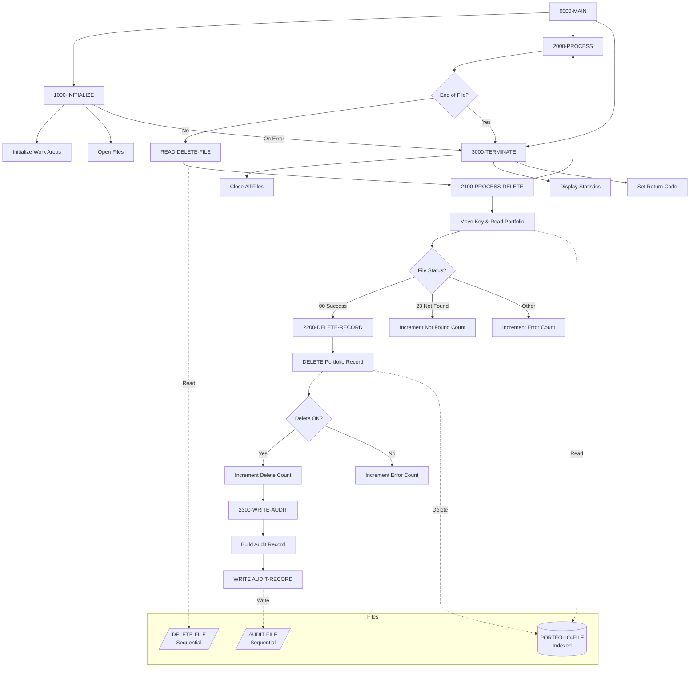
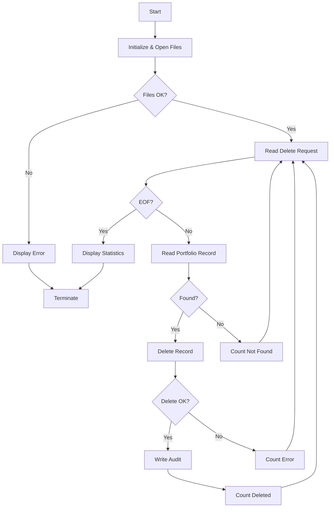

## Overview

PORTDEL is a batch program that processes portfolio deletion requests. It reads deletion requests from an input file, removes the corresponding records from the indexed portfolio master file, and writes audit trail records for each successful deletion.

The program is designed for batch processing of bulk portfolio deletions, such as when accounts are closed, transferred to another institution, or when customers request account removal. Each deletion request includes a reason code that is captured in the audit trail for compliance and tracking purposes.

Key features include:
- Random access deletion from an indexed VSAM file
- Comprehensive audit trail logging
- Error handling with counts for deleted, not found, and error records
- Support for multiple deletion reason codes

## Program Structure



## Data Structures

### File Section

#### PORTFOLIO-FILE (from PORTFLIO copybook)

| Level | Name | Picture | Description |
|-------|------|---------|-------------|
| 01 | PORT-RECORD | - | Portfolio master record |
| 05 | PORT-KEY | - | Composite record key |
| 10 | PORT-ID | X(8) | Portfolio identifier |
| 10 | PORT-ACCOUNT-NO | X(10) | Account number |
| 05 | PORT-CLIENT-INFO | - | Client information group |
| 10 | PORT-CLIENT-NAME | X(30) | Client name |
| 10 | PORT-CLIENT-TYPE | X(1) | Client type code |
| 05 | PORT-PORTFOLIO-INFO | - | Portfolio information group |
| 10 | PORT-CREATE-DATE | 9(8) | Creation date (YYYYMMDD) |
| 10 | PORT-LAST-MAINT | 9(8) | Last maintenance date |
| 10 | PORT-STATUS | X(1) | Portfolio status |
| 05 | PORT-FINANCIAL-INFO | - | Financial data group |
| 10 | PORT-TOTAL-VALUE | S9(13)V99 COMP-3 | Total portfolio value |
| 10 | PORT-CASH-BALANCE | S9(13)V99 COMP-3 | Cash balance |
| 05 | PORT-AUDIT-INFO | - | Audit information group |
| 10 | PORT-LAST-USER | X(8) | Last user to modify |
| 10 | PORT-LAST-TRANS | 9(8) | Last transaction date |
| 05 | PORT-FILLER | X(50) | Reserved space |

**Client Type Values (PORT-CLIENT-TYPE):**
- `I` - Individual
- `C` - Corporate
- `T` - Trust

**Portfolio Status Values (PORT-STATUS):**
- `A` - Active
- `C` - Closed
- `S` - Suspended

#### DELETE-FILE

| Level | Name | Picture | Description |
|-------|------|---------|-------------|
| 01 | DELETE-RECORD | - | Deletion request record |
| 05 | DEL-KEY | - | Key of record to delete |
| 10 | DEL-ID | X(8) | Portfolio ID |
| 10 | DEL-ACCT-NO | X(10) | Account number |
| 05 | DEL-REASON-CODE | X(2) | Reason for deletion |
| 05 | DEL-FILLER | X(60) | Reserved space |

**Deletion Reason Codes (88-levels):**
- `01` (DEL-CLOSED) - Account closed
- `02` (DEL-TRANSFERRED) - Account transferred
- `03` (DEL-REQUESTED) - Customer requested deletion

#### AUDIT-FILE

| Level | Name | Picture | Description |
|-------|------|---------|-------------|
| 01 | AUDIT-RECORD | - | Audit trail record |
| 05 | AUD-TIMESTAMP | X(26) | Deletion timestamp |
| 05 | AUD-ACTION | X(6) | Action code ('DELETE') |
| 05 | AUD-KEY | X(18) | Deleted record key |
| 05 | AUD-REASON | X(2) | Deletion reason code |
| 05 | AUD-STATUS | X(1) | Portfolio status at deletion |
| 05 | AUD-FILLER | X(27) | Reserved space |

### Working Storage

#### WS-CONSTANTS

| Level | Name | Picture | Value | Description |
|-------|------|---------|-------|-------------|
| 05 | WS-PROGRAM-NAME | X(8) | 'PORTDEL' | Program identifier |
| 05 | WS-SUCCESS | S9(4) | +0 | Success return code |
| 05 | WS-ERROR | S9(4) | +8 | Error return code |

#### WS-SWITCHES

| Level | Name | Picture | Description |
|-------|------|---------|-------------|
| 05 | WS-FILE-STATUS | X(2) | Portfolio file status |
| 05 | WS-DEL-STATUS | X(2) | Delete file status |
| 05 | WS-AUD-STATUS | X(2) | Audit file status |
| 05 | WS-END-OF-FILE-SW | X | End of file switch |

**File Status 88-Level Conditions:**

| Condition | Value | Meaning |
|-----------|-------|---------|
| WS-SUCCESS-STATUS | 00 | Successful operation |
| WS-REC-NOT-FND | 23 | Record not found |
| WS-EOF-STATUS | 10 | End of file reached |
| WS-DEL-SUCCESS | 00 | Delete file success |
| WS-DEL-EOF | 10 | Delete file EOF |
| WS-AUD-SUCCESS | 00 | Audit file success |

**End of File Conditions:**
- `END-OF-FILE` (Y) - End of delete file reached
- `NOT-END-OF-FILE` (N) - More records to process

#### WS-WORK-AREAS

| Level | Name | Picture | Description |
|-------|------|---------|-------------|
| 05 | WS-DELETE-COUNT | 9(7) | Successfully deleted records |
| 05 | WS-ERROR-COUNT | 9(7) | Records with errors |
| 05 | WS-NOT-FND-COUNT | 9(7) | Records not found |
| 05 | WS-RETURN-CODE | S9(4) | Program return code |
| 05 | WS-TIMESTAMP | X(26) | Current timestamp |

## File I/O

### PORTFOLIO-FILE

| Attribute | Value |
|-----------|-------|
| Logical Name | PORTFOLIO-FILE |
| DD Name | PORTFILE |
| Organization | Indexed |
| Access Mode | Random |
| Record Key | PORT-KEY |
| Open Mode | I-O (Input-Output) |
| File Status | WS-FILE-STATUS |

### DELETE-FILE

| Attribute | Value |
|-----------|-------|
| Logical Name | DELETE-FILE |
| DD Name | DELEFILE |
| Organization | Sequential |
| Open Mode | Input |
| File Status | WS-DEL-STATUS |

### AUDIT-FILE

| Attribute | Value |
|-----------|-------|
| Logical Name | AUDIT-FILE |
| DD Name | AUDFILE |
| Organization | Sequential |
| Open Mode | Output |
| File Status | WS-AUD-STATUS |

### File Operations Summary

| Operation | File | Paragraph | Description |
|-----------|------|-----------|-------------|
| OPEN I-O | PORTFOLIO-FILE | 1000-INITIALIZE | Open for read and delete |
| OPEN INPUT | DELETE-FILE | 1000-INITIALIZE | Open for reading requests |
| OPEN OUTPUT | AUDIT-FILE | 1000-INITIALIZE | Open for writing audit |
| READ | DELETE-FILE | 2000-PROCESS | Read next deletion request |
| READ | PORTFOLIO-FILE | 2100-PROCESS-DELETE | Read record to delete |
| DELETE | PORTFOLIO-FILE | 2200-DELETE-RECORD | Remove the record |
| WRITE | AUDIT-FILE | 2300-WRITE-AUDIT | Write audit trail |
| CLOSE | All files | 3000-TERMINATE | Close all files |

## Control Flow

### Main Processing Logic

1. **0000-MAIN** - Program entry point
   - Calls initialization
   - Processes deletions until end of file
   - Calls termination

2. **1000-INITIALIZE** - Setup
   - Initializes counters and work areas
   - Opens all three files (portfolio I-O, delete input, audit output)
   - If any file fails to open, displays error and terminates

3. **2000-PROCESS** - Read Loop
   - Reads next record from DELETE-FILE
   - On AT END, sets end-of-file switch
   - On NOT AT END, performs deletion processing

4. **2100-PROCESS-DELETE** - Deletion Logic
   - Moves deletion key to portfolio key
   - Reads the portfolio record
   - Uses EVALUATE TRUE to handle:
     - Success (00): Proceeds to delete
     - Not found (23): Increments not-found counter
     - Other: Increments error counter

5. **2200-DELETE-RECORD** - Execute Deletion
   - Issues DELETE for the portfolio record
   - On success: Increments delete counter, writes audit
   - On failure: Increments error counter

6. **2300-WRITE-AUDIT** - Audit Trail
   - Accepts current timestamp
   - Builds audit record with:
     - Timestamp
     - Action ('DELETE')
     - Record key
     - Deletion reason code
     - Portfolio status at time of deletion
   - Writes audit record

7. **3000-TERMINATE** - Cleanup
   - Closes all files
   - Displays processing statistics
   - Sets program return code

### Processing Flow Diagram



## Dependencies

### Copybooks

- **PORTFLIO** - Portfolio master record layout defining the structure of records in the portfolio file

### Called Programs

This program does not call any external programs.

### Related Programs

**Programs using PORTFLIO copybook:**
- PORTADD - Portfolio addition program
- PORTREAD - Portfolio read/inquiry program
- PORTUPDT - Portfolio update program
- PORTTEST - Portfolio testing program
- TSTGEN00 - Test data generation

## Technical Notes

### COBOL Concepts Used

- **INDEXED File Organization**: The portfolio file uses indexed organization with random access mode, enabling direct access to records by key for efficient deletion.

- **OPEN I-O**: Opens the portfolio file for both input and output operations, required for the DELETE statement.

- **DELETE Statement**: The COBOL DELETE statement removes a record from an indexed file. The record must first be read successfully before deletion.

- **EVALUATE TRUE**: Used for multi-way branching based on file status conditions. More readable than nested IF statements.

- **88-Level Condition Names**: Extensively used for file status checking and end-of-file detection, making the code self-documenting.

- **ACCEPT FROM TIME STAMP**: Retrieves the current system timestamp for audit trail recording.

### Return Codes

| Code | Meaning |
|------|---------|
| 0 | Successful completion (may include not-found records) |
| 8 | Error occurred (file open failure or processing errors) |

### Processing Statistics

The program displays the following statistics at termination:
- Records deleted - Successful deletions
- Records not found - Requests for non-existent records
- Errors occurred - File operation failures

### JCL Requirements

```jcl
//PORTDEL  EXEC PGM=PORTDEL
//PORTFILE DD DSN=your.portfolio.file,DISP=OLD
//DELEFILE DD DSN=your.delete.requests,DISP=SHR
//AUDFILE  DD DSN=your.audit.file,DISP=(NEW,CATLG,DELETE),
//            DCB=(RECFM=FB,LRECL=80,BLKSIZE=0)
//SYSOUT   DD SYSOUT=*
```

**Notes:**
- PORTFILE requires DISP=OLD for exclusive access during deletion
- DELEFILE contains the deletion requests to process
- AUDFILE is created new for each run (or use DISP=MOD to append)

### Audit Trail Record

Each successful deletion generates an audit record containing:

| Field | Content |
|-------|---------|
| Timestamp | Date/time of deletion |
| Action | 'DELETE' |
| Key | Portfolio ID + Account Number |
| Reason | Deletion reason code (01/02/03) |
| Status | Portfolio status at deletion time |

This provides a complete audit trail for compliance and recovery purposes.

### Error Handling

The program handles several error conditions:
1. **File open failures** - Displays status codes and terminates
2. **Record not found** - Counts and continues processing
3. **Delete failures** - Counts and continues processing
4. **Audit write failures** - Displays warning and continues

The program continues processing even when individual records fail, ensuring maximum throughput while tracking all errors.
