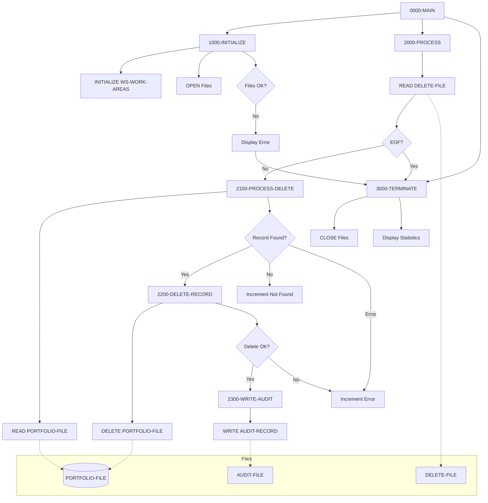

## Overview

PORTDEL is a batch program that processes portfolio deletion requests. It reads a sequential file containing deletion requests, removes the corresponding records from the indexed portfolio master file, and writes audit records documenting each deletion.

The program is part of the portfolio management subsystem and handles the controlled removal of portfolio records. It supports multiple deletion reason codes (account closed, transferred, or customer requested) and tracks statistics for successful deletions, records not found, and errors.

PORTDEL implements proper audit trail maintenance by recording each deletion with a timestamp, the deleted key, reason code, and the portfolio's status at the time of deletion. This ensures regulatory compliance and provides a complete history of portfolio lifecycle events.

## Program Structure



## Data Structures

### File Section

#### PORTFOLIO-FILE (PORT-RECORD from PORTFLIO copybook)

The indexed master file containing portfolio records:

| Level | Name | Picture | Description |
|-------|------|---------|-------------|
| 01 | PORT-RECORD | | Portfolio master record |
| 05 | PORT-KEY | | Composite primary key |
| 10 | PORT-ID | X(8) | Portfolio identifier |
| 10 | PORT-ACCOUNT-NO | X(10) | Account number |
| 05 | PORT-CLIENT-INFO | | Client information group |
| 10 | PORT-CLIENT-NAME | X(30) | Client name |
| 10 | PORT-CLIENT-TYPE | X(1) | Client type code |
| 05 | PORT-PORTFOLIO-INFO | | Portfolio status group |
| 10 | PORT-CREATE-DATE | 9(8) | Creation date (YYYYMMDD) |
| 10 | PORT-LAST-MAINT | 9(8) | Last maintenance date |
| 10 | PORT-STATUS | X(1) | Portfolio status |
| 05 | PORT-FINANCIAL-INFO | | Financial data group |
| 10 | PORT-TOTAL-VALUE | S9(13)V99 COMP-3 | Total portfolio value |
| 10 | PORT-CASH-BALANCE | S9(13)V99 COMP-3 | Cash balance |
| 05 | PORT-AUDIT-INFO | | Audit information group |
| 10 | PORT-LAST-USER | X(8) | Last user to modify |
| 10 | PORT-LAST-TRANS | 9(8) | Last transaction date |
| 05 | PORT-FILLER | X(50) | Reserved space |

**PORT-CLIENT-TYPE Values:**
- `I` - Individual (PORT-INDIVIDUAL)
- `C` - Corporate (PORT-CORPORATE)
- `T` - Trust (PORT-TRUST)

**PORT-STATUS Values:**
- `A` - Active (PORT-ACTIVE)
- `C` - Closed (PORT-CLOSED)
- `S` - Suspended (PORT-SUSPENDED)

#### DELETE-FILE (DELETE-RECORD)

Sequential input file containing deletion requests:

| Level | Name | Picture | Description |
|-------|------|---------|-------------|
| 01 | DELETE-RECORD | | Deletion request record |
| 05 | DEL-KEY | | Key of record to delete |
| 10 | DEL-ID | X(8) | Portfolio ID |
| 10 | DEL-ACCT-NO | X(10) | Account number |
| 05 | DEL-REASON-CODE | X(2) | Reason for deletion |
| 05 | DEL-FILLER | X(60) | Reserved/unused |

**DEL-REASON-CODE Values (88-level conditions):**
- `01` - Account closed (DEL-CLOSED)
- `02` - Transferred to another institution (DEL-TRANSFERRED)
- `03` - Customer requested deletion (DEL-REQUESTED)

#### AUDIT-FILE (AUDIT-RECORD)

Sequential output file for audit trail:

| Level | Name | Picture | Description |
|-------|------|---------|-------------|
| 01 | AUDIT-RECORD | | Audit trail record |
| 05 | AUD-TIMESTAMP | X(26) | Deletion timestamp |
| 05 | AUD-ACTION | X(6) | Action performed ('DELETE') |
| 05 | AUD-KEY | X(18) | Deleted portfolio key |
| 05 | AUD-REASON | X(2) | Deletion reason code |
| 05 | AUD-STATUS | X(1) | Portfolio status at deletion |
| 05 | AUD-FILLER | X(27) | Reserved space |

### Working Storage

#### Constants (WS-CONSTANTS)

| Level | Name | Picture | Value | Description |
|-------|------|---------|-------|-------------|
| 05 | WS-PROGRAM-NAME | X(8) | 'PORTDEL' | Program identifier |
| 05 | WS-SUCCESS | S9(4) | +0 | Success return code |
| 05 | WS-ERROR | S9(4) | +8 | Error return code |

#### File Status Switches (WS-SWITCHES)

| Level | Name | Picture | Description |
|-------|------|---------|-------------|
| 05 | WS-FILE-STATUS | X(2) | Portfolio file status |
| 05 | WS-DEL-STATUS | X(2) | Delete file status |
| 05 | WS-AUD-STATUS | X(2) | Audit file status |
| 05 | WS-END-OF-FILE-SW | X | EOF indicator |

**WS-FILE-STATUS Values:**
- `00` - Success (WS-SUCCESS-STATUS)
- `23` - Record not found (WS-REC-NOT-FND)
- `10` - End of file (WS-EOF-STATUS)

**WS-END-OF-FILE-SW Values:**
- `Y` - End of file reached (END-OF-FILE)
- `N` - Not end of file (NOT-END-OF-FILE)

#### Work Areas (WS-WORK-AREAS)

| Level | Name | Picture | Initial | Description |
|-------|------|---------|---------|-------------|
| 05 | WS-DELETE-COUNT | 9(7) | ZERO | Successful deletions count |
| 05 | WS-ERROR-COUNT | 9(7) | ZERO | Error count |
| 05 | WS-NOT-FND-COUNT | 9(7) | ZERO | Records not found count |
| 05 | WS-RETURN-CODE | S9(4) | +0 | Program return code |
| 05 | WS-TIMESTAMP | X(26) | | Current timestamp |

## File I/O

### PORTFOLIO-FILE

| Property | Value |
|----------|-------|
| Logical Name | PORTFOLIO-FILE |
| Physical Assignment | PORTFILE |
| Organization | Indexed (VSAM KSDS) |
| Access Mode | Random |
| Record Key | PORT-KEY |
| File Status | WS-FILE-STATUS |
| Open Mode | I-O (Input-Output) |

The portfolio master file is opened for I-O to allow both reading and deleting records.

### DELETE-FILE

| Property | Value |
|----------|-------|
| Logical Name | DELETE-FILE |
| Physical Assignment | DELEFILE |
| Organization | Sequential |
| File Status | WS-DEL-STATUS |
| Open Mode | Input |

Contains the list of portfolios to be deleted with reason codes.

### AUDIT-FILE

| Property | Value |
|----------|-------|
| Logical Name | AUDIT-FILE |
| Physical Assignment | AUDFILE |
| Organization | Sequential |
| File Status | WS-AUD-STATUS |
| Open Mode | Output |

Records all deletion activity for audit purposes.

## Control Flow

### Main Processing (0000-MAIN)

The program follows a standard batch processing pattern:

1. **Initialize** - Open files and set up work areas
2. **Process** - Loop through deletion requests until EOF
3. **Terminate** - Close files and display statistics
4. **GOBACK** - Return to caller/operating system

### Initialization (1000-INITIALIZE)

1. **Initialize Work Areas**: Clears WS-WORK-AREAS to initial values
2. **Open Files**:
   - PORTFOLIO-FILE opened for I-O (read and delete)
   - DELETE-FILE opened for INPUT
   - AUDIT-FILE opened for OUTPUT
3. **Check File Status**: If any file fails to open:
   - Displays error message with all file status codes
   - Sets WS-RETURN-CODE to 8 (error)
   - Performs 3000-TERMINATE to clean up

### Main Loop (2000-PROCESS)

Executed repeatedly until END-OF-FILE:

1. **Read Delete Request**: Reads next record from DELETE-FILE
2. **Check for EOF**: Sets END-OF-FILE flag if at end
3. **Process Deletion**: If not EOF, performs 2100-PROCESS-DELETE

### Process Delete (2100-PROCESS-DELETE)

1. **Set Key**: Moves DEL-KEY to PORT-KEY to identify target record
2. **Read Portfolio**: Reads the record to verify it exists
3. **Evaluate Result**:
   - **Success**: Record found, performs 2200-DELETE-RECORD
   - **Not Found**: Increments WS-NOT-FND-COUNT, displays message
   - **Other Error**: Increments WS-ERROR-COUNT, displays message

### Delete Record (2200-DELETE-RECORD)

1. **Delete Record**: Executes `DELETE PORTFOLIO-FILE` to remove the record
2. **Check Status**: 
   - **Success**: Increments WS-DELETE-COUNT, performs 2300-WRITE-AUDIT
   - **Failure**: Increments WS-ERROR-COUNT, displays error message

### Write Audit (2300-WRITE-AUDIT)

1. **Get Timestamp**: Uses `ACCEPT WS-TIMESTAMP FROM TIME STAMP`
2. **Build Audit Record**:
   - AUD-TIMESTAMP = current timestamp
   - AUD-ACTION = 'DELETE'
   - AUD-KEY = the deleted portfolio key
   - AUD-REASON = deletion reason code from input
   - AUD-STATUS = portfolio status at time of deletion
3. **Write Record**: Writes AUDIT-RECORD to AUDIT-FILE
4. **Check Status**: Displays warning if audit write fails

### Termination (3000-TERMINATE)

1. **Close Files**: Closes all three files
2. **Display Statistics**:
   - Records deleted (successful)
   - Records not found
   - Errors occurred
3. **Set Return Code**: Moves WS-RETURN-CODE to RETURN-CODE

## Dependencies

### Copybooks
- PORTFLIO - Portfolio master record layout

### Called Programs
None - PORTDEL is a standalone batch program.

### Related Programs

Programs that share the PORTFLIO copybook:
- PORTADD - Portfolio addition program
- PORTREAD - Portfolio read/inquiry program
- PORTTEST - Portfolio test program
- PORTUPDT - Portfolio update program
- TSTGEN00 - Test data generation

## JCL Requirements

Example JCL for executing PORTDEL:

```jcl
//PORTDEL  EXEC PGM=PORTDEL
//STEPLIB  DD DSN=your.loadlib,DISP=SHR
//PORTFILE DD DSN=your.portfolio.master,DISP=SHR
//DELEFILE DD DSN=your.delete.requests,DISP=SHR
//AUDFILE  DD DSN=your.audit.file,
//            DISP=(NEW,CATLG,DELETE),
//            DCB=(RECFM=FB,LRECL=80,BLKSIZE=0),
//            SPACE=(CYL,(1,1),RLSE)
//SYSOUT   DD SYSOUT=*
```

### Input File Format (DELEFILE)

Fixed-length 80-byte records:
- Positions 1-8: Portfolio ID
- Positions 9-18: Account Number
- Positions 19-20: Reason Code (01, 02, or 03)
- Positions 21-80: Filler (spaces)

## Return Codes

| Code | Meaning |
|------|---------|
| 0 | Successful completion (may include not-found records) |
| 8 | Error occurred (file open failure or other error) |

## Processing Statistics

The program displays the following statistics at termination:

| Statistic | Description |
|-----------|-------------|
| Records deleted | Number of portfolios successfully removed |
| Records not found | Number of deletion requests where portfolio didn't exist |
| Errors occurred | Number of I/O or processing errors |

## Technical Notes

### DELETE Statement

The program uses the COBOL `DELETE` statement to remove records from the indexed VSAM file. This requires:
1. The file must be opened for I-O
2. The record must be read first (to position the file)
3. The DELETE operates on the last-read record

### Random Access

The PORTFOLIO-FILE uses random access mode, allowing direct retrieval of records by key without sequential processing. This is efficient for deletion processing where specific records are targeted.

### Audit Trail Integrity

Each successful deletion is immediately followed by an audit write. If the audit write fails, a warning is displayed but processing continues. This ensures deletion statistics are accurate even if audit logging has issues.

### COMP-3 (Packed Decimal)

The financial fields in PORT-RECORD (PORT-TOTAL-VALUE, PORT-CASH-BALANCE) use COMP-3 format. These fields are not directly used by PORTDEL but are part of the record structure defined in the PORTFLIO copybook.

### ACCEPT TIME STAMP

The program uses the IBM COBOL extension `ACCEPT WS-TIMESTAMP FROM TIME STAMP` to obtain a 26-character timestamp in ISO format for audit records.
