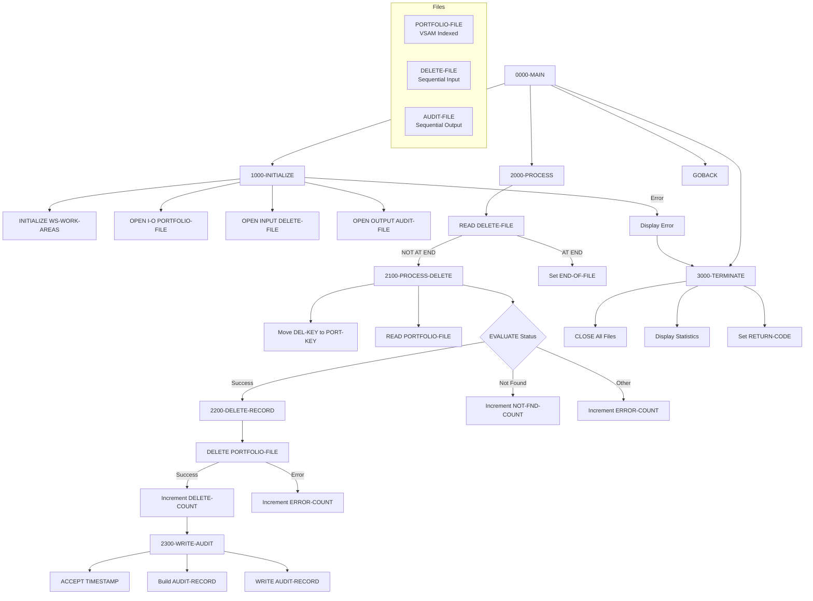

## Overview

PORTDEL is a batch program that processes portfolio deletion requests. It reads deletion requests from an input file, removes the corresponding records from the portfolio master file, and maintains a complete audit trail of all deletion activities.

Key features:
- **Batch Deletion Processing**: Reads sequential file of deletion requests
- **VSAM Random Access**: Uses random access to efficiently locate and delete specific portfolio records
- **Audit Trail**: Creates audit records for each successful deletion
- **Error Handling**: Tracks and reports records not found and processing errors
- **Statistics Reporting**: Displays counts of deletions, not-found records, and errors at completion

This program is typically run as part of account closure or portfolio maintenance batch jobs.

## Program Structure



## Data Structures

### File Section

#### PORTFOLIO-FILE (PORTFLIO Copybook)

| Level | Name | Picture | Description |
|-------|------|---------|-------------|
| 01 | PORT-RECORD | - | Portfolio master record |
| 05 | PORT-KEY | - | Composite primary key |
| 10 | PORT-ID | X(8) | Portfolio identifier |
| 10 | PORT-ACCOUNT-NO | X(10) | Account number |
| 05 | PORT-CLIENT-INFO | - | Client information |
| 10 | PORT-CLIENT-NAME | X(30) | Client name |
| 10 | PORT-CLIENT-TYPE | X(1) | Client type code |
| 05 | PORT-PORTFOLIO-INFO | - | Portfolio information |
| 10 | PORT-CREATE-DATE | 9(8) | Creation date |
| 10 | PORT-LAST-MAINT | 9(8) | Last maintenance date |
| 10 | PORT-STATUS | X(1) | Portfolio status |
| 05 | PORT-FINANCIAL-INFO | - | Financial data |
| 10 | PORT-TOTAL-VALUE | S9(13)V99 COMP-3 | Total portfolio value |
| 10 | PORT-CASH-BALANCE | S9(13)V99 COMP-3 | Cash balance |
| 05 | PORT-AUDIT-INFO | - | Audit information |
| 10 | PORT-LAST-USER | X(8) | Last user to modify |
| 10 | PORT-LAST-TRANS | 9(8) | Last transaction date |
| 05 | PORT-FILLER | X(50) | Reserved space |

##### Client Type Values (PORT-CLIENT-TYPE)

| Value | 88-Level Name | Meaning |
|-------|---------------|---------|
| `'I'` | PORT-INDIVIDUAL | Individual account |
| `'C'` | PORT-CORPORATE | Corporate account |
| `'T'` | PORT-TRUST | Trust account |

##### Portfolio Status Values (PORT-STATUS)

| Value | 88-Level Name | Meaning |
|-------|---------------|---------|
| `'A'` | PORT-ACTIVE | Active portfolio |
| `'C'` | PORT-CLOSED | Closed portfolio |
| `'S'` | PORT-SUSPENDED | Suspended portfolio |

#### DELETE-FILE

| Level | Name | Picture | Description |
|-------|------|---------|-------------|
| 01 | DELETE-RECORD | - | Deletion request record |
| 05 | DEL-KEY | - | Key to delete |
| 10 | DEL-ID | X(8) | Portfolio ID |
| 10 | DEL-ACCT-NO | X(10) | Account number |
| 05 | DEL-REASON-CODE | X(2) | Deletion reason |
| 05 | DEL-FILLER | X(60) | Reserved space |

##### Deletion Reason Codes (DEL-REASON-CODE)

| Value | 88-Level Name | Meaning |
|-------|---------------|---------|
| `'01'` | DEL-CLOSED | Account closed |
| `'02'` | DEL-TRANSFERRED | Transferred to another institution |
| `'03'` | DEL-REQUESTED | Customer requested deletion |

#### AUDIT-FILE

| Level | Name | Picture | Description |
|-------|------|---------|-------------|
| 01 | AUDIT-RECORD | - | Audit trail record |
| 05 | AUD-TIMESTAMP | X(26) | Deletion timestamp |
| 05 | AUD-ACTION | X(6) | Action code (`'DELETE'`) |
| 05 | AUD-KEY | X(18) | Deleted record key |
| 05 | AUD-REASON | X(2) | Deletion reason code |
| 05 | AUD-STATUS | X(1) | Portfolio status at deletion |
| 05 | AUD-FILLER | X(27) | Reserved space |

### Working Storage

#### Constants

| Level | Name | Picture | Value | Description |
|-------|------|---------|-------|-------------|
| 01 | WS-CONSTANTS | - | - | Program constants |
| 05 | WS-PROGRAM-NAME | X(8) | `'PORTDEL'` | Program identifier |
| 05 | WS-SUCCESS | S9(4) | +0 | Success return code |
| 05 | WS-ERROR | S9(4) | +8 | Error return code |

#### File Status Switches

| Level | Name | Picture | Description |
|-------|------|---------|-------------|
| 01 | WS-SWITCHES | - | Status switches |
| 05 | WS-FILE-STATUS | X(2) | Portfolio file status |
| 05 | WS-DEL-STATUS | X(2) | Delete file status |
| 05 | WS-AUD-STATUS | X(2) | Audit file status |
| 05 | WS-END-OF-FILE-SW | X | EOF indicator |

##### Portfolio File Status (WS-FILE-STATUS)

| Value | 88-Level Name | Meaning |
|-------|---------------|---------|
| `'00'` | WS-SUCCESS-STATUS | Successful operation |
| `'23'` | WS-REC-NOT-FND | Record not found |
| `'10'` | WS-EOF-STATUS | End of file |

##### Delete File Status (WS-DEL-STATUS)

| Value | 88-Level Name | Meaning |
|-------|---------------|---------|
| `'00'` | WS-DEL-SUCCESS | Successful operation |
| `'10'` | WS-DEL-EOF | End of file |

##### Audit File Status (WS-AUD-STATUS)

| Value | 88-Level Name | Meaning |
|-------|---------------|---------|
| `'00'` | WS-AUD-SUCCESS | Successful operation |

##### End of File Switch (WS-END-OF-FILE-SW)

| Value | 88-Level Name | Meaning |
|-------|---------------|---------|
| `'Y'` | END-OF-FILE | End of file reached |
| `'N'` | NOT-END-OF-FILE | More records to process |

#### Work Areas

| Level | Name | Picture | Initial | Description |
|-------|------|---------|---------|-------------|
| 01 | WS-WORK-AREAS | - | - | Work area group |
| 05 | WS-DELETE-COUNT | 9(7) | ZERO | Successful deletions |
| 05 | WS-ERROR-COUNT | 9(7) | ZERO | Processing errors |
| 05 | WS-NOT-FND-COUNT | 9(7) | ZERO | Records not found |
| 05 | WS-RETURN-CODE | S9(4) | +0 | Program return code |
| 05 | WS-TIMESTAMP | X(26) | - | Current timestamp |

## File I/O

### PORTFOLIO-FILE

| Property | Value |
|----------|-------|
| DD Name | PORTFILE |
| Organization | INDEXED (VSAM KSDS) |
| Access Mode | RANDOM |
| Record Key | PORT-KEY (PORT-ID + PORT-ACCOUNT-NO) |
| File Status | WS-FILE-STATUS |
| Open Mode | I-O (Input-Output) |

The portfolio file is opened for I-O to allow both READ and DELETE operations.

### DELETE-FILE

| Property | Value |
|----------|-------|
| DD Name | DELEFILE |
| Organization | SEQUENTIAL |
| File Status | WS-DEL-STATUS |
| Open Mode | INPUT |

Sequential input file containing deletion requests.

### AUDIT-FILE

| Property | Value |
|----------|-------|
| DD Name | AUDFILE |
| Organization | SEQUENTIAL |
| File Status | WS-AUD-STATUS |
| Open Mode | OUTPUT |

Sequential output file for audit trail records.

### File Operations Summary

| Paragraph | File | Operation |
|-----------|------|-----------|
| 1000-INITIALIZE | PORTFOLIO-FILE | OPEN I-O |
| 1000-INITIALIZE | DELETE-FILE | OPEN INPUT |
| 1000-INITIALIZE | AUDIT-FILE | OPEN OUTPUT |
| 2000-PROCESS | DELETE-FILE | READ |
| 2100-PROCESS-DELETE | PORTFOLIO-FILE | READ (random) |
| 2200-DELETE-RECORD | PORTFOLIO-FILE | DELETE |
| 2300-WRITE-AUDIT | AUDIT-FILE | WRITE |
| 3000-TERMINATE | All files | CLOSE |

## Control Flow

### 0000-MAIN

The main entry point that orchestrates the deletion process:
1. **PERFORM 1000-INITIALIZE**: Set up files and work areas
2. **PERFORM 2000-PROCESS UNTIL END-OF-FILE**: Process all deletion requests
3. **PERFORM 3000-TERMINATE**: Close files and report statistics
4. **GOBACK**: Return to caller/operating system

### 1000-INITIALIZE

Performs program initialization:
1. **INITIALIZE WS-WORK-AREAS**: Clears counters and work fields
2. **OPEN files**: Opens all three files with appropriate modes
3. **Error check**: If any file fails to open:
   - Displays error message with all file statuses
   - Sets WS-RETURN-CODE to WS-ERROR (8)
   - Performs 3000-TERMINATE to clean up

### 2000-PROCESS

Reads and processes deletion requests in a loop:
1. **READ DELETE-FILE**: Reads next deletion request
   - AT END: Sets END-OF-FILE flag to stop loop
   - NOT AT END: Performs 2100-PROCESS-DELETE

### 2100-PROCESS-DELETE

Processes a single deletion request:
1. **MOVE DEL-KEY TO PORT-KEY**: Sets up key for portfolio lookup
2. **READ PORTFOLIO-FILE**: Random read using the key
3. **EVALUATE status**:
   - **WS-SUCCESS-STATUS**: Record found, perform 2200-DELETE-RECORD
   - **WS-REC-NOT-FND**: Record not in file, increment WS-NOT-FND-COUNT, display message
   - **OTHER**: Unexpected error, increment WS-ERROR-COUNT, display message

### 2200-DELETE-RECORD

Performs the actual deletion:
1. **DELETE PORTFOLIO-FILE**: Removes the record from the indexed file
2. **Check status**:
   - **Success**: Increment WS-DELETE-COUNT, perform 2300-WRITE-AUDIT
   - **Error**: Increment WS-ERROR-COUNT, display failure message

### 2300-WRITE-AUDIT

Creates an audit trail record:
1. **ACCEPT WS-TIMESTAMP FROM TIME STAMP**: Gets current system time
2. **Build audit record**:
   - AUD-TIMESTAMP = current timestamp
   - AUD-ACTION = `'DELETE'`
   - AUD-KEY = deleted portfolio key
   - AUD-REASON = deletion reason code
   - AUD-STATUS = portfolio status at time of deletion
3. **WRITE AUDIT-RECORD**: Writes to audit file
4. **Check status**: If write fails, display error message (processing continues)

### 3000-TERMINATE

Performs cleanup and reporting:
1. **CLOSE all files**: Closes PORTFOLIO-FILE, DELETE-FILE, AUDIT-FILE
2. **Display statistics**:
   - Records deleted count
   - Records not found count
   - Errors occurred count
3. **MOVE WS-RETURN-CODE TO RETURN-CODE**: Sets job return code

## Processing Summary

```
┌─────────────────────────────────────────────────────────────┐
│                    PORTDEL Processing                        │
├─────────────────────────────────────────────────────────────┤
│                                                              │
│  DELETE-FILE ──────► Read Request                            │
│       │                   │                                  │
│       │                   ▼                                  │
│       │         ┌─────────────────┐                         │
│       │         │ Lookup in       │                         │
│       │         │ PORTFOLIO-FILE  │                         │
│       │         └────────┬────────┘                         │
│       │                  │                                   │
│       │         ┌────────┴────────┐                         │
│       │         │                 │                         │
│       │         ▼                 ▼                         │
│       │      Found           Not Found                       │
│       │         │                 │                         │
│       │         ▼                 ▼                         │
│       │    Delete Record    Log to Console                  │
│       │         │                                           │
│       │         ▼                                           │
│       │    Write Audit ──────► AUDIT-FILE                   │
│       │                                                      │
│       └──────► Next Request (loop until EOF)                │
│                                                              │
└─────────────────────────────────────────────────────────────┘
```

## Sample JCL

```jcl
//PORTDEL  EXEC PGM=PORTDEL
//STEPLIB  DD DSN=your.loadlib,DISP=SHR
//PORTFILE DD DSN=your.portfolio.vsam.file,DISP=SHR
//DELEFILE DD DSN=your.delete.requests,DISP=SHR
//AUDFILE  DD DSN=your.audit.output,
//            DISP=(NEW,CATLG,DELETE),
//            DCB=(RECFM=FB,LRECL=80,BLKSIZE=0),
//            SPACE=(TRK,(5,2),RLSE)
//SYSOUT   DD SYSOUT=*
```

## Dependencies

### Copybooks

- **PORTFLIO** - Portfolio master record layout with client, financial, and audit information

### Called Programs

None - PORTDEL is a standalone batch program.

### Related Programs

- Programs that create portfolio records (PORTADD, PORTMSTR)
- Programs that read the audit file (RPTAUD00)
- Programs that generate deletion request files

## Return Codes

| Code | Meaning |
|------|---------|
| 0 | Successful completion (may include not-found records) |
| 8 | Error during processing (file open failure or delete errors) |

## Console Output

The program produces console output for monitoring:

**Error Messages:**
- `Error opening files: PORT=xx DEL=xx AUD=xx` - File open failure
- `Record not found: [key]` - Deletion request for non-existent record
- `Read error for: [key]` - Unexpected read error
- `Delete failed for: [key]` - Delete operation failed
- `Audit write failed for: [key]` - Audit record write failed

**Statistics (at termination):**
```
Records deleted:  0000025
Records not found:0000003
Errors occurred:  0000000
```

## Technical Notes

### COBOL Constructs Used

- **INDEXED File with RANDOM Access**: The PORTFOLIO-FILE uses random access mode to directly locate records by key without sequential scanning. This is efficient for deletion processing where specific records need to be located.

- **DELETE Statement**: The COBOL DELETE statement removes a record from an indexed file. The record must first be successfully read before it can be deleted (record locking).

- **OPEN I-O**: Opens the file for both input and output operations, required when both reading and deleting records from the same file.

- **ACCEPT FROM TIME STAMP**: IBM extension that retrieves the current system timestamp in ISO format (`YYYY-MM-DD-HH.MM.SS.FFFFFF`).

- **PERFORM UNTIL**: Loop construct that continues processing until the END-OF-FILE condition becomes true.

- **EVALUATE TRUE**: Multi-way branch based on condition name evaluation, similar to a switch/case statement.

- **Multiple file CLOSE**: COBOL allows closing multiple files in a single CLOSE statement.

### File Status Codes

| Status | Meaning |
|--------|---------|
| `'00'` | Successful operation |
| `'10'` | End of file (sequential read) |
| `'23'` | Record not found (random read/delete) |

### Processing Characteristics

- **Non-destructive on not-found**: Records not found in portfolio file are logged but do not cause program failure
- **Audit before continue**: Each successful deletion is audited before processing the next request
- **Statistics tracking**: Maintains separate counts for deletions, not-found, and errors
- **Graceful degradation**: Continues processing even if audit writes fail
