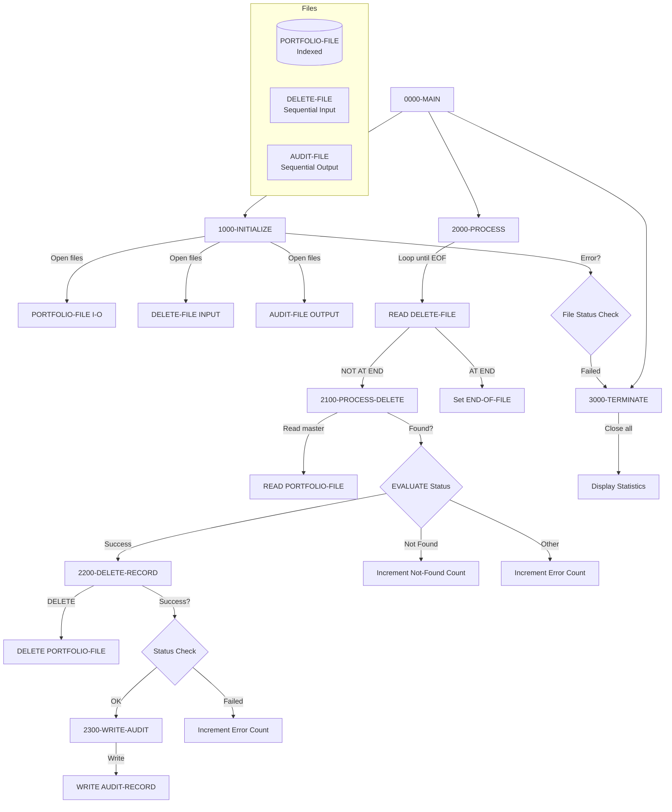

## Overview

PORTDEL is a batch program that processes portfolio deletion requests from an input file. The program reads deletion requests containing portfolio keys and reason codes, locates the corresponding records in the indexed portfolio master file, deletes them, and writes audit records documenting each deletion.

This program is part of the portfolio maintenance subsystem and works alongside PORTADD, PORTREAD, and PORTUPDT to provide complete portfolio lifecycle management. Key features include:

- **Batch Deletion Processing**: Reads a sequential file of deletion requests and processes them against the indexed portfolio master file
- **Audit Trail Generation**: Creates detailed audit records for each successful deletion, capturing timestamp, reason code, and portfolio status
- **Error Handling**: Tracks and reports records not found, delete failures, and other processing errors
- **Processing Statistics**: Reports deletion counts, not-found counts, and error counts at job completion

## Program Structure



## Data Structures

### File Section

#### PORT-RECORD (from PORTFLIO copybook)

| Level | Name | Picture | Description |
|-------|------|---------|-------------|
| 01 | PORT-RECORD | - | Portfolio master record |
| 05 | PORT-KEY | - | Composite primary key |
| 10 | PORT-ID | X(8) | Portfolio identifier |
| 10 | PORT-ACCOUNT-NO | X(10) | Account number |
| 05 | PORT-CLIENT-INFO | - | Client information group |
| 10 | PORT-CLIENT-NAME | X(30) | Client name |
| 10 | PORT-CLIENT-TYPE | X(1) | Client type code |
| 05 | PORT-PORTFOLIO-INFO | - | Portfolio information group |
| 10 | PORT-CREATE-DATE | 9(8) | Creation date (YYYYMMDD) |
| 10 | PORT-LAST-MAINT | 9(8) | Last maintenance date |
| 10 | PORT-STATUS | X(1) | Portfolio status |
| 05 | PORT-FINANCIAL-INFO | - | Financial information group |
| 10 | PORT-TOTAL-VALUE | S9(13)V99 COMP-3 | Total portfolio value |
| 10 | PORT-CASH-BALANCE | S9(13)V99 COMP-3 | Cash balance |
| 05 | PORT-AUDIT-INFO | - | Audit information group |
| 10 | PORT-LAST-USER | X(8) | Last user to modify |
| 10 | PORT-LAST-TRANS | 9(8) | Last transaction date |
| 05 | PORT-FILLER | X(50) | Reserved space |

**Client Type Condition Names (88-levels):**

| Condition | Value | Description |
|-----------|-------|-------------|
| PORT-INDIVIDUAL | 'I' | Individual account |
| PORT-CORPORATE | 'C' | Corporate account |
| PORT-TRUST | 'T' | Trust account |

**Portfolio Status Condition Names (88-levels):**

| Condition | Value | Description |
|-----------|-------|-------------|
| PORT-ACTIVE | 'A' | Active portfolio |
| PORT-CLOSED | 'C' | Closed portfolio |
| PORT-SUSPENDED | 'S' | Suspended portfolio |

#### DELETE-RECORD

| Level | Name | Picture | Description |
|-------|------|---------|-------------|
| 01 | DELETE-RECORD | - | Deletion request record |
| 05 | DEL-KEY | - | Key to delete |
| 10 | DEL-ID | X(8) | Portfolio identifier |
| 10 | DEL-ACCT-NO | X(10) | Account number |
| 05 | DEL-REASON-CODE | X(2) | Reason for deletion |
| 05 | DEL-FILLER | X(60) | Reserved space |

**Deletion Reason Codes (88-levels):**

| Condition | Value | Description |
|-----------|-------|-------------|
| DEL-CLOSED | '01' | Account closed |
| DEL-TRANSFERRED | '02' | Account transferred |
| DEL-REQUESTED | '03' | Client requested |

#### AUDIT-RECORD

| Level | Name | Picture | Description |
|-------|------|---------|-------------|
| 01 | AUDIT-RECORD | - | Audit trail record |
| 05 | AUD-TIMESTAMP | X(26) | Deletion timestamp |
| 05 | AUD-ACTION | X(6) | Action ('DELETE') |
| 05 | AUD-KEY | X(18) | Deleted record key |
| 05 | AUD-REASON | X(2) | Deletion reason code |
| 05 | AUD-STATUS | X(1) | Portfolio status at deletion |
| 05 | AUD-FILLER | X(27) | Reserved space |

### Working Storage

#### WS-CONSTANTS

| Level | Name | Picture | Value | Description |
|-------|------|---------|-------|-------------|
| 05 | WS-PROGRAM-NAME | X(8) | 'PORTDEL' | Program identifier |
| 05 | WS-SUCCESS | S9(4) | +0 | Success return code |
| 05 | WS-ERROR | S9(4) | +8 | Error return code |

#### WS-SWITCHES

| Level | Name | Picture | Description |
|-------|------|---------|-------------|
| 05 | WS-FILE-STATUS | X(2) | Portfolio file status |
| 05 | WS-DEL-STATUS | X(2) | Delete file status |
| 05 | WS-AUD-STATUS | X(2) | Audit file status |
| 05 | WS-END-OF-FILE-SW | X | End of file indicator |

**File Status Condition Names (88-levels):**

| Field | Condition | Value | Description |
|-------|-----------|-------|-------------|
| WS-FILE-STATUS | WS-SUCCESS-STATUS | '00' | Successful operation |
| WS-FILE-STATUS | WS-REC-NOT-FND | '23' | Record not found |
| WS-FILE-STATUS | WS-EOF-STATUS | '10' | End of file |
| WS-DEL-STATUS | WS-DEL-SUCCESS | '00' | Successful operation |
| WS-DEL-STATUS | WS-DEL-EOF | '10' | End of file |
| WS-AUD-STATUS | WS-AUD-SUCCESS | '00' | Successful operation |
| WS-END-OF-FILE-SW | END-OF-FILE | 'Y' | End of file reached |
| WS-END-OF-FILE-SW | NOT-END-OF-FILE | 'N' | More records to process |

#### WS-WORK-AREAS

| Level | Name | Picture | Description |
|-------|------|---------|-------------|
| 05 | WS-DELETE-COUNT | 9(7) | Count of successful deletions |
| 05 | WS-ERROR-COUNT | 9(7) | Count of errors |
| 05 | WS-NOT-FND-COUNT | 9(7) | Count of records not found |
| 05 | WS-RETURN-CODE | S9(4) | Program return code |
| 05 | WS-TIMESTAMP | X(26) | Current timestamp |

## File I/O

### PORTFOLIO-FILE

| Property | Value |
|----------|-------|
| Assign To | PORTFILE |
| Organization | Indexed (VSAM KSDS) |
| Access Mode | Random |
| Record Key | PORT-KEY |
| File Status | WS-FILE-STATUS |
| Open Mode | I-O (read and delete) |

The portfolio master file is opened for I-O access to allow both reading records to verify existence and deleting them.

### DELETE-FILE

| Property | Value |
|----------|-------|
| Assign To | DELEFILE |
| Organization | Sequential |
| File Status | WS-DEL-STATUS |
| Open Mode | INPUT |

Input file containing deletion requests to process.

### AUDIT-FILE

| Property | Value |
|----------|-------|
| Assign To | AUDFILE |
| Organization | Sequential |
| File Status | WS-AUD-STATUS |
| Open Mode | OUTPUT |

Output file for audit trail records documenting each deletion.

### I/O Operations Summary

| Paragraph | File | Operation | Description |
|-----------|------|-----------|-------------|
| 1000-INITIALIZE | PORTFOLIO-FILE | OPEN I-O | Open for read/delete |
| 1000-INITIALIZE | DELETE-FILE | OPEN INPUT | Open for reading |
| 1000-INITIALIZE | AUDIT-FILE | OPEN OUTPUT | Open for writing |
| 2000-PROCESS | DELETE-FILE | READ | Read next deletion request |
| 2100-PROCESS-DELETE | PORTFOLIO-FILE | READ | Read record to delete |
| 2200-DELETE-RECORD | PORTFOLIO-FILE | DELETE | Delete the record |
| 2300-WRITE-AUDIT | AUDIT-FILE | WRITE | Write audit record |
| 3000-TERMINATE | All files | CLOSE | Close all files |

## Control Flow

### 0000-MAIN

Entry point that orchestrates the batch deletion process:
1. Performs initialization (open files, initialize counters)
2. Loops through deletion requests until end of file
3. Performs termination (close files, report statistics)
4. Returns to operating system via GOBACK

### 1000-INITIALIZE

1. **Initialize Work Areas**: Clears all counters and work fields
2. **Open Files**: Opens all three files with appropriate modes:
   - PORTFOLIO-FILE as I-O (for read and delete)
   - DELETE-FILE as INPUT
   - AUDIT-FILE as OUTPUT
3. **Check File Status**: If any file fails to open:
   - Displays error message with all file status codes
   - Sets return code to error (8)
   - Performs termination to close any opened files

### 2000-PROCESS

Main processing loop that reads deletion requests:
1. **Read Delete File**: Reads next deletion request
2. **Check for EOF**: If AT END, sets END-OF-FILE flag
3. **Process Record**: If NOT AT END, performs 2100-PROCESS-DELETE

### 2100-PROCESS-DELETE

Processes a single deletion request:
1. **Set Key**: Moves DEL-KEY to PORT-KEY for lookup
2. **Read Master**: Reads portfolio record using the key
3. **Evaluate Result**: Uses EVALUATE TRUE to handle different outcomes:
   - **WS-SUCCESS-STATUS**: Record found, perform deletion
   - **WS-REC-NOT-FND**: Record not found, increment counter, display message
   - **OTHER**: Unexpected error, increment error counter, display message

### 2200-DELETE-RECORD

Performs the actual deletion:
1. **Delete Record**: Issues DELETE for current PORTFOLIO-FILE record
2. **Check Status**: If successful:
   - Increments delete count
   - Performs audit write
3. **Handle Failure**: If delete fails:
   - Increments error count
   - Displays failure message

### 2300-WRITE-AUDIT

Creates audit trail for successful deletions:
1. **Get Timestamp**: Uses `ACCEPT FROM TIME STAMP` for current time
2. **Build Audit Record**:
   - WS-TIMESTAMP → AUD-TIMESTAMP
   - 'DELETE' → AUD-ACTION
   - PORT-KEY → AUD-KEY
   - DEL-REASON-CODE → AUD-REASON
   - PORT-STATUS → AUD-STATUS (captures status before deletion)
3. **Write Record**: Writes AUDIT-RECORD to audit file
4. **Check Status**: Displays warning if write fails (processing continues)

### 3000-TERMINATE

Cleanup and reporting:
1. **Close Files**: Closes all three files
2. **Display Statistics**:
   - Records deleted
   - Records not found
   - Errors occurred
3. **Set Return Code**: Moves WS-RETURN-CODE to system RETURN-CODE

## Dependencies

### Copybooks

- [PORTFLIO](/docs/copybooks/PORTFLIO) - Portfolio master record layout with client, portfolio, financial, and audit information

### Called Programs

This program does not call any external programs.

### Related Programs

Programs that share the PORTFLIO copybook:
- [PORTADD](/docs/programs/PORTADD) - Portfolio addition program
- [PORTREAD](/docs/programs/PORTREAD) - Portfolio read/inquiry program
- [PORTUPDT](/docs/programs/PORTUPDT) - Portfolio update program
- [PORTTEST](/docs/programs/PORTTEST) - Portfolio testing program
- [TSTGEN00](/docs/programs/TSTGEN00) - Test data generation

## Return Codes

| Code | Description |
|------|-------------|
| 0 | Successful completion (may include not-found records) |
| 8 | Error occurred (file open failure or processing errors) |

## Processing Statistics

At job completion, the program displays:

```
Records deleted:  NNNNNNN
Records not found:NNNNNNN
Errors occurred:  NNNNNNN
```

## JCL Example

```jcl
//PORTDEL  EXEC PGM=PORTDEL
//STEPLIB  DD  DSN=your.loadlib,DISP=SHR
//PORTFILE DD  DSN=your.portfolio.master,DISP=SHR
//DELEFILE DD  DSN=your.delete.requests,DISP=SHR
//AUDFILE  DD  DSN=your.audit.trail,
//             DISP=(NEW,CATLG,DELETE),
//             DCB=(RECFM=FB,LRECL=80,BLKSIZE=0),
//             SPACE=(TRK,(10,5),RLSE)
//SYSOUT   DD  SYSOUT=*
```

## Technical Notes

### DELETE Statement

The COBOL `DELETE` statement removes the current record from an indexed file. The record must first be successfully read (making it the "current" record) before it can be deleted. This is why the program reads the portfolio record before attempting deletion.

### VSAM File Status Codes

| Code | Meaning |
|------|---------|
| 00 | Successful operation |
| 10 | End of file |
| 23 | Record not found |

### Audit Trail Integrity

The program captures PORT-STATUS in the audit record before the deletion occurs, preserving the portfolio's state at the time of deletion for compliance and recovery purposes.

### Error Recovery

The program continues processing after individual record errors (not-found or delete failures), allowing maximum throughput while tracking all issues. Only file open failures cause immediate termination.
