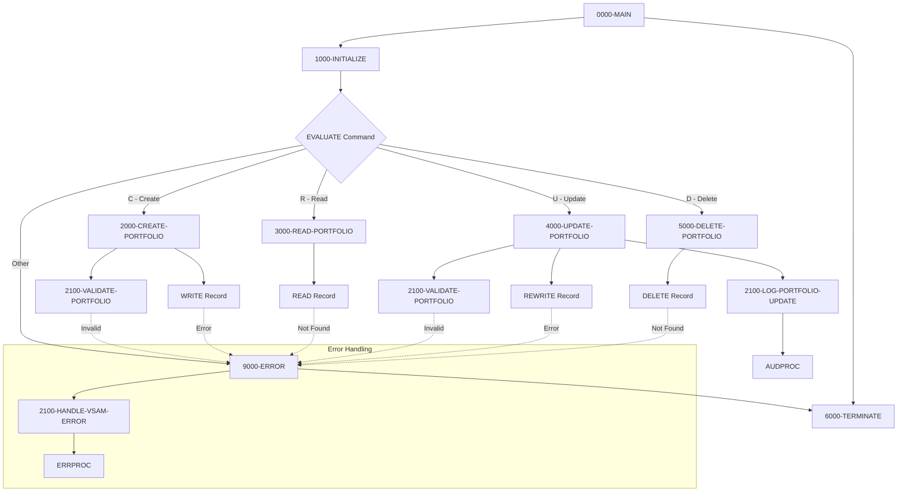

## Overview

PORTMSTR is a callable subprogram that provides complete CRUD (Create, Read, Update, Delete) operations for portfolio master records stored in a VSAM KSDS (Key-Sequenced Data Set) file. It serves as a centralized data access layer for portfolio management, ensuring consistent validation, error handling, and audit logging across all portfolio operations.

The program is designed to be called by other programs (batch or online) that need to maintain portfolio data, providing:
- **Create** - Add new portfolio records with validation
- **Read** - Retrieve portfolio records by ID
- **Update** - Modify existing portfolio records with validation and audit logging
- **Delete** - Remove portfolio records

Key features include:
- Standardized validation of portfolio ID format (PORTnnnnn)
- Required field validation (name, status)
- Status code validation (A=Active, I=Inactive, C=Closed)
- VSAM file status handling with descriptive error messages
- Audit trail logging for updates via AUDPROC
- Error logging via ERRPROC

## Program Structure



## Data Structures

### Working Storage

#### Constants

| Level | Name | Picture | Value | Description |
|-------|------|---------|-------|-------------|
| 01 | WS-CONSTANTS | | | Program constants |
| 05 | WS-PROGRAM-NAME | X(8) | 'PORTMSTR' | Program identifier |
| 05 | WS-SUCCESS | S9(4) | +0 | Success return code |
| 05 | WS-ERROR | S9(4) | +8 | Error return code |
| 05 | WS-ERROR-TEXT | X(50) | SPACES | Error message text |

#### Switches and Flags

| Level | Name | Picture | Description |
|-------|------|---------|-------------|
| 01 | WS-SWITCHES | | Program switches |
| 05 | WS-PORT-STATUS | X(2) | VSAM file status |
| 05 | WS-VALID-STATUS | X(1) | Portfolio status validator |
| 05 | WS-END-OF-FILE-SW | X | EOF indicator |

#### VSAM File Status Codes

| Value | 88-Level Name | Description |
|-------|---------------|-------------|
| 00 | PORT-SUCCESS | Operation successful |
| 10 | PORT-EOF | End of file reached |
| 22 | PORT-DUP-KEY | Duplicate key on write |
| 23 | PORT-NOT-FOUND | Record not found |

#### Valid Portfolio Status Codes

| Value | Description |
|-------|-------------|
| A | Active portfolio |
| I | Inactive portfolio |
| C | Closed portfolio |

### File Section - Portfolio Record

| Level | Name | Picture | Description |
|-------|------|---------|-------------|
| 01 | PORTFOLIO-RECORD | | 100-byte portfolio record |
| 05 | PORT-ID | X(10) | Portfolio ID (key) - format PORTnnnnn |
| 05 | PORT-NAME | X(50) | Portfolio name |
| 05 | PORT-CREATE-DATE | X(10) | Creation date |
| 05 | PORT-STATUS | X(1) | Status (A/I/C) |
| 05 | PORT-TOTAL-VALUE | S9(13)V99 COMP-3 | Total portfolio value |
| 05 | FILLER | X(24) | Reserved space |

### Linkage Section (Calling Interface)

| Level | Name | Picture | Description |
|-------|------|---------|-------------|
| 01 | LS-COMMAND-AREA | | Main request structure |
| 05 | LS-COMMAND | X(1) | Operation code (C/R/U/D) |
| 05 | LS-PORTFOLIO | X(100) | Portfolio record buffer |
| 05 | LS-RETURN-CODE | S9(4) COMP | Return code |

### Command Codes

| Code | 88-Level Name | Description |
|------|---------------|-------------|
| C | CREATE-PORT | Create new portfolio |
| R | READ-PORT | Read existing portfolio |
| U | UPDATE-PORT | Update existing portfolio |
| D | DELETE-PORT | Delete existing portfolio |

## Calling Interface

### COBOL Call Example

```cobol
       01  WS-PORT-REQUEST.
           05  WS-COMMAND          PIC X(1).
           05  WS-PORTFOLIO-DATA   PIC X(100).
           05  WS-RETURN-CODE      PIC S9(4) COMP.
       
       01  WS-PORTFOLIO-RECORD.
           05  WS-PORT-ID          PIC X(10).
           05  WS-PORT-NAME        PIC X(50).
           05  WS-PORT-CREATE-DATE PIC X(10).
           05  WS-PORT-STATUS      PIC X(1).
           05  WS-PORT-TOTAL-VALUE PIC S9(13)V99 COMP-3.
           05  FILLER              PIC X(24).
       
       * Create a new portfolio
           MOVE 'C' TO WS-COMMAND
           MOVE 'PORT00001' TO WS-PORT-ID
           MOVE 'Investment Portfolio A' TO WS-PORT-NAME
           MOVE '2024-03-20' TO WS-PORT-CREATE-DATE
           MOVE 'A' TO WS-PORT-STATUS
           MOVE 0 TO WS-PORT-TOTAL-VALUE
           MOVE WS-PORTFOLIO-RECORD TO WS-PORTFOLIO-DATA
           CALL 'PORTMSTR' USING WS-PORT-REQUEST
           IF WS-RETURN-CODE NOT = 0
               DISPLAY 'Create failed: ' WS-RETURN-CODE
           END-IF
       
       * Read a portfolio
           MOVE 'R' TO WS-COMMAND
           MOVE 'PORT00001' TO WS-PORT-ID
           MOVE WS-PORTFOLIO-RECORD TO WS-PORTFOLIO-DATA
           CALL 'PORTMSTR' USING WS-PORT-REQUEST
           IF WS-RETURN-CODE = 0
               MOVE WS-PORTFOLIO-DATA TO WS-PORTFOLIO-RECORD
               DISPLAY 'Portfolio: ' WS-PORT-NAME
           END-IF
       
       * Update a portfolio
           MOVE 'U' TO WS-COMMAND
           MOVE 'I' TO WS-PORT-STATUS
           MOVE WS-PORTFOLIO-RECORD TO WS-PORTFOLIO-DATA
           CALL 'PORTMSTR' USING WS-PORT-REQUEST
       
       * Delete a portfolio
           MOVE 'D' TO WS-COMMAND
           MOVE 'PORT00001' TO WS-PORT-ID
           MOVE WS-PORTFOLIO-RECORD TO WS-PORTFOLIO-DATA
           CALL 'PORTMSTR' USING WS-PORT-REQUEST
```

## Control Flow

### 1000-INITIALIZE

Initialization paragraph:
1. Initializes work areas
2. Opens PORTFOLIO-FILE in I-O mode (allows read and write)
3. If open fails, sets error message and performs error routine
4. Accepts current date in YYYYMMDD format

### 2000-CREATE-PORTFOLIO

Creates a new portfolio record:
1. Moves input data from linkage section to file record
2. Validates portfolio data via 2100-VALIDATE-PORTFOLIO
3. If validation fails, performs error routine
4. Writes record to VSAM file
5. If duplicate key (status '22'), sets appropriate error message
6. If other write error, sets error message and performs error routine

### 2100-VALIDATE-PORTFOLIO

Validates portfolio data fields:

1. **Portfolio ID Format**: Must be 'PORT' followed by 5 numeric characters
   - Example valid IDs: PORT00001, PORT12345
   - Rejects: ACCT00001, PORT1234A

2. **Portfolio Name**: Cannot be all spaces (required field)

3. **Portfolio Status**: Must be 'A' (Active), 'I' (Inactive), or 'C' (Closed)

If any validation fails:
- Sets descriptive error message in WS-ERROR-TEXT
- Sets WS-RETURN-CODE to WS-ERROR (+8)
- Exits paragraph

### 3000-READ-PORTFOLIO

Reads a portfolio record by key:
1. Moves input data to file record (extracts PORT-ID key)
2. Reads record from VSAM file
3. If successful, copies record back to linkage section
4. If not found (status '23'), sets error message
5. If other error, sets generic read error message

### 4000-UPDATE-PORTFOLIO

Updates an existing portfolio record:
1. Moves input data to file record
2. Validates data via 2100-VALIDATE-PORTFOLIO
3. If validation fails, performs error routine
4. Rewrites record to VSAM file
5. If not found, sets error message
6. If successful, calls 2100-LOG-PORTFOLIO-UPDATE for audit trail

### 5000-DELETE-PORTFOLIO

Deletes a portfolio record:
1. Moves input data to file record (extracts PORT-ID key)
2. Deletes record from VSAM file
3. If not found (status '23'), sets appropriate error message
4. If other error, sets generic delete error message

### 6000-TERMINATE

Cleanup and termination:
1. Closes PORTFOLIO-FILE
2. Copies WS-RETURN-CODE to LS-RETURN-CODE for caller

### 9000-ERROR

Error handling paragraph:
1. Sets WS-RETURN-CODE to WS-ERROR (+8)
2. Performs 6000-TERMINATE to close file
3. Returns to caller via GOBACK

### 2100-HANDLE-VSAM-ERROR

VSAM-specific error handling (example code):
1. Sets program ID and error category
2. Evaluates file status for specific error messages:
   - '22' (Duplicate key) → Warning severity
   - '23' (Not found) → Warning severity
   - Other → Error severity
3. Calls ERRPROC for centralized error logging

### 2100-LOG-PORTFOLIO-UPDATE

Audit logging for updates (example code):
1. Initializes audit request structure
2. Populates audit fields:
   - System ID: 'PORTFOLIO'
   - User ID, Program, Terminal
   - Action: 'UPDATE'
   - Status: 'SUCC'
   - Before/After images
3. Calls AUDPROC for audit trail recording

## File I/O

### File Definition

| Attribute | Value |
|-----------|-------|
| Logical Name | PORTFOLIO-FILE |
| DD Name | PORTFILE |
| Organization | Indexed (VSAM KSDS) |
| Access Mode | Dynamic |
| Record Key | PORT-ID |
| Record Length | 100 bytes |
| File Status | WS-PORT-STATUS |

### VSAM Operations

| Operation | Paragraph | Description |
|-----------|-----------|-------------|
| OPEN I-O | 1000-INITIALIZE | Opens file for read/write |
| WRITE | 2000-CREATE-PORTFOLIO | Adds new record |
| READ | 3000-READ-PORTFOLIO | Retrieves by key |
| REWRITE | 4000-UPDATE-PORTFOLIO | Modifies existing record |
| DELETE | 5000-DELETE-PORTFOLIO | Removes record |
| CLOSE | 6000-TERMINATE | Closes file |

## Dependencies

### Copybooks

This program does not explicitly COPY any copybooks, but it references structures and constants that align with:
- **ERRHAND** - Error handling constants (ERR-CAT-VSAM, ERR-WARNING, ERR-ERROR, ERR-VSAM-22, ERR-VSAM-23)
- **PORTFLIO** - Portfolio record layout (referenced in audit logging section)

### Called Programs

| Program | Purpose | Parameters |
|---------|---------|------------|
| ERRPROC | Error processing and logging | LS-ERROR-REQUEST |
| AUDPROC | Audit trail recording | LS-AUDIT-REQUEST |

### Related Programs

Programs that may call PORTMSTR for portfolio maintenance:
- Portfolio management batch programs
- Online portfolio inquiry/update transactions
- Portfolio valuation programs
- Account maintenance utilities

## Technical Notes

### VSAM Dynamic Access Mode

The file is opened with `ACCESS MODE IS DYNAMIC`, which allows both:
- **Sequential access** - Reading records in key order
- **Random access** - Direct access by key for READ, REWRITE, DELETE

This provides flexibility for different operation types within a single file open.

### Portfolio ID Validation

The validation ensures portfolio IDs follow the format `PORTnnnnn`:
- Positions 1-4 must be 'PORT'
- Positions 5-10 must be numeric (checked via `IS NOT NUMERIC`)

This standardized format helps prevent data integrity issues and makes records easily identifiable.

### COMP-3 (Packed Decimal) for Financial Values

The `PORT-TOTAL-VALUE` field uses COMP-3 (packed decimal) format with picture `S9(13)V99`:
- 13 integer digits + 2 decimal places
- Maximum value: ±9,999,999,999,999.99
- Stored in approximately 8 bytes
- Ideal for financial calculations requiring decimal precision

### Return Codes

| Code | Constant | Meaning |
|------|----------|---------|
| 0 | WS-SUCCESS | Operation completed successfully |
| 8 | WS-ERROR | Operation failed (see WS-ERROR-TEXT) |

### Error Messages

| Message | Cause |
|---------|-------|
| Error opening Portfolio file | OPEN I-O failed |
| Invalid command | Command not C, R, U, or D |
| Invalid Portfolio ID format | ID not PORTnnnnn |
| Portfolio Name is required | Name is spaces |
| Invalid Portfolio Status | Status not A, I, or C |
| Portfolio ID already exists | Duplicate key on CREATE |
| Error writing Portfolio record | WRITE failed |
| Portfolio not found | Record doesn't exist (READ) |
| Error reading Portfolio | READ failed |
| Portfolio not found for update | Record doesn't exist (UPDATE) |
| Error updating Portfolio | REWRITE failed |
| Portfolio not found for deletion | Record doesn't exist (DELETE) |
| Error deleting Portfolio | DELETE failed |

### Audit Trail

The 2100-LOG-PORTFOLIO-UPDATE paragraph demonstrates audit logging for UPDATE operations:
- Records before and after images
- Captures user ID, terminal, and program name
- Logs success status with descriptive message

This audit trail supports compliance requirements and debugging.
