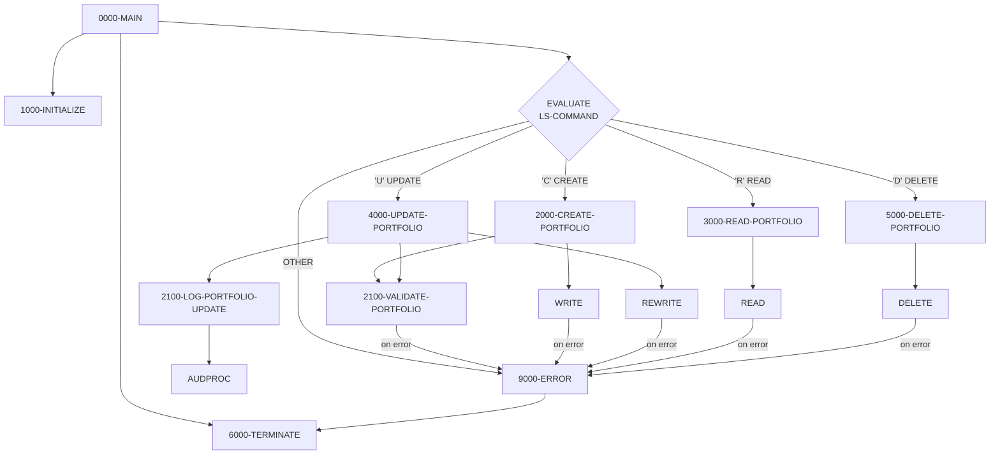

## Overview

PORTMSTR is a callable service program that provides complete CRUD (Create, Read, Update, Delete) operations for portfolio master records. It manages an indexed VSAM file containing portfolio information and is designed to be called by other programs requiring portfolio data access.

The program implements a command-driven interface supporting four operations:
- **C (Create)** - Add a new portfolio record
- **R (Read)** - Retrieve an existing portfolio record
- **U (Update)** - Modify an existing portfolio record
- **D (Delete)** - Remove a portfolio record

Key features include:
- **Data validation** - Validates portfolio ID format and required fields before writes
- **Error handling** - Returns meaningful error messages for all failure conditions
- **Audit logging** - Logs portfolio updates for compliance tracking
- **VSAM status handling** - Interprets and handles all VSAM file status codes

The program uses dynamic access mode, allowing both keyed and sequential operations on the indexed file.

## Program Structure



## Data Structures

### File Section

| Level | Name | Picture | Description |
|-------|------|---------|-------------|
| FD | PORTFOLIO-FILE | 100 bytes | Portfolio master file definition |
| 01 | PORTFOLIO-RECORD | - | Portfolio record structure |
| 05 | PORT-ID | PIC X(10) | Portfolio identifier (record key) |
| 05 | PORT-NAME | PIC X(50) | Portfolio name |
| 05 | PORT-CREATE-DATE | PIC X(10) | Creation date |
| 05 | PORT-STATUS | PIC X(01) | Status: `A`=Active, `I`=Inactive, `C`=Closed |
| 05 | PORT-TOTAL-VALUE | PIC S9(13)V99 COMP-3 | Total portfolio value |
| 05 | FILLER | PIC X(24) | Reserved space |

### Working Storage

#### Constants

| Level | Name | Picture | Value | Description |
|-------|------|---------|-------|-------------|
| 05 | WS-PROGRAM-NAME | PIC X(08) | `'PORTMSTR'` | Program identifier |
| 05 | WS-SUCCESS | PIC S9(4) | +0 | Success return code |
| 05 | WS-ERROR | PIC S9(4) | +8 | Error return code |
| 05 | WS-ERROR-TEXT | PIC X(50) | SPACES | Error message text |

#### Switches and Flags

| Level | Name | Picture | Description |
|-------|------|---------|-------------|
| 05 | WS-PORT-STATUS | PIC X(02) | VSAM file status |
| 05 | WS-VALID-STATUS | PIC X(01) | Portfolio status validation field |
| 05 | WS-END-OF-FILE-SW | PIC X | End-of-file indicator |

#### VSAM File Status Conditions (88-Levels)

| Condition Name | Value | Description |
|----------------|-------|-------------|
| PORT-SUCCESS | `00` | Operation successful |
| PORT-EOF | `10` | End of file reached |
| PORT-NOT-FOUND | `23` | Record not found |
| PORT-DUP-KEY | `22` | Duplicate key on write |

#### Valid Portfolio Status Conditions (88-Levels)

| Condition Name | Value | Description |
|----------------|-------|-------------|
| VALID-STATUS | `A`, `I`, `C` | Active, Inactive, or Closed |

#### Work Areas

| Level | Name | Picture | Description |
|-------|------|---------|-------------|
| 05 | WS-CURRENT-DATE | PIC X(10) | Current system date |
| 05 | WS-RETURN-CODE | PIC S9(4) COMP | Return code for caller |

### Linkage Section (Interface)

| Level | Name | Picture | Description |
|-------|------|---------|-------------|
| 01 | LS-COMMAND-AREA | - | Main interface structure |
| 05 | LS-COMMAND | PIC X(01) | Command code (`C`/`R`/`U`/`D`) |
| 05 | LS-PORTFOLIO | PIC X(100) | Portfolio record data |
| 05 | LS-RETURN-CODE | PIC S9(4) COMP | Return code (0=success, 8=error) |

### Command Codes (88-Level Conditions)

| Condition Name | Value | Description |
|----------------|-------|-------------|
| CREATE-PORT | `C` | Create new portfolio |
| READ-PORT | `R` | Read existing portfolio |
| UPDATE-PORT | `U` | Update existing portfolio |
| DELETE-PORT | `D` | Delete portfolio |

## File I/O

### File Definition

| Logical Name | DD Name | Organization | Access Mode | Record Key | Description |
|--------------|---------|--------------|-------------|------------|-------------|
| PORTFOLIO-FILE | PORTFILE | Indexed (VSAM KSDS) | Dynamic | PORT-ID | Portfolio master file |

### File Operations by Paragraph

| Paragraph | Operation | Purpose |
|-----------|-----------|---------|
| 1000-INITIALIZE | OPEN I-O | Open file for read/write access |
| 2000-CREATE-PORTFOLIO | WRITE | Add new portfolio record |
| 3000-READ-PORTFOLIO | READ | Retrieve portfolio by key |
| 4000-UPDATE-PORTFOLIO | REWRITE | Update existing portfolio |
| 5000-DELETE-PORTFOLIO | DELETE | Remove portfolio record |
| 6000-TERMINATE | CLOSE | Close the file |

## Control Flow

### 1000-INITIALIZE

Prepares the program for operation:
1. Initializes work areas
2. Opens PORTFOLIO-FILE in I-O mode (read/write)
3. Checks file status; if not successful, triggers error handling
4. Accepts current date from system using `ACCEPT ... FROM DATE YYYYMMDD`

### 2000-CREATE-PORTFOLIO

Creates a new portfolio record:
1. Moves input data from linkage section to file record
2. Calls `2100-VALIDATE-PORTFOLIO` to validate the data
3. If validation fails, performs error routine
4. Writes the record to the file
5. Handles duplicate key error (file status `'22'`) with specific message
6. Handles other write errors

### 2100-VALIDATE-PORTFOLIO

Validates portfolio data before create or update:

1. **Portfolio ID Format**: Must start with `'PORT'` followed by 5 numeric digits
   ```cobol
   IF PORT-ID(1:4) NOT = 'PORT'
      OR PORT-ID(5:5) IS NOT NUMERIC
   ```
2. **Portfolio Name**: Cannot be spaces (required field)
3. **Portfolio Status**: Must be `'A'` (Active), `'I'` (Inactive), or `'C'` (Closed)

Uses `EXIT PARAGRAPH` to return early when validation fails, setting `WS-RETURN-CODE` to indicate error.

### 3000-READ-PORTFOLIO

Reads a portfolio record by key:
1. Moves input data to file record (to set the key)
2. Reads the record using the key
3. On success, moves record data back to linkage section for caller
4. Handles not-found condition (file status `'23'`)
5. Handles other read errors

### 4000-UPDATE-PORTFOLIO

Updates an existing portfolio record:
1. Moves input data to file record
2. Validates the data via `2100-VALIDATE-PORTFOLIO`
3. Rewrites the record
4. Handles not-found condition
5. Handles other rewrite errors
6. Calls `2100-LOG-PORTFOLIO-UPDATE` to create audit trail

### 5000-DELETE-PORTFOLIO

Deletes a portfolio record:
1. Moves input data to file record (to set the key)
2. Deletes the record
3. Handles not-found condition
4. Handles other delete errors

### 6000-TERMINATE

Cleanup processing:
1. Closes the PORTFOLIO-FILE
2. Moves the return code to the linkage section for the caller

### 9000-ERROR

Error handling routine:
1. Sets return code to error value (8)
2. Performs termination to close files
3. Returns to caller via GOBACK

### 2100-HANDLE-VSAM-ERROR (Example)

Demonstrates structured VSAM error handling:
- Categorizes error by VSAM status code
- Sets appropriate severity level
- Provides descriptive error messages
- Calls ERRPROC for centralized error logging

### 2100-LOG-PORTFOLIO-UPDATE (Audit)

Creates audit trail for portfolio updates:
- Records system, user, program, and terminal information
- Captures transaction type (`TRAN`) and action (`UPDATE`)
- Stores before and after images of the record
- Calls AUDPROC for audit logging

## Dependencies

### Copybooks

This program does not use external copybooks. The portfolio record structure is defined inline in the FILE SECTION. However, the audit logging paragraph references fields that would typically come from copybooks:
- Error handling fields (ERR-CAT-VSAM, ERR-WARNING, etc.)
- Audit request fields (LS-AUDIT-REQUEST, LS-SYSTEM-ID, etc.)

### Called Programs

| Program | Purpose | When Called |
|---------|---------|-------------|
| ERRPROC | Error processing and logging | On VSAM errors (example code) |
| AUDPROC | Audit trail logging | After successful updates |

### Related Programs

Programs that may call PORTMSTR for portfolio maintenance:
- Online transaction programs requiring portfolio CRUD
- Batch programs performing portfolio updates
- Portfolio inquiry programs (for read operations)

Related copybook for portfolio structure:
- **PORTFLIO** - Extended portfolio record layout with client info, financial info, and audit fields

## Usage Example

To call PORTMSTR from another program:

```cobol
WORKING-STORAGE SECTION.
01  WS-COMMAND-AREA.
    05  WS-COMMAND          PIC X(01).
    05  WS-PORTFOLIO-DATA   PIC X(100).
    05  WS-RETURN-CODE      PIC S9(4) COMP.

01  WS-PORTFOLIO-RECORD.
    05  WS-PORT-ID          PIC X(10).
    05  WS-PORT-NAME        PIC X(50).
    05  WS-PORT-DATE        PIC X(10).
    05  WS-PORT-STATUS      PIC X(01).
    05  WS-PORT-VALUE       PIC S9(13)V99 COMP-3.
    05  FILLER              PIC X(24).

PROCEDURE DIVISION.
    * Create a new portfolio
    MOVE 'C' TO WS-COMMAND
    MOVE 'PORT00001' TO WS-PORT-ID
    MOVE 'Investment Portfolio' TO WS-PORT-NAME
    MOVE '2024-03-20' TO WS-PORT-DATE
    MOVE 'A' TO WS-PORT-STATUS
    MOVE 100000.00 TO WS-PORT-VALUE
    MOVE WS-PORTFOLIO-RECORD TO WS-PORTFOLIO-DATA
    
    CALL 'PORTMSTR' USING WS-COMMAND-AREA
    
    IF WS-RETURN-CODE = 0
        DISPLAY 'Portfolio created successfully'
    ELSE
        DISPLAY 'Error creating portfolio'
    END-IF
    
    * Read the portfolio
    MOVE 'R' TO WS-COMMAND
    MOVE 'PORT00001' TO WS-PORT-ID
    MOVE WS-PORTFOLIO-RECORD TO WS-PORTFOLIO-DATA
    
    CALL 'PORTMSTR' USING WS-COMMAND-AREA
    
    IF WS-RETURN-CODE = 0
        MOVE WS-PORTFOLIO-DATA TO WS-PORTFOLIO-RECORD
        DISPLAY 'Portfolio Value: ' WS-PORT-VALUE
    END-IF
```

## Validation Rules

| Field | Rule | Error Message |
|-------|------|---------------|
| PORT-ID | Must be `'PORT'` + 5 numeric digits | "Invalid Portfolio ID format" |
| PORT-NAME | Cannot be spaces | "Portfolio Name is required" |
| PORT-STATUS | Must be `'A'`, `'I'`, or `'C'` | "Invalid Portfolio Status" |

## Return Codes

| Code | Meaning |
|------|---------|
| 0 | Success |
| 8 | Error (see WS-ERROR-TEXT for details) |

## VSAM File Status Codes

| Status | Meaning | Handling |
|--------|---------|----------|
| `00` | Success | Continue processing |
| `10` | End of file | Set EOF flag |
| `22` | Duplicate key | "Portfolio ID already exists" |
| `23` | Record not found | "Portfolio not found" |

## Technical Notes

### Dynamic Access Mode

The file is opened with `ACCESS MODE IS DYNAMIC`, which allows:
- Keyed READ operations (used in this program)
- Sequential READ NEXT operations (if needed)
- Direct WRITE, REWRITE, and DELETE by key

### COMP-3 (Packed Decimal)

The `PORT-TOTAL-VALUE` field uses `COMP-3` format:
- `PIC S9(13)V99 COMP-3` stores up to 13 integer digits and 2 decimal places
- Packed decimal is efficient for financial calculations
- Takes approximately 8 bytes of storage

### EXIT PARAGRAPH

The validation routine uses `EXIT PARAGRAPH` for early returns:
```cobol
IF PORT-ID(1:4) NOT = 'PORT'
    MOVE 'Invalid Portfolio ID format' TO WS-ERROR-TEXT
    MOVE WS-ERROR TO WS-RETURN-CODE
    EXIT PARAGRAPH
END-IF
```
This provides clean exit from validation when an error is found without complex nested IF structures.
