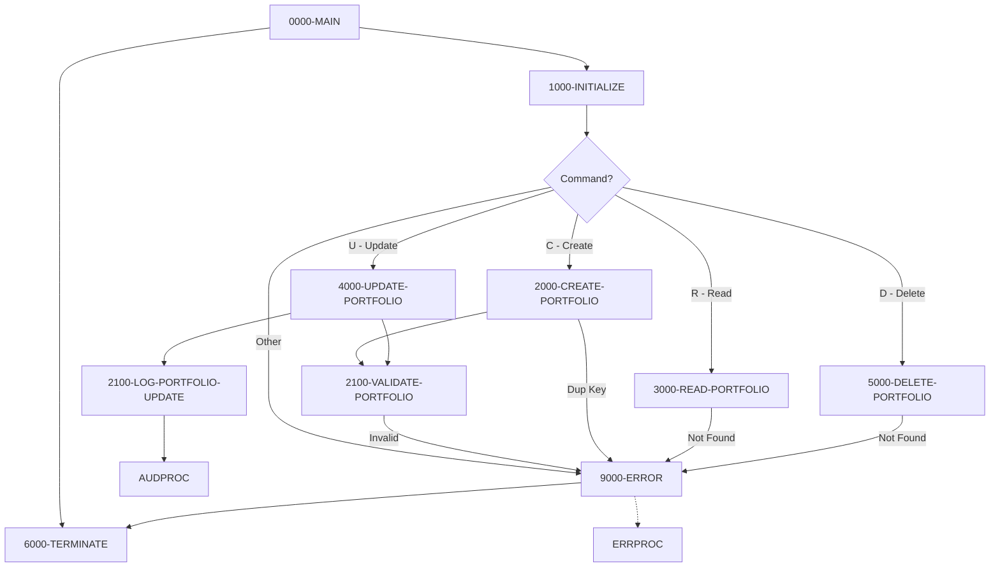

## Overview

PORTMSTR is a COBOL subprogram that provides complete CRUD (Create, Read, Update, Delete) operations for portfolio master records. It manages a VSAM indexed file containing portfolio information and is designed to be called by other programs that need to maintain portfolio data.

The program implements:
- **Data validation** - Validates portfolio ID format, required fields, and status codes
- **Error handling** - Comprehensive error detection and reporting for file operations
- **Audit logging** - Records portfolio updates for compliance and tracking
- **VSAM operations** - Full indexed file support with dynamic access mode

This is a core data management program that other portfolio-related programs depend on for consistent portfolio record maintenance.

## Program Structure



## Data Structures

### File Section - Portfolio Record

| Level | Name | Picture | Size | Description |
|-------|------|---------|------|-------------|
| 01 | PORTFOLIO-RECORD | - | 100 bytes | Complete portfolio record |
| 05 | PORT-ID | PIC X(10) | 10 | Portfolio identifier (key) |
| 05 | PORT-NAME | PIC X(50) | 50 | Portfolio name |
| 05 | PORT-CREATE-DATE | PIC X(10) | 10 | Creation date |
| 05 | PORT-STATUS | PIC X(01) | 1 | Status code (A/I/C) |
| 05 | PORT-TOTAL-VALUE | PIC S9(13)V99 COMP-3 | 8 | Total portfolio value (packed decimal) |
| 05 | FILLER | PIC X(24) | 24 | Reserved space |

### Working Storage

#### Constants

| Level | Name | Picture | Value | Description |
|-------|------|---------|-------|-------------|
| 05 | WS-PROGRAM-NAME | PIC X(08) | 'PORTMSTR' | Program identifier |
| 05 | WS-SUCCESS | PIC S9(4) | +0 | Success return code |
| 05 | WS-ERROR | PIC S9(4) | +8 | Error return code |
| 05 | WS-ERROR-TEXT | PIC X(50) | SPACES | Error message text |

#### File Status and Switches

| Level | Name | Picture | Description |
|-------|------|---------|-------------|
| 05 | WS-PORT-STATUS | PIC X(02) | VSAM file status |
| 05 | WS-VALID-STATUS | PIC X(01) | Status validation field |
| 05 | WS-END-OF-FILE-SW | PIC X | EOF indicator |

#### Work Areas

| Level | Name | Picture | Description |
|-------|------|---------|-------------|
| 05 | WS-CURRENT-DATE | PIC X(10) | System date |
| 05 | WS-RETURN-CODE | PIC S9(4) COMP | Operation return code |

### File Status Conditions (88-levels)

| Condition | Value | Meaning |
|-----------|-------|---------|
| PORT-SUCCESS | '00' | Operation successful |
| PORT-EOF | '10' | End of file reached |
| PORT-NOT-FOUND | '23' | Record not found |
| PORT-DUP-KEY | '22' | Duplicate key on write |

### Portfolio Status Codes (88-levels)

| Condition | Values | Meaning |
|-----------|--------|---------|
| VALID-STATUS | 'A', 'I', 'C' | Active, Inactive, Closed |

### Linkage Section (Interface)

| Level | Name | Picture | Description |
|-------|------|---------|-------------|
| 01 | LS-COMMAND-AREA | - | Input/output parameter block |
| 05 | LS-COMMAND | PIC X(01) | Operation command |
| 05 | LS-PORTFOLIO | PIC X(100) | Portfolio record data |
| 05 | LS-RETURN-CODE | PIC S9(4) COMP | Return code |

### Command Codes (88-levels)

| Condition | Value | Operation |
|-----------|-------|-----------|
| CREATE-PORT | 'C' | Create new portfolio |
| READ-PORT | 'R' | Read existing portfolio |
| UPDATE-PORT | 'U' | Update existing portfolio |
| DELETE-PORT | 'D' | Delete portfolio |

## File I/O

### File Definition

| Attribute | Value |
|-----------|-------|
| Logical Name | PORTFOLIO-FILE |
| Physical Name (DD) | PORTFILE |
| Organization | Indexed (VSAM KSDS) |
| Access Mode | Dynamic |
| Record Key | PORT-ID |
| Record Length | 100 bytes |
| File Status | WS-PORT-STATUS |

### File Operations by Function

| Function | Operation | Paragraph |
|----------|-----------|-----------|
| Initialize | OPEN I-O | 1000-INITIALIZE |
| Create | WRITE | 2000-CREATE-PORTFOLIO |
| Read | READ | 3000-READ-PORTFOLIO |
| Update | REWRITE | 4000-UPDATE-PORTFOLIO |
| Delete | DELETE | 5000-DELETE-PORTFOLIO |
| Terminate | CLOSE | 6000-TERMINATE |

## Control Flow

### 0000-MAIN

Entry point that orchestrates the CRUD operations:

1. Performs initialization
2. Dispatches to appropriate operation based on LS-COMMAND
3. Performs termination
4. Returns to caller via GOBACK

### 1000-INITIALIZE

Prepares the program for execution:

1. Initializes work areas
2. Opens PORTFOLIO-FILE for I-O (read and write)
3. If open fails, triggers error handling
4. Accepts current date from system in YYYYMMDD format

### 2000-CREATE-PORTFOLIO

Creates a new portfolio record:

1. Moves input data to PORTFOLIO-RECORD
2. Validates portfolio data (2100-VALIDATE-PORTFOLIO)
3. If validation fails, triggers error
4. Writes record to file
5. If duplicate key (PORT-DUP-KEY), triggers error with "Portfolio ID already exists"
6. If other error, triggers error with write failure message

### 2100-VALIDATE-PORTFOLIO

Validates portfolio data against business rules:

**Portfolio ID Validation:**
- First 4 characters must be 'PORT'
- Characters 5-9 must be numeric
- Example valid ID: `PORT00001`

**Portfolio Name Validation:**
- Cannot be empty (spaces)

**Status Validation:**
- Must be 'A' (Active), 'I' (Inactive), or 'C' (Closed)

If any validation fails, sets WS-RETURN-CODE to WS-ERROR and exits.

### 3000-READ-PORTFOLIO

Retrieves an existing portfolio record:

1. Moves input (containing PORT-ID key) to PORTFOLIO-RECORD
2. Reads record by key
3. On success, returns record data in LS-PORTFOLIO
4. On not found (PORT-NOT-FOUND), triggers error
5. On other error, triggers error with read failure message

### 4000-UPDATE-PORTFOLIO

Updates an existing portfolio record:

1. Moves input data to PORTFOLIO-RECORD
2. Validates portfolio data
3. If validation fails, triggers error
4. Rewrites record to file
5. On not found, triggers error with "Portfolio not found for update"
6. On other error, triggers error with update failure message
7. On success, logs the update (2100-LOG-PORTFOLIO-UPDATE)

### 5000-DELETE-PORTFOLIO

Deletes an existing portfolio record:

1. Moves input (containing PORT-ID key) to PORTFOLIO-RECORD
2. Deletes record from file
3. On not found, triggers error with "Portfolio not found for deletion"
4. On other error, triggers error with delete failure message

### 6000-TERMINATE

Cleanup and return:

1. Closes PORTFOLIO-FILE
2. Moves WS-RETURN-CODE to LS-RETURN-CODE for caller

### 9000-ERROR

Error handling routine:

1. Sets WS-RETURN-CODE to WS-ERROR (8)
2. Performs termination (closes file)
3. Returns immediately to caller via GOBACK

### 2100-LOG-PORTFOLIO-UPDATE

Audit logging for successful updates:

1. Initializes audit request
2. Populates audit fields:
   - System ID: 'PORTFOLIO'
   - User ID, Program, Terminal
   - Type: 'TRAN', Action: 'UPDATE', Status: 'SUCC'
   - Portfolio ID and Account Number
   - Before and after images
   - Success message
3. Calls AUDPROC for audit logging

### 2100-HANDLE-VSAM-ERROR

Example VSAM error handling (for reference):

1. Populates error request with program ID and category
2. Evaluates file status for specific errors:
   - '22' (Duplicate key) → Warning severity
   - '23' (Not found) → Warning severity
   - Other → Error severity
3. Calls ERRPROC for error processing

## Calling Interface

### How to Call PORTMSTR

```cobol
WORKING-STORAGE SECTION.
01  WS-PORT-REQUEST.
    05  WS-COMMAND         PIC X(01).
    05  WS-PORTFOLIO-DATA  PIC X(100).
    05  WS-RETURN-CODE     PIC S9(4) COMP.

01  WS-PORTFOLIO-RECORD.
    05  WS-PORT-ID         PIC X(10).
    05  WS-PORT-NAME       PIC X(50).
    05  WS-PORT-DATE       PIC X(10).
    05  WS-PORT-STATUS     PIC X(01).
    05  WS-PORT-VALUE      PIC S9(13)V99 COMP-3.
    05  FILLER             PIC X(24).

PROCEDURE DIVISION.
    *> Create a new portfolio
    MOVE 'C' TO WS-COMMAND
    MOVE 'PORT00001' TO WS-PORT-ID
    MOVE 'Growth Portfolio' TO WS-PORT-NAME
    MOVE '2024-03-20' TO WS-PORT-DATE
    MOVE 'A' TO WS-PORT-STATUS
    MOVE 0 TO WS-PORT-VALUE
    MOVE WS-PORTFOLIO-RECORD TO WS-PORTFOLIO-DATA
    
    CALL 'PORTMSTR' USING WS-PORT-REQUEST
    
    IF WS-RETURN-CODE = 0
        DISPLAY 'Portfolio created successfully'
    ELSE
        DISPLAY 'Error creating portfolio'
    END-IF
    
    *> Read a portfolio
    MOVE 'R' TO WS-COMMAND
    MOVE 'PORT00001' TO WS-PORT-ID
    MOVE WS-PORTFOLIO-RECORD TO WS-PORTFOLIO-DATA
    
    CALL 'PORTMSTR' USING WS-PORT-REQUEST
    
    IF WS-RETURN-CODE = 0
        MOVE WS-PORTFOLIO-DATA TO WS-PORTFOLIO-RECORD
        DISPLAY 'Portfolio Name: ' WS-PORT-NAME
    END-IF
```

### Return Codes

| Code | Meaning |
|------|---------|
| 0 | Operation successful |
| 8 | Error occurred (check WS-ERROR-TEXT for details) |

## Dependencies

### Copybooks

None directly referenced via COPY statement. The program defines all structures inline.

### Called Programs

| Program | Purpose | Called From |
|---------|---------|-------------|
| ERRPROC | Error processing and logging | 2100-HANDLE-VSAM-ERROR |
| AUDPROC | Audit logging | 2100-LOG-PORTFOLIO-UPDATE |

### JCL Requirements

```jcl
//PORTFILE DD DSN=your.portfolio.file,DISP=SHR
```

The PORTFILE DD must point to a VSAM KSDS (Key-Sequenced Data Set) with:
- Key position: 1
- Key length: 10
- Record length: 100 (fixed)

## Validation Rules

### Portfolio ID Format

```
PORT#####
│   │
│   └─ 5 numeric digits (00001-99999)
└───── Literal 'PORT'
```

Valid examples: `PORT00001`, `PORT12345`, `PORT99999`
Invalid examples: `ACCT00001`, `PORT0001A`, `PORT001`

### Portfolio Status Codes

| Code | Status | Description |
|------|--------|-------------|
| A | Active | Portfolio is active and available for transactions |
| I | Inactive | Portfolio is temporarily inactive |
| C | Closed | Portfolio is permanently closed |

## Technical Notes

### COMP-3 (Packed Decimal) Field

The PORT-TOTAL-VALUE field uses COMP-3 (packed decimal) format:
- PIC S9(13)V99 stores up to 13 integer digits and 2 decimal places
- Packed format uses approximately half the storage of display format
- Supports values from -9,999,999,999,999.99 to +9,999,999,999,999.99

### Dynamic Access Mode

The file is opened with DYNAMIC access mode, allowing:
- Sequential reads (READ NEXT)
- Random reads by key (READ with key)
- Updates and deletes by key

### Error Recovery

The program uses immediate termination on error (9000-ERROR performs GOBACK). This ensures:
- File is properly closed before returning
- Return code indicates error condition
- Calling program can handle the error appropriately

### Audit Trail

The 2100-LOG-PORTFOLIO-UPDATE paragraph captures before and after images of portfolio records, providing a complete audit trail for compliance requirements.
