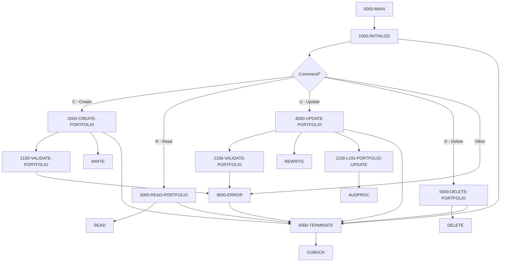

## Overview

PORTMSTR is a COBOL subprogram that provides centralized master file maintenance operations for the portfolio management system. It implements the four fundamental CRUD operations (Create, Read, Update, Delete) for portfolio records stored in a VSAM KSDS (Key-Sequenced Data Set) file.

The program is designed to be called by other programs rather than executed standalone, receiving commands and data through its linkage section. This modular approach ensures:

- **Consistent Data Access**: All portfolio file operations go through a single program
- **Centralized Validation**: Portfolio data is validated using the same rules regardless of the caller
- **Audit Trail**: Update operations are logged for compliance and tracking
- **Error Handling**: Standardized error handling and return codes

The program validates portfolio IDs (must start with 'PORT' followed by 5 numeric digits), requires portfolio names, and enforces valid status codes (Active, Inactive, Closed).

## Program Structure



## Data Structures

### File Section - Portfolio Record

| Level | Name | Picture | Description |
|-------|------|---------|-------------|
| 01 | PORTFOLIO-RECORD | - | 100-byte portfolio record |
| 05 | PORT-ID | X(10) | Portfolio identifier (key field) |
| 05 | PORT-NAME | X(50) | Portfolio name |
| 05 | PORT-CREATE-DATE | X(10) | Creation date |
| 05 | PORT-STATUS | X(01) | Status: `A`=Active, `I`=Inactive, `C`=Closed |
| 05 | PORT-TOTAL-VALUE | S9(13)V99 COMP-3 | Total portfolio value (packed decimal) |
| 05 | FILLER | X(24) | Reserved space |

### Working Storage

#### Constants

| Level | Name | Picture | Value | Description |
|-------|------|---------|-------|-------------|
| 05 | WS-PROGRAM-NAME | X(08) | 'PORTMSTR' | Program identifier |
| 05 | WS-SUCCESS | S9(4) | +0 | Success return code |
| 05 | WS-ERROR | S9(4) | +8 | Error return code |
| 05 | WS-ERROR-TEXT | X(50) | SPACES | Error message text |

#### Switches and Status

| Level | Name | Picture | Description |
|-------|------|---------|-------------|
| 05 | WS-PORT-STATUS | X(02) | VSAM file status |
| - | PORT-SUCCESS | 88 | Value '00' - Operation successful |
| - | PORT-EOF | 88 | Value '10' - End of file |
| - | PORT-NOT-FOUND | 88 | Value '23' - Record not found |
| - | PORT-DUP-KEY | 88 | Value '22' - Duplicate key |
| 05 | WS-VALID-STATUS | X(01) | Portfolio status validation |
| - | VALID-STATUS | 88 | Values 'A', 'I', 'C' |
| 05 | WS-END-OF-FILE-SW | X | End of file switch |

#### Work Areas

| Level | Name | Picture | Description |
|-------|------|---------|-------------|
| 05 | WS-CURRENT-DATE | X(10) | Current date (YYYYMMDD format) |
| 05 | WS-RETURN-CODE | S9(4) COMP | Return code for caller |

### Linkage Section (Calling Interface)

| Level | Name | Picture | Description |
|-------|------|---------|-------------|
| 01 | LS-COMMAND-AREA | - | Main parameter structure |
| 05 | LS-COMMAND | X(01) | Command code (see table below) |
| 05 | LS-PORTFOLIO | X(100) | Portfolio record data |
| 05 | LS-RETURN-CODE | S9(4) COMP | Return code to caller |

### Command Codes

| Code | 88-Level Name | Description |
|------|---------------|-------------|
| `C` | CREATE-PORT | Create new portfolio record |
| `R` | READ-PORT | Read existing portfolio record |
| `U` | UPDATE-PORT | Update existing portfolio record |
| `D` | DELETE-PORT | Delete portfolio record |

## File I/O

### File Definition

| Logical Name | DD Name | Organization | Access Mode | Record Key | Record Length |
|--------------|---------|--------------|-------------|------------|---------------|
| PORTFOLIO-FILE | PORTFILE | Indexed (VSAM KSDS) | Dynamic | PORT-ID | 100 bytes |

### File Operations by Function

| Function | Operation | Description |
|----------|-----------|-------------|
| Initialize | OPEN I-O | Open file for input/output |
| Create | WRITE | Write new record |
| Read | READ | Read record by key |
| Update | REWRITE | Update existing record |
| Delete | DELETE | Delete record by key |
| Terminate | CLOSE | Close file |

### VSAM Status Codes

| Status | Meaning | Handling |
|--------|---------|----------|
| 00 | Success | Continue processing |
| 10 | End of file | Set EOF flag |
| 22 | Duplicate key | Error on create |
| 23 | Record not found | Error on read/update/delete |

## Control Flow

### Initialize (1000-INITIALIZE)

1. Initializes work areas
2. Opens PORTFOLIO-FILE for I-O (input-output) access
3. If open fails, invokes error routine
4. Accepts current date in YYYYMMDD format

### Create Portfolio (2000-CREATE-PORTFOLIO)

Creates a new portfolio record:

1. Moves input data from LS-PORTFOLIO to PORTFOLIO-RECORD
2. Calls 2100-VALIDATE-PORTFOLIO to validate data
3. If validation fails, invokes error routine
4. Writes the record to the file
5. If duplicate key (status 22), reports "Portfolio ID already exists"
6. If other error, reports "Error writing Portfolio record"

### Validate Portfolio (2100-VALIDATE-PORTFOLIO)

Validates portfolio data against business rules:

1. **Portfolio ID Format**: Must start with 'PORT' followed by 5 numeric digits
   - Example valid: `PORT12345`
   - Error: "Invalid Portfolio ID format"

2. **Portfolio Name**: Must not be spaces
   - Error: "Portfolio Name is required"

3. **Portfolio Status**: Must be one of: `A` (Active), `I` (Inactive), `C` (Closed)
   - Error: "Invalid Portfolio Status"

Returns WS-ERROR in WS-RETURN-CODE if validation fails.

### Read Portfolio (3000-READ-PORTFOLIO)

Reads a portfolio record by key:

1. Moves input key from LS-PORTFOLIO to PORTFOLIO-RECORD
2. Reads the record using the key
3. On success (status 00): Returns record in LS-PORTFOLIO
4. On not found (status 23): Reports "Portfolio not found"
5. On other error: Reports "Error reading Portfolio"

### Update Portfolio (4000-UPDATE-PORTFOLIO)

Updates an existing portfolio record:

1. Moves input data from LS-PORTFOLIO to PORTFOLIO-RECORD
2. Calls 2100-VALIDATE-PORTFOLIO to validate data
3. If validation fails, invokes error routine
4. Rewrites the record
5. On not found: Reports "Portfolio not found for update"
6. On other error: Reports "Error updating Portfolio"
7. Calls 2100-LOG-PORTFOLIO-UPDATE for audit logging

### Delete Portfolio (5000-DELETE-PORTFOLIO)

Deletes a portfolio record:

1. Moves input key from LS-PORTFOLIO to PORTFOLIO-RECORD
2. Deletes the record by key
3. On not found: Reports "Portfolio not found for deletion"
4. On other error: Reports "Error deleting Portfolio"

### Terminate (6000-TERMINATE)

1. Closes PORTFOLIO-FILE
2. Moves WS-RETURN-CODE to LS-RETURN-CODE for caller

### Error Routine (9000-ERROR)

1. Sets WS-RETURN-CODE to WS-ERROR (+8)
2. Calls 6000-TERMINATE to close file
3. Returns to caller via GOBACK

### Audit Logging (2100-LOG-PORTFOLIO-UPDATE)

Logs portfolio updates for audit compliance:

1. Initializes audit request structure
2. Populates audit fields:
   - System ID: 'PORTFOLIO'
   - Program: 'PORTMSTR'
   - Action: 'UPDATE'
   - Status: 'SUCC'
   - Before/after images of the record
3. Calls AUDPROC for audit processing

## Dependencies

### Copybooks

This program defines its data structures inline rather than using copybooks. However, it references structures that align with:

- **PORTFLIO** - Standard portfolio record layout (similar structure)
- **ERRHAND** - Error handling patterns (referenced in error routine)

### Called Programs

| Program | Purpose |
|---------|---------|
| ERRPROC | Error processing and logging |
| AUDPROC | Audit trail logging |

### Related Programs

Other programs in the portfolio subsystem:

| Program | Description |
|---------|-------------|
| PORTADD | Portfolio addition |
| PORTDEL | Portfolio deletion |
| PORTREAD | Portfolio read operations |
| PORTUPDT | Portfolio updates |
| PORTTRAN | Portfolio transactions |
| PORTVALD | Portfolio validation |
| PORTTEST | Portfolio testing |

## Technical Notes

### Calling Convention

To call PORTMSTR from another COBOL program:

```cobol
WORKING-STORAGE SECTION.
01  WS-COMMAND-AREA.
    05  WS-COMMAND          PIC X(01).
    05  WS-PORTFOLIO-DATA   PIC X(100).
    05  WS-RETURN-CODE      PIC S9(4) COMP.

PROCEDURE DIVISION.
* Create a new portfolio
    MOVE 'C' TO WS-COMMAND
    MOVE 'PORT00001' TO WS-PORTFOLIO-DATA(1:10)
    MOVE 'My Portfolio' TO WS-PORTFOLIO-DATA(11:50)
    MOVE 'A' TO WS-PORTFOLIO-DATA(71:1)
    
    CALL 'PORTMSTR' USING WS-COMMAND-AREA
    
    IF WS-RETURN-CODE NOT = 0
        ... handle error ...
    END-IF
    
* Read a portfolio
    MOVE 'R' TO WS-COMMAND
    MOVE 'PORT00001' TO WS-PORTFOLIO-DATA(1:10)
    
    CALL 'PORTMSTR' USING WS-COMMAND-AREA
    
    IF WS-RETURN-CODE = 0
        ... process WS-PORTFOLIO-DATA ...
    END-IF
```

### Return Codes

| Code | Meaning |
|------|---------|
| 0 | Success |
| 8 | Error (check WS-ERROR-TEXT for details) |

### Portfolio ID Validation Rules

The portfolio ID must follow this format:
- Positions 1-4: Literal 'PORT'
- Positions 5-9: Numeric digits (00000-99999)

Examples:
- ✓ `PORT00001` - Valid
- ✓ `PORT99999` - Valid
- ✗ `ACCT00001` - Invalid prefix
- ✗ `PORTABCDE` - Non-numeric suffix

### Portfolio Status Values

| Code | Meaning | Description |
|------|---------|-------------|
| `A` | Active | Portfolio is active and can be traded |
| `I` | Inactive | Portfolio is inactive but preserved |
| `C` | Closed | Portfolio is closed permanently |

### COMP-3 (Packed Decimal)

The PORT-TOTAL-VALUE field uses COMP-3 (packed decimal) format:
- Picture: S9(13)V99
- Stores up to 13 digits before decimal, 2 after
- Maximum value: 9,999,999,999,999.99
- Efficient storage: 8 bytes for 15-digit precision

### Dynamic Access Mode

The file is opened with ACCESS MODE IS DYNAMIC, allowing:
- Sequential reads (READ NEXT)
- Random reads by key (READ with key)
- Updates and deletes by key
- This provides flexibility for different operation types
