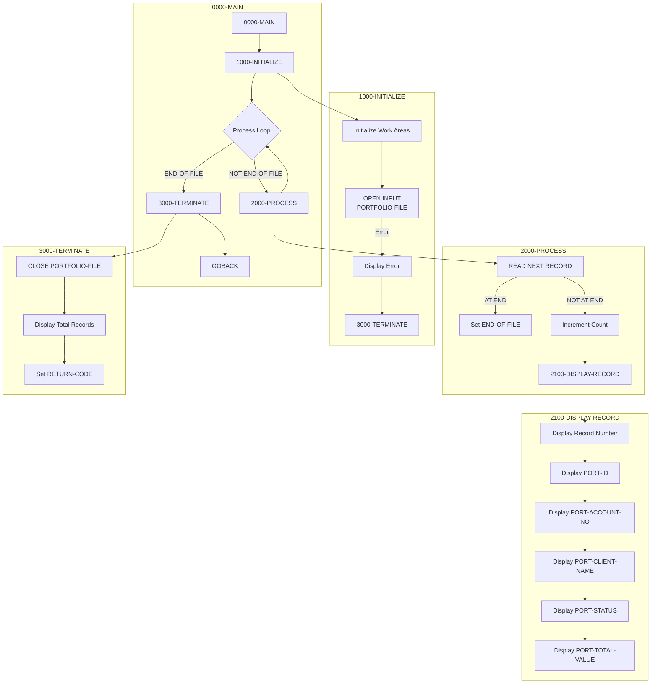

## Overview

PORTREAD is a batch utility program that sequentially reads and displays all records from the Portfolio Master VSAM file. It serves as a diagnostic and verification tool for the Investment Portfolio Management System, allowing operators and developers to inspect the contents of the portfolio file.

The program provides:
- Sequential traversal of all portfolio records
- Formatted console display of key portfolio fields
- Record count tracking and reporting
- Standard VSAM error handling

PORTREAD is commonly used for:
- Verifying file contents after batch updates
- Debugging data issues
- Quick file inspection during development
- Testing file accessibility

## Program Structure



## Data Structures

### Working Storage

#### Constants (WS-CONSTANTS)

| Level | Name | Picture | Value | Description |
|-------|------|---------|-------|-------------|
| 01 | WS-CONSTANTS | - | - | Constants group |
| 05 | WS-PROGRAM-NAME | X(08) | 'PORTREAD' | Program identifier |
| 05 | WS-SUCCESS | S9(4) | +0 | Success return code |
| 05 | WS-ERROR | S9(4) | +8 | Error return code |

#### Switches (WS-SWITCHES)

| Level | Name | Picture | Value | Description |
|-------|------|---------|-------|-------------|
| 01 | WS-SWITCHES | - | - | Switch variables group |
| 05 | WS-FILE-STATUS | X(02) | - | VSAM file status code |
| 88 | WS-SUCCESS-STATUS | VALUE '00' | - | Successful operation |
| 88 | WS-EOF-STATUS | VALUE '10' | - | End of file reached |
| 88 | WS-REC-NOT-FND | VALUE '23' | - | Record not found |
| 05 | WS-END-OF-FILE-SW | X | 'N' | End of file switch |
| 88 | END-OF-FILE | VALUE 'Y' | - | EOF condition true |
| 88 | NOT-END-OF-FILE | VALUE 'N' | - | EOF condition false |

#### Work Areas (WS-WORK-AREAS)

| Level | Name | Picture | Value | Description |
|-------|------|---------|-------|-------------|
| 01 | WS-WORK-AREAS | - | - | Work areas group |
| 05 | WS-RECORD-COUNT | 9(7) | ZERO | Count of records read |
| 05 | WS-RETURN-CODE | S9(4) | +0 | Program return code |

### File Section - Portfolio Record (PORTFLIO Copybook)

| Level | Name | Picture | Description |
|-------|------|---------|-------------|
| 01 | PORT-RECORD | - | Portfolio master record |
| 05 | PORT-KEY | - | Composite record key |
| 10 | PORT-ID | X(8) | Portfolio identifier |
| 10 | PORT-ACCOUNT-NO | X(10) | Account number |
| 05 | PORT-CLIENT-INFO | - | Client information group |
| 10 | PORT-CLIENT-NAME | X(30) | Client name |
| 10 | PORT-CLIENT-TYPE | X(1) | Client type code |
| 88 | PORT-INDIVIDUAL | VALUE 'I' | Individual account |
| 88 | PORT-CORPORATE | VALUE 'C' | Corporate account |
| 88 | PORT-TRUST | VALUE 'T' | Trust account |
| 05 | PORT-PORTFOLIO-INFO | - | Portfolio information group |
| 10 | PORT-CREATE-DATE | 9(8) | Creation date (YYYYMMDD) |
| 10 | PORT-LAST-MAINT | 9(8) | Last maintenance date |
| 10 | PORT-STATUS | X(1) | Portfolio status |
| 88 | PORT-ACTIVE | VALUE 'A' | Active portfolio |
| 88 | PORT-CLOSED | VALUE 'C' | Closed portfolio |
| 88 | PORT-SUSPENDED | VALUE 'S' | Suspended portfolio |
| 05 | PORT-FINANCIAL-INFO | - | Financial information group |
| 10 | PORT-TOTAL-VALUE | S9(13)V99 COMP-3 | Total portfolio value |
| 10 | PORT-CASH-BALANCE | S9(13)V99 COMP-3 | Cash balance |
| 05 | PORT-AUDIT-INFO | - | Audit information group |
| 10 | PORT-LAST-USER | X(8) | Last update user ID |
| 10 | PORT-LAST-TRANS | 9(8) | Last transaction date |
| 05 | PORT-FILLER | X(50) | Reserved space |

## File I/O

### File Definition

| Attribute | Value | Description |
|-----------|-------|-------------|
| File Name | PORTFOLIO-FILE | Logical file name |
| DD Name | PORTFILE | JCL DD name |
| Organization | INDEXED | VSAM KSDS |
| Access Mode | DYNAMIC | Supports sequential and random |
| Record Key | PORT-KEY | Composite key (ID + Account) |
| File Status | WS-FILE-STATUS | Status variable |

### File Operations

| Paragraph | Operation | Mode | Description |
|-----------|-----------|------|-------------|
| 1000-INITIALIZE | OPEN | INPUT | Open file for reading |
| 2000-PROCESS | READ NEXT | Sequential | Read next record |
| 3000-TERMINATE | CLOSE | - | Close file |

### READ Statement

```cobol
READ PORTFOLIO-FILE NEXT RECORD
    AT END
        SET END-OF-FILE TO TRUE
    NOT AT END
        ADD 1 TO WS-RECORD-COUNT
        PERFORM 2100-DISPLAY-RECORD
END-READ
```

The `READ NEXT` syntax reads records sequentially in key order (by PORT-KEY).

## Control Flow

### Main Processing (0000-MAIN)

1. Perform initialization
2. Loop through all records until end-of-file
3. Perform termination cleanup
4. Return to caller via GOBACK

```cobol
PERFORM 1000-INITIALIZE

PERFORM 2000-PROCESS
   UNTIL END-OF-FILE

PERFORM 3000-TERMINATE

GOBACK
```

### Initialization (1000-INITIALIZE)

1. Initialize work areas to default values
2. Open portfolio file for input
3. If open fails:
   - Display error message with file status
   - Set return code to error (8)
   - Perform termination

### Sequential Processing (2000-PROCESS)

For each iteration:
1. Read next record from file
2. If end-of-file: Set EOF flag
3. If record read successfully:
   - Increment record counter
   - Display record fields

### Display Record (2100-DISPLAY-RECORD)

Displays formatted record information to SYSOUT:

```
Portfolio Record: nnnnnnn
  ID: XXXXXXXX
  Account: XXXXXXXXXX
  Client: XXXXXXXXXXXXXXXXXXXXXXXXXXXXXX
  Status: X
  Total Value: nnnnnnnnnnnnnn.nn
```

### Termination (3000-TERMINATE)

1. Close portfolio file
2. Display total records read count
3. Set system RETURN-CODE from WS-RETURN-CODE

## JCL Requirements

### Sample JCL

```jcl
//PORTREAD  JOB (ACCT),'READ PORTFOLIO',
//          CLASS=A,MSGCLASS=X,NOTIFY=&SYSUID
//*
//STEP1    EXEC PGM=PORTREAD
//STEPLIB   DD DSN=YOUR.LOADLIB,DISP=SHR
//PORTFILE  DD DSN=PORTFOLIO.MASTER.FILE,DISP=SHR
//SYSOUT    DD SYSOUT=*
//SYSPRINT  DD SYSOUT=*
//SYSUDUMP  DD SYSOUT=*
```

### DD Statement Requirements

| DD Name | Description | Disposition |
|---------|-------------|-------------|
| STEPLIB | Load library containing PORTREAD | SHR |
| PORTFILE | Portfolio master VSAM KSDS file | SHR |
| SYSOUT | Console output for DISPLAY statements | SYSOUT=* |
| SYSPRINT | Print output | SYSOUT=* |
| SYSUDUMP | Dump output for abends | SYSOUT=* |

## Dependencies

### Copybooks

| Copybook | Location | Description |
|----------|----------|-------------|
| PORTFLIO | common/ | Portfolio master record layout |

### Related Programs

| Program | Relationship | Description |
|---------|--------------|-------------|
| PORTMSTR | Related | Portfolio master maintenance - CRUD operations |
| PORTADD | Related | Add new portfolio records - uses PORTFLIO |
| PORTDEL | Related | Delete portfolio records - uses PORTFLIO |
| PORTUPDT | Related | Update portfolio records - uses PORTFLIO |
| PORTTEST | Related | Portfolio test program - uses PORTFLIO |
| TSTGEN00 | Related | Test data generator - uses PORTFLIO |

## COBOL Concepts

### PERFORM UNTIL

The main processing loop uses `PERFORM UNTIL` with a condition name:

```cobol
PERFORM 2000-PROCESS
   UNTIL END-OF-FILE
```

The loop continues until the `END-OF-FILE` condition (88-level) becomes true.

### AT END / NOT AT END

The READ statement uses the AT END phrase to detect end-of-file:

```cobol
READ PORTFOLIO-FILE NEXT RECORD
    AT END
        SET END-OF-FILE TO TRUE
    NOT AT END
        ADD 1 TO WS-RECORD-COUNT
        PERFORM 2100-DISPLAY-RECORD
END-READ
```

### File Status Codes

VSAM file status is a two-character code:

| Code | Meaning |
|------|---------|
| 00 | Successful completion |
| 10 | End of file (AT END condition) |
| 22 | Duplicate key on WRITE |
| 23 | Record not found |
| 35 | File not found |
| 39 | File attribute mismatch |

### COMP-3 (Packed Decimal)

Financial fields use COMP-3 for efficient storage and arithmetic:
- `PORT-TOTAL-VALUE`: S9(13)V99 COMP-3 - stores up to 9,999,999,999,999.99
- `PORT-CASH-BALANCE`: S9(13)V99 COMP-3 - same range

COMP-3 stores two digits per byte plus a sign nibble, so S9(13)V99 requires 8 bytes.

### DYNAMIC Access Mode

`ACCESS MODE IS DYNAMIC` allows both:
- Sequential access (READ NEXT)
- Random access (READ with key)

PORTREAD uses only sequential access, but DYNAMIC mode enables flexibility.

## Return Codes

| Code | Meaning | Condition |
|------|---------|-----------|
| 0 | Success | All records read successfully |
| 8 | Error | File open failed |

## Sample Output

```
Portfolio Record: 0000001
  ID: PORT0001
  Account: ACCT000001
  Client: SMITH, JOHN
  Status: A
  Total Value: 0000000125000.50

Portfolio Record: 0000002
  ID: PORT0002
  Account: ACCT000002
  Client: JONES CORPORATION
  Status: A
  Total Value: 0000005750000.00

...

Total Records Read: 0001234
```

## Issues

:::note Design Considerations
- The program displays all records without filtering. For large files, consider adding selection criteria or record limits.
- Output goes to SYSOUT via DISPLAY statements. For formatted reports, consider using a report writer or output file.
- The `WS-RECORD-COUNT` field is PIC 9(7), limiting the display to 9,999,999 records.
- No validation is performed on record contents - this is a read-only diagnostic tool.
:::
