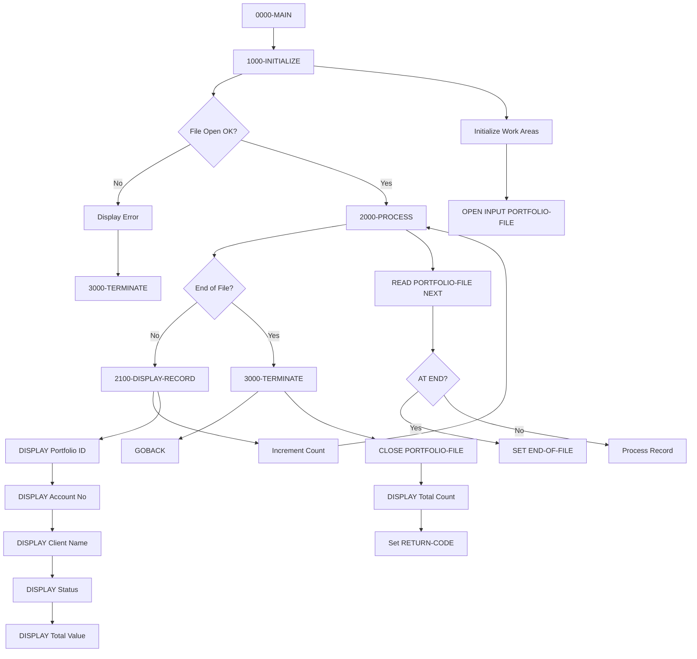

## Overview

PORTREAD is a batch COBOL utility program that reads and displays all records from the Portfolio Master File. It provides a simple way to view portfolio data for verification, debugging, or reporting purposes.

Key capabilities include:

- **Sequential Reading**: Reads all portfolio records from start to end
- **Record Display**: Formats and displays key portfolio information
- **Record Counting**: Tracks and reports total records processed
- **Error Handling**: Detects and reports file access errors

This program is part of the Portfolio Management module and serves as a diagnostic/utility tool for examining portfolio data. It demonstrates the basic reading capabilities of the Portfolio file.

## Program Structure



## Data Structures

### Working Storage

#### Constants

| Level | Name | Picture | Value | Description |
|-------|------|---------|-------|-------------|
| 01 | WS-CONSTANTS | - | - | Program constants |
| 05 | WS-PROGRAM-NAME | X(08) | 'PORTREAD' | Program identifier |
| 05 | WS-SUCCESS | S9(4) | +0 | Success return code |
| 05 | WS-ERROR | S9(4) | +8 | Error return code |

#### Switches and Status

| Level | Name | Picture | Value | Description |
|-------|------|---------|-------|-------------|
| 01 | WS-SWITCHES | - | - | Control switches |
| 05 | WS-FILE-STATUS | X(02) | - | VSAM file status |
| 88 | WS-SUCCESS-STATUS | VALUE '00' | - | Successful operation |
| 88 | WS-EOF-STATUS | VALUE '10' | - | End of file reached |
| 88 | WS-REC-NOT-FND | VALUE '23' | - | Record not found |
| 05 | WS-END-OF-FILE-SW | X | 'N' | EOF indicator |
| 88 | END-OF-FILE | VALUE 'Y' | - | EOF condition true |
| 88 | NOT-END-OF-FILE | VALUE 'N' | - | EOF condition false |

#### Work Areas

| Level | Name | Picture | Value | Description |
|-------|------|---------|-------|-------------|
| 01 | WS-WORK-AREAS | - | - | Processing work areas |
| 05 | WS-RECORD-COUNT | 9(7) | ZERO | Records read counter |
| 05 | WS-RETURN-CODE | S9(4) | +0 | Program return code |

### Portfolio Record Structure (PORTFLIO)

| Level | Name | Picture | Description |
|-------|------|---------|-------------|
| 01 | PORT-RECORD | - | Portfolio master record |
| 05 | PORT-KEY | - | Composite record key |
| 10 | PORT-ID | X(8) | Portfolio identifier |
| 10 | PORT-ACCOUNT-NO | X(10) | Account number |
| 05 | PORT-CLIENT-INFO | - | Client information |
| 10 | PORT-CLIENT-NAME | X(30) | Client name |
| 10 | PORT-CLIENT-TYPE | X(1) | Client type (I/C/T) |
| 05 | PORT-PORTFOLIO-INFO | - | Portfolio details |
| 10 | PORT-CREATE-DATE | 9(8) | Creation date (YYYYMMDD) |
| 10 | PORT-LAST-MAINT | 9(8) | Last maintenance date |
| 10 | PORT-STATUS | X(1) | Status (A/C/S) |
| 05 | PORT-FINANCIAL-INFO | - | Financial data |
| 10 | PORT-TOTAL-VALUE | S9(13)V99 COMP-3 | Total portfolio value |
| 10 | PORT-CASH-BALANCE | S9(13)V99 COMP-3 | Cash balance |
| 05 | PORT-AUDIT-INFO | - | Audit trail |
| 10 | PORT-LAST-USER | X(8) | Last update user ID |
| 10 | PORT-LAST-TRANS | 9(8) | Last transaction date |
| 05 | PORT-FILLER | X(50) | Reserved space |

### Client Type Values

| Code | 88-Level | Description |
|------|----------|-------------|
| `I` | PORT-INDIVIDUAL | Individual investor |
| `C` | PORT-CORPORATE | Corporate account |
| `T` | PORT-TRUST | Trust account |

### Portfolio Status Values

| Code | 88-Level | Description |
|------|----------|-------------|
| `A` | PORT-ACTIVE | Active portfolio |
| `C` | PORT-CLOSED | Closed portfolio |
| `S` | PORT-SUSPENDED | Suspended portfolio |

## File I/O

### File Definition

| Attribute | Value |
|-----------|-------|
| File Name | PORTFOLIO-FILE |
| DD Name | PORTFILE |
| Organization | Indexed (VSAM KSDS) |
| Access Mode | Dynamic |
| Record Key | PORT-KEY |
| File Status | WS-FILE-STATUS |

### I/O Operations

| Operation | Paragraph | Description |
|-----------|-----------|-------------|
| OPEN INPUT | 1000-INITIALIZE | Open file for reading |
| READ NEXT | 2000-PROCESS | Read next sequential record |
| CLOSE | 3000-TERMINATE | Close file |

## Control Flow

### Initialization (1000-INITIALIZE)

1. **Initialize Work Areas**: Clears `WS-WORK-AREAS` to default values
2. **Open File**: Opens `PORTFOLIO-FILE` for INPUT
3. **Error Check**: If open fails:
   - Displays error message with file status
   - Sets `WS-RETURN-CODE` to error value
   - Performs terminate processing

### Main Processing Loop (2000-PROCESS)

The main loop executes `UNTIL END-OF-FILE`:

1. **Read Next Record**: Issues `READ PORTFOLIO-FILE NEXT RECORD`
2. **AT END Handling**: Sets `END-OF-FILE` flag when no more records
3. **NOT AT END Handling**:
   - Increments `WS-RECORD-COUNT`
   - Calls `2100-DISPLAY-RECORD` to output record data

### Record Display (2100-DISPLAY-RECORD)

Displays formatted portfolio information:

```
Portfolio Record: nnnnnnn
  ID: xxxxxxxx
  Account: xxxxxxxxxx
  Client: xxxxxxxxxxxxxxxxxxxxxxxxxxxxxx
  Status: x
  Total Value: snnnnnnnnnnnnnn.nn
```

### Termination (3000-TERMINATE)

1. **Close File**: Closes `PORTFOLIO-FILE`
2. **Display Summary**: Shows total records read
3. **Set Return Code**: Moves `WS-RETURN-CODE` to `RETURN-CODE`

## Dependencies

### Copybooks

| Copybook | Location | Purpose |
|----------|----------|---------|
| PORTFLIO | common | Portfolio master record layout |

### Related Programs

| Program | Relationship | Description |
|---------|--------------|-------------|
| PORTMSTR | Sibling | Portfolio master maintenance (CRUD) |
| PORTADD | Sibling | Add new portfolio records |
| PORTUPDT | Sibling | Update portfolio records |
| PORTDEL | Sibling | Delete portfolio records |
| PORTTEST | Sibling | Portfolio testing utility |
| TSTGEN00 | Consumer | Test data generator |

### Programs Sharing PORTFLIO Copybook

- PORTADD - Portfolio add program
- PORTDEL - Portfolio delete program
- PORTTEST - Portfolio test program
- PORTUPDT - Portfolio update program
- TSTGEN00 - Test data generator

## JCL Requirements

```jcl
//PORTREAD  JOB (ACCT),'READ PORTFOLIO',
//          CLASS=A,MSGCLASS=X,NOTIFY=&SYSUID
//*
//STEP1    EXEC PGM=PORTREAD
//STEPLIB   DD DSN=YOUR.LOADLIB,DISP=SHR
//PORTFILE  DD DSN=PORTFOLIO.MASTER.FILE,DISP=SHR
//SYSOUT    DD SYSOUT=*
//SYSPRINT  DD SYSOUT=*
//SYSUDUMP  DD SYSOUT=*
```

### DD Statements

| DD Name | Description |
|---------|-------------|
| STEPLIB | Load library containing PORTREAD |
| PORTFILE | Portfolio master VSAM KSDS file |
| SYSOUT | Standard output (DISPLAY statements) |
| SYSPRINT | Print output |
| SYSUDUMP | Dump output for abends |

## Return Codes

| Code | Meaning | Description |
|------|---------|-------------|
| 0 | Success | All records read successfully |
| 8 | Error | File open or processing error |

## Sample Output

```
Portfolio Record: 0000001
  ID: PORT0001
  Account: 1234567890
  Client: SMITH, JOHN Q
  Status: A
  Total Value: 000000125000.50
 
Portfolio Record: 0000002
  ID: PORT0002
  Account: 0987654321
  Client: ACME CORPORATION
  Status: A
  Total Value: 000005000000.00
 
Portfolio Record: 0000003
  ID: PORT0003
  Account: 5555555555
  Client: FAMILY TRUST
  Status: S
  Total Value: 000000750000.25
 
Total Records Read: 0000003
```

## Technical Notes

### VSAM Access Mode

The program uses `ACCESS MODE IS DYNAMIC` which allows both:
- Sequential access (used by this program via `READ NEXT`)
- Random access (by key, not used in this program)

This provides flexibility if the program is later enhanced to support keyed reads.

### File Status Checking

The program uses 88-level conditions for file status checking:

```cobol
88  WS-SUCCESS-STATUS     VALUE '00'.
88  WS-EOF-STATUS        VALUE '10'.
88  WS-REC-NOT-FND       VALUE '23'.
```

Common VSAM file status codes:
- `00` - Successful completion
- `10` - End of file (AT END condition)
- `23` - Record not found
- `22` - Duplicate key on write
- `35` - File not found

### COMP-3 Packed Decimal

Financial fields use COMP-3 (packed decimal) format:
- `PORT-TOTAL-VALUE`: S9(13)V99 - Up to $99,999,999,999,999.99
- `PORT-CASH-BALANCE`: S9(13)V99 - Up to $99,999,999,999,999.99

Packed decimal stores two digits per byte plus a sign nibble, making it efficient for financial calculations.

### Record Counter

`WS-RECORD-COUNT` uses PIC 9(7), supporting up to 9,999,999 records. For larger files, consider expanding to 9(9) or using COMP for efficiency.

### Error Recovery

The program performs basic error handling:
- On file open failure, displays status and terminates
- Uses GOBACK for clean program termination
- Sets appropriate return code for job step condition checking

### Usage Scenarios

1. **Data Verification**: Verify portfolio data after batch updates
2. **Debugging**: Examine file contents during development
3. **Audit Support**: List all portfolios for audit review
4. **Migration Testing**: Verify data after file conversions
