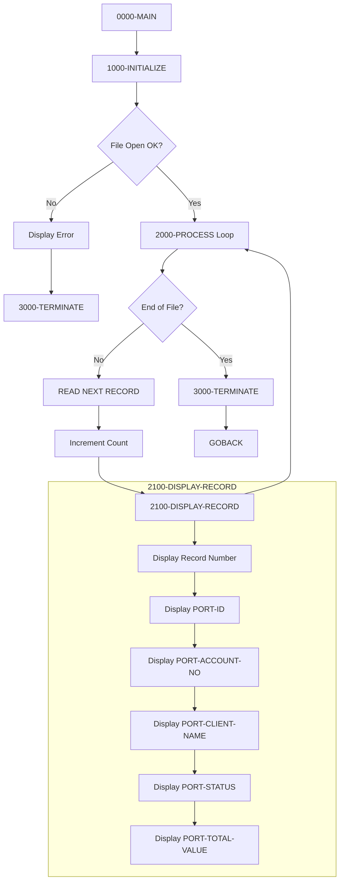

## Overview

PORTREAD is a batch COBOL program that demonstrates the reading capabilities of the portfolio master file. It performs a sequential read of all records in the indexed VSAM file and displays the key fields from each portfolio record to the console.

This program is typically used for:
- **Data Verification** - Confirming portfolio records exist and contain expected data
- **Debugging** - Viewing portfolio data during development and testing
- **Audit Support** - Producing a quick listing of all portfolios in the system
- **Training** - Demonstrating COBOL indexed file reading patterns

The program uses dynamic access mode, which allows for both sequential and random access to the indexed file, though this implementation only uses sequential reading.

## Program Structure



## Data Structures

### Working-Storage Section

#### Constants (WS-CONSTANTS)

| Level | Name | Picture | Value | Description |
|-------|------|---------|-------|-------------|
| 01 | WS-CONSTANTS | - | - | Program constants group |
| 05 | WS-PROGRAM-NAME | X(8) | 'PORTREAD' | Program identifier |
| 05 | WS-SUCCESS | S9(4) | +0 | Success return code |
| 05 | WS-ERROR | S9(4) | +8 | Error return code |

#### Switches (WS-SWITCHES)

| Level | Name | Picture | Value | Description |
|-------|------|---------|-------|-------------|
| 01 | WS-SWITCHES | - | - | Control switches group |
| 05 | WS-FILE-STATUS | X(2) | - | File status from I/O operations |
| 88 | WS-SUCCESS-STATUS | VALUE '00' | - | Successful operation |
| 88 | WS-EOF-STATUS | VALUE '10' | - | End of file reached |
| 88 | WS-REC-NOT-FND | VALUE '23' | - | Record not found |
| 05 | WS-END-OF-FILE-SW | X | 'N' | End-of-file switch |
| 88 | END-OF-FILE | VALUE 'Y' | - | EOF condition true |
| 88 | NOT-END-OF-FILE | VALUE 'N' | - | EOF condition false |

#### Work Areas (WS-WORK-AREAS)

| Level | Name | Picture | Value | Description |
|-------|------|---------|-------|-------------|
| 01 | WS-WORK-AREAS | - | - | Working variables group |
| 05 | WS-RECORD-COUNT | 9(7) | ZERO | Count of records read |
| 05 | WS-RETURN-CODE | S9(4) | +0 | Program return code |

### File Section

#### Portfolio Record (from PORTFLIO copybook)

| Level | Name | Picture | Description |
|-------|------|---------|-------------|
| 01 | PORT-RECORD | - | Portfolio master record |
| 05 | PORT-KEY | - | Composite primary key |
| 10 | PORT-ID | X(8) | Portfolio identifier |
| 10 | PORT-ACCOUNT-NO | X(10) | Account number |
| 05 | PORT-CLIENT-INFO | - | Client information group |
| 10 | PORT-CLIENT-NAME | X(30) | Client name |
| 10 | PORT-CLIENT-TYPE | X(1) | Client type code |
| 88 | PORT-INDIVIDUAL | VALUE 'I' | Individual account |
| 88 | PORT-CORPORATE | VALUE 'C' | Corporate account |
| 88 | PORT-TRUST | VALUE 'T' | Trust account |
| 05 | PORT-PORTFOLIO-INFO | - | Portfolio details group |
| 10 | PORT-CREATE-DATE | 9(8) | Creation date (YYYYMMDD) |
| 10 | PORT-LAST-MAINT | 9(8) | Last maintenance date |
| 10 | PORT-STATUS | X(1) | Portfolio status |
| 88 | PORT-ACTIVE | VALUE 'A' | Active portfolio |
| 88 | PORT-CLOSED | VALUE 'C' | Closed portfolio |
| 88 | PORT-SUSPENDED | VALUE 'S' | Suspended portfolio |
| 05 | PORT-FINANCIAL-INFO | - | Financial data group |
| 10 | PORT-TOTAL-VALUE | S9(13)V99 COMP-3 | Total portfolio value |
| 10 | PORT-CASH-BALANCE | S9(13)V99 COMP-3 | Cash balance |
| 05 | PORT-AUDIT-INFO | - | Audit trail group |
| 10 | PORT-LAST-USER | X(8) | Last update user ID |
| 10 | PORT-LAST-TRANS | 9(8) | Last transaction date |
| 05 | PORT-FILLER | X(50) | Reserved for future use |

## File I/O

### File Definition

| Attribute | Value | Description |
|-----------|-------|-------------|
| File Name | PORTFOLIO-FILE | Internal file name |
| DD Name | PORTFILE | JCL DD name |
| Organization | Indexed | VSAM KSDS |
| Access Mode | Dynamic | Allows sequential and random access |
| Record Key | PORT-KEY | Composite key (PORT-ID + PORT-ACCOUNT-NO) |
| File Status | WS-FILE-STATUS | Two-byte status field |

### I/O Operations

| Paragraph | Operation | Description |
|-----------|-----------|-------------|
| 1000-INITIALIZE | OPEN INPUT | Open file for reading |
| 2000-PROCESS | READ NEXT | Sequential read of next record |
| 3000-TERMINATE | CLOSE | Close the file |

## Control Flow

### Main Processing (0000-MAIN)

The main paragraph orchestrates the program flow:

```cobol
PERFORM 1000-INITIALIZE
PERFORM 2000-PROCESS UNTIL END-OF-FILE
PERFORM 3000-TERMINATE
GOBACK
```

### Initialization (1000-INITIALIZE)

1. **Initialize Work Areas**
   - Clear WS-WORK-AREAS using INITIALIZE verb
   - Resets record count to zero

2. **Open File**
   - Open PORTFOLIO-FILE for INPUT
   - Check file status for success

3. **Error Handling**
   - If open fails: Display error message with file status
   - Set return code to 8 (error)
   - Perform early termination

### Processing Loop (2000-PROCESS)

Uses the "read-process" pattern with AT END/NOT AT END:

```cobol
READ PORTFOLIO-FILE NEXT RECORD
    AT END
        SET END-OF-FILE TO TRUE
    NOT AT END
        ADD 1 TO WS-RECORD-COUNT
        PERFORM 2100-DISPLAY-RECORD
END-READ
```

- **AT END**: Sets the END-OF-FILE flag to exit the loop
- **NOT AT END**: Increments counter and displays the record

### Display Record (2100-DISPLAY-RECORD)

Outputs key fields from the current record:

```
Portfolio Record: 0000001
  ID: PORTF001
  Account: 1234567890
  Client: SMITH, JOHN
  Status: A
  Total Value: 0000000125000.50
```

### Termination (3000-TERMINATE)

1. **Close File**
   - Close PORTFOLIO-FILE

2. **Display Summary**
   - Show total records read count

3. **Set Return Code**
   - Move WS-RETURN-CODE to system RETURN-CODE

## Dependencies

### Copybooks

| Copybook | Location | Description |
|----------|----------|-------------|
| PORTFLIO | File Section (FD) | Portfolio master record layout defining PORT-RECORD structure |

### Called Programs

This program does not call any external programs.

### Related Programs

Programs in the portfolio management suite that share the PORTFLIO copybook:

| Program | Description |
|---------|-------------|
| PORTADD | Add new portfolio records |
| PORTDEL | Delete portfolio records |
| PORTUPDT | Update existing portfolio records |
| PORTTEST | Portfolio testing program |
| TSTGEN00 | Test data generator |

Other portfolio programs:

| Program | Description |
|---------|-------------|
| PORTMSTR | Portfolio master controller |
| PORTTRAN | Portfolio transaction processor |
| PORTVALD | Portfolio validation program |

## Return Codes

| Code | Meaning | Condition |
|------|---------|-----------|
| 0 | Success | All records read successfully |
| 8 | Error | File open or processing error |

## File Status Codes

| Code | Constant | Meaning |
|------|----------|---------|
| 00 | WS-SUCCESS-STATUS | Successful operation |
| 10 | WS-EOF-STATUS | End of file reached |
| 23 | WS-REC-NOT-FND | Record not found (not used in sequential read) |

## Sample Output

```
Portfolio Record: 0000001
  ID: PORT0001
  Account: ACC0000001
  Client: SMITH, JOHN A.
  Status: A
  Total Value: +0000000125000.50
 
Portfolio Record: 0000002
  ID: PORT0002
  Account: ACC0000002
  Client: JOHNSON, MARY B.
  Status: A
  Total Value: +0000000087500.25
 
Portfolio Record: 0000003
  ID: PORT0003
  Account: ACC0000003
  Client: ACME CORPORATION
  Status: S
  Total Value: +0000001250000.00
 
Total Records Read: 0000003
```

## JCL Requirements

```jcl
//PORTREAD EXEC PGM=PORTREAD
//STEPLIB  DD  DSN=your.loadlib,DISP=SHR
//PORTFILE DD  DSN=your.portfolio.vsam.file,DISP=SHR
//SYSOUT   DD  SYSOUT=*
```

## Technical Notes

### Dynamic Access Mode
The program specifies `ACCESS MODE IS DYNAMIC` in the SELECT statement. This allows the program to switch between sequential access (`READ NEXT`) and random access (`READ` with key) at runtime. While this program only uses sequential access, the dynamic mode provides flexibility for future enhancements.

### COMP-3 Display
The PORT-TOTAL-VALUE field is defined as `S9(13)V99 COMP-3` (packed decimal). When displayed directly, the output shows the raw numeric value. For production reporting, this would typically be formatted with edited picture clauses for proper currency display.

### Composite Key Structure
The record key (PORT-KEY) is a composite of PORT-ID (8 bytes) and PORT-ACCOUNT-NO (10 bytes), totaling 18 bytes. Records are ordered by this composite key in the indexed file.

### 88-Level Conditions
The program uses 88-level condition names extensively for readable code:
- `END-OF-FILE` / `NOT-END-OF-FILE` for loop control
- `WS-SUCCESS-STATUS` / `WS-EOF-STATUS` for file status checking
- `PORT-ACTIVE` / `PORT-CLOSED` / `PORT-SUSPENDED` for status values

### INITIALIZE Verb
The `INITIALIZE WS-WORK-AREAS` statement sets:
- Numeric fields (WS-RECORD-COUNT, WS-RETURN-CODE) to zeros
- Alphanumeric fields to spaces

This provides a clean starting state for each program execution.

## Error Handling

The program implements basic error handling:

1. **File Open Error**
   - Displays "Error opening file: " with the two-byte file status
   - Sets return code to 8
   - Performs immediate termination

2. **Read Errors**
   - End-of-file (status 10) is handled normally via AT END clause
   - Other read errors would cause abnormal termination (not explicitly handled)

For production use, consider adding:
- Comprehensive file status error messages
- Recovery procedures for transient errors
- Logging to an error file
