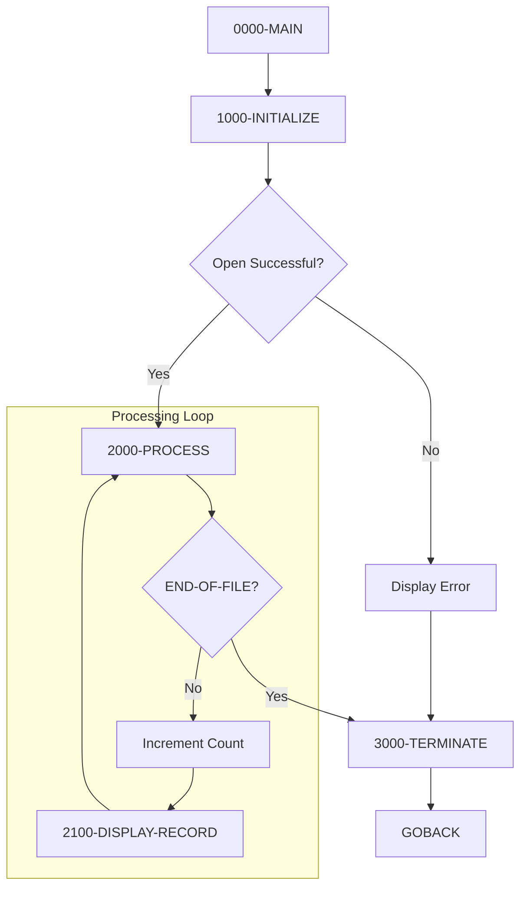

## Overview

PORTREAD is a batch COBOL program that demonstrates portfolio file reading capabilities. It sequentially reads all records from an indexed VSAM file (PORTFILE) and displays the key fields of each portfolio record to the console output.

This program serves as both a functional utility and a reference implementation for:
- **File browsing**: Listing all portfolios in the system
- **Data verification**: Confirming file contents and record structure
- **Testing support**: Validating portfolio data after batch updates

The program uses dynamic access mode on an indexed file, allowing for both sequential and random access patterns, though this implementation uses sequential (READ NEXT) processing.

## Program Structure



## Data Structures

### File Section

The program uses the PORTFLIO copybook to define the portfolio record structure:

#### PORT-RECORD (from PORTFLIO copybook)

| Level | Name | Picture | Description |
|-------|------|---------|-------------|
| 01 | PORT-RECORD | Group | Portfolio master record |
| 05 | PORT-KEY | Group | Composite primary key |
| 10 | PORT-ID | X(8) | Portfolio identifier |
| 10 | PORT-ACCOUNT-NO | X(10) | Account number |
| 05 | PORT-CLIENT-INFO | Group | Client information |
| 10 | PORT-CLIENT-NAME | X(30) | Client name |
| 10 | PORT-CLIENT-TYPE | X(1) | Client type code |
| 88 | PORT-INDIVIDUAL | 'I' | Individual client |
| 88 | PORT-CORPORATE | 'C' | Corporate client |
| 88 | PORT-TRUST | 'T' | Trust account |
| 05 | PORT-PORTFOLIO-INFO | Group | Portfolio metadata |
| 10 | PORT-CREATE-DATE | 9(8) | Creation date (YYYYMMDD) |
| 10 | PORT-LAST-MAINT | 9(8) | Last maintenance date |
| 10 | PORT-STATUS | X(1) | Portfolio status |
| 88 | PORT-ACTIVE | 'A' | Active portfolio |
| 88 | PORT-CLOSED | 'C' | Closed portfolio |
| 88 | PORT-SUSPENDED | 'S' | Suspended portfolio |
| 05 | PORT-FINANCIAL-INFO | Group | Financial data |
| 10 | PORT-TOTAL-VALUE | S9(13)V99 COMP-3 | Total portfolio value |
| 10 | PORT-CASH-BALANCE | S9(13)V99 COMP-3 | Cash balance |
| 05 | PORT-AUDIT-INFO | Group | Audit trail |
| 10 | PORT-LAST-USER | X(8) | Last update user ID |
| 10 | PORT-LAST-TRANS | 9(8) | Last transaction date |
| 05 | PORT-FILLER | X(50) | Reserved space |

### Working Storage

#### Constants (WS-CONSTANTS)

| Level | Name | Picture | Value | Description |
|-------|------|---------|-------|-------------|
| 01 | WS-CONSTANTS | Group | | Program constants |
| 05 | WS-PROGRAM-NAME | X(8) | 'PORTREAD' | Program identifier |
| 05 | WS-SUCCESS | S9(4) | +0 | Success return code |
| 05 | WS-ERROR | S9(4) | +8 | Error return code |

#### Switches (WS-SWITCHES)

| Level | Name | Picture | Value | Description |
|-------|------|---------|-------|-------------|
| 01 | WS-SWITCHES | Group | | Processing flags |
| 05 | WS-FILE-STATUS | X(2) | | VSAM file status |
| 88 | WS-SUCCESS-STATUS | | '00' | Successful operation |
| 88 | WS-EOF-STATUS | | '10' | End of file reached |
| 88 | WS-REC-NOT-FND | | '23' | Record not found |
| 05 | WS-END-OF-FILE-SW | X | 'N' | EOF switch |
| 88 | END-OF-FILE | | 'Y' | EOF reached |
| 88 | NOT-END-OF-FILE | | 'N' | More records exist |

#### Work Areas (WS-WORK-AREAS)

| Level | Name | Picture | Value | Description |
|-------|------|---------|-------|-------------|
| 01 | WS-WORK-AREAS | Group | | Processing variables |
| 05 | WS-RECORD-COUNT | 9(7) | ZERO | Records read counter |
| 05 | WS-RETURN-CODE | S9(4) | +0 | Program return code |

## File I/O

### File Definition

| Attribute | Value |
|-----------|-------|
| Logical Name | PORTFOLIO-FILE |
| DD Name | PORTFILE |
| Organization | Indexed (VSAM KSDS) |
| Access Mode | Dynamic |
| Record Key | PORT-KEY (18 bytes: PORT-ID + PORT-ACCOUNT-NO) |
| File Status | WS-FILE-STATUS |

### I/O Operations

| Paragraph | Operation | Description |
|-----------|-----------|-------------|
| 1000-INITIALIZE | OPEN INPUT | Open file for reading |
| 2000-PROCESS | READ NEXT | Sequential read of next record |
| 3000-TERMINATE | CLOSE | Close the file |

### File Status Codes

| Code | Condition | Handling |
|------|-----------|----------|
| 00 | Success | Continue processing |
| 10 | End of file | Set END-OF-FILE flag, exit loop |
| 23 | Record not found | (Defined but not used in sequential read) |
| Other | Error | Display error, terminate with RC=8 |

## Control Flow

### Main Processing (0000-MAIN)

1. Perform initialization
2. Loop through all records until end-of-file
3. Perform termination
4. Return to caller via GOBACK

### Initialization (1000-INITIALIZE)

1. Initialize work areas to default values
2. Open PORTFOLIO-FILE for input
3. If open fails:
   - Display error message with file status
   - Set return code to 8 (error)
   - Jump to termination

### Record Processing (2000-PROCESS)

Uses the `READ...NEXT RECORD` statement for sequential processing:

```cobol
READ PORTFOLIO-FILE NEXT RECORD
    AT END
        SET END-OF-FILE TO TRUE
    NOT AT END
        ADD 1 TO WS-RECORD-COUNT
        PERFORM 2100-DISPLAY-RECORD
END-READ
```

The `AT END` and `NOT AT END` phrases provide inline handling for the end-of-file condition.

### Display Record (2100-DISPLAY-RECORD)

Outputs key portfolio fields to SYSOUT:
- Record number
- Portfolio ID
- Account number
- Client name
- Portfolio status
- Total portfolio value

Sample output:
```
Portfolio Record: 0000001
  ID: PORT0001
  Account: 1234567890
  Client: SMITH, JOHN
  Status: A
  Total Value: +0000000150000.00
```

### Termination (3000-TERMINATE)

1. Close PORTFOLIO-FILE
2. Display total records read
3. Set system RETURN-CODE from WS-RETURN-CODE

## Dependencies

### Copybooks

| Copybook | Location | Description |
|----------|----------|-------------|
| PORTFLIO | common/ | Portfolio master record layout with key, client info, financial data, and audit fields |

### Called Programs

*None* - This is a standalone batch utility.

### Related Programs

Programs that share the PORTFLIO copybook (portfolio CRUD operations):

| Program | Function |
|---------|----------|
| PORTADD | Add new portfolio records |
| PORTUPDT | Update existing portfolio records |
| PORTDEL | Delete portfolio records |
| PORTTEST | Portfolio file testing utility |
| TSTGEN00 | Test data generation |

## Return Codes

| Code | Meaning |
|------|---------|
| 0 | Successful completion - all records read |
| 8 | Error - file open failed |

## JCL Requirements

```jcl
//PORTREAD EXEC PGM=PORTREAD
//STEPLIB  DD DSN=your.loadlib,DISP=SHR
//PORTFILE DD DSN=your.portfolio.vsam.file,DISP=SHR
//SYSOUT   DD SYSOUT=*
```

### DD Statements

| DD Name | Description |
|---------|-------------|
| STEPLIB | Program load library |
| PORTFILE | Portfolio VSAM KSDS file |
| SYSOUT | Console output for DISPLAY statements |

## Technical Notes

### Dynamic Access Mode

The program specifies `ACCESS MODE IS DYNAMIC` which allows both:
- **Sequential access**: Using `READ...NEXT RECORD` (as used in this program)
- **Random access**: Using `READ...KEY IS...` (not used but available)

This provides flexibility for future enhancements such as:
- Reading a specific portfolio by key
- Positioned reads starting from a specific key
- Mixed sequential and random processing

### Packed Decimal Fields

The financial fields use COMP-3 (packed decimal) format:
- `PORT-TOTAL-VALUE`: S9(13)V99 - supports values up to ±9,999,999,999,999.99
- `PORT-CASH-BALANCE`: S9(13)V99 - same range

When displayed via DISPLAY statement, these show in their internal packed format. For formatted output, these would need to be moved to edited PIC fields (e.g., `PIC $ZZZ,ZZZ,ZZZ,ZZ9.99-`).

### Record Key Structure

The composite key (PORT-KEY) consists of:
- PORT-ID (8 bytes): Portfolio identifier
- PORT-ACCOUNT-NO (10 bytes): Account number

This 18-byte key ensures unique identification of each portfolio record.

## Usage Examples

### Basic Execution
Run the program to list all portfolios:
```
//LISTALL  EXEC PGM=PORTREAD
//PORTFILE DD DSN=PROD.PORTFOLIO.MASTER,DISP=SHR
//SYSOUT   DD SYSOUT=*
```

### Capture Output to File
Redirect output for later analysis:
```
//CAPTURE  EXEC PGM=PORTREAD
//PORTFILE DD DSN=PROD.PORTFOLIO.MASTER,DISP=SHR
//SYSOUT   DD DSN=WORK.PORT.LISTING,DISP=(NEW,CATLG),
//            DCB=(RECFM=FBA,LRECL=133,BLKSIZE=0),
//            SPACE=(CYL,(1,1))
```
