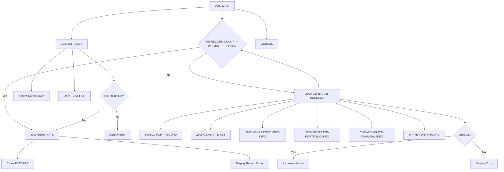

## Overview

PORTTEST is a Portfolio Test Data Generator utility that creates synthetic portfolio records for testing and development purposes. It generates up to 100 portfolio master records with randomized data, including client information, portfolio status, and financial values.

The program is designed to support development and quality assurance activities by providing realistic test data that exercises the full range of portfolio record fields. It creates records with varying client types (Individual, Corporate, Trust), portfolio statuses (Active, Closed, Suspended), and randomized financial values.

Test data generation is essential for validating portfolio processing programs without using production data, ensuring data privacy compliance while still providing meaningful test scenarios.

## Program Structure



## Data Structures

### File Section - Portfolio Record (from PORTFLIO copybook)

| Level | Name | Picture | Description |
|-------|------|---------|-------------|
| 01 | PORT-RECORD | - | Portfolio master record |
| 05 | PORT-KEY | - | Record key fields |
| 10 | PORT-ID | X(8) | Portfolio identifier (e.g., "PORT00001") |
| 10 | PORT-ACCOUNT-NO | X(10) | Account number (1000000000+) |
| 05 | PORT-CLIENT-INFO | - | Client information |
| 10 | PORT-CLIENT-NAME | X(30) | Client name (e.g., "TEST00001") |
| 10 | PORT-CLIENT-TYPE | X(1) | I=Individual, C=Corporate, T=Trust |
| 05 | PORT-PORTFOLIO-INFO | - | Portfolio details |
| 10 | PORT-CREATE-DATE | 9(8) | Creation date (YYYYMMDD) |
| 10 | PORT-LAST-MAINT | 9(8) | Last maintenance date |
| 10 | PORT-STATUS | X(1) | A=Active, C=Closed, S=Suspended |
| 05 | PORT-FINANCIAL-INFO | - | Financial data |
| 10 | PORT-TOTAL-VALUE | S9(13)V99 COMP-3 | Total portfolio value |
| 10 | PORT-CASH-BALANCE | S9(13)V99 COMP-3 | Cash balance (10% of total) |
| 05 | PORT-AUDIT-INFO | - | Audit trail fields |
| 10 | PORT-LAST-USER | X(8) | Last user to update |
| 10 | PORT-LAST-TRANS | 9(8) | Last transaction date |
| 05 | PORT-FILLER | X(50) | Reserved space |

### Working Storage - Control Variables

| Level | Name | Picture | Value | Description |
|-------|------|---------|-------|-------------|
| 05 | WS-FILE-STATUS | X(2) | - | File status code |
| 05 | WS-RECORD-COUNT | 9(5) | 0 | Records generated counter |
| 05 | WS-MAX-RECORDS | 9(5) | 100 | Maximum records to generate |
| 05 | WS-CURRENT-DATE | 9(8) | - | System date (YYYYMMDD) |

### Working Storage - Test Value Templates

| Level | Name | Picture | Value | Description |
|-------|------|---------|-------|-------------|
| 05 | WS-CLIENT-TYPES | X(3) | 'ICT' | Client type values (Individual/Corporate/Trust) |
| 05 | WS-STATUS-TYPES | X(3) | 'ACS' | Status values (Active/Closed/Suspended) |
| 05 | WS-NAME-PREFIX | X(4) | 'TEST' | Prefix for generated client names |

### Working Storage - Subscripts

| Level | Name | Picture | Description |
|-------|------|---------|-------------|
| 05 | WS-TYPE-SUB | 9(1) | Subscript for client type selection |
| 05 | WS-STATUS-SUB | 9(1) | Subscript for status selection |

## File I/O

### TEST-FILE

- **Assignment**: TESTFILE (DD name in JCL)
- **Organization**: Sequential
- **Access Mode**: Sequential (output only)
- **File Status**: WS-FILE-STATUS
- **Record Layout**: PORT-RECORD (from PORTFLIO copybook)

| Operation | Paragraph | Description |
|-----------|-----------|-------------|
| OPEN OUTPUT | 1000-INITIALIZE | Opens file for writing test data |
| WRITE | 2000-GENERATE-RECORDS | Writes generated portfolio record |
| CLOSE | 3000-TERMINATE | Closes file after generation |

## Control Flow

### 0000-MAIN - Main Control

Controls the overall program flow:
1. Calls 1000-INITIALIZE to set up the environment
2. Loops through 2000-GENERATE-RECORDS until WS-RECORD-COUNT reaches WS-MAX-RECORDS (100)
3. Calls 3000-TERMINATE for cleanup
4. Returns via GOBACK

### 1000-INITIALIZE - Setup

Prepares the program for execution:
1. **Get Current Date**: Uses `ACCEPT WS-CURRENT-DATE FROM DATE YYYYMMDD` to retrieve system date
2. **Open Output File**: Opens TEST-FILE for output
3. **Validate Open**: If file status ≠ '00', displays error and terminates early

### 2000-GENERATE-RECORDS - Record Generation Loop

Generates a single test portfolio record:
1. **Initialize Record**: Clears PORT-RECORD to spaces/zeros
2. **Generate Components**: Calls four sub-paragraphs to populate record sections:
   - 2100-GENERATE-KEY
   - 2200-GENERATE-CLIENT-INFO
   - 2300-GENERATE-PORTFOLIO-INFO
   - 2400-GENERATE-FINANCIAL-INFO
3. **Write Record**: Writes PORT-RECORD to TEST-FILE
4. **Track Results**: If successful, increments WS-RECORD-COUNT; otherwise displays error

### 2100-GENERATE-KEY - Key Generation

Creates unique key values:
1. **Portfolio ID**: Uses STRING to create ID like "PORT00001" by combining "PORT" with record count
2. **Random Seed**: Calls `FUNCTION RANDOM(WS-RECORD-COUNT)` to seed randomizer
3. **Account Number**: Computes unique account number starting at 1000000000 + record count

### 2200-GENERATE-CLIENT-INFO - Client Data

Generates client-related fields:
1. **Client Name**: Uses STRING to create name like "TEST00001" by combining prefix with record count
2. **Client Type**: Selects character from WS-CLIENT-TYPES using WS-TYPE-SUB as subscript
   - Position 1 = 'I' (Individual)
   - Position 2 = 'C' (Corporate)
   - Position 3 = 'T' (Trust)

### 2300-GENERATE-PORTFOLIO-INFO - Portfolio Details

Generates portfolio metadata:
1. **Dates**: Sets both PORT-CREATE-DATE and PORT-LAST-MAINT to current date
2. **Status**: Computes random subscript (1-3) and selects from WS-STATUS-TYPES
   - Position 1 = 'A' (Active)
   - Position 2 = 'C' (Closed)
   - Position 3 = 'S' (Suspended)

### 2400-GENERATE-FINANCIAL-INFO - Financial Values

Generates financial data:
1. **Total Value**: Computes random value between 0 and 1,000,000 using `FUNCTION RANDOM * 1000000`
2. **Cash Balance**: Calculates as 10% of total value (`PORT-TOTAL-VALUE * .10`)

### 3000-TERMINATE - Cleanup

Finalizes program execution:
1. Closes TEST-FILE
2. Displays final record count for verification

## Generated Data Characteristics

### Record Key Pattern

| Field | Pattern | Example |
|-------|---------|---------|
| PORT-ID | "PORT" + sequence | PORT00001, PORT00002, ... |
| PORT-ACCOUNT-NO | 1000000000 + sequence | 1000000001, 1000000002, ... |

### Client Name Pattern

| Field | Pattern | Example |
|-------|---------|---------|
| PORT-CLIENT-NAME | "TEST" + sequence | TEST00001, TEST00002, ... |

### Randomized Values

| Field | Distribution | Range |
|-------|--------------|-------|
| PORT-CLIENT-TYPE | Random from "ICT" | I, C, or T |
| PORT-STATUS | Random from "ACS" | A, C, or S |
| PORT-TOTAL-VALUE | Random | 0.00 to 999,999.99 |
| PORT-CASH-BALANCE | 10% of total | 0.00 to 99,999.99 |

## Dependencies

### Copybooks

| Copybook | Section | Description |
|----------|---------|-------------|
| PORTFLIO | FILE SECTION | Portfolio Master Record layout |
| ERRHAND | WORKING-STORAGE | Error Handling definitions (included but not actively used) |

### Called Programs

This program does not call any external programs.

### Related Programs

Programs that use the PORTFLIO copybook and may process the generated test data:

- **PORTADD** - Portfolio add program
- **PORTDEL** - Portfolio delete program
- **PORTREAD** - Portfolio read/inquiry program
- **PORTUPDT** - Portfolio update program
- **TSTGEN00** - Test data generator (uses PORTFLIO, ERRHAND)

## Return Codes

The program does not explicitly set a return code. It uses GOBACK for normal termination.

### Console Messages

| Message | Condition |
|---------|-----------|
| "Error opening test file: XX" | File open failed (XX = file status) |
| "Error writing record: XX" | Write operation failed |
| "Records generated: NNNNN" | Normal completion with count |

## JCL Example

```jcl
//PORTTEST EXEC PGM=PORTTEST
//STEPLIB  DD  DSN=your.loadlib,DISP=SHR
//TESTFILE DD  DSN=your.test.portfolio.file,
//             DISP=(NEW,CATLG,DELETE),
//             SPACE=(TRK,(10,10),RLSE),
//             DCB=(RECFM=FB,LRECL=150,BLKSIZE=0)
//SYSOUT   DD  SYSOUT=*
```

## Technical Notes

- **FUNCTION RANDOM**: COBOL intrinsic function generating pseudo-random numbers between 0 and 1. The seed value (WS-RECORD-COUNT) ensures reproducible sequences for testing
- **FUNCTION RANDOM(seed)**: First call with a seed initializes the random number generator; subsequent calls without arguments continue the sequence
- **Reference Modification**: `WS-CLIENT-TYPES(WS-TYPE-SUB:1)` extracts a single character at position WS-TYPE-SUB
- **STRING Statement**: Concatenates literals and variables into target fields
- **ACCEPT FROM DATE YYYYMMDD**: Retrieves system date in 8-digit format
- **COMP-3 (Packed Decimal)**: Financial fields use packed decimal for efficient storage and precise decimal arithmetic
- **Sequential File**: Output file is sequential for simplicity; test data can be loaded into VSAM or DB2 by subsequent processes
- **88-Level Conditions**: The PORTFLIO copybook defines condition names for client types and statuses that consuming programs can use

## Testing Considerations

### Verification Steps

1. **Record Count**: Verify 100 records generated (or configured maximum)
2. **Unique Keys**: Confirm PORT-ID and PORT-ACCOUNT-NO are unique
3. **Value Distribution**: Check that client types and statuses vary across records
4. **Financial Integrity**: Verify PORT-CASH-BALANCE = PORT-TOTAL-VALUE * 0.10

### Loading Test Data

The generated sequential file can be:
- Loaded into a VSAM KSDS using IDCAMS REPRO
- Imported into DB2 using LOAD utility
- Used directly by sequential file processing programs
