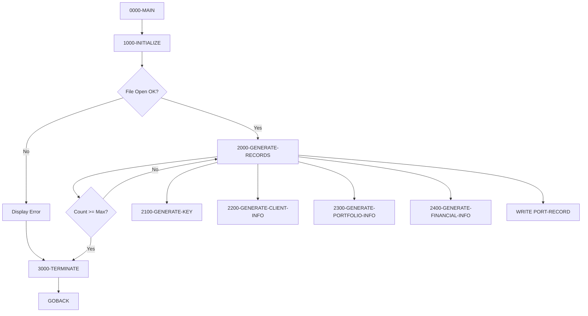

## Overview

PORTTEST is a utility program that generates synthetic test data for the portfolio management system. It creates randomized portfolio records with realistic data patterns, writing them to a sequential file for use in testing, development, and quality assurance activities.

The program generates up to 100 portfolio records by default, each containing:
- Unique portfolio identifiers and account numbers
- Client information with varied client types
- Portfolio metadata including status and dates
- Financial data with random values for total value and cash balance

This test data generator is essential for populating development and test environments without using production data, supporting both functional testing and performance benchmarking.

## Program Structure



## Data Structures

### Working Storage Variables

| Level | Name | Picture | Value | Description |
|-------|------|---------|-------|-------------|
| 05 | WS-FILE-STATUS | X(2) | - | File status code |
| 05 | WS-RECORD-COUNT | 9(5) | 0 | Current record counter |
| 05 | WS-MAX-RECORDS | 9(5) | 100 | Maximum records to generate |
| 05 | WS-CURRENT-DATE | 9(8) | - | Current date (YYYYMMDD) |

### Test Value Constants

| Level | Name | Picture | Value | Description |
|-------|------|---------|-------|-------------|
| 05 | WS-CLIENT-TYPES | X(3) | 'ICT' | Client type codes: I=Individual, C=Corporate, T=Trust |
| 05 | WS-STATUS-TYPES | X(3) | 'ACS' | Status codes: A=Active, C=Closed, S=Suspended |
| 05 | WS-NAME-PREFIX | X(4) | 'TEST' | Prefix for generated client names |

### Subscripts

| Level | Name | Picture | Description |
|-------|------|---------|-------------|
| 05 | WS-TYPE-SUB | 9(1) | Subscript for client type selection |
| 05 | WS-STATUS-SUB | 9(1) | Subscript for status selection |

### Portfolio Record Structure (from PORTFLIO copybook)

| Level | Name | Picture | Description |
|-------|------|---------|-------------|
| 01 | PORT-RECORD | - | Complete portfolio record |
| 10 | PORT-ID | X(8) | Portfolio identifier |
| 10 | PORT-ACCOUNT-NO | X(10) | Account number |
| 10 | PORT-CLIENT-NAME | X(30) | Client name |
| 10 | PORT-CLIENT-TYPE | X(1) | I=Individual, C=Corporate, T=Trust |
| 10 | PORT-CREATE-DATE | 9(8) | Creation date (YYYYMMDD) |
| 10 | PORT-LAST-MAINT | 9(8) | Last maintenance date |
| 10 | PORT-STATUS | X(1) | A=Active, C=Closed, S=Suspended |
| 10 | PORT-TOTAL-VALUE | S9(13)V99 COMP-3 | Total portfolio value |
| 10 | PORT-CASH-BALANCE | S9(13)V99 COMP-3 | Available cash balance |
| 10 | PORT-LAST-USER | X(8) | Last user to modify |
| 10 | PORT-LAST-TRANS | 9(8) | Last transaction date |
| 05 | PORT-FILLER | X(50) | Reserved space |

## File I/O

### Test File (TESTFILE)

| Attribute | Value |
|-----------|-------|
| DDname | TESTFILE |
| Organization | Sequential |
| Access Mode | Sequential |
| File Status | WS-FILE-STATUS |
| Record Layout | PORTFLIO copybook |

**Operations:**
- OPEN OUTPUT - Opens file for writing new records
- WRITE - Writes generated portfolio records
- CLOSE - Closes file at program termination

## Control Flow

### 0000-MAIN

Main control paragraph that orchestrates the test data generation:

1. Performs 1000-INITIALIZE to set up the environment
2. Loops through 2000-GENERATE-RECORDS until WS-RECORD-COUNT reaches WS-MAX-RECORDS (100)
3. Performs 3000-TERMINATE to close files and display results
4. Returns control via GOBACK

### 1000-INITIALIZE

Prepares the environment for data generation:

1. **Get Current Date**: Uses `ACCEPT WS-CURRENT-DATE FROM DATE YYYYMMDD` to retrieve system date
2. **Open Output File**: Opens TEST-FILE for output
3. **Validate Open**: If file status is not '00':
   - Displays error message with status code
   - Performs termination routine
   - Exits program immediately

### 2000-GENERATE-RECORDS

Generates a single portfolio record:

1. **Initialize Record**: Clears PORT-RECORD to spaces/zeros
2. **Generate Components**: Calls subordinate paragraphs:
   - 2100-GENERATE-KEY - Creates unique identifiers
   - 2200-GENERATE-CLIENT-INFO - Populates client data
   - 2300-GENERATE-PORTFOLIO-INFO - Sets portfolio metadata
   - 2400-GENERATE-FINANCIAL-INFO - Generates financial values
3. **Write Record**: Writes PORT-RECORD to file
4. **Check Status**: If successful, increments record counter; otherwise displays error

### 2100-GENERATE-KEY

Creates unique portfolio identifiers:

1. **Portfolio ID**: Uses STRING to concatenate 'PORT' with record count
   - Example: PORT00001, PORT00002, etc.
2. **Set Random Seed**: Calls FUNCTION RANDOM with record count as seed
3. **Account Number**: Computes account number as record count + 1,000,000,000
   - Example: 1000000001, 1000000002, etc.

### 2200-GENERATE-CLIENT-INFO

Generates client-related data:

1. **Client Name**: Uses STRING to concatenate 'TEST' prefix with record count
   - Example: TEST00001, TEST00002, etc.
2. **Client Type**: Extracts character from WS-CLIENT-TYPES using WS-TYPE-SUB
   - Randomly assigns I (Individual), C (Corporate), or T (Trust)

### 2300-GENERATE-PORTFOLIO-INFO

Sets portfolio metadata:

1. **Create Date**: Sets to current date (WS-CURRENT-DATE)
2. **Last Maintenance**: Sets to current date
3. **Status**: Randomly selects from WS-STATUS-TYPES
   - Computes random subscript 1-3
   - Assigns A (Active), C (Closed), or S (Suspended)

### 2400-GENERATE-FINANCIAL-INFO

Generates financial values:

1. **Total Value**: Random amount up to $1,000,000
   - Formula: `FUNCTION RANDOM * 1000000`
2. **Cash Balance**: 10% of total value
   - Formula: `PORT-TOTAL-VALUE * 0.10`

### 3000-TERMINATE

Cleanup and reporting:

1. Closes TEST-FILE
2. Displays final record count to SYSOUT

## Generated Data Patterns

| Field | Pattern | Example |
|-------|---------|---------|
| PORT-ID | 'PORT' + sequence | PORT00001 |
| PORT-ACCOUNT-NO | 1000000000 + sequence | 1000000001 |
| PORT-CLIENT-NAME | 'TEST' + sequence | TEST00001 |
| PORT-CLIENT-TYPE | Random from 'ICT' | I, C, or T |
| PORT-CREATE-DATE | Current date | 20240320 |
| PORT-STATUS | Random from 'ACS' | A, C, or S |
| PORT-TOTAL-VALUE | Random 0-1,000,000 | 547823.45 |
| PORT-CASH-BALANCE | 10% of total | 54782.35 |

## Dependencies

### Copybooks

- **PORTFLIO** - Portfolio master record layout defining the PORT-RECORD structure
- **ERRHAND** - Standard error handling definitions (included but not actively used)

### Called Programs

None - this is a standalone utility program.

### Related Programs

Programs that use the same PORTFLIO copybook and may consume test data:
- PORTADD - Add new portfolio records
- PORTDEL - Delete portfolio records
- PORTREAD - Read/query portfolio records
- PORTUPDT - Update portfolio records
- TSTGEN00 - Another test data generator (uses PORTFLIO, ERRHAND)

## JCL Example

```jcl
//PORTTEST JOB (ACCT),'GENERATE TEST DATA',
//             CLASS=A,MSGCLASS=X
//*
//GENTEST  EXEC PGM=PORTTEST
//STEPLIB  DD DSN=TEST.LOAD.LIBRARY,DISP=SHR
//TESTFILE DD DSN=TEST.PORTFOLIO.DATA,
//            DISP=(NEW,CATLG,DELETE),
//            DCB=(RECFM=FB,LRECL=150,BLKSIZE=0),
//            SPACE=(CYL,(1,1))
//SYSOUT   DD SYSOUT=*
```

## Customization

To modify the number of records generated, change the WS-MAX-RECORDS value:

```cobol
05  WS-MAX-RECORDS      PIC 9(5) VALUE 100.
```

To add new client types or statuses, modify the corresponding constants:

```cobol
05  WS-CLIENT-TYPES     PIC X(3) VALUE 'ICT'.
05  WS-STATUS-TYPES     PIC X(3) VALUE 'ACS'.
```

## Technical Notes

1. **FUNCTION RANDOM**: COBOL intrinsic function that generates pseudo-random numbers between 0 and 1. When called with an argument, it seeds the random number generator for reproducible sequences.

2. **ACCEPT FROM DATE YYYYMMDD**: Retrieves the system date in 8-digit format (YYYYMMDD). This is a COBOL 85 extension supported by most mainframe compilers.

3. **STRING Statement**: Concatenates multiple source fields into a target field. The DELIMITED BY SIZE clause uses the full length of each source field.

4. **Reference Modification**: The syntax `WS-CLIENT-TYPES(WS-TYPE-SUB:1)` extracts 1 character starting at position WS-TYPE-SUB, enabling array-like access to a character string.

5. **COMP-3 (Packed Decimal)**: Financial fields use packed decimal format for efficient storage and arithmetic. Each digit occupies half a byte, with the sign in the last nibble.

6. **INITIALIZE Statement**: Clears the record to spaces for alphanumeric fields and zeros for numeric fields, ensuring clean data before populating.

7. **Sequential File Processing**: Output-mode sequential files are simple and efficient for batch data generation, writing records in the order they are generated.

## Sample Output

After execution, the program displays:
```
Records generated: 00100
```

The generated file contains 100 portfolio records ready for use in testing portfolio management applications.
