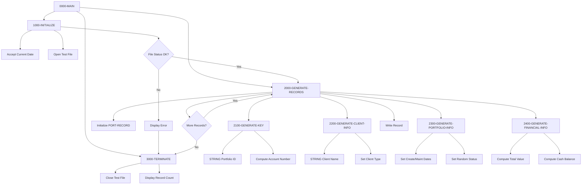

## Overview

PORTTEST is a batch utility program that generates test data for the portfolio management system. It creates sample portfolio master records with randomized but realistic data, writing them to a sequential test file.

The program is designed for:
- **Development Testing** - Provides sample data for developers to test portfolio-related functionality
- **Performance Testing** - Can generate large volumes of data (configurable up to 100 records by default)
- **Integration Testing** - Creates properly formatted records that match production data structures
- **Demo Environments** - Populates demonstration systems with representative data

The generated records include portfolio identifiers, client information, dates, status codes, and financial values with realistic distributions.

## Program Structure



## Data Structures

### File Section - Portfolio Record (PORTFLIO copybook)

| Level | Field | Picture | Description |
|-------|-------|---------|-------------|
| 01 | PORT-RECORD | - | Portfolio master record |
| 05 | PORT-KEY | - | Composite key group |
| 10 | PORT-ID | X(8) | Portfolio identifier |
| 10 | PORT-ACCOUNT-NO | X(10) | Account number |
| 05 | PORT-CLIENT-INFO | - | Client information group |
| 10 | PORT-CLIENT-NAME | X(30) | Client name |
| 10 | PORT-CLIENT-TYPE | X(1) | I=Individual, C=Corporate, T=Trust |
| 05 | PORT-PORTFOLIO-INFO | - | Portfolio attributes group |
| 10 | PORT-CREATE-DATE | 9(8) | Creation date (YYYYMMDD) |
| 10 | PORT-LAST-MAINT | 9(8) | Last maintenance date |
| 10 | PORT-STATUS | X(1) | A=Active, C=Closed, S=Suspended |
| 05 | PORT-FINANCIAL-INFO | - | Financial data group |
| 10 | PORT-TOTAL-VALUE | S9(13)V99 COMP-3 | Total portfolio value |
| 10 | PORT-CASH-BALANCE | S9(13)V99 COMP-3 | Cash balance |
| 05 | PORT-AUDIT-INFO | - | Audit information group |
| 10 | PORT-LAST-USER | X(8) | Last update user ID |
| 10 | PORT-LAST-TRANS | 9(8) | Last transaction date |
| 05 | PORT-FILLER | X(50) | Reserved space |

**Condition Names:**

| Field | Level-88 | Value | Description |
|-------|----------|-------|-------------|
| PORT-CLIENT-TYPE | PORT-INDIVIDUAL | 'I' | Individual account |
| PORT-CLIENT-TYPE | PORT-CORPORATE | 'C' | Corporate account |
| PORT-CLIENT-TYPE | PORT-TRUST | 'T' | Trust account |
| PORT-STATUS | PORT-ACTIVE | 'A' | Active portfolio |
| PORT-STATUS | PORT-CLOSED | 'C' | Closed portfolio |
| PORT-STATUS | PORT-SUSPENDED | 'S' | Suspended portfolio |

### Working Storage

#### Control Variables

| Field | Picture | Initial Value | Description |
|-------|---------|---------------|-------------|
| WS-FILE-STATUS | X(2) | - | File operation status |
| WS-RECORD-COUNT | 9(5) | 0 | Records generated counter |
| WS-MAX-RECORDS | 9(5) | 100 | Maximum records to generate |
| WS-CURRENT-DATE | 9(8) | - | Current date (YYYYMMDD) |

#### Test Value Templates

| Field | Picture | Value | Description |
|-------|---------|-------|-------------|
| WS-CLIENT-TYPES | X(3) | 'ICT' | Client type options (Individual, Corporate, Trust) |
| WS-STATUS-TYPES | X(3) | 'ACS' | Status options (Active, Closed, Suspended) |
| WS-NAME-PREFIX | X(4) | 'TEST' | Prefix for generated names |

#### Subscript Variables

| Field | Picture | Description |
|-------|---------|-------------|
| WS-TYPE-SUB | 9(1) | Index into client/status type strings |
| WS-STATUS-SUB | 9(1) | Index for status selection |

## File I/O

### Test File (TESTFILE)

A sequential output file containing generated portfolio records.

| Attribute | Value |
|-----------|-------|
| DD Name | TESTFILE |
| Organization | Sequential |
| Access Mode | Sequential (Output) |
| Record Format | From PORTFLIO copybook |
| File Status | WS-FILE-STATUS |

| Operation | Paragraph | Description |
|-----------|-----------|-------------|
| OPEN OUTPUT | 1000-INITIALIZE | Opens file for writing |
| WRITE | 2000-GENERATE-RECORDS | Writes each generated record |
| CLOSE | 3000-TERMINATE | Closes file |

## Control Flow

### 0000-MAIN - Main Control

1. Calls 1000-INITIALIZE to set up the environment
2. Loops through 2000-GENERATE-RECORDS until WS-MAX-RECORDS is reached
3. Calls 3000-TERMINATE for cleanup
4. Returns to caller via GOBACK

### 1000-INITIALIZE - Setup

1. Accepts current date in YYYYMMDD format using `ACCEPT FROM DATE YYYYMMDD`
2. Opens test file for output
3. Validates file status:
   - If not '00': Displays error, terminates, and exits
   - If '00': Continues to record generation

### 2000-GENERATE-RECORDS - Record Generation Loop

For each record:
1. Initializes PORT-RECORD to spaces/zeros
2. Calls 2100-GENERATE-KEY to create unique identifiers
3. Calls 2200-GENERATE-CLIENT-INFO to populate client data
4. Calls 2300-GENERATE-PORTFOLIO-INFO to set dates and status
5. Calls 2400-GENERATE-FINANCIAL-INFO to calculate values
6. Writes the record to the test file
7. If successful, increments record count; otherwise displays error

### 2100-GENERATE-KEY - Key Generation

1. Creates PORT-ID by concatenating 'PORT' with the record count (e.g., 'PORT00001')
2. Uses FUNCTION RANDOM with record count as seed for randomization
3. Computes PORT-ACCOUNT-NO as record count + 1,000,000,000 (ensuring 10-digit accounts)

### 2200-GENERATE-CLIENT-INFO - Client Data Generation

1. Creates PORT-CLIENT-NAME by concatenating 'TEST' with record count (e.g., 'TEST00001')
2. Sets PORT-CLIENT-TYPE using random index into 'ICT' string:
   - Position 1: 'I' (Individual)
   - Position 2: 'C' (Corporate)
   - Position 3: 'T' (Trust)

### 2300-GENERATE-PORTFOLIO-INFO - Portfolio Attributes

1. Sets PORT-CREATE-DATE to current date
2. Sets PORT-LAST-MAINT to current date
3. Computes random status index (1-3)
4. Sets PORT-STATUS using index into 'ACS' string:
   - Position 1: 'A' (Active)
   - Position 2: 'C' (Closed)
   - Position 3: 'S' (Suspended)

### 2400-GENERATE-FINANCIAL-INFO - Financial Values

1. Computes PORT-TOTAL-VALUE as random value between 0 and 1,000,000
2. Computes PORT-CASH-BALANCE as 10% of total value

### 3000-TERMINATE - Cleanup

1. Closes the test file
2. Displays count of records generated

## Dependencies

### Copybooks

- **PORTFLIO** - Portfolio master record layout defining the complete record structure
- **ERRHAND** - Standard error handling definitions (included but not actively used in this program)

### Called Programs

None - this is a standalone test data generator.

### Related Programs

Programs sharing the PORTFLIO copybook:

| Program | Description |
|---------|-------------|
| PORTADD | Portfolio add/create program |
| PORTDEL | Portfolio delete program |
| PORTREAD | Portfolio read/inquiry program |
| PORTUPDT | Portfolio update program |
| TSTGEN00 | Another test data generator |

Programs sharing the ERRHAND copybook are used throughout the system for consistent error handling.

## Generated Data Characteristics

### Record Distribution

| Field | Distribution | Example Values |
|-------|--------------|----------------|
| PORT-ID | Sequential | PORT00001, PORT00002, ... |
| PORT-ACCOUNT-NO | Sequential | 1000000001, 1000000002, ... |
| PORT-CLIENT-NAME | Sequential | TEST00001, TEST00002, ... |
| PORT-CLIENT-TYPE | Random (I/C/T) | Approximately 33% each |
| PORT-STATUS | Random (A/C/S) | Approximately 33% each |
| PORT-TOTAL-VALUE | Random 0-1,000,000 | Uniform distribution |
| PORT-CASH-BALANCE | 10% of total | Correlates with total value |
| PORT-CREATE-DATE | Current date | All records same date |
| PORT-LAST-MAINT | Current date | All records same date |

### Sample Generated Record

```
PORT-ID:          PORT00042
PORT-ACCOUNT-NO:  1000000042
PORT-CLIENT-NAME: TEST00042
PORT-CLIENT-TYPE: I (Individual)
PORT-CREATE-DATE: 20240320
PORT-LAST-MAINT:  20240320
PORT-STATUS:      A (Active)
PORT-TOTAL-VALUE: 523,847.25
PORT-CASH-BALANCE: 52,384.73
```

## Technical Notes

1. **FUNCTION RANDOM**: The COBOL intrinsic function generates pseudo-random numbers between 0 and 1. When called with an argument (seed), it initializes the random sequence. Subsequent calls without arguments continue the sequence.

2. **STRING Statement**: Used to concatenate text with numeric values for generating unique identifiers. The DELIMITED BY SIZE clause ensures all characters are included.

3. **COMP-3 (Packed Decimal)**: Financial fields use packed decimal format which stores two digits per byte plus a sign nibble. This is efficient for decimal arithmetic on mainframes.

4. **Reference Modification**: The syntax `WS-CLIENT-TYPES(WS-TYPE-SUB:1)` extracts a single character from position WS-TYPE-SUB in the string. This is used to randomly select client types and statuses.

5. **ACCEPT FROM DATE**: The `YYYYMMDD` format option ensures a 4-digit year, avoiding Y2K-style issues with 2-digit years.

6. **Sequential File Output**: Using sequential organization is appropriate for bulk test data generation as it provides fast sequential writes without index overhead.

7. **Error Handling**: The program uses simple DISPLAY statements for errors rather than calling ERRPROC, which is appropriate for a test utility that typically runs interactively or in a development environment.

## Usage

### JCL Example

```jcl
//GENTEST  EXEC PGM=PORTTEST
//STEPLIB  DD DSN=your.loadlib,DISP=SHR
//TESTFILE DD DSN=your.test.portfolio,
//            DISP=(NEW,CATLG,DELETE),
//            SPACE=(CYL,(1,1)),
//            DCB=(RECFM=FB,LRECL=150,BLKSIZE=0)
//SYSOUT   DD SYSOUT=*
```

### Customization

To change the number of records generated, modify the WS-MAX-RECORDS value:

```cobol
05  WS-MAX-RECORDS      PIC 9(5) VALUE 100.
```

Change to desired count (e.g., VALUE 1000 for 1,000 records).
