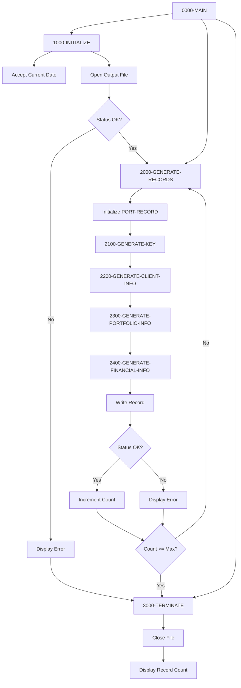

## Overview

PORTTEST is a utility program that generates synthetic portfolio test data for development, testing, and quality assurance purposes. It creates a configurable number of portfolio records with realistic-looking data, writing them to a sequential output file.

The program generates 100 test records by default, each containing a unique portfolio ID, account number, client information, portfolio status, and financial values. The generated data uses randomization to create variety in client types, portfolio statuses, and financial amounts, making it suitable for testing various scenarios in the portfolio management system.

This test data generator is essential for creating repeatable test scenarios without requiring access to production data, supporting both unit testing of individual programs and integration testing of the complete portfolio processing system.

## Program Structure



## Data Structures

### Working Storage Variables

| Level | Name | Picture | Value | Description |
|-------|------|---------|-------|-------------|
| 01 | WS-VARIABLES | - | - | Main working variables |
| 05 | WS-FILE-STATUS | X(2) | - | File status code |
| 05 | WS-RECORD-COUNT | 9(5) | 0 | Number of records generated |
| 05 | WS-MAX-RECORDS | 9(5) | 100 | Maximum records to generate |
| 05 | WS-CURRENT-DATE | 9(8) | - | System date (YYYYMMDD) |

### Test Value Constants

| Level | Name | Picture | Value | Description |
|-------|------|---------|-------|-------------|
| 01 | WS-TEST-VALUES | - | - | Test data generation values |
| 05 | WS-CLIENT-TYPES | X(3) | 'ICT' | Client types: Individual, Corporate, Trust |
| 05 | WS-STATUS-TYPES | X(3) | 'ACS' | Status types: Active, Closed, Suspended |
| 05 | WS-NAME-PREFIX | X(4) | 'TEST' | Prefix for generated client names |

### Subscripts

| Level | Name | Picture | Description |
|-------|------|---------|-------------|
| 01 | WS-SUBSCRIPTS | - | Loop subscripts |
| 05 | WS-TYPE-SUB | 9(1) | Subscript for client type selection |
| 05 | WS-STATUS-SUB | 9(1) | Subscript for status selection |

### Portfolio Record Structure (from PORTFLIO copybook)

| Level | Name | Picture | Description |
|-------|------|---------|-------------|
| 01 | PORT-RECORD | - | Portfolio master record |
| 05 | PORT-KEY | - | Record key group |
| 10 | PORT-ID | X(8) | Portfolio identifier |
| 10 | PORT-ACCOUNT-NO | X(10) | Account number |
| 05 | PORT-CLIENT-INFO | - | Client information group |
| 10 | PORT-CLIENT-NAME | X(30) | Client name |
| 10 | PORT-CLIENT-TYPE | X(1) | 'I'=Individual, 'C'=Corporate, 'T'=Trust |
| 05 | PORT-PORTFOLIO-INFO | - | Portfolio information group |
| 10 | PORT-CREATE-DATE | 9(8) | Creation date (YYYYMMDD) |
| 10 | PORT-LAST-MAINT | 9(8) | Last maintenance date |
| 10 | PORT-STATUS | X(1) | 'A'=Active, 'C'=Closed, 'S'=Suspended |
| 05 | PORT-FINANCIAL-INFO | - | Financial information group |
| 10 | PORT-TOTAL-VALUE | S9(13)V99 COMP-3 | Total portfolio value |
| 10 | PORT-CASH-BALANCE | S9(13)V99 COMP-3 | Cash balance (10% of total) |
| 05 | PORT-AUDIT-INFO | - | Audit information group |
| 10 | PORT-LAST-USER | X(8) | Last user to modify |
| 10 | PORT-LAST-TRANS | 9(8) | Last transaction date |
| 05 | PORT-FILLER | X(50) | Reserved space |

## File I/O

### File Definition

| File Name | DD Name | Organization | Access | Description |
|-----------|---------|--------------|--------|-------------|
| TEST-FILE | TESTFILE | Sequential | Sequential | Output file for generated test records |

### File Section

The file section includes the PORTFLIO copybook, which defines PORT-RECORD as the file's record layout.

### I/O Operations

| File | Operation | Paragraph | Purpose |
|------|-----------|-----------|---------|
| TEST-FILE | OPEN OUTPUT | 1000-INITIALIZE | Open file for writing |
| TEST-FILE | WRITE | 2000-GENERATE-RECORDS | Write generated portfolio record |
| TEST-FILE | CLOSE | 3000-TERMINATE | Close file after generation |

## Control Flow

### 0000-MAIN (Main Control)

The main paragraph orchestrates the test data generation:
1. Performs initialization (1000-INITIALIZE)
2. Loops through record generation (2000-GENERATE-RECORDS) until WS-RECORD-COUNT reaches WS-MAX-RECORDS
3. Performs termination (3000-TERMINATE)
4. Returns to caller via GOBACK

### 1000-INITIALIZE (Setup)

1. Accepts the current system date in YYYYMMDD format using `ACCEPT FROM DATE YYYYMMDD`
2. Opens TEST-FILE for output
3. Checks file status:
   - If not '00': Displays error message, performs termination, and exits
   - If '00': Continues to record generation

### 2000-GENERATE-RECORDS (Record Creation)

Main record generation loop that creates one portfolio record per iteration:

1. Initializes PORT-RECORD to spaces/zeros
2. Calls subordinate paragraphs to populate each section:
   - 2100-GENERATE-KEY: Creates portfolio ID and account number
   - 2200-GENERATE-CLIENT-INFO: Creates client name and type
   - 2300-GENERATE-PORTFOLIO-INFO: Sets dates and status
   - 2400-GENERATE-FINANCIAL-INFO: Calculates financial values
3. Writes the completed record to TEST-FILE
4. If write successful ('00'): Increments WS-RECORD-COUNT
5. If write fails: Displays error message with status code

### 2100-GENERATE-KEY (Key Generation)

Generates unique key fields:

1. Uses STRING to create PORT-ID by concatenating 'PORT' with the record count
   - Example: 'PORT00001', 'PORT00002', etc.
2. Uses FUNCTION RANDOM seeded with record count to set type subscript
3. Computes PORT-ACCOUNT-NO by adding record count to 1000000000
   - Example: 1000000001, 1000000002, etc.

### 2200-GENERATE-CLIENT-INFO (Client Data)

Generates client information:

1. Uses STRING to create PORT-CLIENT-NAME by concatenating 'TEST' with record count
   - Example: 'TEST00001', 'TEST00002', etc.
2. Selects PORT-CLIENT-TYPE using WS-TYPE-SUB as subscript into WS-CLIENT-TYPES
   - Produces 'I' (Individual), 'C' (Corporate), or 'T' (Trust)

### 2300-GENERATE-PORTFOLIO-INFO (Portfolio Data)

Generates portfolio metadata:

1. Moves current date to PORT-CREATE-DATE
2. Moves current date to PORT-LAST-MAINT
3. Computes random status subscript (1-3) using `FUNCTION RANDOM * 3 + 1`
4. Selects PORT-STATUS using subscript into WS-STATUS-TYPES
   - Produces 'A' (Active), 'C' (Closed), or 'S' (Suspended)

### 2400-GENERATE-FINANCIAL-INFO (Financial Data)

Generates financial values:

1. Computes PORT-TOTAL-VALUE as random value up to 1,000,000 using `FUNCTION RANDOM * 1000000`
2. Computes PORT-CASH-BALANCE as 10% of total value

### 3000-TERMINATE (Cleanup)

1. Closes TEST-FILE
2. Displays final record count generated

## Dependencies

### Copybooks

- **PORTFLIO** - Portfolio master record layout defining PORT-RECORD structure
- **ERRHAND** - Standard error handling definitions (included but not actively used in current implementation)

### Called Programs

This program does not call other programs.

### Related Programs

Programs that share the PORTFLIO copybook and process portfolio data:

- **PORTADD** - Add new portfolio records
- **PORTDEL** - Delete portfolio records
- **PORTREAD** - Read/retrieve portfolio records
- **PORTUPDT** - Update existing portfolio records
- **TSTGEN00** - Test generation utility (uses PORTFLIO and ERRHAND)

## Technical Notes

### Generated Data Characteristics

| Field | Generation Method | Example Values |
|-------|-------------------|----------------|
| PORT-ID | 'PORT' + sequence | PORT00001, PORT00050, PORT00099 |
| PORT-ACCOUNT-NO | 1000000000 + sequence | 1000000001, 1000000050 |
| PORT-CLIENT-NAME | 'TEST' + sequence | TEST00001, TEST00050 |
| PORT-CLIENT-TYPE | Random from 'ICT' | I, C, or T |
| PORT-CREATE-DATE | Current date | 20240320 |
| PORT-LAST-MAINT | Current date | 20240320 |
| PORT-STATUS | Random from 'ACS' | A, C, or S |
| PORT-TOTAL-VALUE | Random 0-1,000,000 | 500000.00 |
| PORT-CASH-BALANCE | 10% of total | 50000.00 |

### File Status Codes

| Status | Meaning | Action |
|--------|---------|--------|
| 00 | Success | Continue processing |
| Other | Error | Display message, terminate |

### Configuration

The number of records generated is controlled by WS-MAX-RECORDS, which defaults to 100. To generate a different number of test records, this value can be modified in the working storage section.

### COBOL Features Used

- **ACCEPT FROM DATE YYYYMMDD**: Retrieves system date in 8-digit format
- **FUNCTION RANDOM**: Intrinsic function generating pseudo-random numbers between 0 and 1
- **FUNCTION RANDOM(seed)**: Seeded random number for reproducible sequences
- **STRING DELIMITED BY SIZE**: Concatenates multiple fields into a single field
- **COMPUTE**: Performs arithmetic calculations with multiple operators
- **Reference modification**: `WS-CLIENT-TYPES(WS-TYPE-SUB:1)` extracts single character at position

### Sample Output

A generated record might contain:

```
PORT-ID:          PORT00042
PORT-ACCOUNT-NO:  1000000042
PORT-CLIENT-NAME: TEST00042
PORT-CLIENT-TYPE: C (Corporate)
PORT-CREATE-DATE: 20240320
PORT-LAST-MAINT:  20240320
PORT-STATUS:      A (Active)
PORT-TOTAL-VALUE: 725432.50
PORT-CASH-BALANCE: 72543.25
```

### Usage

The program is typically run via JCL that defines the TESTFILE DD:

```jcl
//GENTEST  EXEC PGM=PORTTEST
//TESTFILE DD DSN=TEST.PORTFOLIO.DATA,
//            DISP=(NEW,CATLG,DELETE),
//            SPACE=(TRK,(10,5)),
//            DCB=(RECFM=FB,LRECL=150,BLKSIZE=0)
//SYSOUT   DD SYSOUT=*
```

### Limitations

- PORT-AUDIT-INFO fields (PORT-LAST-USER, PORT-LAST-TRANS) are not populated
- PORT-FILLER is left as spaces
- Random seed based on record count produces same sequence each run
- Financial values have no upper bound validation
