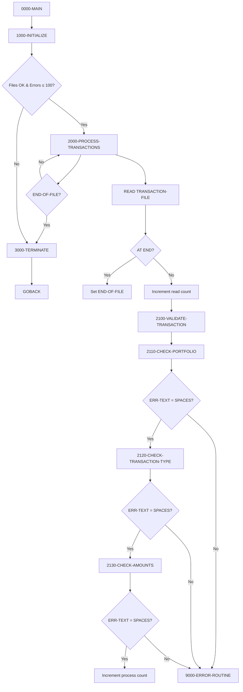
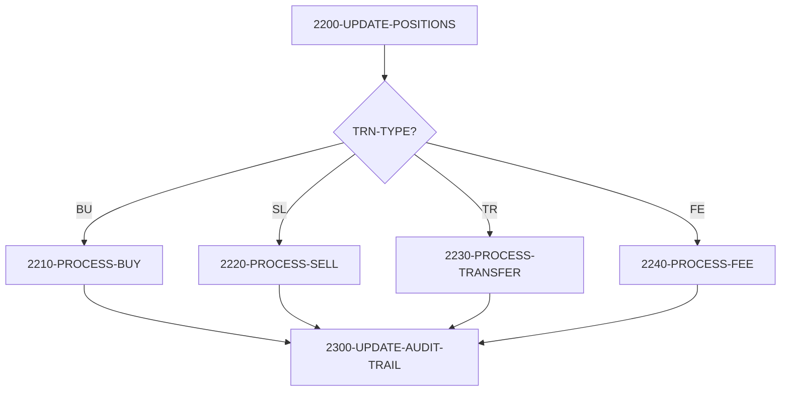
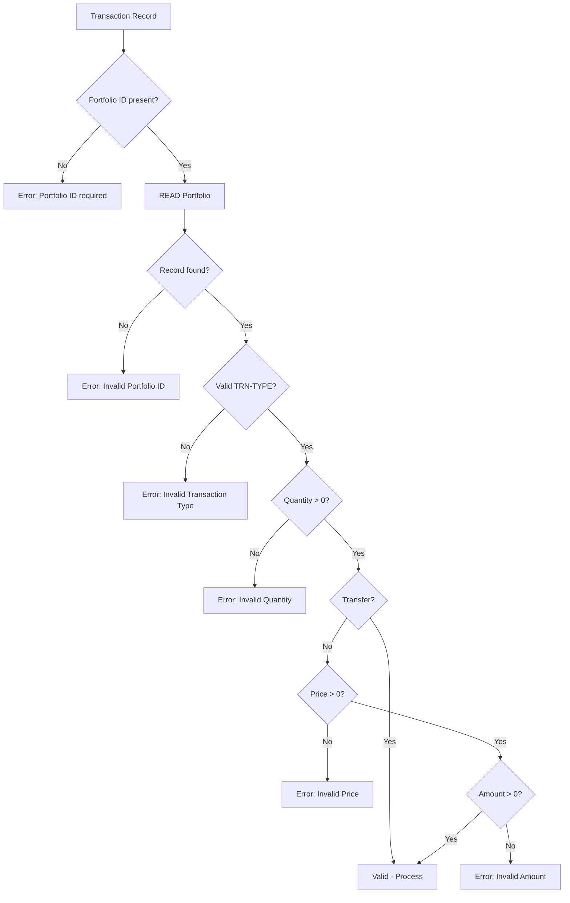

## Overview

PORTTRAN is a batch Portfolio Transaction Processing program that reads transaction records from a sequential input file, validates them, and updates portfolio positions accordingly. It supports four transaction types: Buy (BU), Sell (SL), Transfer (TR), and Fee (FE).

The program implements a robust validation framework that checks for valid portfolio IDs, valid transaction types, and positive amounts before processing. Each transaction is validated against the portfolio master file to ensure the referenced portfolio exists. For sell transactions, the program also validates that sufficient units are available.

PORTTRAN maintains a complete audit trail by calling the AUDPROC program after each position update, capturing before images, transaction details, and success/failure status. The program includes an error threshold that terminates processing if more than 100 errors are encountered, preventing runaway error conditions.

## Program Structure



## Data Structures

### Transaction Record (from TRNREC copybook)

| Level | Name | Picture | Description |
|-------|------|---------|-------------|
| 01 | TRANSACTION-RECORD | | Transaction input record |
| 05 | TRN-KEY | | Composite transaction key |
| 10 | TRN-DATE | X(8) | Transaction date (YYYYMMDD) |
| 10 | TRN-TIME | X(6) | Transaction time (HHMMSS) |
| 10 | TRN-PORTFOLIO-ID | X(8) | Portfolio identifier |
| 10 | TRN-SEQUENCE-NO | X(6) | Sequence number for ordering |
| 05 | TRN-DATA | | Transaction details |
| 10 | TRN-INVESTMENT-ID | X(10) | Investment/security identifier |
| 10 | TRN-TYPE | X(2) | Transaction type code |
| 10 | TRN-QUANTITY | S9(11)V9(4) COMP-3 | Number of units |
| 10 | TRN-PRICE | S9(11)V9(4) COMP-3 | Price per unit |
| 10 | TRN-AMOUNT | S9(13)V9(2) COMP-3 | Total transaction amount |
| 10 | TRN-CURRENCY | X(3) | Currency code |
| 10 | TRN-STATUS | X(1) | Transaction status |
| 05 | TRN-AUDIT | | Audit information |
| 10 | TRN-PROCESS-DATE | X(26) | Processing timestamp |
| 10 | TRN-PROCESS-USER | X(8) | Processing user ID |
| 05 | TRN-FILLER | X(50) | Reserved |

### Transaction Type Values

| Code | Condition Name | Description |
|------|----------------|-------------|
| `BU` | TRN-TYPE-BUY | Buy - add units to portfolio |
| `SL` | TRN-TYPE-SELL | Sell - remove units from portfolio |
| `TR` | TRN-TYPE-TRANS | Transfer between portfolios |
| `FE` | TRN-TYPE-FEE | Fee - deduct amount from portfolio |

### Transaction Status Values

| Code | Condition Name | Description |
|------|----------------|-------------|
| `P` | TRN-STATUS-PEND | Pending processing |
| `D` | TRN-STATUS-DONE | Successfully processed |
| `F` | TRN-STATUS-FAIL | Processing failed |
| `R` | TRN-STATUS-REV | Reversed |

### Audit Record (from AUDITLOG copybook)

| Level | Name | Picture | Description |
|-------|------|---------|-------------|
| 01 | AUDIT-RECORD | | Audit trail record |
| 10 | AUD-TIMESTAMP | X(26) | Audit record timestamp |
| 10 | AUD-SYSTEM-ID | X(8) | System identifier |
| 10 | AUD-USER-ID | X(8) | User who performed action |
| 10 | AUD-PROGRAM | X(8) | Program name |
| 10 | AUD-TERMINAL | X(8) | Terminal ID |
| 05 | AUD-TYPE | X(4) | Audit type: `TRAN`, `USER`, `SYST` |
| 05 | AUD-ACTION | X(8) | Action: `CREATE`, `UPDATE`, `DELETE` |
| 05 | AUD-STATUS | X(4) | Status: `SUCC`, `FAIL`, `WARN` |
| 10 | AUD-PORTFOLIO-ID | X(8) | Portfolio identifier |
| 10 | AUD-ACCOUNT-NO | X(10) | Account number |
| 05 | AUD-BEFORE-IMAGE | X(100) | Record state before change |
| 05 | AUD-AFTER-IMAGE | X(100) | Record state after change |
| 05 | AUD-MESSAGE | X(100) | Descriptive message |

### Working Storage

| Level | Name | Picture | Description |
|-------|------|---------|-------------|
| 05 | WS-TRAN-STATUS | X(2) | Transaction file status |
| 05 | WS-PORT-STATUS | X(2) | Portfolio file status |
| 05 | WS-READ-COUNT | 9(8) COMP | Records read counter |
| 05 | WS-PROCESS-COUNT | 9(8) COMP | Records processed counter |
| 05 | WS-ERROR-COUNT | 9(8) COMP | Error counter |
| 01 | WS-EOF-FLAG | X(1) | End-of-file flag (`Y`/`N`) |

## File I/O

### TRANSACTION-FILE

| Attribute | Value |
|-----------|-------|
| DD Name | TRANFILE |
| Organization | Sequential |
| Access Mode | Sequential |
| Recording Mode | Fixed (F) |
| Open Mode | INPUT |
| Record Layout | TRNREC copybook |

Operations:
- **READ** - Read transaction records sequentially

### PORTFOLIO-FILE

| Attribute | Value |
|-----------|-------|
| DD Name | PORTFILE |
| Organization | Indexed (VSAM KSDS) |
| Access Mode | Random |
| Recording Mode | Fixed (F) |
| Record Key | PORT-ID |
| Open Mode | I-O |
| Record Layout | PORTREC copybook |

Operations:
- **READ** - Retrieve portfolio record by key
- **REWRITE** - Update portfolio after transaction

## Control Flow

### 0000-MAIN

1. Performs 1000-INITIALIZE
2. If transaction file opened successfully, loops through 2000-PROCESS-TRANSACTIONS until:
   - END-OF-FILE is reached, OR
   - WS-ERROR-COUNT exceeds 100
3. Performs 3000-TERMINATE

### 1000-INITIALIZE

1. Initializes file status and counter fields
2. Sets MORE-RECORDS flag to TRUE
3. Opens TRANSACTION-FILE for INPUT
4. Opens PORTFOLIO-FILE for I-O
5. On file open errors, calls 9000-ERROR-ROUTINE

### 2000-PROCESS-TRANSACTIONS

1. Reads next record from TRANSACTION-FILE
2. On AT END: Sets END-OF-FILE flag
3. On NOT AT END:
   - Increments WS-READ-COUNT
   - Performs 2100-VALIDATE-TRANSACTION

### 2100-VALIDATE-TRANSACTION

Orchestrates validation by calling three check paragraphs in sequence. Processing stops at the first error:

1. **2110-CHECK-PORTFOLIO** - Validates portfolio exists
2. **2120-CHECK-TRANSACTION-TYPE** - Validates transaction type
3. **2130-CHECK-AMOUNTS** - Validates quantities and amounts

If all validations pass (ERR-TEXT = SPACES), increments WS-PROCESS-COUNT.
If any validation fails, calls 9000-ERROR-ROUTINE.

### 2110-CHECK-PORTFOLIO

1. If TRN-PORTFOLIO-ID is spaces: Error "Portfolio ID is required"
2. Moves TRN-PORTFOLIO-ID to PORT-ID
3. Reads PORTFOLIO-FILE
4. On INVALID KEY: Error "Invalid Portfolio ID: `{id}`"

### 2120-CHECK-TRANSACTION-TYPE

Validates TRN-TYPE against allowed values:

| Valid | Description |
|-------|-------------|
| `BU` | Buy |
| `SL` | Sell |
| `TR` | Transfer |
| `FE` | Fee |

Other values: Error "Invalid Transaction Type: `{type}`"

### 2130-CHECK-AMOUNTS

1. If TRN-QUANTITY ≤ 0: Error "Quantity must be greater than zero"
2. If TRN-PRICE ≤ 0 AND TRN-TYPE ≠ 'TR': Error "Price must be greater than zero"
3. If TRN-AMOUNT ≤ 0 AND TRN-TYPE ≠ 'TR': Error "Amount must be greater than zero"

**Note:** Transfer transactions are exempt from price and amount checks.

## Transaction Processing

### 2200-UPDATE-POSITIONS

Routes to appropriate processing paragraph based on transaction type:



### 2210-PROCESS-BUY

1. Reads portfolio record
2. Adds TRN-QUANTITY to PORT-TOTAL-UNITS
3. Adds TRN-AMOUNT to PORT-TOTAL-COST
4. Rewrites portfolio record

### 2220-PROCESS-SELL

1. Reads portfolio record
2. Validates PORT-TOTAL-UNITS ≥ TRN-QUANTITY (prevents overselling)
3. Subtracts TRN-QUANTITY from PORT-TOTAL-UNITS
4. Subtracts TRN-AMOUNT from PORT-TOTAL-COST
5. Rewrites portfolio record

### 2230-PROCESS-TRANSFER

Currently not implemented - logs error "Transfer processing not implemented"

### 2240-PROCESS-FEE

1. Reads portfolio record
2. Subtracts TRN-AMOUNT from PORT-TOTAL-COST
3. Rewrites portfolio record

### 2300-UPDATE-AUDIT-TRAIL

Creates an audit record for each transaction:

1. Initializes AUDIT-RECORD
2. Sets timestamp using `FUNCTION CURRENT-DATE`
3. Sets AUD-PROGRAM to 'PORTTRAN'
4. Sets AUD-USER-ID using `FUNCTION USER-ID`
5. Sets AUD-TYPE to 'TRAN'
6. Maps TRN-TYPE to AUD-ACTION:
   - BU → CREATE
   - SL → DELETE
   - TR → UPDATE
   - FE → UPDATE
7. Sets AUD-STATUS based on WS-PORT-STATUS ('SUCC' or 'FAIL')
8. Stores PORT-RECORD as AUD-BEFORE-IMAGE
9. Builds AUD-MESSAGE with transaction details
10. Calls AUDPROC to write audit record

### 3000-TERMINATE

1. Closes both files
2. Displays processing statistics:
   ```
   Transactions Read:    nnnnnnnn
   Transactions Process: nnnnnnnn
   Errors Encountered:   nnnnnnnn
   ```

### 9000-ERROR-ROUTINE

1. Increments WS-ERROR-COUNT
2. Sets ERR-CATEGORY to ERR-CAT-PROC
3. Sets ERR-PROGRAM to 'PORTTRAN'
4. Calls ERRPROC for error logging

## Validation Flow



## Dependencies

### Copybooks

- **TRNREC** - Transaction record layout with key, data, and audit fields
- **PORTREC** - Portfolio record layout for file operations
- **ERRHAND** - Standard error handling definitions
- **AUDITLOG** - Audit trail record structure

### Called Programs

- **ERRPROC** - Error processing routine for centralized error logging
- **AUDPROC** - Audit processing routine for writing audit records

### Related Programs

Programs that share copybooks with PORTTRAN:

| Program | Shared Copybooks | Relationship |
|---------|-----------------|--------------|
| RPTPOS00 | TRNREC, ERRHAND | Position reporting |
| TSTGEN00 | TRNREC, ERRHAND | Test data generation |
| UTLVAL00 | TRNREC, ERRHAND | Utility validation |
| RPTAUD00 | AUDITLOG, ERRHAND | Audit reporting |
| AUDPROC | AUDITLOG | Audit processing |

## JCL Example

```jcl
//PORTTRAN EXEC PGM=PORTTRAN
//STEPLIB  DD   DSN=your.loadlib,DISP=SHR
//TRANFILE DD   DSN=your.transaction.input,DISP=SHR
//PORTFILE DD   DSN=your.portfolio.master,DISP=SHR
//SYSOUT   DD   SYSOUT=*
```

## Processing Statistics

The program produces a summary report at termination:

```
Transactions Read:    00001000
Transactions Process: 00000985
Errors Encountered:   00000015
```

- **Transactions Read**: Total records read from input file
- **Transactions Process**: Records that passed validation
- **Errors Encountered**: Records that failed validation or processing

## Technical Notes

1. **Error Threshold**: Processing stops when WS-ERROR-COUNT exceeds 100. This prevents runaway error situations and allows batch operations to fail fast.

2. **COMP-3 Precision**: Financial fields (TRN-QUANTITY, TRN-PRICE, TRN-AMOUNT) use packed decimal format with 4 decimal places for quantity/price and 2 for amount, supporting high-precision calculations.

3. **Transfer Not Implemented**: The transfer transaction type (TR) is defined but not fully implemented. It logs an error message and continues.

4. **Oversell Prevention**: The sell processing includes a check to prevent selling more units than the portfolio holds.

5. **Audit Trail**: Every transaction generates an audit record regardless of success or failure, providing complete traceability.

6. **STRING for Messages**: Error messages use STRING with DELIMITED BY SIZE to concatenate dynamic values, which is more efficient than reference modification for building messages.

7. **EXIT PARAGRAPH**: Validation paragraphs use EXIT PARAGRAPH to short-circuit on first error, following a fail-fast validation pattern.
