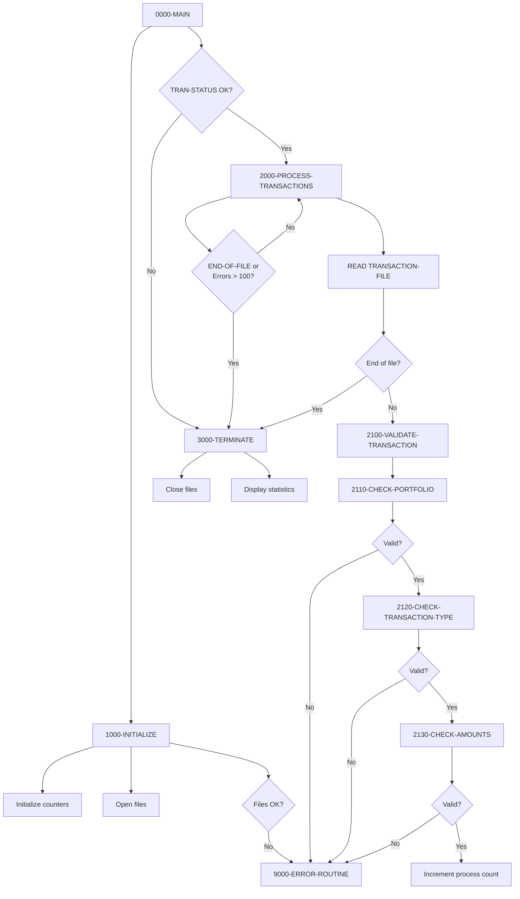
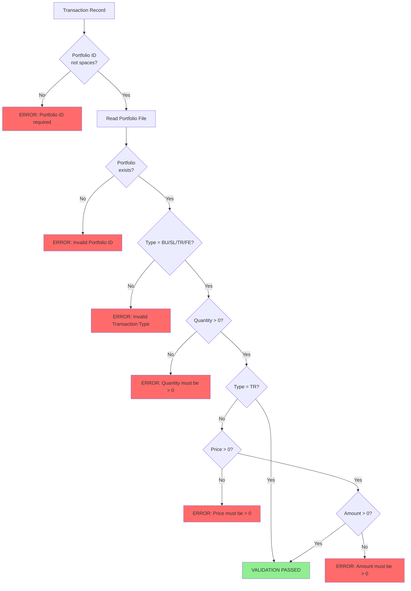

## Overview

PORTTRAN is a batch program that processes financial transactions against portfolio records. It reads transactions from a sequential input file, validates them against business rules, and updates the corresponding portfolio master records. The program supports four transaction types: buy (BU), sell (SL), transfer (TR), and fee (FE).

The program implements a comprehensive validation pipeline that checks for valid portfolio IDs, valid transaction types, and valid monetary amounts before processing. Each transaction is audited through the AUDPROC external program, creating a complete audit trail of all portfolio changes.

PORTTRAN includes a safety mechanism that halts processing if more than 100 errors are encountered, preventing runaway error conditions in production batch runs.

## Program Structure



## Data Structures

### Working Storage

| Level | Name | Picture | Description |
|-------|------|---------|-------------|
| 01 | WS-FILE-STATUS | - | File status group |
| 05 | WS-TRAN-STATUS | X(2) | Transaction file status |
| 05 | WS-PORT-STATUS | X(2) | Portfolio file status |
| 01 | WS-COUNTERS | - | Processing counters |
| 05 | WS-READ-COUNT | 9(8) COMP | Records read |
| 05 | WS-PROCESS-COUNT | 9(8) COMP | Records processed successfully |
| 05 | WS-ERROR-COUNT | 9(8) COMP | Records with errors |
| 01 | WS-EOF-FLAG | X(1) | End of file indicator |

#### WS-EOF-FLAG Condition Names

| Condition | Value | Description |
|-----------|-------|-------------|
| END-OF-FILE | 'Y' | End of file reached |
| MORE-RECORDS | 'N' | More records to process |

### Transaction Record (from TRNREC copybook)

| Level | Name | Picture | Description |
|-------|------|---------|-------------|
| 01 | TRANSACTION-RECORD | - | Transaction input record |
| 05 | TRN-KEY | - | Composite key group |
| 10 | TRN-DATE | X(8) | Transaction date YYYYMMDD |
| 10 | TRN-TIME | X(6) | Transaction time HHMMSS |
| 10 | TRN-PORTFOLIO-ID | X(8) | Portfolio identifier |
| 10 | TRN-SEQUENCE-NO | X(6) | Sequence number |
| 05 | TRN-DATA | - | Transaction data group |
| 10 | TRN-INVESTMENT-ID | X(10) | Investment identifier |
| 10 | TRN-TYPE | X(2) | Transaction type code |
| 10 | TRN-QUANTITY | S9(11)V9(4) COMP-3 | Units/shares quantity |
| 10 | TRN-PRICE | S9(11)V9(4) COMP-3 | Price per unit |
| 10 | TRN-AMOUNT | S9(13)V9(2) COMP-3 | Total transaction amount |
| 10 | TRN-CURRENCY | X(3) | Currency code |
| 10 | TRN-STATUS | X(1) | Transaction status |
| 05 | TRN-AUDIT | - | Audit information |
| 10 | TRN-PROCESS-DATE | X(26) | Processing timestamp |
| 10 | TRN-PROCESS-USER | X(8) | Processing user ID |

#### TRN-TYPE Condition Names

| Condition | Value | Description |
|-----------|-------|-------------|
| TRN-TYPE-BUY | 'BU' | Buy transaction |
| TRN-TYPE-SELL | 'SL' | Sell transaction |
| TRN-TYPE-TRANS | 'TR' | Transfer transaction |
| TRN-TYPE-FEE | 'FE' | Fee transaction |

#### TRN-STATUS Condition Names

| Condition | Value | Description |
|-----------|-------|-------------|
| TRN-STATUS-PEND | 'P' | Pending |
| TRN-STATUS-DONE | 'D' | Done/Completed |
| TRN-STATUS-FAIL | 'F' | Failed |
| TRN-STATUS-REV | 'R' | Reversed |

### Portfolio Record (from PORTREC copybook)

| Level | Name | Picture | Description |
|-------|------|---------|-------------|
| 01 | PORTFOLIO-RECORD | - | Portfolio master record |
| 05 | PORT-ID | X(8) | Portfolio identifier (key) |
| 05 | PORT-ACCOUNT-NO | X(10) | Account number |
| 05 | PORT-TOTAL-UNITS | S9(11)V9(4) COMP-3 | Total units held |
| 05 | PORT-TOTAL-COST | S9(13)V9(2) COMP-3 | Total cost basis |

### Audit Record (from AUDITLOG copybook)

| Level | Name | Picture | Description |
|-------|------|---------|-------------|
| 01 | AUDIT-RECORD | - | Audit trail record |
| 05 | AUD-HEADER | - | Header information |
| 10 | AUD-TIMESTAMP | X(26) | Audit timestamp |
| 10 | AUD-SYSTEM-ID | X(8) | System identifier |
| 10 | AUD-USER-ID | X(8) | User identifier |
| 10 | AUD-PROGRAM | X(8) | Program name |
| 10 | AUD-TERMINAL | X(8) | Terminal ID |
| 05 | AUD-TYPE | X(4) | Audit type |
| 05 | AUD-ACTION | X(8) | Action performed |
| 05 | AUD-STATUS | X(4) | Result status |
| 05 | AUD-KEY-INFO | - | Key fields |
| 10 | AUD-PORTFOLIO-ID | X(8) | Portfolio ID |
| 10 | AUD-ACCOUNT-NO | X(10) | Account number |
| 05 | AUD-BEFORE-IMAGE | X(100) | Record before change |
| 05 | AUD-AFTER-IMAGE | X(100) | Record after change |
| 05 | AUD-MESSAGE | X(100) | Descriptive message |

#### AUD-TYPE Condition Names

| Condition | Value | Description |
|-----------|-------|-------------|
| AUD-TRANSACTION | 'TRAN' | Transaction event |
| AUD-USER-ACTION | 'USER' | User action |
| AUD-SYSTEM-EVENT | 'SYST' | System event |

#### AUD-ACTION Condition Names

| Condition | Value | Description |
|-----------|-------|-------------|
| AUD-CREATE | 'CREATE' | Create operation |
| AUD-UPDATE | 'UPDATE' | Update operation |
| AUD-DELETE | 'DELETE' | Delete operation |
| AUD-INQUIRE | 'INQUIRE' | Inquiry operation |

## File I/O

### TRANSACTION-FILE

| Attribute | Value |
|-----------|-------|
| DD Name | TRANFILE |
| Organization | SEQUENTIAL |
| Access Mode | SEQUENTIAL |
| Recording Mode | F (Fixed) |
| Block Contains | 0 (System determined) |
| File Status | WS-TRAN-STATUS |
| Open Mode | INPUT |

**Operations:**
- **READ** - Reads transaction records sequentially

### PORTFOLIO-FILE

| Attribute | Value |
|-----------|-------|
| DD Name | PORTFILE |
| Organization | INDEXED (VSAM KSDS) |
| Access Mode | RANDOM |
| Record Key | PORT-ID |
| Recording Mode | F (Fixed) |
| Block Contains | 0 (System determined) |
| File Status | WS-PORT-STATUS |
| Open Mode | I-O |

**Operations:**
- **READ** - Retrieves portfolio record by key
- **REWRITE** - Updates portfolio record after transaction

## Control Flow

### 0000-MAIN

Main driver with conditional processing:
1. Performs initialization
2. If transaction file opened successfully:
   - Loops through 2000-PROCESS-TRANSACTIONS until:
     - END-OF-FILE is reached, OR
     - WS-ERROR-COUNT exceeds 100
3. Performs termination
4. Returns via GOBACK

### 1000-INITIALIZE

Prepares the processing environment:
1. Initializes file status and counter areas
2. Sets MORE-RECORDS flag to 'N'
3. Opens TRANSACTION-FILE for INPUT
4. Opens PORTFOLIO-FILE for I-O
5. Calls 9000-ERROR-ROUTINE if either file fails to open

### 2000-PROCESS-TRANSACTIONS

Main processing loop:
1. Reads next transaction record
2. On end of file: Sets END-OF-FILE to 'Y'
3. On successful read:
   - Increments WS-READ-COUNT
   - Performs 2100-VALIDATE-TRANSACTION

### 2100-VALIDATE-TRANSACTION

Orchestrates the validation pipeline:
1. Clears ERR-TEXT
2. Performs 2110-CHECK-PORTFOLIO
3. If no error, performs 2120-CHECK-TRANSACTION-TYPE
4. If no error, performs 2130-CHECK-AMOUNTS
5. If all validations pass: Increments WS-PROCESS-COUNT
6. If any validation fails: Performs 9000-ERROR-ROUTINE

### 2110-CHECK-PORTFOLIO

Validates portfolio existence:
1. Checks TRN-PORTFOLIO-ID is not spaces
2. Attempts to READ PORTFOLIO-FILE with the portfolio ID
3. Sets ERR-TEXT if portfolio not found

### 2120-CHECK-TRANSACTION-TYPE

Validates transaction type:
- Accepts: 'BU', 'SL', 'TR', 'FE'
- Rejects all other values with descriptive error message

### 2130-CHECK-AMOUNTS

Validates monetary amounts:

| Check | Condition | Applies To |
|-------|-----------|------------|
| Quantity > 0 | TRN-QUANTITY > ZERO | All types |
| Price > 0 | TRN-PRICE > ZERO | BU, SL, FE (not TR) |
| Amount > 0 | TRN-AMOUNT > ZERO | BU, SL, FE (not TR) |

### Transaction Processing Paragraphs

#### 2200-UPDATE-POSITIONS

Dispatches to appropriate transaction handler based on TRN-TYPE:
- 'BU' → 2210-PROCESS-BUY
- 'SL' → 2220-PROCESS-SELL
- 'TR' → 2230-PROCESS-TRANSFER
- 'FE' → 2240-PROCESS-FEE

Then calls 2300-UPDATE-AUDIT-TRAIL.

#### 2210-PROCESS-BUY

Processes buy transactions:
1. Reads portfolio record
2. Adds TRN-QUANTITY to PORT-TOTAL-UNITS
3. Adds TRN-AMOUNT to PORT-TOTAL-COST
4. Rewrites portfolio record

#### 2220-PROCESS-SELL

Processes sell transactions:
1. Reads portfolio record
2. Validates sufficient units (PORT-TOTAL-UNITS >= TRN-QUANTITY)
3. Subtracts TRN-QUANTITY from PORT-TOTAL-UNITS
4. Subtracts TRN-AMOUNT from PORT-TOTAL-COST
5. Rewrites portfolio record

#### 2230-PROCESS-TRANSFER

**Not yet implemented** - Returns error message.

#### 2240-PROCESS-FEE

Processes fee transactions:
1. Reads portfolio record
2. Subtracts TRN-AMOUNT from PORT-TOTAL-COST
3. Rewrites portfolio record

### 2300-UPDATE-AUDIT-TRAIL

Creates audit record for each transaction:
1. Initializes AUDIT-RECORD
2. Sets timestamp using `FUNCTION CURRENT-DATE`
3. Sets program name to 'PORTTRAN'
4. Sets user ID using `FUNCTION USER-ID`
5. Sets audit type to 'TRAN'
6. Maps TRN-TYPE to AUD-ACTION:
   - 'BU' → 'CREATE'
   - 'SL' → 'DELETE'
   - 'TR' → 'UPDATE'
   - 'FE' → 'UPDATE'
7. Sets AUD-STATUS based on WS-PORT-STATUS
8. Stores before-image of portfolio record
9. Builds descriptive message with STRING
10. Calls 2310-WRITE-AUDIT-RECORD

### 2310-WRITE-AUDIT-RECORD

Persists audit record:
1. Calls AUDPROC with AUDIT-RECORD
2. Checks RETURN-CODE; if non-zero, calls 9000-ERROR-ROUTINE

### 3000-TERMINATE

Finalizes processing:
1. Closes both files
2. Displays processing statistics:
   - Transactions Read
   - Transactions Processed
   - Errors Encountered

### 9000-ERROR-ROUTINE

Handles all error conditions:
1. Increments WS-ERROR-COUNT
2. Sets ERR-CATEGORY to ERR-CAT-PROC
3. Sets ERR-PROGRAM to 'PORTTRAN'
4. Calls ERRPROC with ERR-MESSAGE

## Validation Flow



## Transaction Type Summary

| Type | Code | Effect on Units | Effect on Cost | Validation |
|------|------|-----------------|----------------|------------|
| Buy | BU | + TRN-QUANTITY | + TRN-AMOUNT | Price, Amount > 0 |
| Sell | SL | - TRN-QUANTITY | - TRN-AMOUNT | Price, Amount > 0, sufficient units |
| Transfer | TR | N/A | N/A | Not implemented |
| Fee | FE | No change | - TRN-AMOUNT | Price, Amount > 0 |

## Dependencies

### Copybooks

- **TRNREC** - Transaction record layout
- **PORTREC** - Portfolio record layout
- **ERRHAND** - Error handling definitions
- **AUDITLOG** - Audit trail record layout

### Called Programs

- **ERRPROC** - Error processing routine
- **AUDPROC** - Audit trail processor

### Related Programs

- **PORTADD** - Portfolio Addition Program
- **PORTUPDT** - Portfolio Update Program
- **PORTREAD** - Portfolio Read Program

## JCL Example

```jcl
//PORTTRAN EXEC PGM=PORTTRAN
//STEPLIB  DD DSN=your.loadlib,DISP=SHR
//TRANFILE DD DSN=your.transaction.file,DISP=SHR
//PORTFILE DD DSN=your.portfolio.master,DISP=SHR
//SYSOUT   DD SYSOUT=*
```

## Sample Output

```
Transactions Read:    00012345
Transactions Process: 00012298
Errors Encountered:   00000047
```

## Technical Notes

### Error Threshold

The program includes a safety check that stops processing when WS-ERROR-COUNT exceeds 100. This prevents:
- Runaway error conditions
- Excessive error logging
- Potential data corruption from systematic issues

### COMP-3 (Packed Decimal)

Financial fields use COMP-3 for:
- Efficient storage of large decimal numbers
- Precise decimal arithmetic
- Industry-standard financial data representation

Example: S9(13)V9(2) COMP-3
- 13 digits before decimal point
- 2 digits after decimal point
- Storage: (15+1)/2 = 8 bytes

### Intrinsic Functions

| Function | Usage | Description |
|----------|-------|-------------|
| `FUNCTION CURRENT-DATE` | Audit timestamp | Returns current date/time |
| `FUNCTION USER-ID` | Audit user | Returns executing user ID |

### EXIT PARAGRAPH

Used in validation paragraphs to provide early exit when errors are detected, preventing cascading validations on already-invalid data.

### STRING Statement

Used to build dynamic error messages and audit messages by concatenating multiple fields with delimiters.

## Error Handling

| Error Type | Detection | Response |
|------------|-----------|----------|
| File open failure | WS-TRAN-STATUS or WS-PORT-STATUS ≠ '00' | Log error, skip processing |
| Portfolio not found | INVALID KEY on READ | Log error, skip transaction |
| Invalid transaction type | EVALUATE OTHER | Log error, skip transaction |
| Invalid amounts | Amount <= ZERO | Log error, skip transaction |
| Insufficient units | PORT-TOTAL-UNITS < TRN-QUANTITY | Log error, skip transaction |
| Portfolio update failure | INVALID KEY on REWRITE | Log error |
| Audit write failure | RETURN-CODE ≠ 0 | Log error |
| Error threshold exceeded | WS-ERROR-COUNT > 100 | Stop processing |

## Audit Trail

Every transaction creates an audit record containing:
- **Timestamp**: When the transaction was processed
- **User ID**: Who executed the batch job
- **Program**: 'PORTTRAN'
- **Type**: 'TRAN' (Transaction)
- **Action**: CREATE (buy), DELETE (sell), or UPDATE (transfer/fee)
- **Status**: 'SUCC' or 'FAIL'
- **Before Image**: Portfolio state before transaction
- **Message**: Transaction details (type, amount, units)

This comprehensive audit trail supports:
- Regulatory compliance
- Transaction reconciliation
- Problem investigation
- Historical analysis
