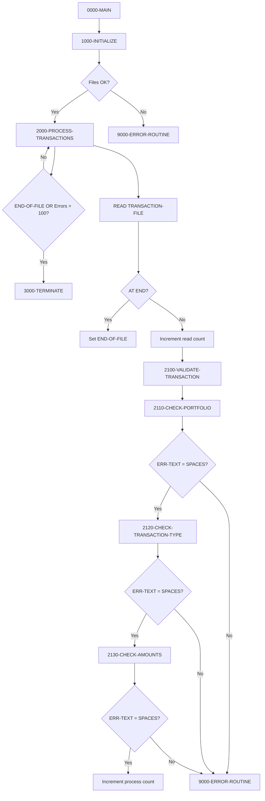
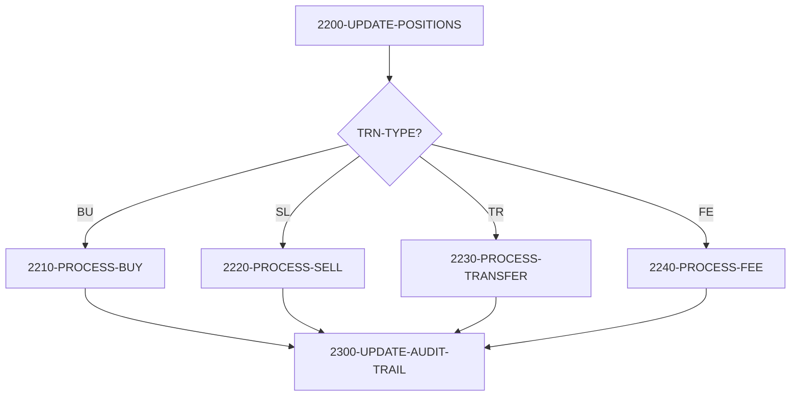

## Overview

PORTTRAN is a batch transaction processing program that reads financial transactions from a sequential file, validates them against portfolio master records, and updates portfolio positions accordingly. The program supports four transaction types: Buy (BU), Sell (SL), Transfer (TR), and Fee (FE).

The program implements a robust validation pipeline that checks portfolio existence, transaction type validity, and amount constraints before processing. Each transaction updates the portfolio's total units and cost basis, with comprehensive audit trail logging for compliance and traceability.

Processing continues until end-of-file or until more than 100 errors are encountered, providing a fail-safe mechanism to prevent runaway error conditions. The program integrates with the ERRPROC error handler and AUDPROC audit processor for centralized error and audit management.

## Program Structure



## Data Structures

### Transaction Record (TRNREC Copybook)

| Level | Name | Picture | Description |
|-------|------|---------|-------------|
| 01 | TRANSACTION-RECORD | - | Transaction input record |
| 05 | TRN-KEY | - | Composite transaction key |
| 10 | TRN-DATE | X(8) | Transaction date (YYYYMMDD) |
| 10 | TRN-TIME | X(6) | Transaction time (HHMMSS) |
| 10 | TRN-PORTFOLIO-ID | X(8) | Portfolio identifier |
| 10 | TRN-SEQUENCE-NO | X(6) | Sequence for multiple transactions |
| 10 | TRN-INVESTMENT-ID | X(10) | Investment/security identifier |
| 10 | TRN-TYPE | X(2) | Transaction type: BU, SL, TR, FE |
| 10 | TRN-QUANTITY | S9(11)V9(4) COMP-3 | Number of units |
| 10 | TRN-PRICE | S9(11)V9(4) COMP-3 | Price per unit |
| 10 | TRN-AMOUNT | S9(13)V9(2) COMP-3 | Total transaction amount |
| 10 | TRN-CURRENCY | X(3) | Currency code |
| 10 | TRN-STATUS | X(1) | Status: P=Pending, D=Done, F=Failed, R=Reversed |
| 10 | TRN-PROCESS-DATE | X(26) | Processing timestamp |
| 10 | TRN-PROCESS-USER | X(8) | Processing user ID |

### Portfolio Record (PORTREC Copybook)

| Level | Name | Picture | Description |
|-------|------|---------|-------------|
| 01 | PORTFOLIO-RECORD | - | Portfolio master record |
| 05 | PORT-ID | X(8) | Portfolio identifier (record key) |
| 05 | PORT-ACCOUNT-NO | X(10) | Account number |
| 05 | PORT-TOTAL-UNITS | S9(11)V9(4) COMP-3 | Total units held |
| 05 | PORT-TOTAL-COST | S9(13)V9(2) COMP-3 | Total cost basis |

### Audit Record (AUDITLOG Copybook)

| Level | Name | Picture | Description |
|-------|------|---------|-------------|
| 01 | AUDIT-RECORD | - | Audit trail record |
| 10 | AUD-TIMESTAMP | X(26) | Event timestamp |
| 10 | AUD-USER-ID | X(8) | User who performed action |
| 10 | AUD-PROGRAM | X(8) | Program name |
| 05 | AUD-TYPE | X(4) | Audit type: TRAN, USER, SYST |
| 05 | AUD-ACTION | X(8) | Action: CREATE, UPDATE, DELETE |
| 05 | AUD-STATUS | X(4) | Status: SUCC, FAIL, WARN |
| 10 | AUD-PORTFOLIO-ID | X(8) | Related portfolio |
| 10 | AUD-ACCOUNT-NO | X(10) | Related account |
| 05 | AUD-BEFORE-IMAGE | X(100) | Record before change |
| 05 | AUD-MESSAGE | X(100) | Audit message |

### Working Storage

| Level | Name | Picture | Description |
|-------|------|---------|-------------|
| 05 | WS-TRAN-STATUS | X(2) | Transaction file status |
| 05 | WS-PORT-STATUS | X(2) | Portfolio file status |
| 05 | WS-READ-COUNT | 9(8) COMP | Transactions read |
| 05 | WS-PROCESS-COUNT | 9(8) COMP | Transactions processed |
| 05 | WS-ERROR-COUNT | 9(8) COMP | Errors encountered |
| 01 | WS-EOF-FLAG | X(1) | End-of-file switch (Y/N) |

## File I/O

### TRANSACTION-FILE

| Attribute | Value |
|-----------|-------|
| Logical Name | TRANSACTION-FILE |
| DD Name | TRANFILE |
| Organization | SEQUENTIAL |
| Access Mode | SEQUENTIAL |
| Recording Mode | F (Fixed) |
| Open Mode | INPUT |
| File Status | WS-TRAN-STATUS |

### PORTFOLIO-FILE

| Attribute | Value |
|-----------|-------|
| Logical Name | PORTFOLIO-FILE |
| DD Name | PORTFILE |
| Organization | INDEXED (VSAM KSDS) |
| Access Mode | RANDOM |
| Record Key | PORT-ID |
| Recording Mode | F (Fixed) |
| Open Mode | I-O |
| File Status | WS-PORT-STATUS |

## Control Flow

### 1000-INITIALIZE

Prepares the program for processing:
1. Initializes file status and counter fields
2. Sets MORE-RECORDS flag to 'N'
3. Opens TRANSACTION-FILE for INPUT
4. Opens PORTFOLIO-FILE for I-O
5. Calls 9000-ERROR-ROUTINE if either file fails to open

### 2000-PROCESS-TRANSACTIONS

Main processing loop:
1. Reads next transaction record
2. On AT END: Sets END-OF-FILE to 'Y'
3. On NOT AT END: Increments WS-READ-COUNT and performs validation

Loop continues until:
- END-OF-FILE is reached, OR
- WS-ERROR-COUNT exceeds 100

### 2100-VALIDATE-TRANSACTION

Orchestrates validation with early exit on failure:
1. Clears ERR-TEXT
2. Calls 2110-CHECK-PORTFOLIO
3. If no error, calls 2120-CHECK-TRANSACTION-TYPE
4. If no error, calls 2130-CHECK-AMOUNTS
5. If all validations pass: increments WS-PROCESS-COUNT
6. If any validation fails: calls 9000-ERROR-ROUTINE

### Validation Paragraphs

**2110-CHECK-PORTFOLIO**:
- Validates TRN-PORTFOLIO-ID is not spaces
- Reads PORTFOLIO-FILE to verify portfolio exists
- Sets ERR-TEXT on failure

**2120-CHECK-TRANSACTION-TYPE**:
- Validates TRN-TYPE is one of: BU, SL, TR, FE
- Sets ERR-TEXT for invalid types

**2130-CHECK-AMOUNTS**:
- TRN-QUANTITY must be > 0
- TRN-PRICE must be > 0 (except for transfers)
- TRN-AMOUNT must be > 0 (except for transfers)

## Transaction Processing

### 2200-UPDATE-POSITIONS

Dispatches to type-specific processing:



### Transaction Type Details

| Type | Code | Processing Logic |
|------|------|------------------|
| Buy | BU | ADD TRN-QUANTITY TO PORT-TOTAL-UNITS, ADD TRN-AMOUNT TO PORT-TOTAL-COST |
| Sell | SL | Validate sufficient units, SUBTRACT from totals |
| Transfer | TR | Not implemented (logs error) |
| Fee | FE | SUBTRACT TRN-AMOUNT FROM PORT-TOTAL-COST |

### 2210-PROCESS-BUY

1. Reads portfolio record by PORT-ID
2. Adds TRN-QUANTITY to PORT-TOTAL-UNITS
3. Adds TRN-AMOUNT to PORT-TOTAL-COST
4. Rewrites portfolio record

### 2220-PROCESS-SELL

1. Reads portfolio record by PORT-ID
2. Validates PORT-TOTAL-UNITS >= TRN-QUANTITY
3. Subtracts TRN-QUANTITY from PORT-TOTAL-UNITS
4. Subtracts TRN-AMOUNT from PORT-TOTAL-COST
5. Rewrites portfolio record

### 2240-PROCESS-FEE

1. Reads portfolio record by PORT-ID
2. Subtracts TRN-AMOUNT from PORT-TOTAL-COST
3. Rewrites portfolio record

## Audit Trail

### 2300-UPDATE-AUDIT-TRAIL

Builds comprehensive audit record:
1. Captures timestamp via FUNCTION CURRENT-DATE
2. Sets AUD-PROGRAM to 'PORTTRAN'
3. Captures user ID via FUNCTION USER-ID
4. Sets AUD-TYPE to 'TRAN'
5. Maps TRN-TYPE to AUD-ACTION:
   - BU → CREATE
   - SL → DELETE
   - TR → UPDATE
   - FE → UPDATE
6. Sets AUD-STATUS based on WS-PORT-STATUS
7. Stores PORT-RECORD in AUD-BEFORE-IMAGE
8. Builds message with transaction details
9. Calls AUDPROC to write audit record

## Error Handling

### 9000-ERROR-ROUTINE

Centralized error processing:
1. Increments WS-ERROR-COUNT
2. Sets ERR-CATEGORY to ERR-CAT-PROC
3. Sets ERR-PROGRAM to 'PORTTRAN'
4. Calls ERRPROC with ERR-MESSAGE

### Error Threshold

Processing stops when WS-ERROR-COUNT exceeds 100, preventing runaway error conditions and excessive logging.

## Sample Output

```
Transactions Read:    00012345
Transactions Process: 00012300
Errors Encountered:   00000045
```

## Dependencies

### Copybooks

- **TRNREC** - Transaction record layout
- **PORTREC** - Portfolio record layout
- **ERRHAND** - Error handling data structures
- **AUDITLOG** - Audit trail record layout

### Called Programs

- **ERRPROC** - Error processing and logging
- **AUDPROC** - Audit trail processor

### Related Programs

Programs that share the TRNREC copybook:
- **RPTPOS00** - Position reporting
- **TSTGEN00** - Test data generation
- **UTLVAL00** - Validation utility

Programs that share the AUDITLOG copybook:
- **RPTAUD00** - Audit reporting
- **AUDPROC** - Audit processor

## Technical Notes

1. **COMP-3 (Packed Decimal)**: Financial fields use packed decimal format for accurate decimal arithmetic. TRN-QUANTITY and TRN-PRICE allow 4 decimal places for fractional shares and precise pricing.

2. **EXIT PARAGRAPH**: Used in validation paragraphs to exit early when an error is detected, preventing cascading validation checks.

3. **STRING Statement**: Used to build dynamic error messages that include the offending data values, improving error diagnostics.

4. **FUNCTION CURRENT-DATE**: Returns the current timestamp for audit records.

5. **FUNCTION USER-ID**: IBM extension that returns the TSO user ID or batch job submitter for audit purposes.

6. **Error Count Threshold**: The 100-error limit prevents infinite processing of bad input files while allowing some errors to be tolerated.

7. **RECORDING MODE F**: Specifies fixed-length records, common for transaction files where all records have the same structure.

8. **BLOCK CONTAINS 0**: Lets the system determine optimal blocking factor based on device characteristics.

9. **Validation Pipeline**: The three-stage validation (portfolio → type → amounts) uses ERR-TEXT as a flag; processing continues only while ERR-TEXT remains spaces.

10. **Transfer Not Implemented**: The 2230-PROCESS-TRANSFER paragraph intentionally logs an error, indicating this functionality is planned but not yet coded.

## JCL Example

```jcl
//PORTTRAN EXEC PGM=PORTTRAN
//STEPLIB  DD DSN=your.loadlib,DISP=SHR
//TRANFILE DD DSN=your.transaction.input,DISP=SHR
//PORTFILE DD DSN=your.portfolio.master,DISP=SHR
//SYSOUT   DD SYSOUT=*
```
