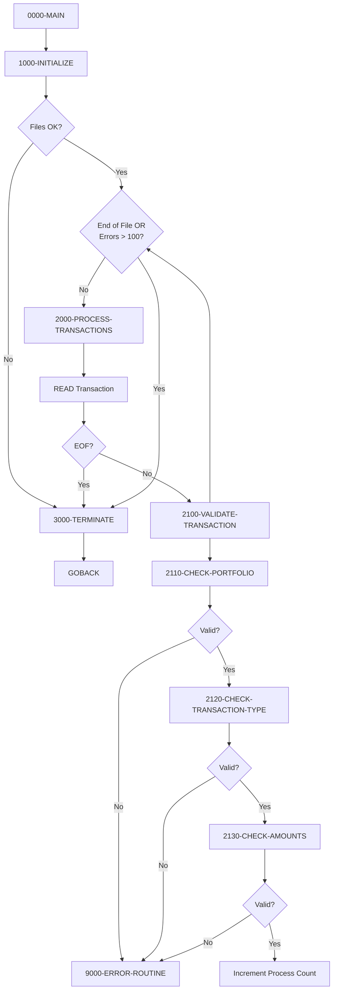
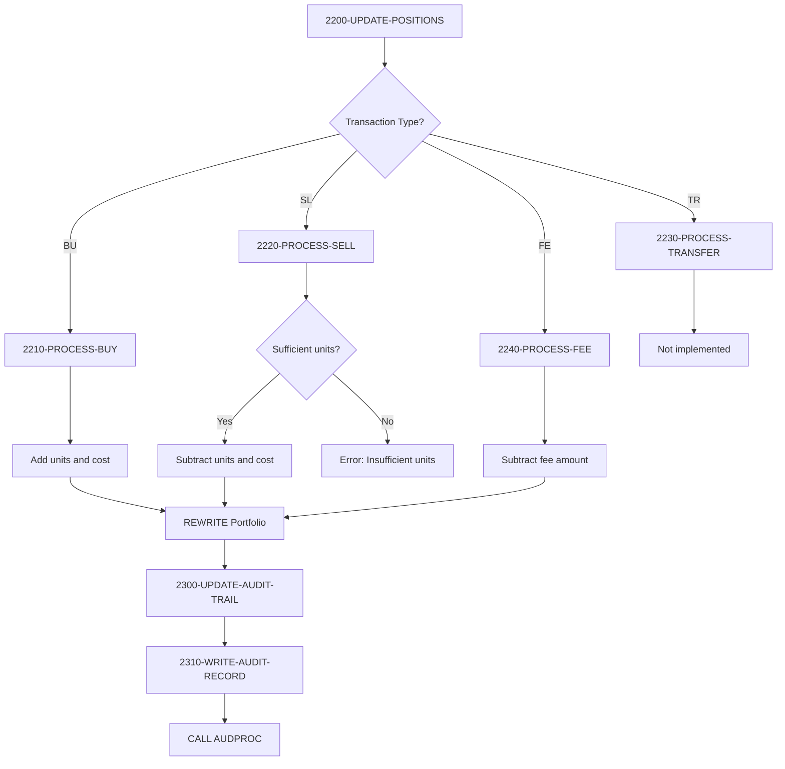

## Overview

PORTTRAN is a batch program that processes portfolio transactions from a sequential input file, validating each transaction and updating the corresponding portfolio records in an indexed VSAM file. It supports four transaction types: buy, sell, transfer, and fee operations.

The program implements a comprehensive validation pipeline that checks portfolio existence, transaction type validity, and amount constraints before processing. For each successful transaction, it updates portfolio positions and creates an audit trail by calling the audit processor. The program includes a safeguard that halts processing if the error count exceeds 100, preventing runaway error conditions.

This utility is a core component of the portfolio management system, handling the daily transaction processing that maintains portfolio positions and provides a complete audit trail for regulatory and operational requirements.

## Program Structure



## Transaction Processing Flow



## Data Structures

### Transaction Record (TRNREC Copybook)

| Level | Name | Picture | Description |
|-------|------|---------|-------------|
| 01 | TRANSACTION-RECORD | - | Transaction input record |
| 05 | TRN-KEY | - | Composite key |
| 10 | TRN-DATE | X(8) | Transaction date (YYYYMMDD) |
| 10 | TRN-TIME | X(6) | Transaction time (HHMMSS) |
| 10 | TRN-PORTFOLIO-ID | X(8) | Portfolio identifier |
| 10 | TRN-SEQUENCE-NO | X(6) | Sequence for multiple trans |
| 05 | TRN-DATA | - | Transaction data |
| 10 | TRN-INVESTMENT-ID | X(10) | Investment/security ID |
| 10 | TRN-TYPE | X(2) | Transaction type code |
| 10 | TRN-QUANTITY | S9(11)V9(4) COMP-3 | Number of units |
| 10 | TRN-PRICE | S9(11)V9(4) COMP-3 | Price per unit |
| 10 | TRN-AMOUNT | S9(13)V9(2) COMP-3 | Total transaction amount |
| 10 | TRN-CURRENCY | X(3) | Currency code |
| 10 | TRN-STATUS | X(1) | Transaction status |
| 05 | TRN-AUDIT | - | Audit information |
| 10 | TRN-PROCESS-DATE | X(26) | Processing timestamp |
| 10 | TRN-PROCESS-USER | X(8) | Processing user ID |
| 05 | TRN-FILLER | X(50) | Reserved space |

### Transaction Types

| Code | 88-Level Condition | Description |
|------|-------------------|-------------|
| `BU` | TRN-TYPE-BUY | Buy - adds units and cost to portfolio |
| `SL` | TRN-TYPE-SELL | Sell - subtracts units and cost from portfolio |
| `TR` | TRN-TYPE-TRANS | Transfer - moves between portfolios (not implemented) |
| `FE` | TRN-TYPE-FEE | Fee - subtracts amount from portfolio cost |

### Transaction Status Values

| Code | 88-Level Condition | Description |
|------|-------------------|-------------|
| `P` | TRN-STATUS-PEND | Pending processing |
| `D` | TRN-STATUS-DONE | Successfully processed |
| `F` | TRN-STATUS-FAIL | Processing failed |
| `R` | TRN-STATUS-REV | Reversed |

### Audit Record (AUDITLOG Copybook)

| Level | Name | Picture | Description |
|-------|------|---------|-------------|
| 01 | AUDIT-RECORD | - | Audit trail record |
| 05 | AUD-HEADER | - | Header information |
| 10 | AUD-TIMESTAMP | X(26) | Audit timestamp |
| 10 | AUD-SYSTEM-ID | X(8) | System identifier |
| 10 | AUD-USER-ID | X(8) | User who performed action |
| 10 | AUD-PROGRAM | X(8) | Program name |
| 10 | AUD-TERMINAL | X(8) | Terminal ID |
| 05 | AUD-TYPE | X(4) | Audit type (TRAN/USER/SYST) |
| 05 | AUD-ACTION | X(8) | Action performed |
| 05 | AUD-STATUS | X(4) | Result status (SUCC/FAIL/WARN) |
| 05 | AUD-KEY-INFO | - | Key identification |
| 10 | AUD-PORTFOLIO-ID | X(8) | Portfolio identifier |
| 10 | AUD-ACCOUNT-NO | X(10) | Account number |
| 05 | AUD-BEFORE-IMAGE | X(100) | Record state before change |
| 05 | AUD-AFTER-IMAGE | X(100) | Record state after change |
| 05 | AUD-MESSAGE | X(100) | Descriptive message |

### Working Storage

| Level | Name | Picture | Description |
|-------|------|---------|-------------|
| 05 | WS-TRAN-STATUS | X(2) | Transaction file status |
| 05 | WS-PORT-STATUS | X(2) | Portfolio file status |
| 05 | WS-READ-COUNT | 9(8) COMP | Records read |
| 05 | WS-PROCESS-COUNT | 9(8) COMP | Records successfully processed |
| 05 | WS-ERROR-COUNT | 9(8) COMP | Records with errors |
| 01 | WS-EOF-FLAG | X(1) | End of file indicator |

## File I/O

### TRANSACTION-FILE

The sequential input file containing transactions to process.

| Property | Value |
|----------|-------|
| Logical Name | TRANSACTION-FILE |
| DD Name | TRANFILE |
| Organization | SEQUENTIAL |
| Access Mode | SEQUENTIAL |
| Open Mode | INPUT |
| Recording Mode | F (Fixed) |
| File Status | WS-TRAN-STATUS |

**Operations:**
- READ (sequential with AT END)

### PORTFOLIO-FILE

The indexed VSAM master file containing portfolio records.

| Property | Value |
|----------|-------|
| Logical Name | PORTFOLIO-FILE |
| DD Name | PORTFILE |
| Organization | INDEXED |
| Access Mode | RANDOM |
| Open Mode | I-O |
| Recording Mode | F (Fixed) |
| Record Key | PORT-ID |
| File Status | WS-PORT-STATUS |

**Operations:**
- READ (random by key with INVALID KEY)
- REWRITE (update with INVALID KEY)

## Control Flow

### Main Processing (0000-MAIN)

Controls the overall program flow with an error threshold:
1. Calls 1000-INITIALIZE
2. If transaction file opened successfully:
   - Processes transactions until END-OF-FILE
   - OR until WS-ERROR-COUNT exceeds 100
3. Calls 3000-TERMINATE
4. Returns via GOBACK

### Initialize (1000-INITIALIZE)

Prepares the processing environment:
1. Initializes file status and counters
2. Sets MORE-RECORDS flag to true
3. Opens TRANSACTION-FILE for INPUT
4. Opens PORTFOLIO-FILE for I-O
5. Reports errors if file opens fail

### Process Transactions (2000-PROCESS-TRANSACTIONS)

Main processing loop:
1. Reads next transaction record
2. On AT END, sets END-OF-FILE flag
3. On NOT AT END:
   - Increments read count
   - Calls 2100-VALIDATE-TRANSACTION

### Validate Transaction (2100-VALIDATE-TRANSACTION)

Multi-step validation pipeline:
1. Clears error text
2. Calls 2110-CHECK-PORTFOLIO (validates portfolio exists)
3. If valid, calls 2120-CHECK-TRANSACTION-TYPE
4. If valid, calls 2130-CHECK-AMOUNTS
5. If all validations pass, increments process count
6. Otherwise, calls error routine

### Validation Paragraphs

#### 2110-CHECK-PORTFOLIO
- Verifies TRN-PORTFOLIO-ID is not spaces
- Reads portfolio file to verify portfolio exists
- Uses EXIT PARAGRAPH for early exit on validation failure

#### 2120-CHECK-TRANSACTION-TYPE
- Validates TRN-TYPE is one of: BU, SL, TR, FE
- Uses EVALUATE to check valid values

#### 2130-CHECK-AMOUNTS
- Validates TRN-QUANTITY > 0
- Validates TRN-PRICE > 0 (except for transfers)
- Validates TRN-AMOUNT > 0 (except for transfers)

### Update Positions (2200-UPDATE-POSITIONS)

Routes to appropriate processing based on transaction type:

| Type | Paragraph | Processing |
|------|-----------|------------|
| BU | 2210-PROCESS-BUY | ADD to units and cost |
| SL | 2220-PROCESS-SELL | SUBTRACT from units and cost |
| TR | 2230-PROCESS-TRANSFER | Not implemented |
| FE | 2240-PROCESS-FEE | SUBTRACT from cost |

#### Buy Processing (2210-PROCESS-BUY)
1. Reads portfolio record
2. Adds TRN-QUANTITY to PORT-TOTAL-UNITS
3. Adds TRN-AMOUNT to PORT-TOTAL-COST
4. Rewrites portfolio record

#### Sell Processing (2220-PROCESS-SELL)
1. Reads portfolio record
2. Validates PORT-TOTAL-UNITS >= TRN-QUANTITY
3. Subtracts TRN-QUANTITY from PORT-TOTAL-UNITS
4. Subtracts TRN-AMOUNT from PORT-TOTAL-COST
5. Rewrites portfolio record

#### Fee Processing (2240-PROCESS-FEE)
1. Reads portfolio record
2. Subtracts TRN-AMOUNT from PORT-TOTAL-COST
3. Rewrites portfolio record

### Update Audit Trail (2300-UPDATE-AUDIT-TRAIL)

Creates audit record for each transaction:
1. Initializes AUDIT-RECORD
2. Sets timestamp via FUNCTION CURRENT-DATE
3. Sets user ID via FUNCTION USER-ID
4. Sets program name to 'PORTTRAN'
5. Maps transaction type to audit action:
   - BU → CREATE
   - SL → DELETE
   - TR/FE → UPDATE
6. Sets status based on WS-PORT-STATUS
7. Stores before-image of portfolio
8. Builds audit message with transaction details
9. Calls AUDPROC to write audit record

### Terminate (3000-TERMINATE)

Finalizes processing:
1. Closes both files
2. Displays processing statistics

## Validation Rules

| Field | Rule | Error Message |
|-------|------|---------------|
| TRN-PORTFOLIO-ID | Not spaces | "Portfolio ID is required" |
| TRN-PORTFOLIO-ID | Must exist in file | "Invalid Portfolio ID: `{id}`" |
| TRN-TYPE | Must be BU/SL/TR/FE | "Invalid Transaction Type: `{type}`" |
| TRN-QUANTITY | Must be > 0 | "Quantity must be greater than zero" |
| TRN-PRICE | Must be > 0 (except TR) | "Price must be greater than zero" |
| TRN-AMOUNT | Must be > 0 (except TR) | "Amount must be greater than zero" |
| PORT-TOTAL-UNITS | Must be >= TRN-QUANTITY (for sells) | "Insufficient units for sale" |

## Processing Controls

| Control | Threshold | Action |
|---------|-----------|--------|
| Error Count | > 100 | Stop processing |
| EOF | Reached | Normal termination |

## Return Codes

| Code | Description |
|------|-------------|
| 0 | Processing completed (check error count) |

## Dependencies

### Copybooks

- **TRNREC** - Transaction record structure
- **PORTREC** - Portfolio record structure
- **ERRHAND** - Error handling definitions
- **AUDITLOG** - Audit trail record structure

### Called Programs

- **ERRPROC** - Error processing routine
- **AUDPROC** - Audit record processor

### Related Programs

Programs that share the TRNREC copybook:
- RPTPOS00 - Position reporting
- TSTGEN00 - Test data generation
- UTLVAL00 - Utility validation

Programs that share the AUDITLOG copybook:
- RPTAUD00 - Audit reporting
- AUDPROC - Audit processor

## JCL Example

```jcl
//PORTTRAN EXEC PGM=PORTTRAN
//STEPLIB  DD  DSN=your.loadlib,DISP=SHR
//TRANFILE DD  DSN=your.transaction.file,DISP=SHR
//PORTFILE DD  DSN=your.portfolio.master,DISP=SHR
//SYSOUT   DD  SYSOUT=*
```

## Sample Output

```
Transactions Read:    00125000
Transactions Process: 00124985
Errors Encountered:   00000015
```

## Audit Trail Mapping

| Transaction Type | Audit Action | Description |
|-----------------|--------------|-------------|
| BU (Buy) | CREATE | New position or addition |
| SL (Sell) | DELETE | Position reduction |
| TR (Transfer) | UPDATE | Position movement |
| FE (Fee) | UPDATE | Cost adjustment |

## Technical Notes

- The program uses **PERFORM UNTIL** with compound conditions (`OR WS-ERROR-COUNT > 100`) to implement error threshold processing
- **EXIT PARAGRAPH** is used extensively for early exit from validation paragraphs when errors are detected
- **STRING ... DELIMITED BY SIZE** builds dynamic error messages with variable content
- **FUNCTION CURRENT-DATE** and **FUNCTION USER-ID** are intrinsic functions that retrieve system information
- The **RECORDING MODE IS F** clause specifies fixed-length records for both files
- **BLOCK CONTAINS 0 RECORDS** lets the system determine optimal blocking
- **COMP-3** (packed decimal) is used for financial amounts to maintain precision
- Transfer processing (TR) is defined but returns an error as "not implemented"
- The audit before-image captures the portfolio state before updates for change tracking
- Sell transactions include balance validation to prevent negative positions
