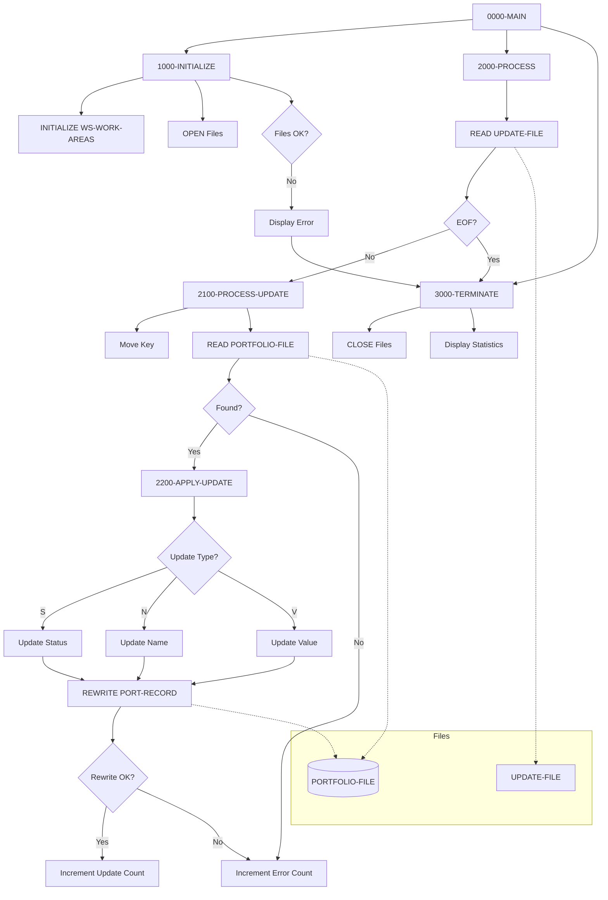

## Overview

PORTUPDT is a batch program that processes portfolio update requests. It reads a sequential transaction file containing update instructions and applies the specified changes to existing records in the indexed portfolio master file.

The program is part of the portfolio management subsystem and supports three types of updates: status changes, client name changes, and total value adjustments. Each update request specifies the target portfolio by key and indicates which field to update along with the new value.

PORTUPDT uses random access to efficiently locate and update individual portfolio records, and tracks statistics for successful updates and errors encountered during processing.

## Program Structure



## Data Structures

### File Section

#### PORTFOLIO-FILE (PORT-RECORD from PORTFLIO copybook)

The indexed master file containing portfolio records:

| Level | Name | Picture | Description |
|-------|------|---------|-------------|
| 01 | PORT-RECORD | | Portfolio master record |
| 05 | PORT-KEY | | Composite primary key |
| 10 | PORT-ID | X(8) | Portfolio identifier |
| 10 | PORT-ACCOUNT-NO | X(10) | Account number |
| 05 | PORT-CLIENT-INFO | | Client information group |
| 10 | PORT-CLIENT-NAME | X(30) | Client name |
| 10 | PORT-CLIENT-TYPE | X(1) | Client type code |
| 05 | PORT-PORTFOLIO-INFO | | Portfolio status group |
| 10 | PORT-CREATE-DATE | 9(8) | Creation date (YYYYMMDD) |
| 10 | PORT-LAST-MAINT | 9(8) | Last maintenance date |
| 10 | PORT-STATUS | X(1) | Portfolio status |
| 05 | PORT-FINANCIAL-INFO | | Financial data group |
| 10 | PORT-TOTAL-VALUE | S9(13)V99 COMP-3 | Total portfolio value |
| 10 | PORT-CASH-BALANCE | S9(13)V99 COMP-3 | Cash balance |
| 05 | PORT-AUDIT-INFO | | Audit information group |
| 10 | PORT-LAST-USER | X(8) | Last user to modify |
| 10 | PORT-LAST-TRANS | 9(8) | Last transaction date |
| 05 | PORT-FILLER | X(50) | Reserved space |

**PORT-CLIENT-TYPE Values:**
- `I` - Individual (PORT-INDIVIDUAL)
- `C` - Corporate (PORT-CORPORATE)
- `T` - Trust (PORT-TRUST)

**PORT-STATUS Values:**
- `A` - Active (PORT-ACTIVE)
- `C` - Closed (PORT-CLOSED)
- `S` - Suspended (PORT-SUSPENDED)

#### UPDATE-FILE (UPDATE-RECORD)

Sequential input file containing update transactions:

| Level | Name | Picture | Description |
|-------|------|---------|-------------|
| 01 | UPDATE-RECORD | | Update transaction record |
| 05 | UPDT-KEY | | Key of record to update |
| 10 | UPDT-ID | X(8) | Portfolio ID |
| 10 | UPDT-ACCT-NO | X(10) | Account number |
| 05 | UPDT-ACTION | X(1) | Type of update to perform |
| 05 | UPDT-NEW-VALUE | X(50) | New value to apply |

**UPDT-ACTION Values (88-level conditions):**
- `S` - Update portfolio status (UPDT-STATUS)
- `V` - Update total value (UPDT-VALUE)
- `N` - Update client name (UPDT-NAME)

### Working Storage

#### Constants (WS-CONSTANTS)

| Level | Name | Picture | Value | Description |
|-------|------|---------|-------|-------------|
| 05 | WS-PROGRAM-NAME | X(8) | 'PORTUPDT' | Program identifier |
| 05 | WS-SUCCESS | S9(4) | +0 | Success return code |
| 05 | WS-ERROR | S9(4) | +8 | Error return code |

#### File Status Switches (WS-SWITCHES)

| Level | Name | Picture | Description |
|-------|------|---------|-------------|
| 05 | WS-FILE-STATUS | X(2) | Portfolio file status |
| 05 | WS-UPDT-STATUS | X(2) | Update file status |
| 05 | WS-END-OF-FILE-SW | X | EOF indicator |

**WS-FILE-STATUS Values:**
- `00` - Success (WS-SUCCESS-STATUS)
- `10` - End of file (WS-EOF-STATUS)
- `23` - Record not found (WS-REC-NOT-FND)

**WS-UPDT-STATUS Values:**
- `00` - Success (WS-UPDT-SUCCESS)
- `10` - End of file (WS-UPDT-EOF)

**WS-END-OF-FILE-SW Values:**
- `Y` - End of file reached (END-OF-FILE)
- `N` - Not end of file (NOT-END-OF-FILE)

#### Work Areas (WS-WORK-AREAS)

| Level | Name | Picture | Initial | Description |
|-------|------|---------|---------|-------------|
| 05 | WS-UPDATE-COUNT | 9(7) | ZERO | Successful updates count |
| 05 | WS-ERROR-COUNT | 9(7) | ZERO | Error count |
| 05 | WS-RETURN-CODE | S9(4) | +0 | Program return code |
| 05 | WS-NUMERIC-WORK | S9(13)V99 | | Numeric conversion work field |

## File I/O

### PORTFOLIO-FILE

| Property | Value |
|----------|-------|
| Logical Name | PORTFOLIO-FILE |
| Physical Assignment | PORTFILE |
| Organization | Indexed (VSAM KSDS) |
| Access Mode | Random |
| Record Key | PORT-KEY |
| File Status | WS-FILE-STATUS |
| Open Mode | I-O (Input-Output) |

The portfolio master file is opened for I-O to allow both reading and rewriting records.

### UPDATE-FILE

| Property | Value |
|----------|-------|
| Logical Name | UPDATE-FILE |
| Physical Assignment | UPDTFILE |
| Organization | Sequential |
| File Status | WS-UPDT-STATUS |
| Open Mode | Input |

Contains the list of update transactions to be processed.

## Control Flow

### Main Processing (0000-MAIN)

The program follows a standard batch processing pattern:

1. **Initialize** - Open files and set up work areas
2. **Process** - Loop through update transactions until EOF
3. **Terminate** - Close files and display statistics
4. **GOBACK** - Return to caller/operating system

### Initialization (1000-INITIALIZE)

1. **Initialize Work Areas**: Clears WS-WORK-AREAS to initial values
2. **Open Files**:
   - PORTFOLIO-FILE opened for I-O (read and rewrite)
   - UPDATE-FILE opened for INPUT
3. **Check File Status**: If either file fails to open:
   - Displays error message with both file status codes
   - Sets WS-RETURN-CODE to 8 (error)
   - Performs 3000-TERMINATE to clean up

### Main Loop (2000-PROCESS)

Executed repeatedly until END-OF-FILE:

1. **Read Update Transaction**: Reads next record from UPDATE-FILE
2. **Check for EOF**: Sets END-OF-FILE flag if at end
3. **Process Update**: If not EOF, performs 2100-PROCESS-UPDATE

### Process Update (2100-PROCESS-UPDATE)

1. **Set Key**: Moves UPDT-KEY to PORT-KEY to identify target record
2. **Read Portfolio**: Reads the existing record from PORTFOLIO-FILE
3. **Check Status**:
   - **Success**: Record found, performs 2200-APPLY-UPDATE
   - **Not Found/Error**: Increments WS-ERROR-COUNT, displays message

### Apply Update (2200-APPLY-UPDATE)

1. **Determine Update Type**: Uses EVALUATE TRUE to check UPDT-ACTION:
   - **UPDT-STATUS (S)**: Moves UPDT-NEW-VALUE to PORT-STATUS
   - **UPDT-NAME (N)**: Moves UPDT-NEW-VALUE to PORT-CLIENT-NAME
   - **UPDT-VALUE (V)**: Converts UPDT-NEW-VALUE to numeric and moves to PORT-TOTAL-VALUE

2. **Rewrite Record**: Executes `REWRITE PORT-RECORD` to save changes

3. **Check Status**:
   - **Success**: Increments WS-UPDATE-COUNT
   - **Failure**: Increments WS-ERROR-COUNT, displays error message

### Termination (3000-TERMINATE)

1. **Close Files**: Closes both files
2. **Display Statistics**:
   - Updates processed (successful)
   - Errors occurred
3. **Set Return Code**: Moves WS-RETURN-CODE to RETURN-CODE

## Dependencies

### Copybooks
- PORTFLIO - Portfolio master record layout

### Called Programs
None - PORTUPDT is a standalone batch program.

### Related Programs

Programs that share the PORTFLIO copybook:
- PORTADD - Portfolio addition program
- PORTDEL - Portfolio deletion program
- PORTREAD - Portfolio read/inquiry program
- PORTTEST - Portfolio test program
- TSTGEN00 - Test data generation

## JCL Requirements

Example JCL for executing PORTUPDT:

```jcl
//PORTUPDT EXEC PGM=PORTUPDT
//STEPLIB  DD DSN=your.loadlib,DISP=SHR
//PORTFILE DD DSN=your.portfolio.master,DISP=SHR
//UPDTFILE DD DSN=your.update.transactions,DISP=SHR
//SYSOUT   DD SYSOUT=*
```

### Input File Format (UPDTFILE)

Fixed-length 69-byte records:
- Positions 1-8: Portfolio ID
- Positions 9-18: Account Number
- Position 19: Action Code (S=Status, V=Value, N=Name)
- Positions 20-69: New Value (50 characters)

**Example Update Records:**

```
PORT0001ACCT000001SACTIVE                                            
PORT0002ACCT000002NJOHN SMITH                                        
PORT0003ACCT000003V000000012345.67                                   
```

## Return Codes

| Code | Meaning |
|------|---------|
| 0 | Successful completion (may include not-found records) |
| 8 | Error occurred (file open failure) |

## Processing Statistics

The program displays the following statistics at termination:

| Statistic | Description |
|-----------|-------------|
| Updates processed | Number of portfolios successfully updated |
| Errors occurred | Number of records not found or I/O errors |

## Update Types

### Status Update (Action = 'S')

Updates the PORT-STATUS field. Valid values:
- `A` - Active
- `C` - Closed
- `S` - Suspended

The new value is moved directly from UPDT-NEW-VALUE to PORT-STATUS.

### Name Update (Action = 'N')

Updates the PORT-CLIENT-NAME field. The new value (up to 30 characters) is moved from UPDT-NEW-VALUE to PORT-CLIENT-NAME.

### Value Update (Action = 'V')

Updates the PORT-TOTAL-VALUE field. The new value must be a valid numeric amount that fits in the S9(13)V99 format. The program:
1. Moves UPDT-NEW-VALUE to WS-NUMERIC-WORK (S9(13)V99)
2. Moves WS-NUMERIC-WORK to PORT-TOTAL-VALUE (COMP-3)

This conversion handles the transformation from display format to packed decimal.

## Technical Notes

### REWRITE Statement

The program uses the COBOL `REWRITE` statement to update records in the indexed VSAM file. This requires:
1. The file must be opened for I-O
2. The record must be read first (to position the file and lock the record)
3. The REWRITE operates on the last-read record

### Random Access

The PORTFOLIO-FILE uses random access mode, allowing direct retrieval of records by key. This is efficient for update processing where specific records are targeted based on the transaction file.

### Numeric Conversion

For value updates, the program uses WS-NUMERIC-WORK as an intermediate field to convert the character representation of the value to a signed numeric format before storing it in the COMP-3 (packed decimal) field PORT-TOTAL-VALUE.

### COMP-3 (Packed Decimal)

The financial fields (PORT-TOTAL-VALUE, PORT-CASH-BALANCE) use COMP-3 format, which stores two decimal digits per byte plus a sign nibble. This is efficient for storage and arithmetic operations.

### No Validation

Note that this program does not perform extensive validation of update values. In a production environment, additional validation should be added to verify:
- Status codes are valid (A, C, or S)
- Numeric values are properly formatted
- Name fields don't contain invalid characters
