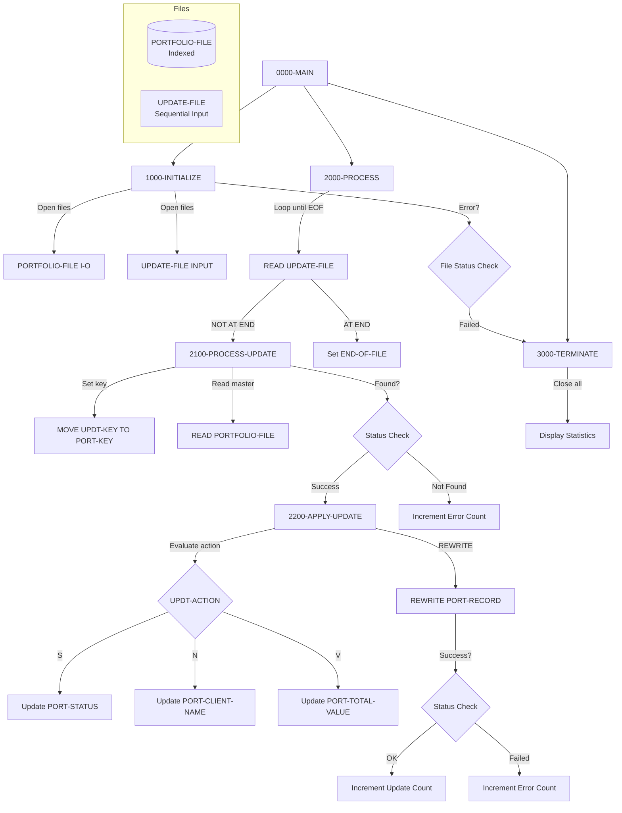

## Overview

PORTUPDT is a batch program that processes portfolio update requests from an input file. The program reads update requests containing portfolio keys, action codes, and new values, then applies the specified updates to the corresponding records in the indexed portfolio master file.

This program is part of the portfolio maintenance subsystem and works alongside PORTADD, PORTREAD, and PORTDEL to provide complete portfolio lifecycle management. Key features include:

- **Flexible Update Types**: Supports updates to portfolio status, client name, and total value through action codes
- **Batch Processing**: Reads a sequential file of update requests and processes them against the indexed portfolio master file
- **Data Type Handling**: Properly converts alphanumeric input to numeric format for value updates
- **Error Tracking**: Counts and reports successful updates and errors at job completion

## Program Structure



## Data Structures

### File Section

#### PORT-RECORD (from PORTFLIO copybook)

| Level | Name | Picture | Description |
|-------|------|---------|-------------|
| 01 | PORT-RECORD | - | Portfolio master record |
| 05 | PORT-KEY | - | Composite primary key |
| 10 | PORT-ID | X(8) | Portfolio identifier |
| 10 | PORT-ACCOUNT-NO | X(10) | Account number |
| 05 | PORT-CLIENT-INFO | - | Client information group |
| 10 | PORT-CLIENT-NAME | X(30) | Client name |
| 10 | PORT-CLIENT-TYPE | X(1) | Client type code |
| 05 | PORT-PORTFOLIO-INFO | - | Portfolio information group |
| 10 | PORT-CREATE-DATE | 9(8) | Creation date (YYYYMMDD) |
| 10 | PORT-LAST-MAINT | 9(8) | Last maintenance date |
| 10 | PORT-STATUS | X(1) | Portfolio status |
| 05 | PORT-FINANCIAL-INFO | - | Financial information group |
| 10 | PORT-TOTAL-VALUE | S9(13)V99 COMP-3 | Total portfolio value |
| 10 | PORT-CASH-BALANCE | S9(13)V99 COMP-3 | Cash balance |
| 05 | PORT-AUDIT-INFO | - | Audit information group |
| 10 | PORT-LAST-USER | X(8) | Last user to modify |
| 10 | PORT-LAST-TRANS | 9(8) | Last transaction date |
| 05 | PORT-FILLER | X(50) | Reserved space |

**Client Type Condition Names (88-levels):**

| Condition | Value | Description |
|-----------|-------|-------------|
| PORT-INDIVIDUAL | 'I' | Individual account |
| PORT-CORPORATE | 'C' | Corporate account |
| PORT-TRUST | 'T' | Trust account |

**Portfolio Status Condition Names (88-levels):**

| Condition | Value | Description |
|-----------|-------|-------------|
| PORT-ACTIVE | 'A' | Active portfolio |
| PORT-CLOSED | 'C' | Closed portfolio |
| PORT-SUSPENDED | 'S' | Suspended portfolio |

#### UPDATE-RECORD

| Level | Name | Picture | Description |
|-------|------|---------|-------------|
| 01 | UPDATE-RECORD | - | Update request record |
| 05 | UPDT-KEY | - | Key of record to update |
| 10 | UPDT-ID | X(8) | Portfolio identifier |
| 10 | UPDT-ACCT-NO | X(10) | Account number |
| 05 | UPDT-ACTION | X(1) | Update action code |
| 05 | UPDT-NEW-VALUE | X(50) | New value to apply |

**Update Action Codes (88-levels):**

| Condition | Value | Description | Target Field |
|-----------|-------|-------------|--------------|
| UPDT-STATUS | 'S' | Update status | PORT-STATUS |
| UPDT-VALUE | 'V' | Update total value | PORT-TOTAL-VALUE |
| UPDT-NAME | 'N' | Update client name | PORT-CLIENT-NAME |

### Working Storage

#### WS-CONSTANTS

| Level | Name | Picture | Value | Description |
|-------|------|---------|-------|-------------|
| 05 | WS-PROGRAM-NAME | X(8) | 'PORTUPDT' | Program identifier |
| 05 | WS-SUCCESS | S9(4) | +0 | Success return code |
| 05 | WS-ERROR | S9(4) | +8 | Error return code |

#### WS-SWITCHES

| Level | Name | Picture | Description |
|-------|------|---------|-------------|
| 05 | WS-FILE-STATUS | X(2) | Portfolio file status |
| 05 | WS-UPDT-STATUS | X(2) | Update file status |
| 05 | WS-END-OF-FILE-SW | X | End of file indicator |

**File Status Condition Names (88-levels):**

| Field | Condition | Value | Description |
|-------|-----------|-------|-------------|
| WS-FILE-STATUS | WS-SUCCESS-STATUS | '00' | Successful operation |
| WS-FILE-STATUS | WS-EOF-STATUS | '10' | End of file |
| WS-FILE-STATUS | WS-REC-NOT-FND | '23' | Record not found |
| WS-UPDT-STATUS | WS-UPDT-SUCCESS | '00' | Successful operation |
| WS-UPDT-STATUS | WS-UPDT-EOF | '10' | End of file |
| WS-END-OF-FILE-SW | END-OF-FILE | 'Y' | End of file reached |
| WS-END-OF-FILE-SW | NOT-END-OF-FILE | 'N' | More records to process |

#### WS-WORK-AREAS

| Level | Name | Picture | Description |
|-------|------|---------|-------------|
| 05 | WS-UPDATE-COUNT | 9(7) | Count of successful updates |
| 05 | WS-ERROR-COUNT | 9(7) | Count of errors |
| 05 | WS-RETURN-CODE | S9(4) | Program return code |
| 05 | WS-NUMERIC-WORK | S9(13)V99 | Numeric conversion work field |

## File I/O

### PORTFOLIO-FILE

| Property | Value |
|----------|-------|
| Assign To | PORTFILE |
| Organization | Indexed (VSAM KSDS) |
| Access Mode | Random |
| Record Key | PORT-KEY |
| File Status | WS-FILE-STATUS |
| Open Mode | I-O (read and rewrite) |

The portfolio master file is opened for I-O access to allow both reading records and rewriting them with updated values.

### UPDATE-FILE

| Property | Value |
|----------|-------|
| Assign To | UPDTFILE |
| Organization | Sequential |
| File Status | WS-UPDT-STATUS |
| Open Mode | INPUT |

Input file containing update requests to process.

### I/O Operations Summary

| Paragraph | File | Operation | Description |
|-----------|------|-----------|-------------|
| 1000-INITIALIZE | PORTFOLIO-FILE | OPEN I-O | Open for read/rewrite |
| 1000-INITIALIZE | UPDATE-FILE | OPEN INPUT | Open for reading |
| 2000-PROCESS | UPDATE-FILE | READ | Read next update request |
| 2100-PROCESS-UPDATE | PORTFOLIO-FILE | READ | Read record to update |
| 2200-APPLY-UPDATE | PORTFOLIO-FILE | REWRITE | Write updated record |
| 3000-TERMINATE | Both files | CLOSE | Close all files |

## Control Flow

### 0000-MAIN

Entry point that orchestrates the batch update process:
1. Performs initialization (open files, initialize counters)
2. Loops through update requests until end of file
3. Performs termination (close files, report statistics)
4. Returns to operating system via GOBACK

### 1000-INITIALIZE

1. **Initialize Work Areas**: Clears all counters and work fields using INITIALIZE
2. **Open Files**: Opens both files with appropriate modes:
   - PORTFOLIO-FILE as I-O (for read and rewrite)
   - UPDATE-FILE as INPUT
3. **Check File Status**: If any file fails to open:
   - Displays error message with file status codes
   - Sets return code to error (8)
   - Performs termination to close any opened files

### 2000-PROCESS

Main processing loop that reads update requests:
1. **Read Update File**: Reads next update request record
2. **Check for EOF**: If AT END, sets END-OF-FILE flag to true
3. **Process Record**: If NOT AT END, performs 2100-PROCESS-UPDATE

### 2100-PROCESS-UPDATE

Processes a single update request:
1. **Set Key**: Moves UPDT-KEY to PORT-KEY for lookup
2. **Read Master**: Reads portfolio record using the key
3. **Check Status**: 
   - If successful (WS-SUCCESS-STATUS), performs apply update
   - Otherwise, increments error count and displays message

### 2200-APPLY-UPDATE

Applies the update based on action code:

1. **Evaluate Action**: Uses EVALUATE TRUE to determine update type:
   - **UPDT-STATUS ('S')**: Moves UPDT-NEW-VALUE directly to PORT-STATUS
   - **UPDT-NAME ('N')**: Moves UPDT-NEW-VALUE directly to PORT-CLIENT-NAME
   - **UPDT-VALUE ('V')**: Converts UPDT-NEW-VALUE to WS-NUMERIC-WORK, then moves to PORT-TOTAL-VALUE (handles alphanumeric to COMP-3 conversion)

2. **Rewrite Record**: Issues REWRITE for PORT-RECORD

3. **Check Status**:
   - If successful, increments update count
   - If failed, increments error count and displays message

### 3000-TERMINATE

Cleanup and reporting:
1. **Close Files**: Closes both files
2. **Display Statistics**:
   - Updates processed
   - Errors occurred
3. **Set Return Code**: Moves WS-RETURN-CODE to system RETURN-CODE

## Dependencies

### Copybooks

- [PORTFLIO](/docs/copybooks/PORTFLIO) - Portfolio master record layout with client, portfolio, financial, and audit information

### Called Programs

This program does not call any external programs.

### Related Programs

Programs that share the PORTFLIO copybook:
- [PORTADD](/docs/programs/PORTADD) - Portfolio addition program
- [PORTDEL](/docs/programs/PORTDEL) - Portfolio deletion program
- [PORTREAD](/docs/programs/PORTREAD) - Portfolio read/inquiry program
- [PORTTEST](/docs/programs/PORTTEST) - Portfolio testing program
- [TSTGEN00](/docs/programs/TSTGEN00) - Test data generation

## Return Codes

| Code | Description |
|------|-------------|
| 0 | Successful completion (may include some record-level errors) |
| 8 | Error occurred (file open failure) |

## Processing Statistics

At job completion, the program displays:

```
Updates processed: NNNNNNN
Errors occurred:   NNNNNNN
```

## Input File Format

The UPDATE-FILE contains fixed-length records with the following layout:

| Position | Length | Field | Description |
|----------|--------|-------|-------------|
| 1-8 | 8 | UPDT-ID | Portfolio ID |
| 9-18 | 10 | UPDT-ACCT-NO | Account number |
| 19 | 1 | UPDT-ACTION | Action code (S/V/N) |
| 20-69 | 50 | UPDT-NEW-VALUE | New value |

### Example Update Records

```
PORT0001ACCT000001SASuspend portfolio status
PORT0002ACCT000002NJOHN DOE CORPORATION        Update client name
PORT0003ACCT000003V00000000123456.78          Update total value
```

## JCL Example

```jcl
//PORTUPDT EXEC PGM=PORTUPDT
//STEPLIB  DD  DSN=your.loadlib,DISP=SHR
//PORTFILE DD  DSN=your.portfolio.master,DISP=SHR
//UPDTFILE DD  DSN=your.update.requests,DISP=SHR
//SYSOUT   DD  SYSOUT=*
```

## Technical Notes

### REWRITE Statement

The COBOL `REWRITE` statement updates the current record in an indexed file. The record must first be successfully read (making it the "current" record) before it can be rewritten. The key field (PORT-KEY) cannot be modified during a rewrite operation.

### Numeric Conversion

When processing value updates (UPDT-VALUE), the program uses a two-step conversion:
1. Moves the alphanumeric UPDT-NEW-VALUE to WS-NUMERIC-WORK (S9(13)V99)
2. Moves WS-NUMERIC-WORK to PORT-TOTAL-VALUE (S9(13)V99 COMP-3)

This ensures proper conversion from display format to packed decimal format.

### VSAM File Status Codes

| Code | Meaning |
|------|---------|
| 00 | Successful operation |
| 10 | End of file |
| 23 | Record not found |

### Error Recovery

The program continues processing after individual record errors (not-found or rewrite failures), allowing maximum throughput while tracking all issues. Only file open failures cause immediate termination.

### Field Validation

The current implementation does not validate the new value before applying updates. Production environments may want to add validation for:
- Status code values (should be 'A', 'C', or 'S')
- Numeric format for value updates
- Client name length and character validation
